# Doubly Linked List

A doubly linked list is a bidirectional linked list where each node holds **data**, a **pointer to the next node**, and a **pointer to the previous node**. This allows traversal in both directions and makes several operations more efficient than singly linked lists.

> "A doubly linked list is like a two-way street — you can move forward and backward, making it easier to navigate and modify the structure."

---

## Table of Contents

1. [Anatomy of a Doubly Linked List](#anatomy-of-a-doubly-linked-list)
2. [Node Class](#node-class)
3. [Head, Tail, and Length](#head-tail-and-length)
4. [Operations — Visual Walkthrough](#operations--visual-walkthrough)
5. [Full Implementation in Python](#full-implementation-in-python)
6. [Traversal Patterns](#traversal-patterns)
7. [Reversing a Doubly Linked List](#reversing-a-doubly-linked-list)
8. [Time and Space Complexity](#time-and-space-complexity)
9. [Doubly Linked List as a Stack](#doubly-linked-list-as-a-stack)
10. [Doubly Linked List as a Queue](#doubly-linked-list-as-a-queue)
11. [Doubly Linked List as a Deque](#doubly-linked-list-as-a-deque)
12. [Essential Interview Techniques](#essential-interview-techniques)
13. [Edge Cases to Always Handle](#edge-cases-to-always-handle)
14. [Common Mistakes](#common-mistakes)
15. [Advantages Over Singly Linked Lists](#advantages-over-singly-linked-lists)
16. [Practice Problems](#practice-problems)
17. [Quick Reference Cheat Sheet](#quick-reference-cheat-sheet)

---

## Anatomy of a Doubly Linked List

```
        HEAD                                                    TAIL
         │                                                       │
         ▼                                                       ▼
    ┌──────────────┐     ┌──────────────┐     ┌──────────────┐
    │ prev: None   │     │ prev:   ◄────┼─────│ prev:   ◄────│
    │ value: 10    │◄───►│ value: 20    │◄───►│ value: 30    │
    │ next:  ──────┼────►│ next:  ──────┼────►│ next: None   │
    └──────────────┘     └──────────────┘     └──────────────┘
        Node 0               Node 1               Node 2
```

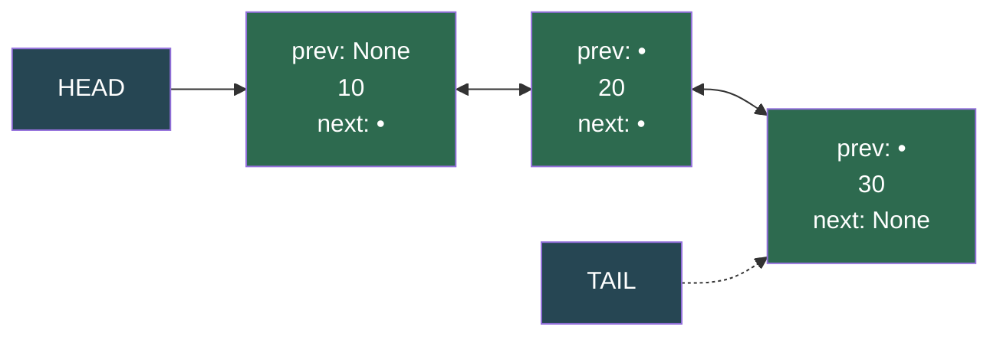

| Component | Purpose |
|---|---|
| **Node** | Container holding `value` + `next` pointer + `prev` pointer |
| **Head** | Pointer to the first node — entry point for forward traversal |
| **Tail** | Pointer to the last node — entry point for backward traversal |
| **Length** | Count of nodes — makes `len()` O(1) instead of O(n) |
| **None** | Signals the beginning/end of the list |

---

## Node Class

The building block. Each node knows three things: its own value, where the next node is, and where the previous node is.

```python
class Node:
    def __init__(self, value):
        self.value = value
        self.next = None
        self.prev = None

    def __repr__(self):
        return f"Node({self.value})"
```

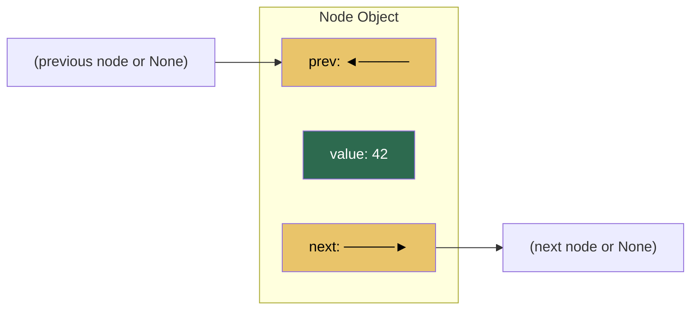

---

## Head, Tail, and Length

Maintaining both `head` and `tail` pointers plus `length` counter makes most operations O(1).

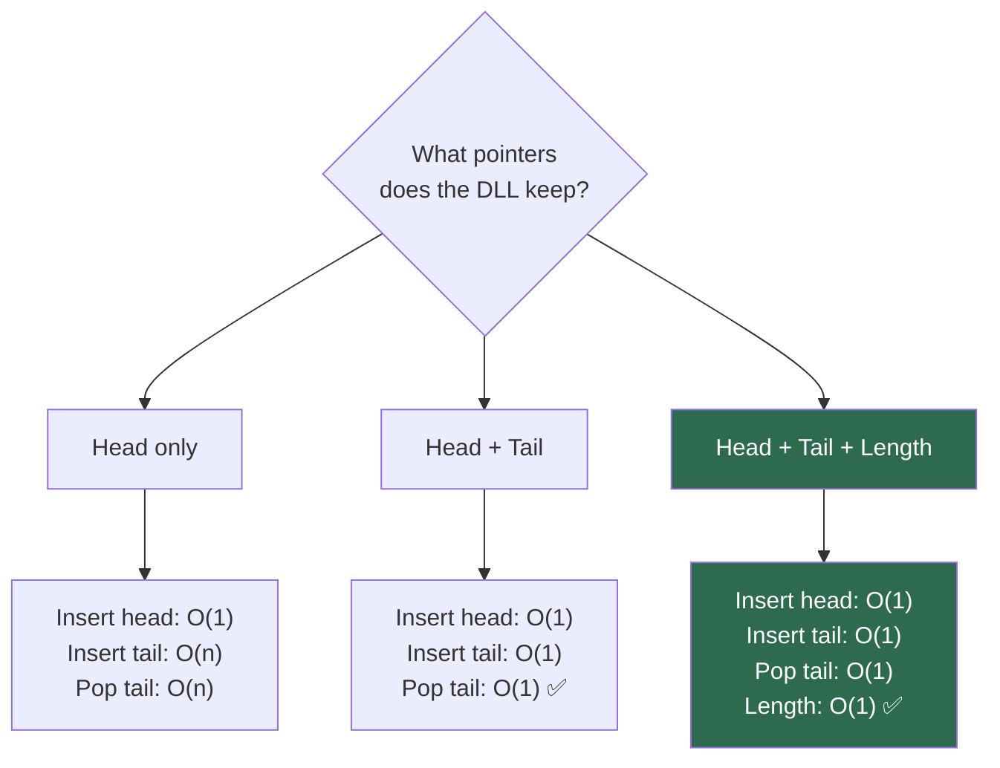

| Variant | Prepend | Append | Pop First | Pop Last | Length |
|---|:-:|:-:|:-:|:-:|:-:|
| Head only | O(1) | O(n) | O(1) | O(n) | O(n) |
| Head + Tail | O(1) | O(1) | O(1) | O(1) ✅ | O(n) |
| Head + Tail + Length | O(1) | O(1) | O(1) | O(1) ✅ | O(1) ✅ |

> **Key advantage over SLL**: Pop last is O(1) because we have a direct pointer to the tail and can use `tail.prev` to find the new tail.

---

## Operations — Visual Walkthrough

### Prepend (Insert at Head) — O(1)

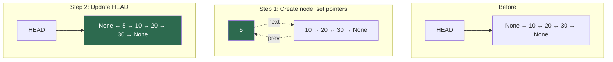

```python
def prepend(self, value):
    new_node = Node(value)
    if not self.head:                   # empty list
        self.head = self.tail = new_node
    else:
        new_node.next = self.head       # 1. new → current head
        self.head.prev = new_node       # 2. current head ← new
        self.head = new_node            # 3. move head to new
    self.length += 1
```

---

### Append (Insert at Tail) — O(1)

```mermaid
flowchart TD
    subgraph "Before"
        direction LR
        A1["None ← 10 ↔ 20 ↔ 30 → None"] <-- TAIL1["TAIL"]
    end

    subgraph "Step 1: Create node, set pointers"
        direction LR
        A2["None ← 10 ↔ 20 ↔ 30"] -.->|"next"| NEW1["40 → None"]
        NEW1 -.->|"prev"| A2
    end

    subgraph "Step 2: Update TAIL"
        direction LR
        NEW2["None ← 10 ↔ 20 ↔ 30 ↔ 40 → None"] <-- TAIL2["TAIL"]
    end

    style NEW1 fill:#2d6a4f,color:#fff
    style NEW2 fill:#2d6a4f,color:#fff
```

```python
def append(self, value):
    new_node = Node(value)
    if not self.head:                   # empty list
        self.head = self.tail = new_node
    else:
        new_node.prev = self.tail       # 1. new ← current tail
        self.tail.next = new_node       # 2. current tail → new
        self.tail = new_node            # 3. move tail to new
    self.length += 1
```

---

### Insert at Index — O(n)

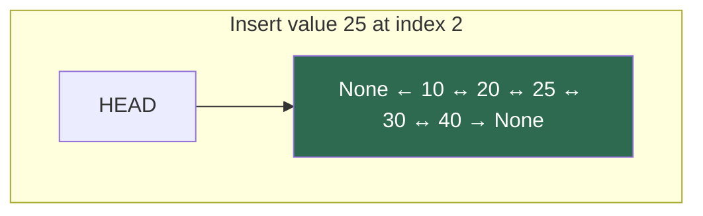

**Why O(n)?** You must traverse to the position first (but can optimize by choosing the closer end).

```python
def insert(self, index, value):
    if index == 0:
        return self.prepend(value)
    if index == self.length:
        return self.append(value)

    new_node = Node(value)
    
    # Optimization: start from the closer end
    if index <= self.length // 2:
        current = self._get_node(index)     # traverse from head
    else:
        current = self._get_node(index)     # could traverse from tail
    
    # Insert before current
    new_node.next = current
    new_node.prev = current.prev
    current.prev.next = new_node
    current.prev = new_node
    self.length += 1
```

**Pointer order matters:**

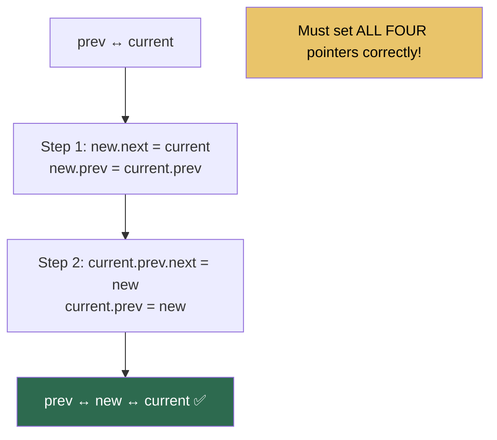

---

### Delete Head (Pop First) — O(1)

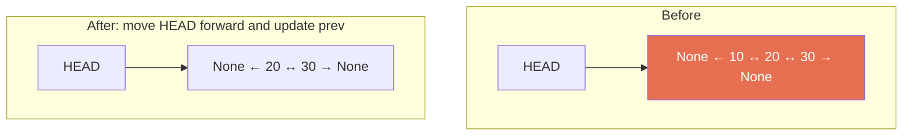

```python
def pop_first(self):
    if not self.head:
        raise IndexError("List is empty")
    
    value = self.head.value
    if self.head == self.tail:          # single node
        self.head = self.tail = None
    else:
        self.head = self.head.next      # move head forward
        self.head.prev = None           # break backward link
    
    self.length -= 1
    return value
```

---

### Delete Tail (Pop Last) — O(1) ⭐

This is the **key advantage** of doubly linked lists over singly linked lists.

```mermaid
flowchart TD
    subgraph "Why O(1) in DLL?"
        direction LR
        A["None ← 10 ↔ 20 ↔ 30 → None"] <-- TAIL["TAIL"]
        B["tail.prev gives us\nthe new tail directly!"]
    end

    style TAIL fill:#2d6a4f,color:#fff
    style B fill:#2d6a4f,color:#fff
```

```python
def pop(self):
    if not self.head:
        raise IndexError("List is empty")
    
    value = self.tail.value
    if self.head == self.tail:          # single node
        self.head = self.tail = None
    else:
        self.tail = self.tail.prev      # move tail backward
        self.tail.next = None           # break forward link
    
    self.length -= 1
    return value
```

> **This is why doubly linked lists are superior for deques** — both ends can be modified in O(1).

---

### Delete at Index — O(n)

```python
def remove(self, index):
    if index == 0:
        return self.pop_first()
    if index == self.length - 1:
        return self.pop()

    current = self._get_node(index)
    current.prev.next = current.next   # skip current in forward direction
    current.next.prev = current.prev   # skip current in backward direction
    self.length -= 1
    return current.value
```

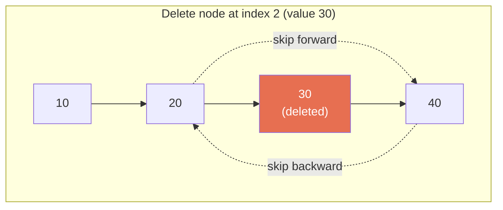

---

### Search — O(n) with optimization

```python
def search(self, value):
    # Search from head
    current = self.head
    index = 0
    while current:
        if current.value == value:
            return index
        current = current.next
        index += 1
    return -1

def search_optimized(self, value):
    """Search from both ends simultaneously."""
    if not self.head:
        return -1
    
    left, right = self.head, self.tail
    left_idx, right_idx = 0, self.length - 1
    
    while left_idx <= right_idx:
        if left.value == value:
            return left_idx
        if right.value == value:
            return right_idx
        
        left = left.next
        right = right.prev
        left_idx += 1
        right_idx -= 1
    
    return -1
```

---

## Full Implementation in Python

```python
class Node:
    def __init__(self, value):
        self.value = value
        self.next = None
        self.prev = None

    def __repr__(self):
        return f"Node({self.value})"


class DoublyLinkedList:
    def __init__(self):
        self.head = None
        self.tail = None
        self.length = 0

    # ======================== CREATE ========================

    def prepend(self, value):
        """Insert at head — O(1)."""
        new_node = Node(value)
        if not self.head:
            self.head = self.tail = new_node
        else:
            new_node.next = self.head
            self.head.prev = new_node
            self.head = new_node
        self.length += 1

    def append(self, value):
        """Insert at tail — O(1)."""
        new_node = Node(value)
        if not self.head:
            self.head = self.tail = new_node
        else:
            new_node.prev = self.tail
            self.tail.next = new_node
            self.tail = new_node
        self.length += 1

    def insert(self, index, value):
        """Insert at index — O(n). Optimized by choosing closer end."""
        if index < 0 or index > self.length:
            raise IndexError(f"Index {index} out of range for list of length {self.length}")
        
        if index == 0:
            return self.prepend(value)
        if index == self.length:
            return self.append(value)

        new_node = Node(value)
        current = self._get_node(index)
        
        # Insert before current
        new_node.next = current
        new_node.prev = current.prev
        current.prev.next = new_node
        current.prev = new_node
        self.length += 1

    # ======================== READ ========================

    def _get_node(self, index):
        """Internal: get node at index — O(n) but optimized by direction."""
        if index < 0 or index >= self.length:
            raise IndexError(f"Index {index} out of range for list of length {self.length}")
        
        # Choose closer end for traversal
        if index <= self.length // 2:
            current = self.head
            for _ in range(index):
                current = current.next
        else:
            current = self.tail
            for _ in range(self.length - 1 - index):
                current = current.prev
        
        return current

    def get(self, index):
        """Get value at index — O(n) but optimized."""
        return self._get_node(index).value

    def search(self, value):
        """Return index of first occurrence, or -1 if not found — O(n)."""
        current = self.head
        index = 0
        while current:
            if current.value == value:
                return index
            current = current.next
            index += 1
        return -1

    # ======================== UPDATE ========================

    def set(self, index, value):
        """Update value at index — O(n) but optimized."""
        self._get_node(index).value = value

    # ======================== DELETE ========================

    def pop_first(self):
        """Remove and return first value — O(1)."""
        if not self.head:
            raise IndexError("pop from empty list")
        
        value = self.head.value
        if self.head == self.tail:
            self.head = self.tail = None
        else:
            self.head = self.head.next
            self.head.prev = None
        
        self.length -= 1
        return value

    def pop(self):
        """Remove and return last value — O(1). KEY ADVANTAGE over SLL."""
        if not self.head:
            raise IndexError("pop from empty list")
        
        value = self.tail.value
        if self.head == self.tail:
            self.head = self.tail = None
        else:
            self.tail = self.tail.prev
            self.tail.next = None
        
        self.length -= 1
        return value

    def remove(self, index):
        """Remove and return value at index — O(n) but optimized."""
        if index < 0 or index >= self.length:
            raise IndexError(f"Index {index} out of range")
        
        if index == 0:
            return self.pop_first()
        if index == self.length - 1:
            return self.pop()
        
        current = self._get_node(index)
        current.prev.next = current.next
        current.next.prev = current.prev
        self.length -= 1
        return current.value

    def remove_value(self, value):
        """Remove first occurrence of value — O(n). Returns True if found."""
        current = self.head
        while current:
            if current.value == value:
                if current == self.head:
                    self.pop_first()
                elif current == self.tail:
                    self.pop()
                else:
                    current.prev.next = current.next
                    current.next.prev = current.prev
                    self.length -= 1
                return True
            current = current.next
        return False

    # ======================== UTILITIES ========================

    def reverse(self):
        """Reverse the list in place — O(n) time, O(1) space."""
        if not self.head:
            return
        
        current = self.head
        while current:
            # Swap next and prev
            current.next, current.prev = current.prev, current.next
            current = current.prev  # move to next (now prev due to swap)
        
        # Swap head and tail
        self.head, self.tail = self.tail, self.head

    def to_list(self):
        """Convert to Python list — O(n)."""
        result = []
        current = self.head
        while current:
            result.append(current.value)
            current = current.next
        return result

    def to_list_reverse(self):
        """Convert to Python list (backward) — O(n)."""
        result = []
        current = self.tail
        while current:
            result.append(current.value)
            current = current.prev
        return result

    def from_list(self, lst):
        """Build DLL from Python list — O(n)."""
        self.head = self.tail = None
        self.length = 0
        for val in lst:
            self.append(val)

    def clear(self):
        """Remove all elements — O(1) (GC handles the rest)."""
        self.head = self.tail = None
        self.length = 0

    def is_empty(self):
        return self.length == 0

    # ======================== DUNDER METHODS ========================

    def __len__(self):
        return self.length

    def __str__(self):
        if not self.head:
            return "None"
        
        values = []
        current = self.head
        while current:
            values.append(str(current.value))
            current = current.next
        return "None ← " + " ↔ ".join(values) + " → None"

    def __repr__(self):
        return f"DoublyLinkedList({self.to_list()})"

    def __iter__(self):
        current = self.head
        while current:
            yield current.value
            current = current.next

    def __reversed__(self):
        current = self.tail
        while current:
            yield current.value
            current = current.prev

    def __contains__(self, value):
        return self.search(value) != -1

    def __getitem__(self, index):
        return self.get(index)

    def __setitem__(self, index, value):
        self.set(index, value)

    def __eq__(self, other):
        if not isinstance(other, DoublyLinkedList):
            return False
        if self.length != other.length:
            return False
        a, b = self.head, other.head
        while a:
            if a.value != b.value:
                return False
            a, b = a.next, b.next
        return True

    def __bool__(self):
        return self.length > 0


# ======================== USAGE ========================

dll = DoublyLinkedList()
dll.append(10)
dll.append(20)
dll.append(30)
dll.prepend(5)
print(dll)                    # None ← 5 ↔ 10 ↔ 20 ↔ 30 → None

dll.insert(2, 15)
print(dll)                    # None ← 5 ↔ 10 ↔ 15 ↔ 20 ↔ 30 → None

print(dll.pop())              # 30 (O(1) — advantage over SLL!)
print(dll.pop_first())        # 5
print(dll)                    # None ← 10 ↔ 15 ↔ 20 → None

dll[1] = 99                   # __setitem__
print(dll[1])                 # 99 — __getitem__
print(20 in dll)              # False — __contains__
print(len(dll))               # 3 — __len__

# Bidirectional iteration
for val in dll:               # forward
    print(val)
    
for val in reversed(dll):     # backward
    print(val)

print(dll.to_list())          # [10, 99, 20]
print(dll.to_list_reverse())  # [20, 99, 10]
```

---

## Traversal Patterns

### Forward Traversal

```python
current = self.head
while current:
    process(current.value)
    current = current.next
```

### Backward Traversal

```python
current = self.tail
while current:
    process(current.value)
    current = current.prev
```

### Bidirectional Search (Optimization)

```python
def find_from_both_ends(self, value):
    """Search from both ends simultaneously — up to 2x faster."""
    left, right = self.head, self.tail
    left_idx, right_idx = 0, self.length - 1
    
    while left_idx <= right_idx:
        if left.value == value:
            return left_idx
        if right.value == value:
            return right_idx
        
        left = left.next
        right = right.prev
        left_idx += 1
        right_idx -= 1
    
    return -1
```

### Traverse with Cleanup

Essential for deletion — you can safely remove nodes while traversing.

```python
def remove_all_occurrences(self, value):
    current = self.head
    while current:
        next_node = current.next  # save next before potential deletion
        if current.value == value:
            if current == self.head and current == self.tail:
                self.head = self.tail = None
            elif current == self.head:
                self.head = current.next
                self.head.prev = None
            elif current == self.tail:
                self.tail = current.prev
                self.tail.next = None
            else:
                current.prev.next = current.next
                current.next.prev = current.prev
            self.length -= 1
        current = next_node
```

---

## Reversing a Doubly Linked List

Much simpler than reversing a singly linked list — just swap `next` and `prev` for each node.

### Iterative Reversal — O(n) time, O(1) space

```python
def reverse(self):
    if not self.head:
        return
    
    current = self.head
    while current:
        # Swap next and prev pointers
        current.next, current.prev = current.prev, current.next
        current = current.prev  # move to next (now prev due to swap)
    
    # Swap head and tail
    self.head, self.tail = self.tail, self.head
```

### Step-by-Step Visualization

```
Initial:  None ← 10 ↔ 20 ↔ 30 → None

Step 1:   None → 10 ↔ 20 ↔ 30 → None
          (swap 10's pointers: next=None, prev=20)

Step 2:   None → 10 → 20 ↔ 30 → None  
          (swap 20's pointers: next=10, prev=30)

Step 3:   None → 10 → 20 → 30 ← None
          (swap 30's pointers: next=20, prev=None)

Final:    None ← 30 ↔ 20 ↔ 10 → None
          (swap head and tail)
```

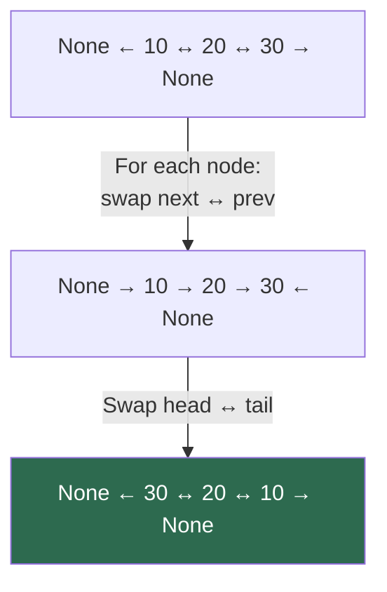

---

## Time and Space Complexity

| Operation | Time | Space | Notes |
|---|:-:|:-:|---|
| `prepend(value)` | **O(1)** | O(1) | Update head + prev pointer |
| `append(value)` | **O(1)** | O(1) | Update tail + next pointer |
| `insert(index, value)` | O(n) | O(1) | Can optimize by starting from closer end |
| `get(index)` | O(n) | O(1) | Can optimize by starting from closer end |
| `set(index, value)` | O(n) | O(1) | Can optimize by starting from closer end |
| `search(value)` | O(n) | O(1) | Can optimize with bidirectional search |
| `pop_first()` | **O(1)** | O(1) | Update head pointer |
| `pop()` (last) | **O(1)** | O(1) | **KEY ADVANTAGE** — direct tail.prev access |
| `remove(index)` | O(n) | O(1) | Can optimize by starting from closer end |
| `remove_value(val)` | O(n) | O(1) | Linear scan + O(1) removal |
| `reverse()` | O(n) | O(1) | Swap pointers for each node |
| `len()` | **O(1)** | O(1) | Stored as attribute |
| `clear()` | **O(1)** | O(1) | Nullify head/tail |

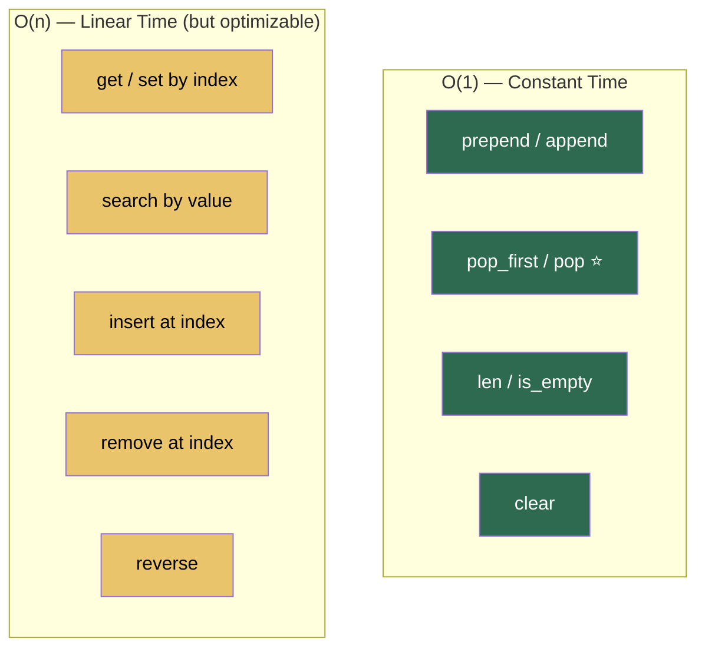

### Space: O(n) Total

Each node stores `value` + two pointers. For `n` nodes the total space is O(n). The extra pointer per node is the trade-off for bidirectional capability.

---

## Doubly Linked List as a Stack

A DLL can implement a stack using either end — both are O(1).

```python
class Stack:
    def __init__(self):
        self._list = DoublyLinkedList()

    def push(self, value):
        self._list.append(value)      # O(1) — could also use prepend

    def pop(self):
        return self._list.pop()       # O(1) — could also use pop_first

    def peek(self):
        if self._list.tail:
            return self._list.tail.value
        raise IndexError("Stack is empty")

    def is_empty(self):
        return self._list.length == 0

    def __len__(self):
        return self._list.length
```

---

## Doubly Linked List as a Queue

A DLL can implement a queue efficiently — enqueue at one end, dequeue at the other.

```python
class Queue:
    def __init__(self):
        self._list = DoublyLinkedList()

    def enqueue(self, value):
        self._list.append(value)      # O(1)

    def dequeue(self):
        return self._list.pop_first() # O(1)

    def peek(self):
        if self._list.head:
            return self._list.head.value
        raise IndexError("Queue is empty")

    def is_empty(self):
        return self._list.length == 0

    def __len__(self):
        return self._list.length
```

---

## Doubly Linked List as a Deque

This is where DLL truly shines — double-ended queue with O(1) operations at both ends.

```python
class Deque:
    def __init__(self):
        self._list = DoublyLinkedList()

    def add_front(self, value):
        self._list.prepend(value)     # O(1)

    def add_rear(self, value):
        self._list.append(value)      # O(1)

    def remove_front(self):
        return self._list.pop_first() # O(1)

    def remove_rear(self):
        return self._list.pop()       # O(1) — KEY ADVANTAGE

    def peek_front(self):
        if self._list.head:
            return self._list.head.value
        raise IndexError("Deque is empty")

    def peek_rear(self):
        if self._list.tail:
            return self._list.tail.value
        raise IndexError("Deque is empty")

    def is_empty(self):
        return self._list.length == 0

    def __len__(self):
        return self._list.length
```

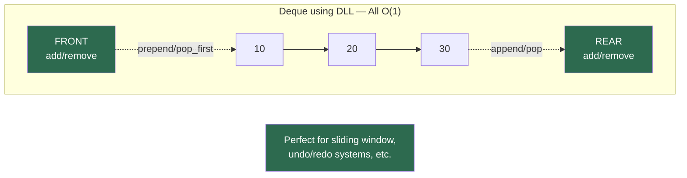

---

## Essential Interview Techniques

### 1. Bidirectional Traversal

```python
def find_pair_with_sum(dll, target):
    """Two pointers from both ends — O(n) if sorted."""
    left, right = dll.head, dll.tail
    
    while left and right and left != right:
        current_sum = left.value + right.value
        if current_sum == target:
            return (left.value, right.value)
        elif current_sum < target:
            left = left.next
        else:
            right = right.prev
    
    return None
```

### 2. LRU Cache Implementation

DLL is perfect for LRU cache — move accessed items to front in O(1).

```python
class LRUCache:
    def __init__(self, capacity):
        self.capacity = capacity
        self.cache = {}  # key -> node
        self.dll = DoublyLinkedList()
    
    def get(self, key):
        if key in self.cache:
            node = self.cache[key]
            # Move to front (most recently used)
            self._move_to_front(node)
            return node.value
        return -1
    
    def put(self, key, value):
        if key in self.cache:
            self.cache[key].value = value
            self._move_to_front(self.cache[key])
        else:
            if len(self.cache) >= self.capacity:
                # Remove least recently used (tail)
                lru_node = self.dll.tail
                del self.cache[lru_node.key]
                self.dll.pop()
            
            # Add new node at front
            self.dll.prepend((key, value))
            self.cache[key] = self.dll.head
    
    def _move_to_front(self, node):
        # Remove node and add to front
        self.dll.remove_node(node)
        self.dll.prepend_node(node)
```

### 3. Palindrome Checker

```python
def is_palindrome(dll):
    """Check if DLL is palindrome using two pointers — O(n)."""
    if not dll.head:
        return True
    
    left, right = dll.head, dll.tail
    while left != right and left.next != right:
        if left.value != right.value:
            return False
        left = left.next
        right = right.prev
    
    return True
```

---

## Edge Cases to Always Handle

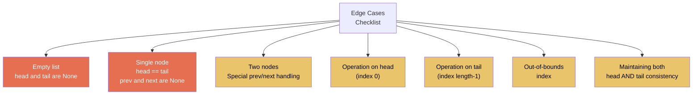

```python
# Template for safe DLL operations
def safe_operation(self, index):
    if not self.head:                          # empty list
        raise IndexError("List is empty")
    if index < 0 or index >= self.length:      # bounds check
        raise IndexError("Index out of range")
    
    if self.length == 1:                       # single node case
        return self.handle_single_node()
    
    if index == 0:                             # head case
        return self.handle_head()
    if index == self.length - 1:               # tail case
        return self.handle_tail()
    
    # ... general case ...
    # Always update BOTH forward and backward links
```

---

## Common Mistakes

### 1. Not Updating All Four Pointers During Insert

```python
# WRONG — missing some pointer updates
new_node.next = current
current.prev = new_node
# Forgot: new_node.prev = current.prev
# Forgot: current.prev.next = new_node

# RIGHT — update ALL four connections
new_node.next = current
new_node.prev = current.prev
current.prev.next = new_node
current.prev = new_node
```

### 2. Forgetting to Update Head or Tail

```python
# WRONG — tail becomes stale when removing last node
def pop(self):
    if self.head == self.tail:
        self.head = None
        # Forgot: self.tail = None
    # ...

# RIGHT — always keep head and tail consistent
def pop(self):
    if self.head == self.tail:
        self.head = self.tail = None
    # ...
```

### 3. Memory Leaks from Circular References

```python
# GOOD PRACTICE — explicitly break links when removing nodes
def remove_node(self, node):
    # Remove from list first
    if node.prev:
        node.prev.next = node.next
    if node.next:
        node.next.prev = node.prev
    
    # Break the removed node's links (avoid circular references)
    node.next = None
    node.prev = None
```

### 4. Wrong Direction During Optimized Traversal

```python
# WRONG — logic error in choosing direction
if index < self.length // 2:
    current = self.head
    for _ in range(index):
        current = current.next      # forward
else:
    current = self.tail
    for _ in range(index):          # BUG: should be (length - 1 - index)
        current = current.prev

# RIGHT — correct math for backward traversal
if index <= self.length // 2:
    current = self.head
    for _ in range(index):
        current = current.next
else:
    current = self.tail
    for _ in range(self.length - 1 - index):
        current = current.prev
```

---

## Advantages Over Singly Linked Lists

| Feature | Singly Linked List | Doubly Linked List | Winner |
|---|---|---|---|
| **Memory per node** | 1 pointer | 2 pointers | SLL |
| **Pop last** | O(n) | **O(1)** | **DLL** ⭐ |
| **Bidirectional traversal** | No | **Yes** | **DLL** ⭐ |
| **Remove node (with reference)** | O(n) | **O(1)** | **DLL** ⭐ |
| **Palindrome check** | O(n) extra space | **O(1)** | **DLL** ⭐ |
| **LRU Cache implementation** | Complex | **Natural** | **DLL** ⭐ |
| **Deque implementation** | O(n) pop last | **All O(1)** | **DLL** ⭐ |
| **Reverse operation** | Complex | **Simple** | **DLL** ⭐ |
| **Cache locality** | Better | Slightly worse | SLL |

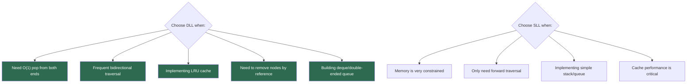

---

## Practice Problems

| # | Problem | Difficulty | Key Technique | Time | Space |
|:-:|---|:-:|---|:-:|:-:|
| 1 | Reverse a doubly linked list | Easy | Swap next↔prev for each node | O(n) | O(1) |
| 2 | Check if DLL is palindrome | Easy | Two pointers from both ends | O(n) | O(1) |
| 3 | Find pair with given sum (sorted DLL) | Easy | Two pointers from ends | O(n) | O(1) |
| 4 | Remove duplicates from sorted DLL | Easy | Single pass with comparisons | O(n) | O(1) |
| 5 | Clone DLL with random pointers | Medium | Hash map for random links | O(n) | O(n) |
| 6 | Flatten multi-level DLL | Medium | DFS with stack or recursion | O(n) | O(d) |
| 7 | LRU Cache implementation | Medium | DLL + HashMap | O(1) | O(capacity) |
| 8 | Convert binary tree to sorted DLL | Medium | In-order traversal + linking | O(n) | O(h) |
| 9 | Merge K sorted DLLs | Hard | Priority queue or divide & conquer | O(n log k) | O(k) |
| 10 | Design browser history | Medium | DLL with current pointer | O(1) ops | O(n) |
| 11 | Rotate DLL by K positions | Medium | Find new head/tail + relink | O(n) | O(1) |
| 12 | Extract leaves of DLL into another DLL | Medium | Two-pass or single pass | O(n) | O(1) |
| 13 | Sort a DLL using merge sort | Hard | Merge sort with DLL | O(n log n) | O(log n) |
| 14 | Implement deque with max/min queries | Hard | DLL + auxiliary structures | O(1) ops | O(n) |
| 15 | DLL with insert/delete/getRandom | Hard | DLL + array mapping | O(1) average | O(n) |

---

## Quick Reference Cheat Sheet

```
┌──────────────────────────────────────────────────────────────────┐
│                DOUBLY LINKED LIST CHEAT SHEET                   │
├──────────────────────────────────────────────────────────────────┤
│                                                                  │
│  STRUCTURE:                                                      │
│    Node: prev + value + next                                     │
│    DLL: None ← node ↔ node ↔ ... ↔ node → None                 │
│                                                                  │
│  O(1) OPERATIONS:                                                │
│    prepend        → insert at head                              │
│    append         → insert at tail                              │
│    pop_first      → remove from head                            │
│    pop            → remove from tail ⭐ (vs O(n) in SLL)       │
│    len            → stored as attribute                         │
│                                                                  │
│  O(n) OPERATIONS (optimizable):                                  │
│    get/set        → traverse from closer end                    │
│    search         → can search from both ends                   │
│    insert(i)      → traverse from closer end                    │
│    remove(i)      → traverse from closer end                    │
│    reverse        → swap next↔prev for each node               │
│                                                                  │
├──────────────────────────────────────────────────────────────────┤
│                                                                  │
│  KEY ADVANTAGES over SLL:                                        │
│    ✅ O(1) pop from BOTH ends                                   │
│    ✅ Bidirectional traversal                                   │
│    ✅ O(1) remove with node reference                           │
│    ✅ Perfect for LRU cache, deque, browser history             │
│    ✅ Palindrome check in O(1) space                            │
│                                                                  │
│  TRADE-OFFS:                                                     │
│    ❌ 2x memory per node (extra prev pointer)                   │
│    ❌ Slightly more complex pointer management                   │
│                                                                  │
├──────────────────────────────────────────────────────────────────┤
│                                                                  │
│  INTERVIEW TECHNIQUES:                                           │
│    Two Pointers      → palindrome, pair sum, etc.              │
│    Bidirectional     → search optimization                      │
│    LRU Cache         → move to front pattern                    │
│    Remove by Ref     → O(1) node removal                       │
│                                                                  │
├──────────────────────────────────────────────────────────────────┤
│                                                                  │
│  EDGE CASES — ALWAYS CHECK:                                      │
│    • Empty list (head and tail are None)                        │
│    • Single node (head == tail, prev/next are None)             │
│    • Two nodes (special case for pointer updates)               │
│    • Head/tail operations (boundary conditions)                 │
│    • Keep head AND tail pointers consistent                     │
│                                                                  │
├──────────────────────────────────────────────────────────────────┤
│                                                                  │
│  INSERTION (4 pointer updates):                                  │
│    1. new.next = current                                        │
│    2. new.prev = current.prev                                   │
│    3. current.prev.next = new                                   │
│    4. current.prev = new                                        │
│                                                                  │
│  REVERSE (simple):                                               │
│    For each node: swap next ↔ prev                             │
│    Finally: swap head ↔ tail                                   │
│                                                                  │
│  PERFECT FOR: Deque, LRU Cache, Browser History, Undo/Redo      │
│                                                                  │
└──────────────────────────────────────────────────────────────────┘
```

---

*Previous: [Circular Linked List](../9.CircularLinkedList/README.md) | Next: [Circular Doubly Linked List](../11.CDLL/README.md)*