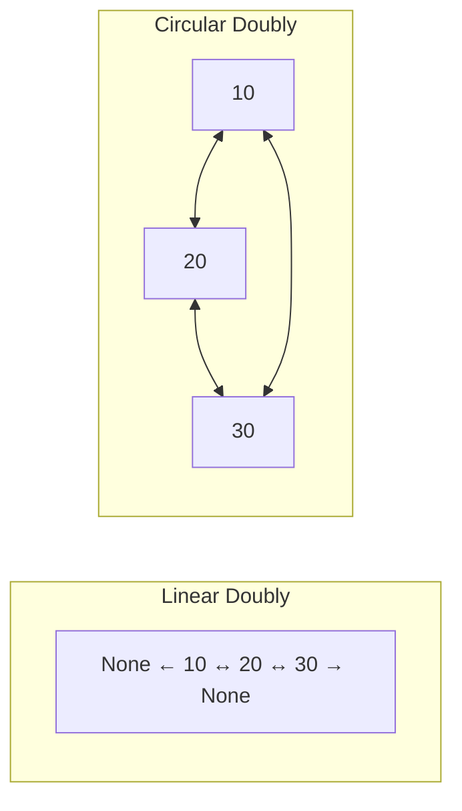
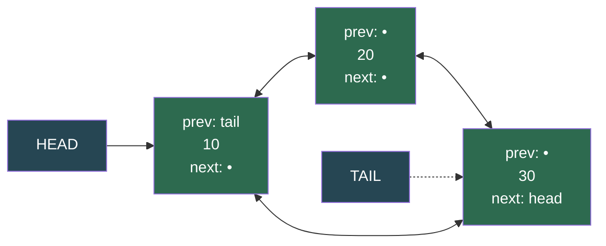
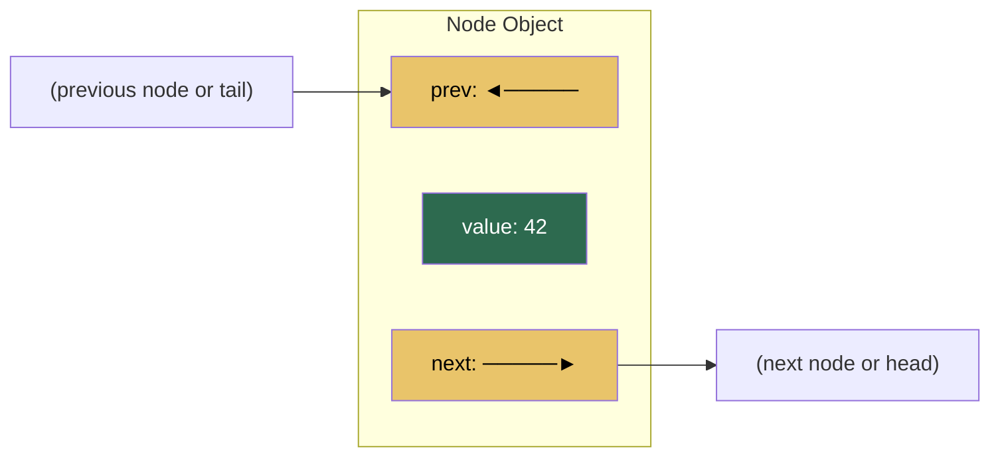
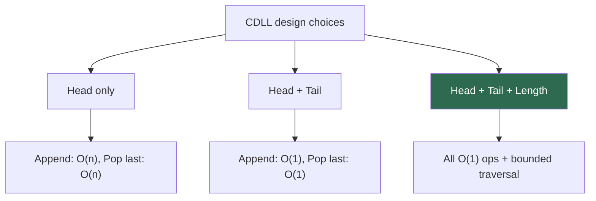
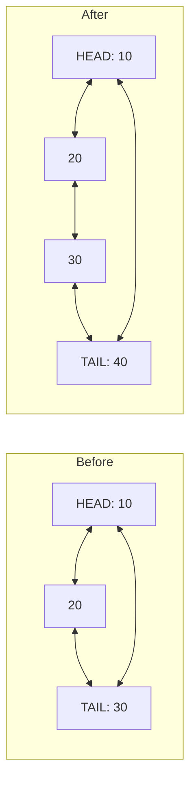
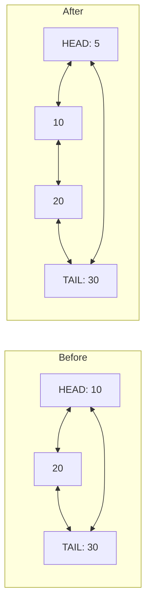

# Circular Doubly Linked List

A **circular doubly linked list** combines the bidirectional navigation of a doubly linked list with the wrap-around behavior of a circular list. The **last node's `next`** points to the **head**, and the **head's `prev`** points to the **tail**, forming a complete ring that can be traversed endlessly in either direction.

> "A circular doubly linked list is like a revolving door — you can spin forward or backward and always end up where you started."

---

## Table of Contents

1. [Circular Doubly vs Other Linked Lists](#circular-doubly-vs-other-linked-lists)
2. [Anatomy of a Circular Doubly Linked List](#anatomy-of-a-circular-doubly-linked-list)
3. [Node Class](#node-class)
4. [Empty and Single-Node Cases](#empty-and-single-node-cases)
5. [Head, Tail, and Length](#head-tail-and-length)
6. [Operations — Visual Walkthrough](#operations--visual-walkthrough)
7. [Full Implementation in Python](#full-implementation-in-python)
8. [Traversal Patterns](#traversal-patterns)
9. [Time and Space Complexity](#time-and-space-complexity)
10. [Real-World Uses](#real-world-uses)
11. [Essential Interview Techniques](#essential-interview-techniques)
12. [Edge Cases to Always Handle](#edge-cases-to-always-handle)
13. [Common Mistakes](#common-mistakes)
14. [Advantages Over Other Linked Lists](#advantages-over-other-linked-lists)
15. [Practice Problems](#practice-problems)
16. [Quick Reference Cheat Sheet](#quick-reference-cheat-sheet)

---

## Circular Doubly vs Other Linked Lists

| Aspect | Singly (SLL) | Doubly (DLL) | Circular Singly (CSLL) | Circular Doubly (CDLL) |
|--------|--------------|--------------|------------------------|------------------------|
| `prev` pointer | No | Yes | No | Yes |
| Last node's `next` | `None` | `None` | `head` | `head` |
| Head's `prev` | N/A | `None` | N/A | `tail` |
| Backward traversal | No | Yes | No | Yes |
| Pop last | O(n) | O(1) | O(n) | **O(1)** |
| Circular traversal | No | No | Forward only | **Both directions** |



---

## Anatomy of a Circular Doubly Linked List

```
        ┌──────────────────────────────────────────────────────────┐
        │                                                          │
        ▼                                                          │
   ┌──────────────┐     ┌──────────────┐     ┌──────────────┐     │
┌──│ prev:  ◄─────┼─────│ prev:  ◄─────┼─────│ prev:  ◄─────│     │
│  │ value: 10    │     │ value: 20    │     │ value: 30    │     │
│  │ next:  ──────┼────►│ next:  ──────┼────►│ next:  ──────┼──┘  │
│  └──────────────┘     └──────────────┘     └──────────────┘     │
│       HEAD                                      TAIL            │
└──────────────────────────────────────────────────────────────────┘
   tail.next = head                          head.prev = tail
```



| Component | Purpose |
|-----------|---------|
| **Node** | Container holding `value` + `next` pointer + `prev` pointer |
| **Head** | Entry point for forward traversal; `head.prev` points to `tail` |
| **Tail** | Entry point for backward traversal; `tail.next` points to `head` |
| **Length** | Count of nodes — makes bounded traversal safe and `len()` O(1) |

---

## Node Class

Identical to a doubly linked list node — only **how you wire `next` and `prev`** changes.

```python
class Node:
    def __init__(self, value):
        self.value = value
        self.next = None
        self.prev = None

    def __repr__(self):
        return f"Node({self.value})"
```



---

## Empty and Single-Node Cases

| State | `head` | `tail` | Structure |
|-------|--------|--------|-----------|
| Empty | `None` | `None` | — |
| One node | node A | A | `A.next = A`, `A.prev = A` |

```python
# After inserting first element into circular doubly linked list:
# head = tail = node
# node.next = node
# node.prev = node
```

A single node forms a self-loop in **both** directions — this is the key invariant that distinguishes CDLL from a regular DLL.

---

## Head, Tail, and Length



With **head + tail + length**, every insertion and deletion at the ends is O(1), and traversal is safely bounded.

---

## Operations — Visual Walkthrough

### Append (insert after tail) — O(1)

1. `new.prev` = `tail`
2. `new.next` = `head`
3. `tail.next` = new
4. `head.prev` = new
5. `tail` = new
6. `length += 1`

For the **first** node: `head = tail = new`, `new.next = new`, `new.prev = new`.



### Prepend (new head) — O(1)

1. `new.next` = `head`
2. `new.prev` = `tail`
3. `tail.next` = new
4. `head.prev` = new
5. `head` = new
6. `length += 1`



### Pop First (remove head) — O(1)

1. If `length == 1`: clear list
2. Else: `head = head.next`, update `head.prev = tail`, `tail.next = head`
3. `length -= 1`

### Pop Last (remove tail) — O(1)

1. If `length == 1`: clear list
2. Else: `tail = tail.prev`, update `tail.next = head`, `head.prev = tail`
3. `length -= 1`

> Unlike singly or circular singly linked lists, **pop last is O(1)** because each node knows its predecessor via `prev`.

### Insert at Index — O(n)

1. If `index == 0`: prepend
2. If `index == length`: append
3. Else: use `get(index - 1)` to find predecessor, wire new node's `prev`/`next`, update neighbors
4. `length += 1`

### Get (optimized) — O(n), but up to ~n/2 steps

The `get` method determines whether to start from **head** (forward) or **tail** (backward) based on which is closer to the target index.

```python
if index < self.length // 2:
    # traverse forward from head
else:
    # traverse backward from tail
```

### Remove at Index — O(n)

1. If `index == 0`: pop_first
2. If `index == length - 1`: pop
3. Else: unlink the node by updating `prev.next` and `next.prev`
4. `length -= 1`

### Search — O(n)

Walk from `head`, checking values; stop when you loop back to `head`.

---

## Full Implementation in Python

```python
class Node:
    def __init__(self, value):
        self.value = value
        self.next = None
        self.prev = None

class CircularDoublyLinkedList:
    def __init__(self):
        self.head = None
        self.tail = None
        self.length = 0

    def __str__(self):
        result = ''
        currentNode = self.head
        while currentNode:
            result += str(currentNode.value)
            currentNode = currentNode.next
            if currentNode == self.head: break
            result += ' <-> '
        return result

    def append(self, value):
        new_node = Node(value)
        if self.length == 0:
            self.head = new_node
            self.tail = new_node
            new_node.next = new_node
            new_node.prev = new_node
        else:
            self.tail.next = new_node
            self.head.prev = new_node
            new_node.prev = self.tail
            new_node.next = self.head
            self.tail = new_node
        self.length += 1

    def prepend(self, value):
        new_node = Node(value)
        if self.length == 0:
            self.head = new_node
            self.tail = new_node
            new_node.next = new_node
            new_node.prev = new_node
        else:
            self.tail.next = new_node
            self.head.prev = new_node
            new_node.prev = self.tail
            new_node.next = self.head
            self.head = new_node
        self.length += 1

    def traverse(self):
        currentNode = self.head
        while currentNode:
            print(currentNode.value)
            currentNode = currentNode.next
            if currentNode == self.head:
                break

    def reverse_traverse(self):
        currentNode = self.tail
        while currentNode:
            print(currentNode.value)
            currentNode = currentNode.prev
            if currentNode == self.tail:
                break

    def search(self, target):
        current = self.head
        while current:
            if current.value == target:
                return True
            current = current.next
            if current == self.head:
                break
        return False

    def insert(self, index, value):
        if index < 0 or index > self.length:
            print("Error: Index out of bounds.")
            return
        if index == 0:
            self.prepend(value)
            return
        if index == self.length:
            self.append(value)
            return

        new_node = Node(value)
        tempNode = self.get(index - 1)
        new_node.next = tempNode.next
        new_node.prev = tempNode
        tempNode.next.prev = new_node
        tempNode.next = new_node
        self.length += 1

    def get(self, index):
        if index < 0 or index >= self.length:
            return None
        if index < self.length // 2:
            currentNode = self.head
            for i in range(index):
                currentNode = currentNode.next
        else:
            currentNode = self.tail
            for i in range(self.length - 1, index, -1):
                currentNode = currentNode.prev
        return currentNode

    def set_value(self, index, value):
        temp = self.get(index)
        if temp:
            temp.value = value
            return True
        return False

    def pop_first(self):
        if self.length == 0:
            return None
        popped_node = self.head
        if self.length == 1:
            self.head = None
            self.tail = None
        else:
            self.head = self.head.next
            popped_node.next = None
            popped_node.prev = None
            self.head.prev = self.tail
            self.tail.next = self.head
        self.length -= 1
        return popped_node

    def pop(self):
        if self.length == 0:
            return None
        popped_node = self.tail
        if self.length == 1:
            self.head = None
            self.tail = None
        else:
            self.tail = self.tail.prev
            popped_node.prev = None
            popped_node.next = None
            self.tail.next = self.head
            self.head.prev = self.tail
        self.length -= 1
        return popped_node

    def remove(self, index):
        if index < 0 or index >= self.length:
            return None
        if index == 0:
            return self.pop_first()
        if index == self.length - 1:
            return self.pop()

        popped_node = self.get(index)
        popped_node.prev.next = popped_node.next
        popped_node.next.prev = popped_node.prev
        self.length -= 1
        return popped_node

    def delete_all(self):
        self.head = None
        self.tail = None
        self.length = 0


# Example usage
cdll = CircularDoublyLinkedList()
cdll.append(10)
cdll.append(20)
cdll.append(30)
print(cdll)  # 10 <-> 20 <-> 30
```

---

## Traversal Patterns

### 1. Forward traversal (using length)

```python
def visit_all_forward(head, length):
    if length == 0:
        return
    cur = head
    for _ in range(length):
        # process cur.value
        cur = cur.next
```

### 2. Backward traversal (using length)

```python
def visit_all_backward(tail, length):
    if length == 0:
        return
    cur = tail
    for _ in range(length):
        # process cur.value
        cur = cur.prev
```

### 3. Forward until back to start (no length)

```python
def visit_forward(head):
    if head is None:
        return
    cur = head
    while True:
        # process cur.value
        cur = cur.next
        if cur is head:
            break
```

### 4. Backward until back to start (no length)

```python
def visit_backward(tail):
    if tail is None:
        return
    cur = tail
    while True:
        # process cur.value
        cur = cur.prev
        if cur is tail:
            break
```

---

## Time and Space Complexity

Assumes **head + tail + length** maintained.

| Operation | Time | Notes |
|-----------|------|-------|
| Append | O(1) | Wire new node between tail and head |
| Prepend | O(1) | Wire new node between tail and head, update head |
| Pop first | O(1) | Update head and circular links |
| Pop last | **O(1)** | `tail.prev` gives predecessor — no scan needed |
| Get by index | O(n) | Up to ~n/2 steps (optimized direction) |
| Set by index | O(n) | Delegates to `get()` |
| Insert at index | O(n) | Finding position dominates |
| Remove at index | O(n) | Finding position dominates |
| Search | O(n) | Full ring scan worst case |
| Traverse (full) | O(n) | Visit every node once |
| Delete all | O(1) | Reset head, tail, length |

**Space:** O(n) for n nodes; O(1) extra for pointers/counters.

---

## Real-World Uses

| Domain | Why Circular Doubly |
|--------|---------------------|
| **Music players** | Playlist loops forward/backward, wrapping at both ends |
| **Browsers** | Tab cycling (Ctrl+Tab / Ctrl+Shift+Tab) wraps around |
| **OS scheduling** | Round-robin with bidirectional priority adjustment |
| **Games** | Turn order that can reverse direction (e.g., UNO reverse card) |
| **Text editors** | Undo/redo ring buffers with bidirectional navigation |
| **Carousels** | UI components that scroll infinitely in both directions |
| **LRU Cache** | Doubly linked list ring for O(1) eviction and promotion |

---

## Essential Interview Techniques

- **Josephus problem (bidirectional)** — Eliminate every k-th person, but direction can reverse.
- **LRU Cache** — Combine a hash map with a circular doubly linked list for O(1) get/put.
- **Flatten a multilevel doubly linked list** — Adapted for circular variants.
- **Split into two circular doubly linked lists** — Use slow/fast pointers, rewire both halves.
- **Detect intersection of two circular lists** — Compare if any node is shared between rings.
- **Rotate the list** — Move head/tail pointers by k positions (O(k) with bidirectional optimization).

---

## Edge Cases to Always Handle

1. **Empty list** — `head` and `tail` are `None`, `length == 0`.
2. **Single node** — `next` and `prev` both point to **self**; deleting empties the list.
3. **Infinite loops** — Never write `while cur:` without a break condition referencing start or length.
4. **Both circular links** — Every mutation must maintain **both** `tail.next = head` **and** `head.prev = tail`.
5. **Pop on single element** — Must clear both `head` and `tail` to `None` (not just one).

---

## Common Mistakes

| Mistake | Consequence |
|---------|-------------|
| Updating `tail.next` but forgetting `head.prev` | Half-broken ring; backward traversal fails |
| `while node:` traversal without break | Infinite loop |
| Forgetting `prev` pointer in insert/remove | Backward links out of sync |
| Pop last without updating `head.prev` | `head.prev` still points to removed node |
| Not handling single-node edge case separately | Dangling pointers or `None` dereference |
| Setting `new.next = new` only (forgetting `new.prev = new`) for first insert | Backward traversal crashes on single-node list |

---

## Advantages Over Other Linked Lists

| Feature | SLL | DLL | CSLL | CDLL |
|---------|-----|-----|------|------|
| Forward traversal | Yes | Yes | Yes (loops) | Yes (loops) |
| Backward traversal | No | Yes | No | **Yes (loops)** |
| Pop last O(1) | No | Yes | No | **Yes** |
| Circular iteration | No | No | Forward only | **Both directions** |
| Pointer overhead per node | 1 | 2 | 1 | 2 |
| Implementation complexity | Low | Medium | Medium | **Highest** |

---

## Files in This Directory

| File | Description |
|------|-------------|
| `CircularDoublyLinkedListNew.py` | Complete implementation with all CRUD operations |
| `README.md` | This comprehensive guide |

---

## Practice Problems

1. **Reverse a CDLL** — Swap `next` and `prev` for every node, then swap `head` and `tail`.
2. **Josephus Problem (bidirectional)** — n people in a circle, every k-th eliminated, with direction reversal support.
3. **LRU Cache** — Implement using a hash map + circular doubly linked list.
4. **Split into Two Halves** — Split a CDLL into two separate CDLLs of (almost) equal size.
5. **Merge Two Sorted CDLLs** — Merge while maintaining both circular and sorted properties.
6. **Palindrome Check** — Use bidirectional traversal (forward from head, backward from tail) to check in O(n) time.
7. **Rotate by K** — Shift the head pointer k positions forward or backward.
8. **Flatten Multilevel CDLL** — Each node may have a child CDLL; flatten into a single ring.

---

## Quick Reference Cheat Sheet

```
Empty:       head = tail = None, length = 0
One node:    node.next = node, node.prev = node

Invariants:  tail.next == head
             head.prev == tail

Append:      new.prev = tail; new.next = head;
             tail.next = new; head.prev = new; tail = new

Prepend:     new.next = head; new.prev = tail;
             tail.next = new; head.prev = new; head = new

Pop first:   head = head.next; head.prev = tail; tail.next = head
             (or clear if len == 1)

Pop last:    tail = tail.prev; tail.next = head; head.prev = tail
             (or clear if len == 1)

Traverse:    for _ in range(length): ...; cur = cur.next
Rev traverse: for _ in range(length): ...; cur = cur.prev

Never:       while cur:  # without break on a circular list
```

---

*Previous: [Doubly Linked List](../10.DoublyLinkedList/README.md) | Next: [Stack](../12.Stack/README.md)*
