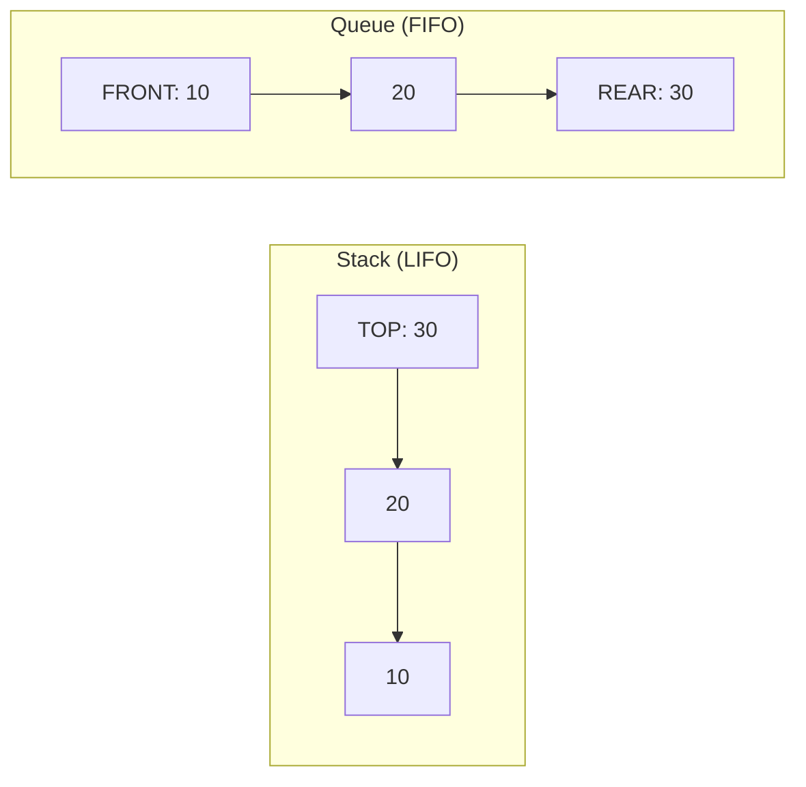
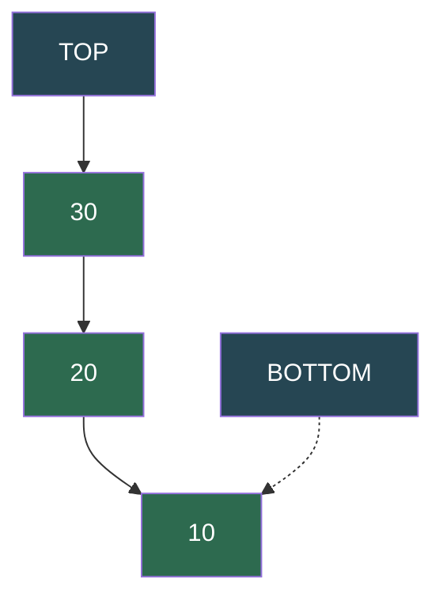
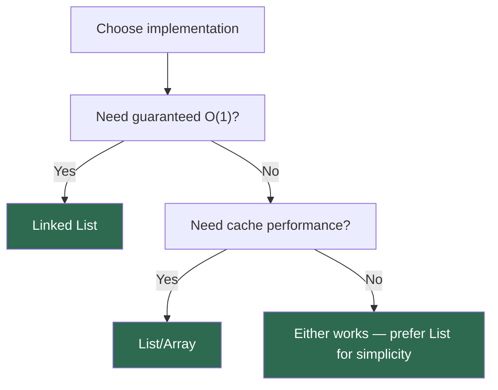
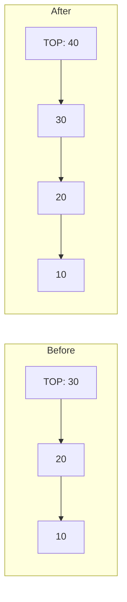

# Stack

A **stack** is a linear data structure that follows the **Last In, First Out (LIFO)** principle. The element added most recently is the first one to be removed. All insertions and deletions happen at one end — the **top**.

> "A stack is like a pile of plates — you can only add or remove from the top. Reach for the bottom, and the whole thing crashes."

---

## Table of Contents

1. [Stack vs Queue](#stack-vs-queue)
2. [Anatomy of a Stack](#anatomy-of-a-stack)
3. [Core Operations](#core-operations)
4. [Implementation — Using a List](#implementation--using-a-list)
5. [Implementation — Using a Linked List](#implementation--using-a-linked-list)
6. [List vs Linked List Implementation](#list-vs-linked-list-implementation)
7. [Operations — Visual Walkthrough](#operations--visual-walkthrough)
8. [Time and Space Complexity](#time-and-space-complexity)
9. [Real-World Uses](#real-world-uses)
10. [Essential Interview Techniques](#essential-interview-techniques)
11. [Classic Stack Problems](#classic-stack-problems)
12. [Edge Cases to Always Handle](#edge-cases-to-always-handle)
13. [Common Mistakes](#common-mistakes)
14. [Practice Problems](#practice-problems)
15. [Quick Reference Cheat Sheet](#quick-reference-cheat-sheet)

---

## Stack vs Queue

| Aspect | Stack (LIFO) | Queue (FIFO) |
|--------|--------------|--------------|
| Order | Last In, First Out | First In, First Out |
| Insert | `push` (top) | `enqueue` (rear) |
| Remove | `pop` (top) | `dequeue` (front) |
| Peek | Top element | Front element |
| Analogy | Pile of plates | Line at a ticket counter |
| Use case | Undo, recursion, DFS | BFS, scheduling, buffering |



---

## Anatomy of a Stack

```
        ┌──────────┐
        │    30    │  ◄── TOP (push/pop here)
        ├──────────┤
        │    20    │
        ├──────────┤
        │    10    │  ◄── BOTTOM
        └──────────┘

     push(40):              pop():
        ┌──────────┐           ┌──────────┐
        │    40    │  ◄─ TOP   │    20    │  ◄─ TOP
        ├──────────┤           ├──────────┤
        │    30    │           │    10    │
        ├──────────┤           └──────────┘
        │    20    │
        ├──────────┤       returned: 30
        │    10    │
        └──────────┘
```



| Component | Purpose |
|-----------|---------|
| **Top** | The only accessible element — all operations happen here |
| **Bottom** | The first element pushed; last to be popped |
| **Size** | Count of elements currently in the stack |

---

## Core Operations

| Operation | Description | Time |
|-----------|-------------|------|
| `push(value)` | Add element to the top | O(1) |
| `pop()` | Remove and return the top element | O(1) |
| `peek()` | Return the top element without removing it | O(1) |
| `is_empty()` | Check if the stack has no elements | O(1) |
| `size()` | Return the number of elements | O(1) |

Every core stack operation is **O(1)** — this is what makes stacks powerful.

---

## Implementation — Using a List

Python's built-in `list` works as a stack out of the box using `append()` and `pop()`.

```python
class Stack:
    def __init__(self):
        self.stack_list = []

    def __str__(self):
        values = [str(x) for x in reversed(self.stack_list)]
        return '\n'.join(values)

    def push(self, value):
        self.stack_list.append(value)

    def pop(self):
        if self.is_empty():
            return None
        return self.stack_list.pop()

    def peek(self):
        if self.is_empty():
            return None
        return self.stack_list[-1]

    def is_empty(self):
        return len(self.stack_list) == 0

    def size(self):
        return len(self.stack_list)


# Example usage
stack = Stack()
stack.push(10)
stack.push(20)
stack.push(30)
print(stack)
# 30
# 20
# 10
print(stack.pop())   # 30
print(stack.peek())  # 20
```

---

## Implementation — Using a Linked List

A singly linked list where the **head** acts as the **top** of the stack. Every operation is O(1) with no amortized resizing.

```python
class Node:
    def __init__(self, value):
        self.value = value
        self.next = None

class StackLinkedList:
    def __init__(self):
        self.top = None
        self.length = 0

    def __str__(self):
        result = ''
        current = self.top
        while current:
            result += str(current.value)
            if current.next:
                result += '\n'
            current = current.next
        return result

    def push(self, value):
        new_node = Node(value)
        new_node.next = self.top
        self.top = new_node
        self.length += 1

    def pop(self):
        if self.is_empty():
            return None
        popped_node = self.top
        self.top = self.top.next
        popped_node.next = None
        self.length -= 1
        return popped_node.value

    def peek(self):
        if self.is_empty():
            return None
        return self.top.value

    def is_empty(self):
        return self.length == 0

    def size(self):
        return self.length


# Example usage
stack = StackLinkedList()
stack.push(10)
stack.push(20)
stack.push(30)
print(stack)
# 30
# 20
# 10
print(stack.pop())   # 30
print(stack.peek())  # 20
```

---

## List vs Linked List Implementation

| Aspect | List-based | Linked List-based |
|--------|------------|-------------------|
| `push` | O(1) amortized* | O(1) always |
| `pop` | O(1) amortized* | O(1) always |
| Memory layout | Contiguous (cache-friendly) | Scattered (pointer overhead) |
| Memory usage | May over-allocate capacity | Exact — one node per element |
| Resizing | Occasional O(n) copy when capacity doubles | Never |
| Simplicity | Simpler (built-in list) | More code, but predictable |

*Python lists use dynamic arrays — `append`/`pop` at the end are O(1) amortized but occasionally O(n) during reallocation.



---

## Operations — Visual Walkthrough

### Push — O(1)

```
push(40):

  Before:          After:
  ┌────┐           ┌────┐
  │ 30 │ ◄─ top    │ 40 │ ◄─ top
  ├────┤           ├────┤
  │ 20 │           │ 30 │
  ├────┤           ├────┤
  │ 10 │           │ 20 │
  └────┘           ├────┤
                   │ 10 │
                   └────┘
```



### Pop — O(1)

```
pop() → returns 30:

  Before:          After:
  ┌────┐           ┌────┐
  │ 30 │ ◄─ top    │ 20 │ ◄─ top
  ├────┤           ├────┤
  │ 20 │           │ 10 │
  ├────┤           └────┘
  │ 10 │
  └────┘
```

### Peek — O(1)

Returns the top value **without** removing it. The stack remains unchanged.

```
peek() → 30

  ┌────┐
  │ 30 │ ◄─ top ◄─ peek returns this
  ├────┤
  │ 20 │
  ├────┤
  │ 10 │
  └────┘
```

---

## Time and Space Complexity

| Operation | Time | Space |
|-----------|------|-------|
| Push | O(1) | O(1) per element |
| Pop | O(1) | O(1) |
| Peek | O(1) | O(1) |
| Is Empty | O(1) | O(1) |
| Size | O(1) | O(1) |
| Search (not standard) | O(n) | O(1) |

**Overall space:** O(n) for n elements in the stack.

---

## Real-World Uses

| Domain | How stacks are used |
|--------|---------------------|
| **Function calls** | The call stack tracks function invocations and local variables |
| **Undo/Redo** | Each action is pushed; undo pops the last action |
| **Browser history** | Back button pops pages from a navigation stack |
| **Expression evaluation** | Parsing and evaluating postfix/infix expressions |
| **Syntax parsing** | Compilers use stacks for matching brackets, tags, and scopes |
| **DFS traversal** | Depth-first search uses an explicit or implicit stack |
| **Backtracking** | Maze solving, N-Queens, Sudoku — try, fail, pop, retry |
| **Memory management** | Stack memory for local variables in most programming languages |

---

## Essential Interview Techniques

### 1. Monotonic Stack

Maintain a stack where elements are always in increasing or decreasing order. Used for "next greater/smaller element" problems.

```python
# Next Greater Element — O(n)
def next_greater(nums):
    result = [-1] * len(nums)
    stack = []  # stores indices
    for i in range(len(nums)):
        while stack and nums[i] > nums[stack[-1]]:
            result[stack.pop()] = nums[i]
        stack.append(i)
    return result

# [1, 3, 2, 4] → [3, 4, 4, -1]
```

### 2. Two-Stack Trick

Use two stacks to implement a queue, or to track min/max in O(1).

```python
# Min Stack — push/pop/getMin all O(1)
class MinStack:
    def __init__(self):
        self.stack = []
        self.min_stack = []

    def push(self, val):
        self.stack.append(val)
        min_val = min(val, self.min_stack[-1] if self.min_stack else val)
        self.min_stack.append(min_val)

    def pop(self):
        self.stack.pop()
        self.min_stack.pop()

    def top(self):
        return self.stack[-1]

    def get_min(self):
        return self.min_stack[-1]
```

### 3. Stack for Parentheses Matching

```python
def is_valid(s):
    stack = []
    mapping = {')': '(', '}': '{', ']': '['}
    for char in s:
        if char in mapping:
            if not stack or stack[-1] != mapping[char]:
                return False
            stack.pop()
        else:
            stack.append(char)
    return len(stack) == 0
```

### 4. Recursion ↔ Stack Conversion

Any recursive algorithm can be converted to an iterative one using an explicit stack. This avoids stack overflow on deep recursion.

```python
# Recursive DFS
def dfs_recursive(node):
    if not node:
        return
    process(node)
    for child in node.children:
        dfs_recursive(child)

# Iterative DFS using explicit stack
def dfs_iterative(root):
    stack = [root]
    while stack:
        node = stack.pop()
        process(node)
        for child in reversed(node.children):
            stack.append(child)
```

---

## Classic Stack Problems

### 1. Evaluate Reverse Polish Notation (Postfix)

```python
def eval_rpn(tokens):
    stack = []
    ops = {'+': lambda a, b: a + b,
           '-': lambda a, b: a - b,
           '*': lambda a, b: a * b,
           '/': lambda a, b: int(a / b)}
    for token in tokens:
        if token in ops:
            b, a = stack.pop(), stack.pop()
            stack.append(ops[token](a, b))
        else:
            stack.append(int(token))
    return stack[0]

# ["2", "1", "+", "3", "*"] → 9
```

### 2. Daily Temperatures (Monotonic Stack)

```python
def daily_temperatures(temps):
    result = [0] * len(temps)
    stack = []  # indices of temps waiting for a warmer day
    for i, t in enumerate(temps):
        while stack and t > temps[stack[-1]]:
            prev = stack.pop()
            result[prev] = i - prev
        stack.append(i)
    return result

# [73, 74, 75, 71, 69, 72, 76, 73] → [1, 1, 4, 2, 1, 1, 0, 0]
```

### 3. Largest Rectangle in Histogram

```python
def largest_rectangle(heights):
    stack = []  # indices
    max_area = 0
    for i, h in enumerate(heights):
        start = i
        while stack and stack[-1][1] > h:
            idx, height = stack.pop()
            max_area = max(max_area, height * (i - idx))
            start = idx
        stack.append((start, h))
    for idx, height in stack:
        max_area = max(max_area, height * (len(heights) - idx))
    return max_area
```

---

## Edge Cases to Always Handle

1. **Empty stack** — `pop()` and `peek()` on an empty stack should return `None` (or raise an exception), not crash.
2. **Single element** — After one push and one pop, the stack should be empty.
3. **Overflow** — If using a fixed-size array, check capacity before push.
4. **Underflow** — Never pop more times than you push.
5. **Duplicate values** — Stacks allow duplicates; don't assume uniqueness.

---

## Common Mistakes

| Mistake | Consequence |
|---------|-------------|
| Popping without checking `is_empty()` | `IndexError` or `None` dereference |
| Using `stack_list[0]` instead of `stack_list[-1]` for peek | Returns bottom, not top |
| Forgetting to decrement size on pop (linked list impl) | Size drifts from actual count |
| Using a queue (`pop(0)`) instead of a stack (`pop()`) | O(n) removal; wrong data structure |
| Not clearing popped node's `next` (linked list impl) | Memory leak / dangling reference |
| Confusing LIFO with FIFO | Completely wrong order of processing |

---

## Practice Problems

1. **Valid Parentheses** — Check if a string of brackets `()[]{}` is balanced.
2. **Min Stack** — Design a stack that supports `push`, `pop`, `top`, and `getMin` in O(1).
3. **Evaluate Reverse Polish Notation** — Evaluate a postfix expression using a stack.
4. **Daily Temperatures** — For each day, find how many days until a warmer temperature.
5. **Next Greater Element** — For each element, find the next greater element to the right.
6. **Largest Rectangle in Histogram** — Find the largest rectangular area in a histogram.
7. **Implement Queue using Stacks** — Use two stacks to simulate FIFO behavior.
8. **Decode String** — Decode patterns like `3[a2[c]]` → `accaccacc` using a stack.
9. **Trapping Rain Water** — Calculate trapped water using a monotonic stack approach.
10. **Asteroid Collision** — Simulate asteroid collisions using a stack.

---

## Quick Reference Cheat Sheet

```
LIFO:   Last In, First Out

push:   stack.append(value)       # list-based
        new_node.next = top       # linked list-based
        top = new_node

pop:    stack.pop()               # list-based
        popped = top              # linked list-based
        top = top.next

peek:   stack[-1]                 # list-based
        top.value                 # linked list-based

empty:  len(stack) == 0

Python shortcut:  list works as a stack with append()/pop()
                  collections.deque also works (slightly faster)

Key patterns:
  - Matching brackets    → push open, pop on close, check match
  - Monotonic stack      → maintain sorted invariant for next greater/smaller
  - Expression eval      → operands push, operators pop two and compute
  - DFS / backtracking   → explicit stack replaces recursion
```

---

*Previous: [Circular Doubly Linked List](../11.CircularDoublyLinkedList/README.md) | Next: Queue (coming soon)*
