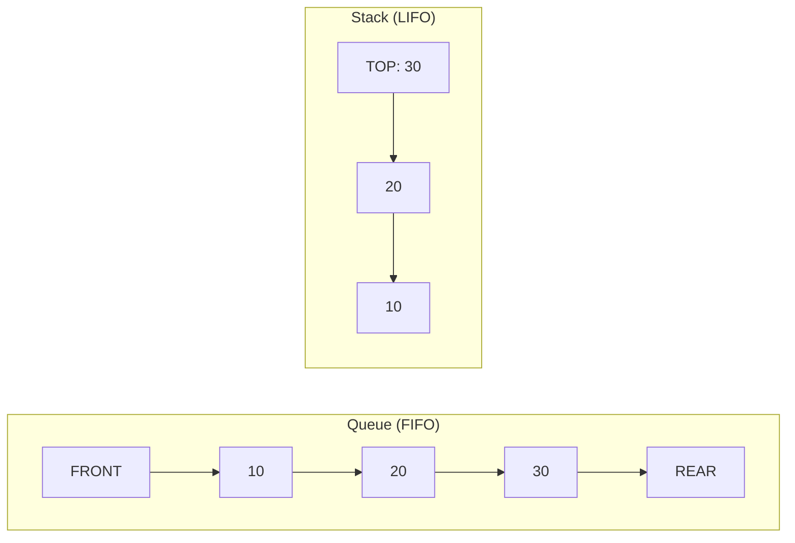
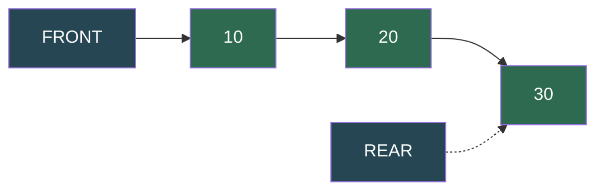
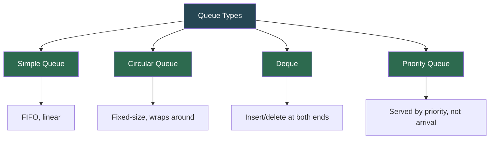
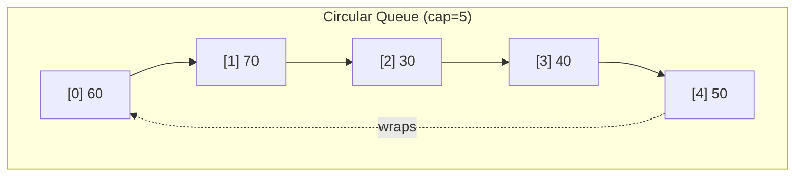
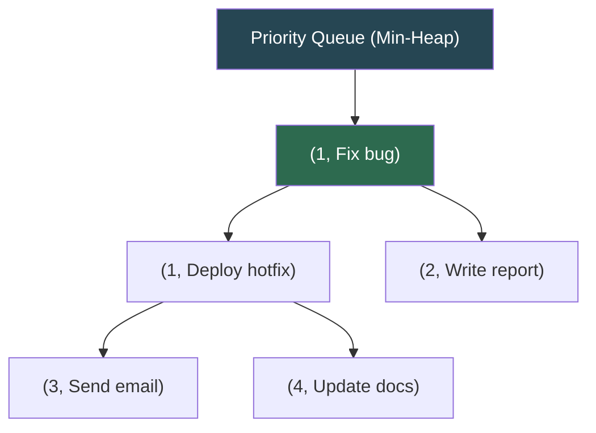
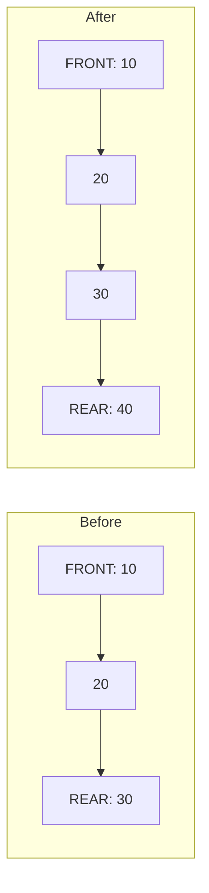

# Queues

A **queue** is a linear data structure that follows the **First In, First Out (FIFO)** principle. The element added first is the first one to be removed. Insertions happen at the **rear** and deletions at the **front**.

> "A queue is like a line at a ticket counter — the first person in line is the first person served. No cutting allowed."

---

## Table of Contents

1. [Queue vs Stack](#queue-vs-stack)
2. [Anatomy of a Queue](#anatomy-of-a-queue)
3. [Types of Queues](#types-of-queues)
4. [Simple Queue](#simple-queue)
5. [Circular Queue](#circular-queue)
6. [Deque (Double-Ended Queue)](#deque-double-ended-queue)
7. [Priority Queue](#priority-queue)
8. [Operations — Visual Walkthrough](#operations--visual-walkthrough)
9. [Time and Space Complexity](#time-and-space-complexity)
10. [Real-World Uses](#real-world-uses)
11. [Essential Interview Techniques](#essential-interview-techniques)
12. [Classic Queue Problems](#classic-queue-problems)
13. [Edge Cases to Always Handle](#edge-cases-to-always-handle)
14. [Common Mistakes](#common-mistakes)
15. [Practice Problems](#practice-problems)
16. [Quick Reference Cheat Sheet](#quick-reference-cheat-sheet)

---

## Queue vs Stack

| Aspect | Queue (FIFO) | Stack (LIFO) |
|--------|--------------|--------------|
| Order | First In, First Out | Last In, First Out |
| Insert | `enqueue` (rear) | `push` (top) |
| Remove | `dequeue` (front) | `pop` (top) |
| Peek | Front element | Top element |
| Analogy | Line at a counter | Pile of plates |
| Use case | BFS, scheduling, buffering | Undo, recursion, DFS |



---

## Anatomy of a Queue

```
  enqueue(40)                                       dequeue() → 10
      │                                                  │
      ▼                                                  ▼
  ┌──────────────────────────────────────────────┐
  │  FRONT                                 REAR  │
  │   10    20    30    40                       │
  │    ▲                  ▲                      │
  │    │                  │                      │
  │  dequeue           enqueue                   │
  └──────────────────────────────────────────────┘
```



| Component | Purpose |
|-----------|---------|
| **Front** | The next element to be removed (dequeued) |
| **Rear** | Where new elements are added (enqueued) |
| **Size** | Count of elements currently in the queue |

---

## Types of Queues



| Type | Description | When to Use |
|------|-------------|-------------|
| **Simple Queue** | Basic FIFO — enqueue at rear, dequeue from front | General-purpose task ordering |
| **Circular Queue** | Fixed capacity, rear wraps to start using modular arithmetic | Bounded buffers, streaming |
| **Deque** | Insert and delete at both front and rear | Sliding window, palindrome check |
| **Priority Queue** | Elements served by priority, not arrival order | Scheduling, Dijkstra, event-driven |

---

## Simple Queue

A straightforward FIFO queue backed by a Python list.

```python
class SimpleQueue:
    """FIFO Queue — elements enter at rear, exit from front."""

    def __init__(self):
        self.items = []

    def is_empty(self):
        return len(self.items) == 0

    def enqueue(self, item):
        """Add item to the rear of the queue."""
        self.items.append(item)

    def dequeue(self):
        """Remove and return item from the front."""
        if self.is_empty():
            raise IndexError("Dequeue from empty queue")
        return self.items.pop(0)

    def peek(self):
        """Return front item without removing it."""
        if self.is_empty():
            raise IndexError("Peek from empty queue")
        return self.items[0]

    def size(self):
        return len(self.items)

    def __repr__(self):
        return f"SimpleQueue({self.items})"


# Example usage
q = SimpleQueue()
for val in [10, 20, 30, 40, 50]:
    q.enqueue(val)

print(q.peek())    # 10
print(q.dequeue())  # 10
print(q.dequeue())  # 20
print(q)            # SimpleQueue([30, 40, 50])
```

> **Note:** `pop(0)` is O(n) because all remaining elements shift left. For production use, prefer `collections.deque` which provides O(1) `popleft()`.

---

## Circular Queue

A fixed-size queue that wraps the rear pointer back to the start using **modular arithmetic**, reusing vacated slots without shifting elements.

```
Capacity = 5

After enqueue(10, 20, 30, 40, 50):
  ┌────┬────┬────┬────┬────┐
  │ 10 │ 20 │ 30 │ 40 │ 50 │
  └────┴────┴────┴────┴────┘
    ▲                    ▲
  front                rear

After dequeue() × 2, then enqueue(60, 70):
  ┌────┬────┬────┬────┬────┐
  │ 60 │ 70 │ 30 │ 40 │ 50 │   ← 60 and 70 wrapped around!
  └────┴────┴────┴────┴────┘
              ▲         ▲
            front      rear → wraps to index 1
```



```python
class CircularQueue:
    """Fixed-size queue that wraps rear pointer back to the start."""

    def __init__(self, capacity):
        self.capacity = capacity
        self.items = [None] * capacity
        self.front = -1
        self.rear = -1
        self.count = 0

    def is_empty(self):
        return self.count == 0

    def is_full(self):
        return self.count == self.capacity

    def enqueue(self, item):
        """Add item at rear; wraps around using modular arithmetic."""
        if self.is_full():
            raise OverflowError("Queue is full")
        if self.is_empty():
            self.front = 0
        self.rear = (self.rear + 1) % self.capacity
        self.items[self.rear] = item
        self.count += 1

    def dequeue(self):
        """Remove item from front; wraps around."""
        if self.is_empty():
            raise IndexError("Dequeue from empty queue")
        item = self.items[self.front]
        self.items[self.front] = None
        self.count -= 1
        if self.is_empty():
            self.front = self.rear = -1
        else:
            self.front = (self.front + 1) % self.capacity
        return item

    def peek(self):
        if self.is_empty():
            raise IndexError("Peek from empty queue")
        return self.items[self.front]


# Example usage
cq = CircularQueue(5)
for v in [10, 20, 30, 40, 50]:
    cq.enqueue(v)

cq.dequeue()  # 10
cq.dequeue()  # 20
cq.enqueue(60)  # wraps to index 0
cq.enqueue(70)  # wraps to index 1
print(cq.peek())  # 30
```

### Key Insight: Modular Arithmetic

```
next_index = (current_index + 1) % capacity
```

This single formula handles the wrap-around. When `rear` is at the last slot, `(last + 1) % capacity` gives `0` — back to the start.

---

## Deque (Double-Ended Queue)

A **deque** allows insertion and deletion at **both** ends. It can act as a queue, a stack, or both simultaneously.

```
             insert_front          insert_rear
                  │                     │
                  ▼                     ▼
              ┌──────────────────────────┐
  FRONT ───►  │  1   5   10   20   30  │  ◄─── REAR
              └──────────────────────────┘
                  ▲                     ▲
                  │                     │
             delete_front          delete_rear
```

```python
class Deque:
    """Double-ended queue — insert/delete at both front and rear."""

    def __init__(self):
        self.items = []

    def is_empty(self):
        return len(self.items) == 0

    def insert_front(self, item):
        """Add item at the front."""
        self.items.insert(0, item)

    def insert_rear(self, item):
        """Add item at the rear."""
        self.items.append(item)

    def delete_front(self):
        """Remove and return item from front."""
        if self.is_empty():
            raise IndexError("Delete from empty deque")
        return self.items.pop(0)

    def delete_rear(self):
        """Remove and return item from rear."""
        if self.is_empty():
            raise IndexError("Delete from empty deque")
        return self.items.pop()

    def peek_front(self):
        if self.is_empty():
            raise IndexError("Peek from empty deque")
        return self.items[0]

    def peek_rear(self):
        if self.is_empty():
            raise IndexError("Peek from empty deque")
        return self.items[-1]

    def size(self):
        return len(self.items)


# Example usage
dq = Deque()
dq.insert_rear(10)
dq.insert_rear(20)
dq.insert_front(5)
dq.insert_rear(30)
dq.insert_front(1)
# Deque: [1, 5, 10, 20, 30]

print(dq.peek_front())  # 1
print(dq.peek_rear())   # 30
dq.delete_front()       # removes 1
dq.delete_rear()        # removes 30
# Deque: [5, 10, 20]
```

### Deque as Stack or Queue

| Used as | Insert | Remove |
|---------|--------|--------|
| Queue (FIFO) | `insert_rear` | `delete_front` |
| Stack (LIFO) | `insert_rear` | `delete_rear` |
| Front stack | `insert_front` | `delete_front` |

> **Production tip:** Use `collections.deque` from Python's standard library — it provides O(1) operations at both ends via a doubly linked list of fixed-size blocks.

---

## Priority Queue

Elements are served by **priority**, not arrival order. Lower priority number = higher urgency (served first). Backed by a **binary heap** via Python's `heapq`.

```
Enqueue order:          Dequeue order (by priority):
  ("Send email", p=3)     1. "Fix critical bug"  (p=1)
  ("Fix bug",    p=1)     2. "Deploy hotfix"     (p=1)
  ("Write report", p=2)   3. "Write report"      (p=2)
  ("Update docs", p=4)    4. "Send email"        (p=3)
  ("Deploy hotfix", p=1)  5. "Update docs"       (p=4)
```



```python
import heapq

class PriorityQueue:
    """Min-priority queue using a binary heap.
    Lower priority number = higher urgency (served first).
    """

    def __init__(self):
        self._heap = []
        self._index = 0  # tiebreaker for same-priority items

    def is_empty(self):
        return len(self._heap) == 0

    def enqueue(self, item, priority):
        """Add item with a given priority (lower = more urgent)."""
        heapq.heappush(self._heap, (priority, self._index, item))
        self._index += 1

    def dequeue(self):
        """Remove and return the highest-priority (lowest number) item."""
        if self.is_empty():
            raise IndexError("Dequeue from empty priority queue")
        priority, _, item = heapq.heappop(self._heap)
        return item

    def peek(self):
        """Return highest-priority item without removing it."""
        if self.is_empty():
            raise IndexError("Peek from empty priority queue")
        priority, _, item = self._heap[0]
        return item, priority

    def size(self):
        return len(self._heap)


# Example usage
pq = PriorityQueue()
pq.enqueue("Send email", priority=3)
pq.enqueue("Fix critical bug", priority=1)
pq.enqueue("Write report", priority=2)

print(pq.dequeue())  # "Fix critical bug"
print(pq.dequeue())  # "Write report"
print(pq.dequeue())  # "Send email"
```

### Why the Tiebreaker Index?

Without `_index`, two items with the same priority would compare by value — and if values aren't comparable (e.g., dicts), Python raises a `TypeError`. The auto-incrementing index guarantees FIFO order among equal-priority items.

---

## Operations — Visual Walkthrough

### Enqueue — O(1)

```
enqueue(40):

  Before:                    After:
  FRONT → [10, 20, 30]      FRONT → [10, 20, 30, 40] ← REAR
```



### Dequeue — O(1)*

```
dequeue() → returns 10:

  Before:                    After:
  FRONT → [10, 20, 30]      FRONT → [20, 30] ← REAR
```

*O(1) with `collections.deque` or linked list; O(n) with `list.pop(0)`.

### Circular Enqueue (wrap-around)

```
Capacity = 4, front=2, rear=3

Before enqueue(50):
  [None, None, 30, 40]
                 ▲       ▲
               front   rear

After enqueue(50):        rear wraps to index 0
  [50, None, 30, 40]
    ▲          ▲
   rear      front
```

---

## Time and Space Complexity

### Simple Queue (list-based)

| Operation | Time | Notes |
|-----------|------|-------|
| Enqueue | O(1) | `list.append()` |
| Dequeue | **O(n)** | `list.pop(0)` shifts all elements |
| Peek | O(1) | `list[0]` |

### Simple Queue (`collections.deque`)

| Operation | Time | Notes |
|-----------|------|-------|
| Enqueue | O(1) | `deque.append()` |
| Dequeue | O(1) | `deque.popleft()` |
| Peek | O(1) | `deque[0]` |

### Circular Queue

| Operation | Time | Notes |
|-----------|------|-------|
| Enqueue | O(1) | Modular index, no shifting |
| Dequeue | O(1) | Modular index, no shifting |
| Peek | O(1) | Direct index access |
| Is Full | O(1) | Compare count to capacity |

### Deque

| Operation | Time (list) | Time (collections.deque) |
|-----------|-------------|--------------------------|
| Insert front | O(n) | O(1) |
| Insert rear | O(1) | O(1) |
| Delete front | O(n) | O(1) |
| Delete rear | O(1) | O(1) |

### Priority Queue (heap-based)

| Operation | Time | Notes |
|-----------|------|-------|
| Enqueue | O(log n) | Heap insert |
| Dequeue | O(log n) | Heap extract-min |
| Peek | O(1) | Read heap root |

**Space:** O(n) for all queue types.

---

## Real-World Uses

| Domain | Queue Type | Why |
|--------|-----------|-----|
| **Print spooling** | Simple | Jobs processed in order received |
| **BFS traversal** | Simple | Explore level by level |
| **CPU scheduling** | Circular | Round-robin time-slice allocation |
| **Streaming buffers** | Circular | Fixed memory, continuous data flow |
| **Sliding window** | Deque | Track min/max efficiently in a window |
| **Palindrome check** | Deque | Compare from both ends simultaneously |
| **Task scheduling** | Priority | Critical tasks served before low-priority |
| **Dijkstra's algorithm** | Priority | Always process nearest unvisited node |
| **Event-driven simulation** | Priority | Events processed by scheduled time |
| **Hospital triage** | Priority | Patients treated by severity, not arrival |

---

## Essential Interview Techniques

### 1. BFS with a Queue

```python
from collections import deque

def bfs(graph, start):
    visited = set()
    queue = deque([start])
    visited.add(start)
    while queue:
        node = queue.popleft()
        process(node)
        for neighbor in graph[node]:
            if neighbor not in visited:
                visited.add(neighbor)
                queue.append(neighbor)
```

### 2. Sliding Window Maximum (Deque)

```python
from collections import deque

def sliding_window_max(nums, k):
    """Find maximum in each window of size k using a deque."""
    dq = deque()  # stores indices
    result = []
    for i, num in enumerate(nums):
        # Remove indices outside window
        while dq and dq[0] < i - k + 1:
            dq.popleft()
        # Remove smaller elements from rear
        while dq and nums[dq[-1]] < num:
            dq.pop()
        dq.append(i)
        if i >= k - 1:
            result.append(nums[dq[0]])
    return result

# [1, 3, -1, -3, 5, 3, 6, 7], k=3 → [3, 3, 5, 5, 6, 7]
```

### 3. Implement Stack Using Queues

```python
from collections import deque

class StackUsingQueues:
    def __init__(self):
        self.q = deque()

    def push(self, val):
        self.q.append(val)
        # Rotate so newest element is at front
        for _ in range(len(self.q) - 1):
            self.q.append(self.q.popleft())

    def pop(self):
        return self.q.popleft()

    def top(self):
        return self.q[0]
```

### 4. Level-Order Traversal (Binary Tree)

```python
from collections import deque

def level_order(root):
    if not root:
        return []
    result = []
    queue = deque([root])
    while queue:
        level = []
        for _ in range(len(queue)):
            node = queue.popleft()
            level.append(node.val)
            if node.left:
                queue.append(node.left)
            if node.right:
                queue.append(node.right)
        result.append(level)
    return result
```

---

## Classic Queue Problems

### 1. Hot Potato / Josephus (Circular Queue Simulation)

```python
from collections import deque

def hot_potato(names, num):
    """Simulate hot potato game — last person standing wins."""
    queue = deque(names)
    while len(queue) > 1:
        for _ in range(num):
            queue.append(queue.popleft())  # pass the potato
        eliminated = queue.popleft()
        print(f"  {eliminated} is eliminated")
    return queue[0]

# hot_potato(["Alice", "Bob", "Charlie", "Dave"], 3)
```

### 2. Generate Binary Numbers 1 to N

```python
from collections import deque

def generate_binary(n):
    """Generate binary representations of 1 to n using a queue."""
    result = []
    queue = deque(["1"])
    for _ in range(n):
        front = queue.popleft()
        result.append(front)
        queue.append(front + "0")
        queue.append(front + "1")
    return result

# generate_binary(5) → ["1", "10", "11", "100", "101"]
```

### 3. First Non-Repeating Character in a Stream

```python
from collections import deque, Counter

def first_non_repeating(stream):
    """For each character in stream, print first non-repeating so far."""
    queue = deque()
    freq = Counter()
    for char in stream:
        freq[char] += 1
        queue.append(char)
        while queue and freq[queue[0]] > 1:
            queue.popleft()
        print(queue[0] if queue else '#', end=' ')

# "aabcbcd" → a # a # c c d
```

---

## Edge Cases to Always Handle

1. **Empty queue** — `dequeue()` and `peek()` on an empty queue should raise or return `None`, not crash.
2. **Single element** — After one enqueue and one dequeue, the queue should be empty.
3. **Circular overflow** — `enqueue()` on a full circular queue should raise `OverflowError`.
4. **Wrap-around** — Circular queue must correctly handle `front > rear` after wrapping.
5. **Priority ties** — Priority queue needs a tiebreaker to maintain stable order among equal priorities.
6. **Deque empty ends** — `delete_front()` and `delete_rear()` both need empty checks.

---

## Common Mistakes

| Mistake | Consequence |
|---------|-------------|
| Using `list.pop(0)` for a hot loop | O(n) per dequeue — use `collections.deque` instead |
| Forgetting modular arithmetic in circular queue | Index goes out of bounds |
| Not resetting `front`/`rear` to -1 when circular queue empties | Stale pointers cause wrong reads |
| Comparing items directly in priority queue without tiebreaker | `TypeError` for non-comparable types |
| Using a stack (LIFO) when a queue (FIFO) is needed | BFS becomes DFS; scheduling order reversed |
| Not checking `is_full()` on bounded circular queue | Silent data overwrite |

---

## Files in This Directory

| File | Description |
|------|-------------|
| `simple-queue.py` | Basic FIFO queue backed by a Python list |
| `circular-queue.py` | Fixed-size queue with modular wrap-around |
| `deque-queue.py` | Double-ended queue + sliding window max example |
| `priority-queue.py` | Min-priority queue using `heapq` + hospital triage demo |
| `README.md` | This comprehensive guide |

---

## Practice Problems

1. **Implement Queue Using Stacks** — Use two stacks to simulate FIFO behavior.
2. **Implement Stack Using Queues** — Use one or two queues to simulate LIFO.
3. **Sliding Window Maximum** — Find the max in every window of size k (deque).
4. **Rotting Oranges** — Multi-source BFS on a grid using a queue.
5. **Number of Islands** — BFS flood-fill using a queue.
6. **Design Circular Queue** — Implement all operations with fixed capacity.
7. **Design Circular Deque** — Fixed-size deque with wrap-around at both ends.
8. **Task Scheduler** — Find minimum intervals to execute tasks with cooldown (priority queue).
9. **Merge K Sorted Lists** — Use a priority queue to merge efficiently in O(n log k).
10. **First Non-Repeating Character in Stream** — Track with a queue and frequency map.
11. **Generate Binary Numbers 1 to N** — Use a queue to build binary strings level by level.
12. **Design Hit Counter** — Count hits in the last 5 minutes using a circular buffer or queue.

---

## Quick Reference Cheat Sheet

```
FIFO:    First In, First Out

Simple Queue:
  enqueue:  items.append(value)         O(1)
  dequeue:  items.pop(0)                O(n)  ← use deque for O(1)
  peek:     items[0]                    O(1)

Circular Queue:
  next_idx: (current + 1) % capacity    wraps around!
  full:     count == capacity
  empty:    count == 0

Deque:
  insert_front / delete_front           both ends accessible
  insert_rear  / delete_rear
  Use as queue: insert_rear + delete_front
  Use as stack: insert_rear + delete_rear

Priority Queue:
  enqueue:  heapq.heappush(heap, (priority, index, item))   O(log n)
  dequeue:  heapq.heappop(heap)                               O(log n)
  peek:     heap[0]                                            O(1)

Python built-ins:
  collections.deque       → O(1) append/popleft
  queue.Queue             → thread-safe FIFO
  queue.PriorityQueue     → thread-safe priority queue
  heapq                   → heap operations on a list
```

---

*Previous: [Stack](../12.Stack/README.md) | Next: coming soon*
