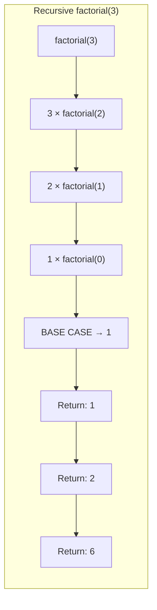
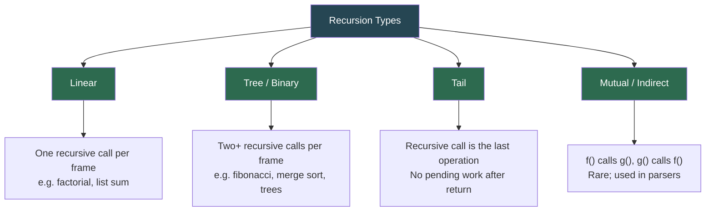
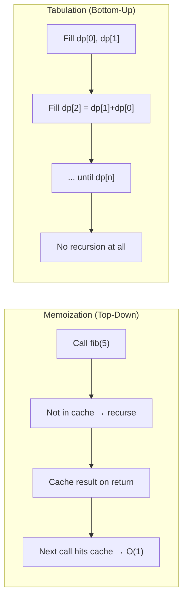

# Recursion

**Recursion** is a technique where a function calls itself to solve a smaller version of the same problem. Every recursive solution has two essential parts: a **base case** that stops the recursion, and a **recursive case** that reduces the problem toward that base case.

> "To understand recursion, you must first understand recursion."

---

## Table of Contents

1. [Recursion vs Iteration](#recursion-vs-iteration)
2. [Anatomy of a Recursive Function](#anatomy-of-a-recursive-function)
3. [The Call Stack](#the-call-stack)
4. [Types of Recursion](#types-of-recursion)
5. [Core Patterns](#core-patterns)
   - [Factorial — Linear Recursion](#factorial--linear-recursion)
   - [Array / List Recursion](#array--list-recursion)
   - [Fibonacci — Optimizing Overlapping Subproblems](#fibonacci--optimizing-overlapping-subproblems)
   - [Linked List Recursion](#linked-list-recursion)
   - [Binary Tree Recursion](#binary-tree-recursion)
   - [Divide & Conquer](#divide--conquer)
   - [Backtracking](#backtracking)
   - [N-Queens — Constraint Satisfaction](#n-queens--constraint-satisfaction)
   - [Dynamic Programming via Recursion](#dynamic-programming-via-recursion)
6. [Converting Recursion to Iteration](#converting-recursion-to-iteration)
7. [Memoization vs Tabulation](#memoization-vs-tabulation)
8. [Time and Space Complexity](#time-and-space-complexity)
9. [Real-World Uses](#real-world-uses)
10. [When to Use Recursion](#when-to-use-recursion)
11. [Edge Cases to Always Handle](#edge-cases-to-always-handle)
12. [Common Mistakes](#common-mistakes)
13. [Files in This Directory](#files-in-this-directory)
14. [Practice Problems](#practice-problems)
15. [Quick Reference Cheat Sheet](#quick-reference-cheat-sheet)

---

## Recursion vs Iteration

| Aspect | Recursion | Iteration |
|--------|-----------|-----------|
| Mechanism | Function calls itself | Loop (`for` / `while`) |
| State | Held in call stack frames | Held in loop variables |
| Space | O(depth) for call stack | O(1) typically |
| Readability | Natural for tree / graph problems | Natural for linear sequences |
| Risk | Stack overflow on deep input | Infinite loop on bad condition |
| Speed | Slightly slower (call overhead) | Slightly faster |
| When to prefer | Trees, graphs, divide & conquer, backtracking | Simple linear traversal, tight memory budgets |



---

## Anatomy of a Recursive Function

Every correct recursive function has exactly these two parts:

```python
def recursive_function(problem):
    # 1. BASE CASE — stop recursing
    if problem is small enough:
        return direct_answer

    # 2. RECURSIVE CASE — shrink the problem, then recurse
    smaller = reduce(problem)
    return combine(recursive_function(smaller))
```

```
factorial(4):

  factorial(4)
  └── 4 × factorial(3)
          └── 3 × factorial(2)
                  └── 2 × factorial(1)
                          └── 1 × factorial(0)  ← base case
                          returns 1
                  returns 2 × 1 = 2
          returns 3 × 2 = 6
  returns 4 × 6 = 24
```

| Part | Purpose | Missing it means... |
|------|---------|---------------------|
| **Base case** | Stops the recursion | Infinite recursion → `RecursionError` |
| **Progress toward base** | Each call shrinks the problem | Infinite recursion even with a base case |
| **Return value** | Propagates result back up the stack | `None` returned everywhere |

---

## The Call Stack

Each recursive call pushes a new **stack frame** onto the call stack. When the base case is reached, frames unwind in reverse order (LIFO).

```
Call stack for factorial(4):

  ┌──────────────────────┐  ← TOP (most recent)
  │  factorial(0) → 1    │
  ├──────────────────────┤
  │  factorial(1) → 1×1  │
  ├──────────────────────┤
  │  factorial(2) → 2×1  │
  ├──────────────────────┤
  │  factorial(3) → 3×2  │
  ├──────────────────────┤
  │  factorial(4) → 4×6  │  ← BOTTOM (original call)
  └──────────────────────┘
```

> **Python's default recursion limit is 1000.** For deeper recursion, use `sys.setrecursionlimit(n)` or convert to iteration.

---

## Types of Recursion



| Type | Calls per frame | Stack depth | Examples |
|------|----------------|-------------|---------|
| **Linear** | 1 | O(n) | Factorial, list sum, linked list ops |
| **Tree / Binary** | 2+ | O(log n) to O(n) | Fibonacci, merge sort, tree traversal |
| **Tail** | 1 (last op) | O(n)* | Tail factorial — Python doesn't optimize |
| **Mutual** | calls another fn | varies | Even/odd checker, language parsers |

*Python does **not** perform tail-call optimization. A tail-recursive function still builds up stack frames.

---

## Core Patterns

### Factorial — Linear Recursion

The simplest demonstration of the base-case + recursive-case pattern.

```python
def factorial(n):
    if n == 0:          # base case
        return 1
    return n * factorial(n - 1)  # recursive case

# factorial(5) → 120
# factorial(0) → 1
```

**Tail-recursive variant** (same call depth in Python — no TCO):

```python
def factorial_tail(n, accumulator=1):
    if n == 0:
        return accumulator
    return factorial_tail(n - 1, n * accumulator)
```

---

### Array / List Recursion

Treat the list as `head + tail` and recurse on the tail.

```python
def recursive_sum(arr):
    if not arr:             # base case: empty list
        return 0
    return arr[0] + recursive_sum(arr[1:])

def recursive_max(arr):
    if len(arr) == 1:
        return arr[0]
    rest_max = recursive_max(arr[1:])
    return arr[0] if arr[0] > rest_max else rest_max

def recursive_count(arr, target):
    if not arr:
        return 0
    return (1 if arr[0] == target else 0) + recursive_count(arr[1:], target)
```

> **Note:** `arr[1:]` creates a new list each call — O(n) extra space per level. Pass an index instead for O(1) slicing overhead: `recursive_sum_optimized(arr, index=0)`.

---

### Fibonacci — Optimizing Overlapping Subproblems

Fibonacci is the canonical example of tree recursion and its exponential blowup.

```
fib(5) call tree (naive):

         fib(5)
        /       \
     fib(4)    fib(3)         ← fib(3) computed twice
    /     \   /     \
 fib(3) fib(2) fib(2) fib(1)  ← fib(2) computed 3×
  ...
```

| Approach | Time | Space | Code |
|----------|------|-------|------|
| Naive | O(2ⁿ) | O(n) stack | Direct double recursion |
| Memoized | O(n) | O(n) | `@lru_cache` or dict |
| Tabulation | O(n) | O(n) | Bottom-up array |
| Optimized | O(n) | O(1) | Two rolling variables |

```python
from functools import lru_cache

# Naive — exponential blowup
def fib_naive(n):
    if n <= 1:
        return n
    return fib_naive(n - 1) + fib_naive(n - 2)

# Memoized — O(n) with decorator
@lru_cache(maxsize=None)
def fib_memo(n):
    if n <= 1:
        return n
    return fib_memo(n - 1) + fib_memo(n - 2)

# Tabulation — O(n) bottom-up
def fib_tabulation(n):
    if n <= 1:
        return n
    dp = [0] * (n + 1)
    dp[1] = 1
    for i in range(2, n + 1):
        dp[i] = dp[i - 1] + dp[i - 2]
    return dp[n]

# Optimized — O(1) space
def fib_optimized(n):
    if n <= 1:
        return n
    a, b = 0, 1
    for _ in range(2, n + 1):
        a, b = b, a + b
    return b
```

---

### Linked List Recursion

Linked lists have a natural recursive structure: each node points to a smaller list.

```python
class ListNode:
    def __init__(self, val=0, next=None):
        self.val = val
        self.next = next

def reverse(head):
    """Reverse a linked list recursively."""
    if not head or not head.next:   # base case
        return head
    new_head = reverse(head.next)   # recurse on tail
    head.next.next = head           # make next node point back
    head.next = None
    return new_head

def merge_sorted(l1, l2):
    """Merge two sorted linked lists."""
    if not l1:
        return l2
    if not l2:
        return l1
    if l1.val <= l2.val:
        l1.next = merge_sorted(l1.next, l2)
        return l1
    else:
        l2.next = merge_sorted(l1, l2.next)
        return l2
```

```
Reverse [1 → 2 → 3 → 4 → 5]:

  reverse(1)
  └── reverse(2)
      └── reverse(3)
          └── reverse(4)
              └── reverse(5) → base case, return 5
          5.next = 4, 4.next = None → [5 → 4]
      5 → 4 → 3
  5 → 4 → 3 → 2 → 1
```

---

### Binary Tree Recursion

Trees are the most natural recursive structure — each node is the root of a smaller subtree.

```python
class TreeNode:
    def __init__(self, val=0, left=None, right=None):
        self.val = val
        self.left = left
        self.right = right

# Traversals
def inorder(root):    # left → root → right
    if not root:
        return []
    return inorder(root.left) + [root.val] + inorder(root.right)

def preorder(root):   # root → left → right
    if not root:
        return []
    return [root.val] + preorder(root.left) + preorder(root.right)

def postorder(root):  # left → right → root
    if not root:
        return []
    return postorder(root.left) + postorder(root.right) + [root.val]

# Divide & conquer on trees
def max_depth(root):
    if not root:
        return 0
    return 1 + max(max_depth(root.left), max_depth(root.right))

def invert_tree(root):
    if not root:
        return None
    root.left, root.right = invert_tree(root.right), invert_tree(root.left)
    return root

def has_path_sum(root, target):
    if not root:
        return False
    if not root.left and not root.right:  # leaf
        return root.val == target
    return (has_path_sum(root.left,  target - root.val) or
            has_path_sum(root.right, target - root.val))

def lca(root, p, q):
    """Lowest Common Ancestor — O(n) single pass."""
    if not root or root == p or root == q:
        return root
    left  = lca(root.left,  p, q)
    right = lca(root.right, p, q)
    return root if left and right else left or right
```

---

### Divide & Conquer

Split the problem in half, conquer each half recursively, then merge.

```
Merge Sort on [5, 2, 8, 1, 9, 3]:

  [5, 2, 8, 1, 9, 3]
  ┌──────────┬──────────┐
  [5, 2, 8]        [1, 9, 3]
  ┌────┬────┐       ┌────┬────┐
  [5, 2]  [8]     [1, 9]   [3]
  ┌──┬──┐           ┌──┬──┐
  [5] [2]           [1] [9]
  └──────┘           └──────┘
  merge → [2, 5]    merge → [1, 9]
  merge → [2, 5, 8]  merge → [1, 3, 9]
  merge → [1, 2, 3, 5, 8, 9]
```

```python
def merge_sort(arr):
    """O(n log n) divide & conquer sort."""
    if len(arr) <= 1:           # base case
        return arr
    mid = len(arr) // 2
    left  = merge_sort(arr[:mid])
    right = merge_sort(arr[mid:])
    return merge(left, right)

def merge(left, right):
    result, i, j = [], 0, 0
    while i < len(left) and j < len(right):
        if left[i] <= right[j]:
            result.append(left[i]); i += 1
        else:
            result.append(right[j]); j += 1
    return result + left[i:] + right[j:]

def binary_search(arr, target, lo=0, hi=None):
    """O(log n) divide & conquer search."""
    if hi is None:
        hi = len(arr) - 1
    if lo > hi:
        return -1
    mid = (lo + hi) // 2
    if arr[mid] == target:
        return mid
    if arr[mid] < target:
        return binary_search(arr, target, mid + 1, hi)
    return binary_search(arr, target, lo, mid - 1)
```

---

### Backtracking

Explore all possibilities via **choose → explore → unchoose**. Prune branches that can never lead to a solution.

```
Permutations of [1, 2, 3]:

  []
  ├── [1]
  │   ├── [1, 2] → [1, 2, 3] ✓
  │   └── [1, 3] → [1, 3, 2] ✓
  ├── [2]
  │   ├── [2, 1] → [2, 1, 3] ✓
  │   └── [2, 3] → [2, 3, 1] ✓
  └── [3]
      ├── [3, 1] → [3, 1, 2] ✓
      └── [3, 2] → [3, 2, 1] ✓
```

```python
def permutations(nums):
    """Generate all permutations of nums."""
    result = []
    def backtrack(path, remaining):
        if not remaining:           # base case — full permutation
            result.append(path[:])
            return
        for i, num in enumerate(remaining):
            path.append(num)                         # choose
            backtrack(path, remaining[:i] + remaining[i+1:])  # explore
            path.pop()                               # unchoose
    backtrack([], nums)
    return result

def combination_sum(candidates, target):
    """Find all combinations that sum to target (reuse allowed)."""
    result = []
    def backtrack(start, path, remaining):
        if remaining == 0:
            result.append(path[:])
            return
        for i in range(start, len(candidates)):
            if candidates[i] > remaining:
                break
            path.append(candidates[i])
            backtrack(i, path, remaining - candidates[i])
            path.pop()
    candidates.sort()
    backtrack(0, [], target)
    return result
```

---

### N-Queens — Constraint Satisfaction

Place N queens on an N×N board so no two queens attack each other. Uses sets to track conflicts in O(1).

```
4-Queens solution:

  . Q . .
  . . . Q
  Q . . .
  . . Q .
```

```python
def solve_n_queens(n):
    """Return all valid placements of n queens on an n×n board."""
    solutions = []
    cols, diag1, diag2 = set(), set(), set()
    board = [['.' for _ in range(n)] for _ in range(n)]

    def backtrack(row):
        if row == n:
            solutions.append([''.join(r) for r in board])
            return
        for col in range(n):
            if col in cols or (row - col) in diag1 or (row + col) in diag2:
                continue                   # pruned — queen would be attacked
            cols.add(col)
            diag1.add(row - col)           # main diagonal
            diag2.add(row + col)           # anti-diagonal
            board[row][col] = 'Q'

            backtrack(row + 1)             # explore

            board[row][col] = '.'
            cols.discard(col)
            diag1.discard(row - col)
            diag2.discard(row + col)

    backtrack(0)
    return solutions

# n=4 → 2 solutions, n=8 → 92 solutions
```

---

### Dynamic Programming via Recursion

Climbing stairs (can take 1 or 2 steps) — the recursion → DP optimization path.

```
climb(4):
  climb(3) + climb(2)
    climb(2) + climb(1)   climb(1) + climb(0)
      ...                  ...
```

```python
from functools import lru_cache

# Naive — exponential
def climb_recursive(n):
    if n <= 1:
        return 1
    return climb_recursive(n - 1) + climb_recursive(n - 2)

# Memoized — O(n)
@lru_cache(maxsize=None)
def climb_memo(n):
    if n <= 1:
        return 1
    return climb_memo(n - 1) + climb_memo(n - 2)

# Tabulation — O(n)
def climb_tabulation(n):
    if n <= 1:
        return 1
    dp = [0] * (n + 1)
    dp[0] = dp[1] = 1
    for i in range(2, n + 1):
        dp[i] = dp[i - 1] + dp[i - 2]
    return dp[n]

# Optimized — O(1) space
def climb_optimized(n):
    if n <= 1:
        return 1
    a, b = 1, 1
    for _ in range(2, n + 1):
        a, b = b, a + b
    return b

# Generalized — can take 1 to k steps
def climb_k_steps(n, k):
    @lru_cache(maxsize=None)
    def dp(remaining):
        if remaining == 0:
            return 1
        return sum(dp(remaining - i) for i in range(1, k + 1) if i <= remaining)
    return dp(n)
```

---

## Converting Recursion to Iteration

Any recursive algorithm can be converted to an iterative one using an **explicit stack**.

```python
# Recursive inorder traversal
def inorder_recursive(root):
    if not root:
        return []
    return inorder_recursive(root.left) + [root.val] + inorder_recursive(root.right)

# Iterative inorder traversal (explicit stack)
def inorder_iterative(root):
    result, stack, curr = [], [], root
    while curr or stack:
        while curr:
            stack.append(curr)
            curr = curr.left
        curr = stack.pop()
        result.append(curr.val)
        curr = curr.right
    return result

# Recursive DFS on a graph
def dfs_recursive(graph, node, visited=None):
    if visited is None:
        visited = set()
    visited.add(node)
    for neighbor in graph[node]:
        if neighbor not in visited:
            dfs_recursive(graph, neighbor, visited)

# Iterative DFS (explicit stack)
def dfs_iterative(graph, start):
    visited = set()
    stack = [start]
    while stack:
        node = stack.pop()
        if node not in visited:
            visited.add(node)
            stack.extend(graph[node])
```

| Recursive structure | Iterative replacement |
|--------------------|----------------------|
| Call stack frames | Explicit `stack` (list) |
| Base case | Empty stack / null check |
| Tree inorder | Stack + `curr` pointer |
| Tree preorder | Push right then left |
| Tree postorder | Two-stack or reversed preorder |
| Graph DFS | Explicit stack |
| Graph BFS | Queue (`collections.deque`) |

---

## Memoization vs Tabulation

Both eliminate redundant computation in overlapping-subproblem recursion.



| | Memoization | Tabulation |
|--|-------------|------------|
| Direction | Top-down (recurse then cache) | Bottom-up (fill table iteratively) |
| Call stack | O(depth) — risk of overflow | O(1) — no call stack used |
| Computes | Only needed subproblems | All subproblems |
| Code style | Recursive + cache | Iterative + array |
| When to use | Sparse subproblem graphs | Dense / all subproblems needed |

---

## Time and Space Complexity

| Algorithm | Time | Space (stack) | Notes |
|-----------|------|---------------|-------|
| Factorial | O(n) | O(n) | Linear recursion — n frames |
| List sum | O(n) | O(n) | One frame per element |
| Fibonacci (naive) | O(2ⁿ) | O(n) | Tree recursion, exponential calls |
| Fibonacci (memo) | O(n) | O(n) | Each subproblem computed once |
| Binary search | O(log n) | O(log n) | Halves search space each call |
| Merge sort | O(n log n) | O(n log n) | log n levels × O(n) merge work |
| Tree traversal | O(n) | O(h) | h = tree height; O(n) worst case |
| Backtracking | O(n!) worst | O(n) | Permutations — prune to reduce |
| N-Queens | O(n!) | O(n) | Constraint sets prune heavily |

> **Space** always includes the implicit call stack. A recursion depth of 10,000 typically uses ~10 MB of stack space.

---

## Real-World Uses

| Domain | Recursive technique | Why recursion fits |
|--------|--------------------|--------------------|
| **File system traversal** | DFS on directories | Each directory is a smaller tree |
| **JSON / XML parsing** | Tree recursion | Nested structures mirror call stack |
| **Compiler design** | Recursive descent parsing | Grammar rules are naturally recursive |
| **Merge sort / Quick sort** | Divide & conquer | Halving fits recursive definition |
| **Binary search trees** | Insert / search / delete | Each node is root of a subtree |
| **Fractal generation** | Self-similar recursion | Each level is a smaller copy of the whole |
| **Backtracking solvers** | Sudoku, maze, N-Queens | Systematic exploration with pruning |
| **Dynamic programming** | Memoized recursion | Overlapping subproblems, optimal substructure |
| **Network routing (DFS)** | Graph DFS | Explore paths recursively |

---

## When to Use Recursion

**Use recursion when:**
- The problem is naturally self-similar (trees, graphs, fractals).
- Divide & conquer is the clearest way to express the solution.
- You're exploring all possibilities (backtracking, combinatorics).
- The problem has optimal substructure (DP).

**Prefer iteration when:**
- Input can be arbitrarily large (stack overflow risk).
- You need O(1) extra space.
- The problem is a simple linear scan.
- Performance is critical and call overhead matters.

---

## Edge Cases to Always Handle

1. **Empty input** — `None` root, empty list, `n=0`. Define what the function returns here.
2. **Single element** — Often a trivially different base case from empty.
3. **Negative input** — `factorial(-1)` has no mathematical meaning; validate or raise.
4. **Large input** — Python's default limit is 1000 frames; `fib_naive(50)` never returns.
5. **Circular structures** — A linked list with a cycle will recurse forever; detect with a visited set.
6. **Off-by-one in base case** — `if n == 0` vs `if n <= 1` changes the answer for `n=1`.

---

## Common Mistakes

| Mistake | Consequence |
|---------|-------------|
| Missing base case | `RecursionError: maximum recursion depth exceeded` |
| Base case that never triggers | Same as above — input never reaches the base |
| Not returning the recursive result | `None` propagates up; final answer is `None` |
| Using `arr[1:]` in every call | O(n²) space — pass an index instead |
| Forgetting to unchoose in backtracking | Path carries stale values into sibling branches |
| Treating mutable defaults as cache | `def f(memo={})` — shared across all calls |
| Relying on Python TCO | Python does not optimize tail calls — deep tail recursion still overflows |
| Shared mutable state in `@lru_cache` | Cache is global; side effects on cached objects corrupt results |

---

## Files in This Directory

| File | Description |
|------|-------------|
| `01_factorial.py` | Linear recursion, tail recursion, iterative comparison |
| `02_sum_of_list.py` | Array recursion — sum, max, count with index optimization |
| `03_fibonacci.py` | Naive → memoized → tabulated → O(1) space optimization |
| `04_linked_list.py` | Reverse, search, length, remove, merge on linked lists |
| `05_binary_tree.py` | Traversals, max depth, invert, LCA, path sum |
| `06_merge_sort.py` | Divide & conquer sort — standard + in-place + verbose trace |
| `07_binary_search.py` | Recursive binary search + first/last occurrence + rotated array |
| `08_backtracking.py` | Permutations, subsets, combination sum, phone letter combos |
| `09_n_queens.py` | N-Queens with conflict sets — solutions for n = 4 to 8 |
| `10_climbing_stairs_dp.py` | Climbing stairs: naive → memo → tabulation → O(1) space |
| `11_iterative_conversion.py` | Converting inorder, preorder, DFS, max depth to iteration |
| `README.md` | This comprehensive guide |

---

## Practice Problems

1. **Reverse a String** — Reverse a string recursively without using `[::-1]`.
2. **Power Function** — Implement `pow(x, n)` recursively in O(log n) using fast exponentiation.
3. **Flatten Nested List** — Recursively flatten `[1, [2, [3, 4]], 5]` to `[1, 2, 3, 4, 5]`.
4. **Tower of Hanoi** — Move n disks from peg A to peg C using peg B.
5. **Letter Combinations (Phone)** — Generate all letter combos a digit string could represent.
6. **Subsets / Power Set** — Generate all subsets of a given array.
7. **Combination Sum** — Find all unique combinations that sum to target.
8. **Word Search** — Backtracking on a 2D board to find a target word.
9. **Sudoku Solver** — Backtrack to fill valid digits in each empty cell.
10. **Decode Ways** — Count ways to decode a digit string (DP via memoized recursion).
11. **Maximum Depth of Binary Tree** — Recursive divide & conquer.
12. **Validate BST** — Recursively validate the BST property with min/max bounds.
13. **Symmetric Tree** — Check if a binary tree is a mirror of itself.
14. **Count Islands** — DFS flood-fill on a 2D grid.
15. **Expression Evaluation** — Recursively evaluate arithmetic expressions with parentheses.

---

## Quick Reference Cheat Sheet

```
RECURSION ANATOMY:
  def f(problem):
      if base_case:            ← MUST exist and MUST be reachable
          return direct_answer
      smaller = reduce(problem) ← MUST make progress toward base case
      return combine(f(smaller))

CALL STACK:
  depth = O(n) linear recursion
  depth = O(log n) divide & conquer (balanced)
  depth = O(n) tree / backtracking (skewed)
  Python limit: 1000 (set via sys.setrecursionlimit)

MEMOIZATION (top-down):
  @lru_cache(maxsize=None)      ← simplest approach
  memo = {}; if n in memo: return memo[n]  ← manual

TABULATION (bottom-up):
  dp = [0] * (n + 1)
  dp[0] = base; dp[1] = base
  for i in range(2, n+1): dp[i] = dp[i-1] + dp[i-2]

BACKTRACKING TEMPLATE:
  def backtrack(state):
      if goal_reached(state):
          result.append(copy(state))
          return
      for choice in choices(state):
          make(choice)        ← choose
          backtrack(state)    ← explore
          undo(choice)        ← unchoose

DIVIDE & CONQUER TEMPLATE:
  def solve(arr):
      if len(arr) <= 1: return arr          ← base case
      mid = len(arr) // 2
      left  = solve(arr[:mid])              ← divide
      right = solve(arr[mid:])              ← divide
      return merge(left, right)             ← conquer

CONVERTING TO ITERATION:
  Recursive call stack → explicit list used as stack
  while stack: ... stack.append(next_node)
```

---

*Previous: [Queues](../13.Queues/README.md) | Next: coming soon*
