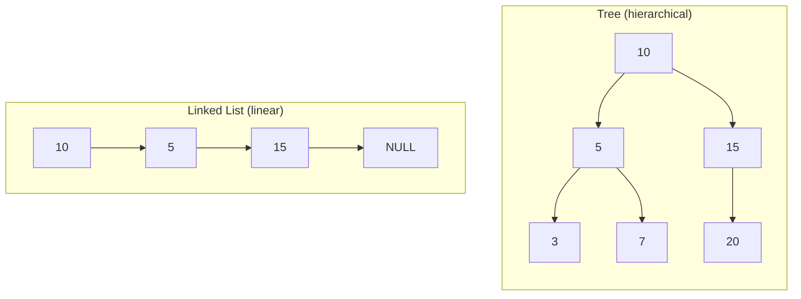
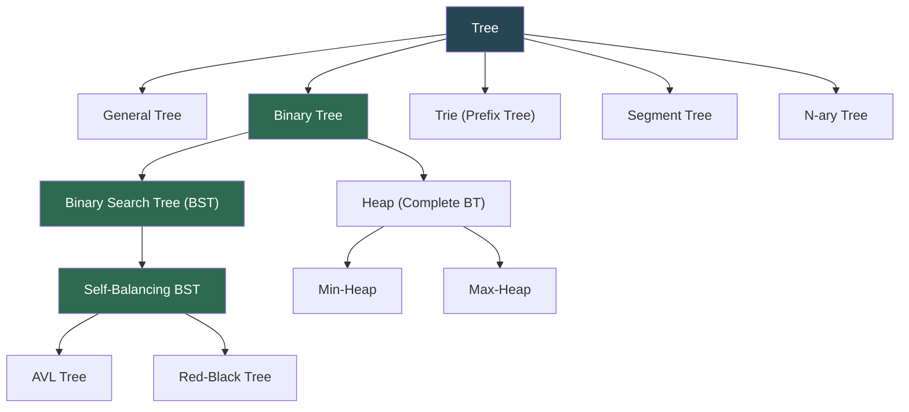

# Trees

A **tree** is a hierarchical, non-linear data structure composed of **nodes** connected by edges. Unlike arrays or linked lists which are sequential, a tree branches out — every node (except the root) has exactly one parent, and any number of children. A tree with `n` nodes always has exactly `n - 1` edges and contains no cycles.

> "A tree is the most natural way to express hierarchy — file systems, DOM elements, org charts, decision paths. If your problem has 'parents' and 'children,' the answer is usually a tree."

---

## Table of Contents

1. [Tree vs Linear Structures](#tree-vs-linear-structures)
2. [Anatomy of a Tree](#anatomy-of-a-tree)
3. [Terminology](#terminology)
4. [Types of Trees](#types-of-trees)
5. [Traversals](#traversals)
   - [Depth-First (Inorder / Preorder / Postorder)](#depth-first-inorder--preorder--postorder)
   - [Breadth-First (Level Order)](#breadth-first-level-order)
   - [Iterative Traversals](#iterative-traversals)
6. [Binary Search Tree (BST)](#binary-search-tree-bst)
7. [Common Tree Patterns](#common-tree-patterns)
   - [Height and Depth](#height-and-depth)
   - [Balanced Check](#balanced-check)
   - [Lowest Common Ancestor](#lowest-common-ancestor)
   - [Validate BST](#validate-bst)
   - [Path Sum](#path-sum)
   - [Diameter](#diameter)
   - [Serialize / Deserialize](#serialize--deserialize)
   - [Invert / Mirror](#invert--mirror)
   - [Views (Right / Left Side)](#views-right--left-side)
8. [AVL Tree (Self-Balancing BST)](#avl-tree-self-balancing-bst)
9. [Trie (Prefix Tree)](#trie-prefix-tree)
10. [Heap / Priority Queue](#heap--priority-queue)
11. [Segment Tree](#segment-tree)
12. [Time and Space Complexity](#time-and-space-complexity)
13. [Real-World Uses](#real-world-uses)
14. [Essential Interview Techniques](#essential-interview-techniques)
15. [Edge Cases to Always Handle](#edge-cases-to-always-handle)
16. [Common Mistakes](#common-mistakes)
17. [Files in This Directory](#files-in-this-directory)
18. [Practice Problems](#practice-problems)
19. [Quick Reference Cheat Sheet](#quick-reference-cheat-sheet)

---

## Tree vs Linear Structures

| Aspect | Tree | Array / Linked List |
|--------|------|---------------------|
| Shape | Hierarchical, branching | Sequential, linear |
| Relationships | Parent → children | Previous ↔ next |
| Search (balanced) | O(log n) | O(n) — O(log n) only if sorted array |
| Insert / Delete (balanced) | O(log n) | O(n) shift — O(1) at ends |
| Natural recursion | Yes — each subtree is a tree | No — loops are usually cleaner |
| Memory | Pointers per node | Contiguous or `next` pointer |
| Use case | Hierarchy, ordered sets, prefix search, priority | Ordered sequences, queues |



---

## Anatomy of a Tree

```
                root
                 │
               (10)          ← root (no parent)
              /    \
           (5)     (15)       ← internal nodes
          /   \       \
        (3)   (7)    (20)     ← (20) is a leaf
        /
      (1)                     ← leaf, depth 3

Edges:  connect parent → child
Height: longest root-to-leaf path = 3
```

| Component | Meaning |
|-----------|---------|
| **Node** | A unit holding a value + pointers to children |
| **Root** | The topmost node; has no parent |
| **Edge** | A link from a parent to a child |
| **Leaf** | A node with no children |
| **Internal node** | A node with at least one child |
| **Subtree** | A node together with all its descendants |

---

## Terminology

| Term | Definition |
|------|-----------|
| **Depth of a node** | Number of edges from the root to that node (root has depth 0) |
| **Height of a node** | Number of edges on the longest path from the node to a leaf (leaf has height 0) |
| **Height of the tree** | Height of its root |
| **Level** | Set of all nodes at the same depth |
| **Degree of a node** | Number of its children |
| **Ancestor / Descendant** | Any node on the path to/from the root |
| **Sibling** | Nodes sharing the same parent |
| **Path** | A sequence of nodes connected by edges |
| **Balanced tree** | Heights of left and right subtrees differ by ≤ 1 at every node |
| **Complete tree** | All levels full except possibly the last, which fills left-to-right |
| **Perfect tree** | All internal nodes have 2 children and all leaves are at the same level |
| **Full tree** | Every node has either 0 or 2 children |

---

## Types of Trees



| Type | Key property | Typical use |
|------|--------------|-------------|
| **Binary Tree** | Each node has ≤ 2 children | Generic hierarchy, expression trees |
| **Binary Search Tree** | `left < node < right` | Ordered sets, maps |
| **AVL Tree** | BST + balanced (height diff ≤ 1) | Guaranteed O(log n) operations |
| **Red-Black Tree** | BST + balanced via color rules | Used in `std::map`, Java `TreeMap` |
| **Heap** | Complete BT with parent ≥/≤ children | Priority queues, heap sort |
| **Trie** | Edges labeled with characters | Autocomplete, spell check, IP routing |
| **Segment Tree** | Each node stores an aggregate over a range | Range sum / min / max queries |
| **N-ary Tree** | Each node can have up to N children | File system, DOM, org charts |

---

## Traversals

A traversal visits every node exactly once. The four classic orderings:

```
Tree:             10
                 /  \
                5    15
               / \     \
              3   7    20

  Inorder    (L → N → R):   3, 5, 7, 10, 15, 20   ← sorted if BST
  Preorder   (N → L → R):  10, 5, 3, 7, 15, 20    ← copy / serialize
  Postorder  (L → R → N):   3, 7, 5, 20, 15, 10   ← delete bottom-up
  Level order (BFS):       10, 5, 15, 3, 7, 20    ← by depth
```

### Depth-First (Inorder / Preorder / Postorder)

```python
class TreeNode:
    def __init__(self, val):
        self.val = val
        self.left = None
        self.right = None

def inorder(node):     # left → root → right (sorted for BST)
    if not node:
        return []
    return inorder(node.left) + [node.val] + inorder(node.right)

def preorder(node):    # root → left → right (serialize / copy)
    if not node:
        return []
    return [node.val] + preorder(node.left) + preorder(node.right)

def postorder(node):   # left → right → root (delete / aggregate)
    if not node:
        return []
    return postorder(node.left) + postorder(node.right) + [node.val]
```

### Breadth-First (Level Order)

```python
from collections import deque

def level_order(root):
    """Visit level by level, left to right."""
    if not root:
        return []
    result, queue = [], deque([root])
    while queue:
        node = queue.popleft()
        result.append(node.val)
        if node.left:
            queue.append(node.left)
        if node.right:
            queue.append(node.right)
    return result

def level_order_grouped(root):
    """Return list of lists, one per level."""
    if not root:
        return []
    result, queue = [], deque([root])
    while queue:
        level_size = len(queue)
        level = []
        for _ in range(level_size):
            node = queue.popleft()
            level.append(node.val)
            if node.left:  queue.append(node.left)
            if node.right: queue.append(node.right)
        result.append(level)
    return result
```

### Iterative Traversals

Essential when recursion depth could blow the stack, and commonly asked in interviews.

```python
def inorder_iterative(root):
    result, stack, curr = [], [], root
    while curr or stack:
        while curr:                # go left as far as possible
            stack.append(curr)
            curr = curr.left
        curr = stack.pop()
        result.append(curr.val)
        curr = curr.right          # then try right
    return result

def preorder_iterative(root):
    if not root:
        return []
    result, stack = [], [root]
    while stack:
        node = stack.pop()
        result.append(node.val)
        if node.right: stack.append(node.right)  # push right first
        if node.left:  stack.append(node.left)   # so left is processed first
    return result

def postorder_iterative(root):
    """Modified preorder reversed at the end."""
    if not root:
        return []
    result, stack = [], [root]
    while stack:
        node = stack.pop()
        result.append(node.val)
        if node.left:  stack.append(node.left)
        if node.right: stack.append(node.right)
    return result[::-1]
```

| Traversal | Recursive | Iterative tool | When to use |
|-----------|-----------|----------------|-------------|
| **Inorder** | Natural | Stack + `curr` pointer | Sorted output from a BST |
| **Preorder** | Natural | Stack (push right, then left) | Copy / serialize |
| **Postorder** | Natural | Two-stack or reversed preorder | Delete / bottom-up aggregates |
| **Level order** | Awkward | Queue (`deque`) | BFS, shortest-path, view problems |

---

## Binary Search Tree (BST)

A **BST** is a binary tree where for every node: all values in the left subtree are smaller, and all values in the right subtree are larger. This invariant makes search, insert, and delete **O(log n) on average** — but **O(n) in the worst case** when the tree degenerates into a sorted chain.

```
BST insertions: 10, 5, 15, 3, 7, 12, 20

                 10
                /  \
               5    15
              / \   / \
             3   7 12  20
```

```python
class TreeNode:
    def __init__(self, val):
        self.val = val
        self.left = None
        self.right = None

class BST:
    def __init__(self):
        self.root = None

    def insert(self, val):
        self.root = self._insert(self.root, val)

    def _insert(self, node, val):
        if not node:
            return TreeNode(val)
        if val < node.val:
            node.left = self._insert(node.left, val)
        elif val > node.val:
            node.right = self._insert(node.right, val)
        return node                           # duplicates ignored

    def search(self, val):
        """Iterative — O(log n) average."""
        node = self.root
        while node:
            if val == node.val: return True
            node = node.left if val < node.val else node.right
        return False

    def delete(self, val):
        self.root = self._delete(self.root, val)

    def _delete(self, node, val):
        if not node:
            return None
        if val < node.val:
            node.left  = self._delete(node.left,  val)
        elif val > node.val:
            node.right = self._delete(node.right, val)
        else:
            if not node.left:  return node.right   # 0 or 1 child
            if not node.right: return node.left
            succ = self._find_min(node.right)      # 2 children: use successor
            node.val = succ.val
            node.right = self._delete(node.right, succ.val)
        return node

    def _find_min(self, node):
        while node and node.left:
            node = node.left
        return node
```

### BST Delete — three cases

```
Case 1 — Node is a leaf:        just remove it
Case 2 — Node has one child:    replace it with its child
Case 3 — Node has two children: replace with inorder successor
                                (smallest value in right subtree)
```

---

## Common Tree Patterns

These patterns cover the majority of tree interview questions.

### Height and Depth

```python
def height(node):
    """Longest root-to-leaf path (edge count)."""
    if not node:
        return 0
    return 1 + max(height(node.left), height(node.right))

def min_depth(node):
    """Shortest root-to-leaf path — careful with one-sided trees."""
    if not node:
        return 0
    if not node.left:  return 1 + min_depth(node.right)
    if not node.right: return 1 + min_depth(node.left)
    return 1 + min(min_depth(node.left), min_depth(node.right))
```

### Balanced Check

```python
def is_balanced_optimal(node):
    """O(n) — check balance during height computation."""
    def check(node):
        if not node:
            return 0
        left = check(node.left)
        if left == -1: return -1
        right = check(node.right)
        if right == -1: return -1
        if abs(left - right) > 1: return -1
        return 1 + max(left, right)
    return check(node) != -1
```

> **Naive O(n²) trap:** calling `height()` at every node recomputes overlapping subtrees. The optimal version returns `-1` as a sentinel to short-circuit.

### Lowest Common Ancestor

```python
def lca_binary_tree(root, p, q):
    """LCA in a general binary tree — O(n) single pass."""
    if not root or root.val == p or root.val == q:
        return root
    left  = lca_binary_tree(root.left,  p, q)
    right = lca_binary_tree(root.right, p, q)
    if left and right:                 # p and q are in different subtrees
        return root
    return left or right

def lca_bst(root, p, q):
    """LCA in a BST — exploit ordering for O(log n)."""
    while root:
        if   p < root.val and q < root.val: root = root.left
        elif p > root.val and q > root.val: root = root.right
        else: return root.val          # split point is the LCA
```

### Validate BST

```python
def is_valid_bst(node, low=float('-inf'), high=float('inf')):
    """Pass bounds down — not just left<node<right locally."""
    if not node:
        return True
    if not (low < node.val < high):
        return False
    return (is_valid_bst(node.left,  low,       node.val)
            and is_valid_bst(node.right, node.val, high))
```

> Checking only immediate children is a classic bug — a right-grandchild smaller than the root would pass a local check but break the BST invariant.

### Path Sum

```python
def has_path_sum(node, target):
    """Does any root-to-leaf path sum to target?"""
    if not node:
        return False
    if not node.left and not node.right:
        return node.val == target
    return (has_path_sum(node.left,  target - node.val) or
            has_path_sum(node.right, target - node.val))

def all_path_sums(node, target):
    """Return every root-to-leaf path that sums to target."""
    result = []
    def dfs(node, remaining, path):
        if not node:
            return
        path.append(node.val)
        if not node.left and not node.right and remaining == node.val:
            result.append(list(path))
        dfs(node.left,  remaining - node.val, path)
        dfs(node.right, remaining - node.val, path)
        path.pop()                             # backtrack
    dfs(node, target, [])
    return result
```

### Diameter

```python
def diameter(root):
    """Longest path between any two nodes — may not pass through root."""
    best = [0]
    def dfs(node):
        if not node:
            return 0
        l, r = dfs(node.left), dfs(node.right)
        best[0] = max(best[0], l + r)          # path through this node
        return 1 + max(l, r)                   # height returned upward
    dfs(root)
    return best[0]
```

### Serialize / Deserialize

```python
def serialize(root):
    """Preorder serialization with 'N' for null — round-trip safe."""
    if not root:
        return "N"
    return f"{root.val},{serialize(root.left)},{serialize(root.right)}"

def deserialize(data):
    vals = iter(data.split(","))
    def build():
        v = next(vals)
        if v == "N":
            return None
        node = TreeNode(int(v))
        node.left  = build()
        node.right = build()
        return node
    return build()
```

### Invert / Mirror

```python
def invert_tree(node):
    """Swap left and right at every node."""
    if not node:
        return None
    node.left, node.right = invert_tree(node.right), invert_tree(node.left)
    return node

def is_symmetric(root):
    """Mirror-self check."""
    def mirror(a, b):
        if not a and not b: return True
        if not a or  not b: return False
        return (a.val == b.val
                and mirror(a.left,  b.right)
                and mirror(a.right, b.left))
    return mirror(root, root) if root else True
```

### Views (Right / Left Side)

```python
from collections import deque

def right_side_view(root):
    """Last node at each level — what you see from the right."""
    if not root:
        return []
    result, queue = [], deque([root])
    while queue:
        level_size = len(queue)
        for i in range(level_size):
            node = queue.popleft()
            if i == level_size - 1:
                result.append(node.val)
            if node.left:  queue.append(node.left)
            if node.right: queue.append(node.right)
    return result
```

---

## AVL Tree (Self-Balancing BST)

An **AVL tree** is a BST that keeps itself balanced — at every node, `|height(left) - height(right)| ≤ 1`. After any insert or delete that breaks this invariant, the tree rebalances via **rotations**, guaranteeing **O(log n)** for all operations.

### The Four Rotation Cases

```
LL (right-rotate z):              RR (left-rotate z):

      z                y              z                  y
     / \             /   \           / \               /   \
    y   T4  ───►    x     z         T1   y    ───►    z     x
   / \             / \   / \            / \          / \   / \
  x   T3          T1 T2 T3 T4          T2  x        T1 T2 T3 T4
 / \                                      / \
T1  T2                                   T3  T4

LR (left-rotate y, then right-rotate z):
RL (right-rotate y, then left-rotate z):
```

| Imbalance | Detection | Fix |
|-----------|-----------|-----|
| **LL** | `balance > 1` and inserted into `left-of-left` | Right rotate |
| **RR** | `balance < -1` and inserted into `right-of-right` | Left rotate |
| **LR** | `balance > 1` and inserted into `right-of-left` | Left-rotate child, then right-rotate root |
| **RL** | `balance < -1` and inserted into `left-of-right` | Right-rotate child, then left-rotate root |

```python
class AVLNode:
    def __init__(self, val):
        self.val = val
        self.left = None
        self.right = None
        self.height = 1

def get_height(node):   return node.height if node else 0
def get_balance(node):  return get_height(node.left) - get_height(node.right) if node else 0
def update_height(node):
    node.height = 1 + max(get_height(node.left), get_height(node.right))

def rotate_right(z):
    y, t3 = z.left, z.left.right
    y.right, z.left = z, t3
    update_height(z); update_height(y)
    return y

def rotate_left(z):
    y, t2 = z.right, z.right.left
    y.left, z.right = z, t2
    update_height(z); update_height(y)
    return y

def avl_insert(node, val):
    if not node:            return AVLNode(val)
    if val < node.val:      node.left  = avl_insert(node.left,  val)
    elif val > node.val:    node.right = avl_insert(node.right, val)
    else:                   return node            # duplicates ignored

    update_height(node)
    balance = get_balance(node)

    if balance >  1 and val < node.left.val:       return rotate_right(node)   # LL
    if balance < -1 and val > node.right.val:      return rotate_left(node)    # RR
    if balance >  1 and val > node.left.val:                                   # LR
        node.left = rotate_left(node.left);        return rotate_right(node)
    if balance < -1 and val < node.right.val:                                  # RL
        node.right = rotate_right(node.right);     return rotate_left(node)
    return node
```

> **Why AVL?** A plain BST built from sorted input `[1, 2, 3, 4, 5]` degenerates into a linked list — O(n) operations. AVL rotations recover guaranteed O(log n) at the cost of a small constant overhead per insert/delete.

---

## Trie (Prefix Tree)

A **trie** stores strings character-by-character along branches, so strings sharing a prefix share the same path. Insert and search are **O(L)** where L = word length — independent of how many words are in the trie.

```
Insertions: "cat", "car", "card", "care"

            root
              │
              c
              │
              a
              │
              t●     (is_end)
              r
             /│\
            d●e●...    ● = end of a word
            │
            e●
```

```python
class TrieNode:
    def __init__(self):
        self.children = {}    # char → TrieNode
        self.is_end = False   # marks end of a complete word
        self.count = 0        # how many words pass through this node

class Trie:
    def __init__(self):
        self.root = TrieNode()

    def insert(self, word):                       # O(L)
        node = self.root
        for ch in word:
            node = node.children.setdefault(ch, TrieNode())
            node.count += 1
        node.is_end = True

    def search(self, word):                       # exact match
        node = self._find(word)
        return node is not None and node.is_end

    def starts_with(self, prefix):                # any word with this prefix?
        return self._find(prefix) is not None

    def _find(self, prefix):
        node = self.root
        for ch in prefix:
            if ch not in node.children:
                return None
            node = node.children[ch]
        return node

    def autocomplete(self, prefix, limit=10):
        node = self._find(prefix)
        if not node:
            return []
        results = []
        def dfs(node, path):
            if len(results) >= limit: return
            if node.is_end: results.append(prefix + "".join(path))
            for ch in sorted(node.children):
                path.append(ch)
                dfs(node.children[ch], path)
                path.pop()
        dfs(node, [])
        return results
```

| Operation | Time | Space |
|-----------|------|-------|
| Insert | O(L) | O(L) new nodes worst-case |
| Search / `starts_with` | O(L) | O(1) |
| Autocomplete | O(L + k·L_avg) | O(L) recursion + k results |
| Total space | O(ALPHABET × N × L_avg) | Compact for shared prefixes |

**When to use a trie:** autocomplete, spell check, longest prefix match (IP routing), word-search boards, streaming dictionary lookups.

---

## Heap / Priority Queue

A **heap** is a complete binary tree stored as a **flat array**, with the heap property: parent ≥ children (max-heap) or parent ≤ children (min-heap). The top of the heap is always the extremum — so `peek` is O(1) and push/pop are O(log n).

```
Min-heap as array indexing (0-based):

            10
           /  \
         15    20
         / \   / \
        17 25 50 30

  array = [10, 15, 20, 17, 25, 50, 30]

  parent(i)      = (i - 1) // 2
  left_child(i)  = 2 * i + 1
  right_child(i) = 2 * i + 2
```

```python
class MinHeap:
    def __init__(self):
        self.heap = []

    def push(self, val):                                       # O(log n)
        self.heap.append(val)
        self._sift_up(len(self.heap) - 1)

    def pop(self):                                             # O(log n)
        if not self.heap:
            return None
        self._swap(0, len(self.heap) - 1)
        val = self.heap.pop()
        if self.heap:
            self._sift_down(0)
        return val

    def peek(self):                                            # O(1)
        return self.heap[0] if self.heap else None

    def _sift_up(self, i):
        while i > 0:
            parent = (i - 1) // 2
            if self.heap[i] < self.heap[parent]:
                self._swap(i, parent); i = parent
            else:
                break

    def _sift_down(self, i):
        n = len(self.heap)
        while True:
            smallest, l, r = i, 2 * i + 1, 2 * i + 2
            if l < n and self.heap[l] < self.heap[smallest]: smallest = l
            if r < n and self.heap[r] < self.heap[smallest]: smallest = r
            if smallest == i: break
            self._swap(i, smallest); i = smallest

    def _swap(self, i, j):
        self.heap[i], self.heap[j] = self.heap[j], self.heap[i]
```

### Python's `heapq` (min-heap by default)

```python
import heapq

nums = [5, 3, 8, 1, 4, 9, 2]
heapq.heapify(nums)                       # O(n) in place
heapq.heappush(nums, 0)
smallest = heapq.heappop(nums)

# Top-K tricks
heapq.nsmallest(3, nums)
heapq.nlargest(3, nums)

# Max-heap: push negated values, negate on pop
max_heap = []
for v in [5, 3, 8]: heapq.heappush(max_heap, -v)
largest = -heapq.heappop(max_heap)
```

| Operation | Time | Notes |
|-----------|------|-------|
| Push | O(log n) | Sift-up from leaf |
| Pop | O(log n) | Move last to root, sift-down |
| Peek | O(1) | Array index 0 |
| Heapify (build) | **O(n)** | Bottom-up sift-down beats n pushes |
| Heap sort | O(n log n) | In-place with max-heap |
| Merge k sorted lists | O(N log k) | Push list heads into heap |

**Classic heap problems:** Top-K elements, Kth largest in stream, merge k sorted lists, median of a stream (two heaps), task scheduling.

---

## Segment Tree

A **segment tree** answers **range queries** (sum / min / max over `[l, r]`) and point updates in **O(log n)** each. Each node stores the aggregate for a range; children split that range in half.

```
Array:  [3, 5, 7, 4, 8, 9]

                       [0..5] = 36
                      /            \
              [0..2] = 15         [3..5] = 21
              /       \            /       \
         [0..1]=8    [2..2]=7  [3..4]=12  [5..5]=9
         /    \                   /   \
      [0..0]=3 [1..1]=5       [3..3]=4 [4..4]=8
```

```python
class SegmentTree:
    """Range sum with point updates."""

    def __init__(self, arr):
        self.n = len(arr)
        self.tree = [0] * (4 * self.n)        # safe upper bound
        if self.n: self._build(arr, 0, 0, self.n - 1)

    def _build(self, arr, node, start, end):
        if start == end:
            self.tree[node] = arr[start]; return
        mid = (start + end) // 2
        self._build(arr, 2 * node + 1, start,     mid)
        self._build(arr, 2 * node + 2, mid + 1,   end)
        self.tree[node] = self.tree[2 * node + 1] + self.tree[2 * node + 2]

    def update(self, idx, val, node=0, start=0, end=None):
        if end is None: end = self.n - 1
        if start == end:
            self.tree[node] = val; return
        mid = (start + end) // 2
        if idx <= mid: self.update(idx, val, 2 * node + 1, start,   mid)
        else:          self.update(idx, val, 2 * node + 2, mid + 1, end)
        self.tree[node] = self.tree[2 * node + 1] + self.tree[2 * node + 2]

    def query(self, l, r, node=0, start=0, end=None):
        if end is None: end = self.n - 1
        if r < start or end < l:      return 0                  # no overlap
        if l <= start and end <= r:   return self.tree[node]    # total overlap
        mid = (start + end) // 2                                # partial overlap
        return (self.query(l, r, 2 * node + 1, start,   mid) +
                self.query(l, r, 2 * node + 2, mid + 1, end))
```

### Lazy Propagation (Range Updates)

When you need **range updates** (not just point updates), propagate pending updates only when needed — both range update and range query become O(log n).

```python
class LazySegmentTree:
    """Range sum with range updates via lazy propagation."""

    def __init__(self, arr):
        self.n = len(arr)
        self.tree = [0] * (4 * self.n)
        self.lazy = [0] * (4 * self.n)
        if self.n: self._build(arr, 0, 0, self.n - 1)

    def _propagate(self, node, start, end):
        if self.lazy[node]:
            self.tree[node] += self.lazy[node] * (end - start + 1)
            if start != end:
                self.lazy[2 * node + 1] += self.lazy[node]
                self.lazy[2 * node + 2] += self.lazy[node]
            self.lazy[node] = 0
```

| Variant | Point update | Range update | Query |
|---------|--------------|--------------|-------|
| Standard | O(log n) | O(n) naive | O(log n) |
| Lazy | O(log n) | **O(log n)** | O(log n) |
| Space | O(4n) | O(4n) | — |

**When to use a segment tree:** competitive programming, time-series rolling aggregates, interval problems. For **range sum + point updates only**, a **Fenwick (BIT) tree** is simpler and has smaller constants.

---

## Time and Space Complexity

| Operation | BST (avg) | BST (worst) | AVL / RB | Heap | Trie (L=word length) | Segment Tree |
|-----------|-----------|-------------|----------|------|----------------------|--------------|
| Search | O(log n) | O(n) | O(log n) | O(n) | O(L) | — |
| Insert | O(log n) | O(n) | O(log n) | O(log n) | O(L) | O(log n) |
| Delete | O(log n) | O(n) | O(log n) | O(log n) | O(L) | — |
| Min / Max | O(log n) | O(n) | O(log n) | O(1) peek | — | — |
| Range query | O(n) | O(n) | O(n) | — | — | **O(log n)** |
| Space | O(n) | O(n) | O(n) | O(n) | O(ALPHABET × N × L) | O(4n) |

> Every recursive tree operation also uses the **call stack**: O(h) extra space, where h is the tree height — O(log n) balanced, O(n) skewed.

---

## Real-World Uses

| Domain | Tree used | Why |
|--------|-----------|-----|
| **File systems** | N-ary tree | Directories branch into subdirectories |
| **DOM / XML / JSON** | N-ary tree | Nested elements naturally hierarchical |
| **Databases** | B-Tree / B+Tree | Disk-friendly block layout, O(log n) indexed lookup |
| **Routing tables** | Trie | Longest-prefix match on IP addresses |
| **Autocomplete / Spell check** | Trie | O(L) lookup regardless of dictionary size |
| **OS process scheduling** | Heap | Ready queue ordered by priority |
| **Dijkstra / Prim's / A*** | Heap (min-heap) | Always extract lowest-cost frontier node |
| **`std::map` / `TreeMap`** | Red-Black Tree | Ordered key-value store with O(log n) ops |
| **Expression parsing** | Binary tree | Operators as internal nodes, operands as leaves |
| **Game AI (Minimax)** | Game tree | Each move branches into opponent's responses |
| **Competitive programming** | Segment / Fenwick | Range queries in O(log n) |
| **Compression (Huffman)** | Binary tree | Variable-length prefix-free codes |

---

## Essential Interview Techniques

| Technique | Idea | When to reach for it |
|-----------|------|----------------------|
| **Recursive DFS with return value** | Each call computes info for its subtree, returns to parent | Height, diameter, path sum, balanced check |
| **DFS with external state** | Mutate a shared accumulator during recursion | Count paths, collect all leaves, best-so-far |
| **BFS with level tracking** | `for _ in range(len(queue))` per level | Level order, shortest depth, views |
| **Pass bounds down** | Carry `(low, high)` into each call | Validate BST |
| **Pass target down** | Subtract node values from target | Path sum, path sum II |
| **Two heaps** | Min-heap for upper half, max-heap for lower | Running median |
| **Parent pointer / HashMap** | Store `child → parent` while building | All nodes at distance K |
| **Morris traversal** | Use right-pointer threading | O(1) space inorder (rare but elegant) |
| **Serialize as a string** | Preorder + null markers | Round-trip tree encoding |

---

## Edge Cases to Always Handle

1. **Empty tree** — `root is None`. Return 0, empty list, `True`, etc. — be explicit.
2. **Single node** — leaf and root are the same; `min_depth == 1`, `height == 0` (or 1 — agree on convention).
3. **Skewed tree** — only left or only right children. Recursion depth = n → may overflow.
4. **Duplicates in BST** — decide up front: ignore, go left, go right, or store a count.
5. **Target doesn't exist** — BST `search`, `delete` on missing value, `lca` when one node is absent.
6. **Negative values in path sum** — a subtree can decrease the running total; don't early-return on "overshoot."
7. **Deep trees vs stack limit** — Python default is 1000 frames. Use iterative traversal or `sys.setrecursionlimit`.
8. **Mutating the tree while iterating** — delete-during-traversal is a classic source of bugs.

---

## Common Mistakes

| Mistake | Consequence |
|---------|-------------|
| Checking `left.val < node.val < right.val` locally for BST validation | Misses violations by grandchildren — use bound-passing instead |
| Using naive `height()` inside `is_balanced` | O(n²) — recomputes overlapping subtrees |
| Forgetting the null check at the top of a recursive helper | `AttributeError: 'NoneType' object has no attribute 'left'` |
| Returning `None` instead of a sentinel from `lca` | Ambiguous when one of the nodes isn't present |
| Using a list as a queue for BFS | `list.pop(0)` is O(n) — use `collections.deque` |
| Mutating `root` parameter and expecting the caller to see it | Python passes references, but reassignment is local |
| BST delete without handling 2-children case via successor | Leaves dangling subtrees |
| Heap operations assuming 1-indexed array | Off-by-one errors in child/parent formulas |
| Trie autocomplete without a `limit` | Enumerating a huge subtree can be prohibitive |
| Segment tree sized as `2n` instead of `4n` | Index-out-of-bounds on non-power-of-two sizes |
| Forgetting `_propagate` in lazy segment tree queries | Stale answers — lazy must be pushed before reading children |

---

## Files in This Directory

| File | Description |
|------|-------------|
| `01_tree_basics.py` | `TreeNode` class, tree construction, node counting, leaf extraction |
| `02_traversals.py` | Inorder / Preorder / Postorder (recursive + iterative), level order (BFS) |
| `03_bst_operations.py` | BST class — insert, search, delete (3 cases), min/max, inorder successor |
| `04_tree_patterns.py` | Height, balanced check, LCA, validate BST, path sum, diameter, serialize, invert, views |
| `05_avl_tree.py` | Self-balancing BST with LL / RR / LR / RL rotations |
| `06_trie.py` | Prefix tree — insert, search, starts_with, autocomplete, delete |
| `07_heap.py` | MinHeap / MaxHeap from scratch, `heapify`, heap sort, `heapq`, merge k sorted lists |
| `08_segment_tree.py` | Range sum, range min, lazy propagation for range updates |
| `trees-dsa-guide.html` | Rendered HTML reference companion |
| `README.md` | This comprehensive guide |

---

## Practice Problems

**Easy / Foundation**
1. **Maximum Depth of Binary Tree** — classic recursive height.
2. **Invert Binary Tree** — swap left/right at every node.
3. **Same Tree** — structural + value equality between two trees.
4. **Symmetric Tree** — mirror check.
5. **Binary Tree Level Order Traversal** — BFS grouped per level.
6. **Path Sum** — does any root-to-leaf equal target?

**Medium / Core Patterns**
7. **Validate Binary Search Tree** — pass bounds down.
8. **Lowest Common Ancestor of a BST / Binary Tree** — iterative vs recursive.
9. **Binary Tree Right Side View** — level order, last node of each level.
10. **Diameter of Binary Tree** — dfs returning height, updating `best`.
11. **Kth Smallest Element in a BST** — inorder traversal with a counter.
12. **Construct Binary Tree from Preorder and Inorder** — recursive reconstruction.
13. **Path Sum II** — return all root-to-leaf paths summing to target (backtracking).
14. **Count Good Nodes in Binary Tree** — DFS passing max-so-far down.
15. **All Nodes Distance K in Binary Tree** — build parent map, then BFS.

**Hard / Classics**
16. **Serialize and Deserialize Binary Tree** — preorder + null markers.
17. **Binary Tree Maximum Path Sum** — negative branches get clipped to 0.
18. **Word Search II** — trie + DFS on a 2D board.
19. **Implement Trie (Prefix Tree)** — from scratch with `insert`/`search`/`startsWith`.
20. **Find Median from Data Stream** — two heaps (max on lower half, min on upper half).
21. **Kth Largest Element in a Stream** — min-heap of size K.
22. **Merge K Sorted Lists** — heap of list heads.
23. **Range Sum Query — Mutable** — segment tree or Fenwick tree.
24. **Count of Smaller Numbers After Self** — Fenwick tree or merge-sort.

---

## Quick Reference Cheat Sheet

```
TREE NODE:
  class TreeNode:
      def __init__(self, val):
          self.val = val
          self.left = None
          self.right = None

DFS TEMPLATE (recursive):
  def dfs(node):
      if not node:                  ← base case
          return BASE_VALUE
      l = dfs(node.left)
      r = dfs(node.right)
      return combine(node.val, l, r)

BFS TEMPLATE (level order):
  from collections import deque
  q = deque([root])
  while q:
      for _ in range(len(q)):       ← per-level loop
          node = q.popleft()
          ...
          if node.left:  q.append(node.left)
          if node.right: q.append(node.right)

BST INVARIANT:
  left.val < node.val < right.val   at EVERY node
  → inorder traversal is sorted
  → validate by passing (low, high) bounds down

HEAP ARRAY INDEXING (0-based):
  parent(i)      = (i - 1) // 2
  left_child(i)  = 2 * i + 1
  right_child(i) = 2 * i + 2

TRIE NODE:
  children = {}      ← dict[char → TrieNode]
  is_end   = False   ← marks end of a word

AVL REBALANCING:
  balance = height(left) - height(right)
  |balance| > 1 → rotate
    LL: right rotate
    RR: left rotate
    LR: rotate_left(left); rotate_right(root)
    RL: rotate_right(right); rotate_left(root)

SEGMENT TREE OVERLAP:
  r < start or end < l    → no overlap    (return identity)
  l <= start and end <= r → total overlap (return node value)
  otherwise               → recurse into both children

COMPLEXITY QUICK LOOK:
  Balanced BST / AVL : O(log n) search/insert/delete
  Skewed BST         : O(n) worst case
  Heap               : O(1) peek, O(log n) push/pop
  Trie               : O(L) per word
  Segment Tree       : O(log n) range query + update
```

---

*Previous: [Recursion](../14.Recursion/README.md) | Next: coming soon*
