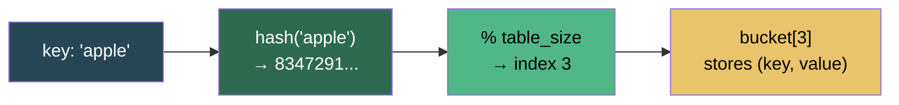

# Hashing

**Hashing** turns data of any size into a fixed-size integer — a fingerprint — that maps directly to an array index. That one trick buys you **O(1) average-case** insert, lookup, and delete. Every `dict`, `set`, cache, database index, and deduplication pass you've ever written rides on it.

> "If arrays are about *position* and lists are about *sequence*, hashing is about *identity* — the key *is* the address."

---

## Table of Contents

1. [Hashing vs Other Lookups](#hashing-vs-other-lookups)
2. [Anatomy of a Hash Table](#anatomy-of-a-hash-table)
3. [Terminology](#terminology)
4. [Hash Functions](#hash-functions)
   - [Division Method](#division-method)
   - [Multiplication Method](#multiplication-method)
   - [Polynomial Rolling Hash (Strings)](#polynomial-rolling-hash-strings)
   - [Universal Hashing](#universal-hashing)
5. [Building a Hash Table from Scratch](#building-a-hash-table-from-scratch)
6. [Collision Resolution](#collision-resolution)
   - [Separate Chaining](#separate-chaining)
   - [Open Addressing](#open-addressing)
   - [Linear Probing](#linear-probing)
   - [Quadratic Probing](#quadratic-probing)
   - [Double Hashing](#double-hashing)
7. [The Clustering Problem](#the-clustering-problem)
8. [Tombstone Deletion](#tombstone-deletion)
9. [Load Factor and Dynamic Resizing](#load-factor-and-dynamic-resizing)
10. [Python `dict` and `set` Internals](#python-dict-and-set-internals)
11. [Time and Space Complexity](#time-and-space-complexity)
12. [Essential DSA Patterns](#essential-dsa-patterns)
    - [Frequency Counting](#frequency-counting)
    - [Two Sum / Complement Lookup](#two-sum--complement-lookup)
    - [Sliding Window + Hash Map](#sliding-window--hash-map)
    - [Grouping by Computed Key](#grouping-by-computed-key)
    - [Prefix Sum + Hash Map](#prefix-sum--hash-map)
    - [Set for O(1) Existence](#set-for-o1-existence)
13. [Advanced Techniques](#advanced-techniques)
    - [Custom Hashable Objects](#custom-hashable-objects)
    - [`frozenset` as a Cache Key](#frozenset-as-a-cache-key)
    - [LRU Cache with `OrderedDict`](#lru-cache-with-ordereddict)
14. [Real-World Uses](#real-world-uses)
15. [Essential Interview Techniques](#essential-interview-techniques)
16. [Edge Cases to Always Handle](#edge-cases-to-always-handle)
17. [Common Mistakes](#common-mistakes)
18. [When *Not* to Hash](#when-not-to-hash)
19. [Files in This Directory](#files-in-this-directory)
20. [Practice Problems](#practice-problems)
21. [Quick Reference Cheat Sheet](#quick-reference-cheat-sheet)

---

## Hashing vs Other Lookups

| Aspect | Hash Table | Sorted Array | Balanced BST |
|--------|------------|--------------|--------------|
| Search | **O(1) avg**, O(n) worst | O(log n) | O(log n) |
| Insert | **O(1) avg** | O(n) shift | O(log n) |
| Delete | **O(1) avg** | O(n) shift | O(log n) |
| Ordered iteration | No (insertion order in Python dict) | Yes | Yes (inorder) |
| Range query `[l, r]` | No | **Yes** | **Yes** |
| Memory overhead | ~2–3× contents | Minimal | ~2× (pointers) |
| Worst-case guarantee | Weak | Strong | Strong |



---

## Anatomy of a Hash Table

```
  key ──► hash(key) ──► % m ──► index ──► bucket
          fingerprint   map        slot     (key, value)

  Array of m slots (the "table"):

    [0]  ·  None
    [1]  ·  ("banana", 0.75)
    [2]  ·  None
    [3]  ·  ("apple", 1.50) → ("grape", 2.00)   ← collision chain
    [4]  ·  None
    [5]  ·  ("cherry", 3.25)
    [6]  ·  None
```

| Component | Meaning |
|-----------|---------|
| **Key** | The thing you look up by — must be hashable (immutable) |
| **Value** | What's stored against the key |
| **Hash function** `h(k)` | Maps key → integer fingerprint |
| **Bucket / Slot** | One array cell, index `0 .. m-1` |
| **Table size** `m` | Length of the underlying array |
| **Load factor** `α` | `n / m` — how full the table is |
| **Collision** | Two distinct keys map to the same index |
| **Probe** | One step in the search for an empty slot (open addressing) |

---

## Terminology

| Term | Definition |
|------|-----------|
| **Hashable** | Object with a stable `__hash__` and `__eq__` — immutable types |
| **Perfect hash** | No collisions for a known, fixed set of keys |
| **Uniform hash** | Spreads keys evenly across all m slots |
| **Avalanche effect** | A 1-bit change in input flips ~50% of output bits |
| **Deterministic** | Same input → same output, every run (per process) |
| **Separate chaining** | Each bucket holds a list of colliding entries |
| **Open addressing** | All entries live in the array; probe for next free slot |
| **Primary clustering** | Linear-probe blocks that keep growing |
| **Secondary clustering** | Same-start keys share a probe path (quadratic) |
| **Tombstone** | Sentinel marking a deleted entry so probes don't stop early |
| **Rehashing** | Allocate a bigger table and re-insert every entry |

---

## Hash Functions

A hash function `h(k)` maps a key from a huge universe **U** into a small range **[0, m-1]**. A good one is:

1. **Deterministic** — same input, same output.
2. **Uniform** — spreads keys evenly.
3. **Avalanche** — small input change → large output change.
4. **Fast** — O(1) for fixed-size keys, O(L) for strings of length L.

### Division Method

```
h(k) = k mod m
```

Simplest. Choose `m` as a **prime not close to a power of 2** — otherwise only the low bits of `k` matter. Good table sizes: `7, 13, 31, 61, 127, 251, 509, 1021, 2053`.

```python
def hash_division(key: int, m: int) -> int:
    """h(k) = k mod m  —  m should be prime."""
    return key % m

hash_division(42, 7)   # 0
hash_division(15, 7)   # 1
hash_division(99, 7)   # 1  ← collision with 15
```

### Multiplication Method

```
h(k) = ⌊ m × (k × A mod 1) ⌋
```

Knuth recommends `A ≈ (√5 − 1) / 2 ≈ 0.6180339887` (golden ratio conjugate). Works even when `m` is a power of 2 — no prime-size constraint.

```python
import math

def hash_multiplication(key: int, m: int) -> int:
    A = 0.6180339887
    return math.floor(m * ((key * A) % 1))
```

### Polynomial Rolling Hash (Strings)

```
h(s) = (s[0]·p^(n-1) + s[1]·p^(n-2) + … + s[n-1]) mod m
```

Each character is weighted by a power of a prime base `p` (typically 31 or 37). Order-sensitive: `"abc" ≠ "cba"`. Foundation of **Rabin-Karp** string matching.

```python
def hash_string(s: str, m: int, p: int = 31) -> int:
    h = 0
    p_pow = 1
    for ch in s:
        h = (h + (ord(ch) - ord('a') + 1) * p_pow) % m
        p_pow = (p_pow * p) % m
    return h
```

### Universal Hashing

```
h_{a,b}(k) = ((a·k + b) mod p) mod m
```

Pick `a ∈ {1, …, p-1}` and `b ∈ {0, …, p-1}` randomly, `p` prime > any key. Collision probability between any two distinct keys is ≤ `1/m` — protection against **adversarial inputs** (hash-flooding DoS attacks).

```python
import random

def universal_hash(key: int, m: int, p: int = 104729) -> int:
    a = random.randint(1, p - 1)
    b = random.randint(0, p - 1)
    return ((a * key + b) % p) % m
```

> **Why Python randomizes string hashes.** Since Python 3.3, `hash(str)` is seeded with a per-process random value (`PYTHONHASHSEED`). Without it, attackers could craft keys that all collide and turn dict operations into O(n).

---

## Building a Hash Table from Scratch

Every operation follows the same shape: **compute hash → find bucket → do the thing.**

```python
class HashTable:
    """Fixed-size table — collisions OVERWRITE. Don't ship this."""

    def __init__(self, size: int = 7):
        self.size = size
        self.table = [None] * size
        self.count = 0

    def _hash(self, key):
        return hash(key) % self.size

    def insert(self, key, value):
        idx = self._hash(key)
        self.table[idx] = (key, value)        # ⚠️ silently clobbers collisions
        self.count += 1

    def search(self, key):
        idx = self._hash(key)
        entry = self.table[idx]
        return entry[1] if entry and entry[0] == key else None

    def delete(self, key):
        idx = self._hash(key)
        if self.table[idx] and self.table[idx][0] == key:
            self.table[idx] = None
            self.count -= 1
```

> **What breaks:** the moment `hash("apple") % 7 == hash("grape") % 7`, `insert("grape")` erases `"apple"`. Handling that cleanly is the *entire* art of hashing.

---

## Collision Resolution

Two families: **separate chaining** (lists per bucket) and **open addressing** (probe the array itself).

### Separate Chaining

Each bucket holds a list. Colliding keys append; search scans the list at the target bucket.

```
  [0]  →  None
  [1]  →  ("apple", 1.50) → ("grape", 2.00)
  [2]  →  None
  [3]  →  ("banana", 0.75)
  [4]  →  ("cherry", 3.25) → ("mango", 2.50)
  [5]  →  None
  [6]  →  None
```

```python
class HashTableChaining:
    def __init__(self, size: int = 7):
        self.size = size
        self.table = [[] for _ in range(size)]
        self.count = 0

    def _hash(self, key):
        return hash(key) % self.size

    def insert(self, key, value):
        idx = self._hash(key)
        for i, (k, _) in enumerate(self.table[idx]):
            if k == key:
                self.table[idx][i] = (key, value)     # update
                return
        self.table[idx].append((key, value))          # new entry
        self.count += 1

    def search(self, key):
        for k, v in self.table[self._hash(key)]:
            if k == key:
                return v
        return None

    def delete(self, key):
        bucket = self.table[self._hash(key)]
        for i, (k, _) in enumerate(bucket):
            if k == key:
                bucket.pop(i)
                self.count -= 1
                return True
        return False

    def load_factor(self) -> float:
        return self.count / self.size
```

### Open Addressing

No lists — every entry lives **inside the array**. On collision, **probe** for the next free slot using a formula. The probe sequence is `h(k, 0), h(k, 1), h(k, 2), …` — increment `i` until an empty slot appears.

| Strategy | Formula | Step pattern | Clusters? |
|----------|---------|--------------|-----------|
| **Linear** | `(h(k) + i) mod m` | `+1, +2, +3, …` | Primary |
| **Quadratic** | `(h(k) + c₁·i + c₂·i²) mod m` | `+1, +4, +9, …` | Secondary |
| **Double** | `(h₁(k) + i·h₂(k)) mod m` | per-key step size | None |

### Linear Probing

```
h(k, i) = (h(k) + i) mod m
```

Cache-friendly (sequential memory), simple to implement, but **primary clustering** kills performance as the table fills.

```python
class LinearProbingHT:
    def __init__(self, m: int = 7):
        self.m = m
        self.keys = [None] * m
        self.vals = [None] * m

    def _probe(self, key, i):
        return (hash(key) % self.m + i) % self.m

    def insert(self, key, val):
        for i in range(self.m):
            idx = self._probe(key, i)
            if self.keys[idx] is None or self.keys[idx] == key:
                self.keys[idx] = key
                self.vals[idx] = val
                return
        raise RuntimeError("Table full — resize!")

    def search(self, key):
        for i in range(self.m):
            idx = self._probe(key, i)
            if self.keys[idx] is None:
                return None                    # empty slot → stop
            if self.keys[idx] == key:
                return self.vals[idx]
        return None
```

### Quadratic Probing

```
h(k, i) = (h(k) + c₁·i + c₂·i²) mod m
```

Common choice: `c₁ = 0, c₂ = 1`, giving `(h(k) + i²) mod m` with steps `+1, +4, +9, +16, …`. **`m` must be prime** — otherwise the sequence won't visit every slot. Guaranteed insert when the table is less than half full.

```python
class QuadraticProbingHT:
    def __init__(self, m: int = 7):       # m MUST be prime
        self.m = m
        self.keys = [None] * m
        self.vals = [None] * m

    def _probe(self, key, i):
        return (hash(key) % self.m + i * i) % self.m

    def insert(self, key, val):
        for i in range(self.m):
            idx = self._probe(key, i)
            if self.keys[idx] is None or self.keys[idx] == key:
                self.keys[idx] = key
                self.vals[idx] = val
                return

# Probe sequence for h(k)=3, m=7:
#   i=0 → (3+0)  % 7 = 3
#   i=1 → (3+1)  % 7 = 4
#   i=2 → (3+4)  % 7 = 0
#   i=3 → (3+9)  % 7 = 5
```

### Double Hashing

```
h(k, i) = (h₁(k) + i · h₂(k)) mod m
```

Two hash functions:
- `h₁(k) = hash(k) mod m` — starting position
- `h₂(k) = 1 + (hash(k) mod (m - 1))` — step size (the `+1` guarantees it's never zero)

Each key gets a **unique step size**, so even keys starting at the same slot diverge immediately. **No clustering.**

```python
class DoubleHashHT:
    def __init__(self, m: int = 7):
        self.m = m
        self.keys = [None] * m
        self.vals = [None] * m

    def _h1(self, key):  return hash(key) % self.m
    def _h2(self, key):  return 1 + (hash(key) % (self.m - 1))

    def _probe(self, key, i):
        return (self._h1(key) + i * self._h2(key)) % self.m

    def insert(self, key, val):
        for i in range(self.m):
            idx = self._probe(key, i)
            if self.keys[idx] is None or self.keys[idx] == key:
                self.keys[idx] = key
                self.vals[idx] = val
                return
```

---

## The Clustering Problem

> **Primary clustering (linear probing).** Contiguous occupied blocks attract more keys. A block of size `k` has probability `(k+1)/m` of growing on the next insert — so clusters snowball. Average probes degrade from O(1) toward O(n).

> **Secondary clustering (quadratic probing).** Keys that hash to the same initial slot follow the *exact same* probe path. Less severe than primary clustering, but still measurable.

> **Double hashing dissolves both.** A unique step size per key means two colliding keys only share the starting slot — they diverge on probe 1.

### Strategy Comparison

| Strategy | Clustering | Cache perf. | Deletion | Max α |
|----------|------------|-------------|----------|-------|
| Separate chaining | **None** | Poor | Simple (`list.remove`) | 1.0+ |
| Linear probing | Primary | **Excellent** | Tombstones | 0.5 – 0.7 |
| Quadratic probing | Secondary | Good | Tombstones | 0.5 |
| Double hashing | **None** | Poor | Tombstones | 0.5 – 0.7 |

---

## Tombstone Deletion

In open addressing, you **can't just set a deleted slot to `None`** — that breaks the probe chain. A subsequent search would hit the `None` and stop, missing a key that got pushed further down the probe sequence.

> **Fix:** Mark the slot with a sentinel (`DELETED`). On **search**, skip past tombstones. On **insert**, overwrite them. Periodically rehash to clean them up.

```python
DELETED = object()   # unique sentinel — compare with `is`

class OpenAddressHT:
    def delete(self, key):
        for i in range(self.m):
            idx = self._probe(key, i)
            if self.keys[idx] is None:
                return False                  # key not present
            if self.keys[idx] == key:
                self.keys[idx] = DELETED      # NOT None
                self.vals[idx] = None
                return True
        return False

    def search(self, key):
        for i in range(self.m):
            idx = self._probe(key, i)
            if self.keys[idx] is None:
                return None                   # real empty → stop
            if self.keys[idx] is DELETED:
                continue                      # tombstone → keep probing
            if self.keys[idx] == key:
                return self.vals[idx]
        return None
```

---

## Load Factor and Dynamic Resizing

```
α = n / m       ← fraction of slots occupied
```

Higher α → more collisions → more probes per operation. Every implementation resizes before α crosses a threshold.

### Expected probes by load factor

| Strategy | Successful search | Unsuccessful search |
|----------|-------------------|---------------------|
| Chaining | `1 + α/2` | `α` |
| Linear probing | `½(1 + 1/(1-α))` | `½(1 + (1/(1-α))²)` |
| Quadratic / Double | `−ln(1-α) / α` | `1 / (1-α)` |

At **α = 0.5**, linear probing averages 1.5 probes. At **α = 0.9**, 5.5. At **α = 0.99**, 50. Resizing isn't optional.

### Rehashing

```
m_new ≈ next_prime(2 × m_old)
```

1. Allocate a new table of size `m_new`.
2. Recompute `h(key) % m_new` for every entry.
3. Re-insert.
4. Replace the old table.

Cost: **O(n)** per resize. But resizes double the size, so they're exponentially rare — **amortized O(1) per insert.**

```python
class DynamicHashTable:
    def __init__(self, m: int = 7):
        self.m = m
        self.table = [[] for _ in range(m)]
        self.n = 0

    def _resize(self):
        old = self.table
        self.m = self.m * 2 + 1              # stays odd → closer to prime
        self.table = [[] for _ in range(self.m)]
        self.n = 0
        for bucket in old:
            for k, v in bucket:
                self.insert(k, v)            # re-hash with new m

    def insert(self, key, val):
        if self.n / self.m >= 0.75:
            self._resize()
        idx = hash(key) % self.m
        for i, (k, _) in enumerate(self.table[idx]):
            if k == key:
                self.table[idx][i] = (key, val)
                return
        self.table[idx].append((key, val))
        self.n += 1
```

---

## Python `dict` and `set` Internals

Both `dict` and `set` are open-addressed hash tables. CPython uses a **perturbation-based probe**:

```
j = ((5 × j) + 1 + perturb) mod 2^n
perturb >>= 5          # shift right 5 bits each step
```

Table size is always a **power of 2**. `perturb` starts as the full hash value, so early probes leap across the table using high-order bits; as it decays toward 0, the walk becomes linear. Excellent distribution without a second hash function.

| Property | `dict` | `set` |
|----------|--------|-------|
| Stores | `hash | key | value` | `hash | key` |
| Load threshold | **α = 2/3** | α = 2/3 |
| Resize strategy | 4× (small) or 2× (large) | Same |
| Insertion order | **Preserved** (3.7+) | Not guaranteed |
| Set operations | — | `& | - ^` |

### Cheat sheet

```python
# ─── dict — all O(1) average ───
d = {"a": 1, "b": 2, "c": 3}
d["d"] = 4                      # insert / update    → O(1)
val   = d["a"]                  # access             → O(1)
val   = d.get("z", 0)           # safe access        → O(1)
del d["b"]                      # delete             → O(1)
"a" in d                        # membership         → O(1)  ← superpower
d.setdefault("e", 5)            # insert-if-absent
d.pop("a", None)                # remove + return (or default)

from collections import Counter, defaultdict
Counter("abracadabra")          # {'a':5, 'b':2, 'r':2, ...}
graph = defaultdict(list)
graph["A"].append("B")          # no KeyError

# ─── set — O(1) element ops ───
s = {1, 2, 3}
s.add(6)                        # O(1)
s.discard(99)                   # O(1), no error if missing
3 in s                          # O(1)

a, b = {1, 2, 3, 4}, {3, 4, 5, 6}
a & b                           # {3, 4}         intersection
a | b                           # {1,2,3,4,5,6}  union
a - b                           # {1, 2}         difference
a ^ b                           # {1, 2, 5, 6}   symmetric difference
```

---

## Time and Space Complexity

| Operation | Hash table (avg) | Hash table (worst) | Sorted array | Balanced BST |
|-----------|------------------|--------------------|--------------|--------------|
| Search | **O(1)** | O(n) | O(log n) | O(log n) |
| Insert | **O(1) amortized** | O(n) | O(n) | O(log n) |
| Delete | **O(1)** | O(n) | O(n) | O(log n) |
| Min / Max | O(n) | O(n) | O(1) | O(log n) |
| Range `[l, r]` | O(n) | O(n) | **O(log n + k)** | **O(log n + k)** |
| Space | O(n) + headroom | O(n) + headroom | O(n) | O(n) |

> Worst case O(n) happens when every key collides into one bucket — either a pathological hash function or an attacker crafting colliding keys. Python's randomized string hashing defends against the latter.

---

## Essential DSA Patterns

The six patterns that solve the majority of hash-map interview problems.

### Frequency Counting

Count occurrences; find most/least common; check anagrams.

```python
def first_unique_char(s: str) -> int:
    freq = {}
    for ch in s:
        freq[ch] = freq.get(ch, 0) + 1
    for i, ch in enumerate(s):
        if freq[ch] == 1:
            return i
    return -1

from collections import Counter
def is_anagram(s: str, t: str) -> bool:
    return Counter(s) == Counter(t)
```

### Two Sum / Complement Lookup

Store values you've seen; check the complement in O(1).

```python
def two_sum(nums: list, target: int) -> list:
    seen = {}                               # value → index
    for i, num in enumerate(nums):
        complement = target - num
        if complement in seen:              # O(1) lookup
            return [seen[complement], i]
        seen[num] = i
    return []
```

```
nums = [2, 7, 11, 15], target = 9
  i=0, num=2 → complement=7 → 7 not in {}        → seen = {2: 0}
  i=1, num=7 → complement=2 → 2 IS in {2:0}       → return [0, 1]
```

### Sliding Window + Hash Map

Track element counts or last-seen indices inside a moving window.

```python
def length_of_longest_substring(s: str) -> int:
    last_seen = {}                          # char → last index
    left = 0
    best = 0
    for right, ch in enumerate(s):
        if ch in last_seen and last_seen[ch] >= left:
            left = last_seen[ch] + 1        # shrink window past the duplicate
        last_seen[ch] = right
        best = max(best, right - left + 1)
    return best
```

### Grouping by Computed Key

Bucket items by something derived from the value — sorted chars, counts, tuple signature.

```python
from collections import defaultdict

def group_anagrams(strs: list) -> list:
    groups = defaultdict(list)
    for s in strs:
        key = tuple(sorted(s))              # hashable signature
        groups[key].append(s)
    return list(groups.values())
```

### Prefix Sum + Hash Map

Subarray problems where you need `sum[i..j] == K` in O(n).

```python
def subarray_sum(nums: list, k: int) -> int:
    prefix_count = {0: 1}                   # prefix_sum → how many times seen
    running = 0
    count = 0
    for num in nums:
        running += num
        if running - k in prefix_count:     # a prior prefix + k = running
            count += prefix_count[running - k]
        prefix_count[running] = prefix_count.get(running, 0) + 1
    return count
```

### Set for O(1) Existence

Convert a list to a set when membership checks dominate.

```python
def longest_consecutive(nums: list) -> int:
    num_set = set(nums)
    best = 0
    for num in num_set:
        if num - 1 not in num_set:          # only start from sequence heads
            current, streak = num, 1
            while current + 1 in num_set:
                current += 1
                streak += 1
            best = max(best, streak)
    return best

def contains_duplicate(nums: list) -> bool:
    return len(nums) != len(set(nums))
```

---

## Advanced Techniques

### Custom Hashable Objects

Define `__hash__` **and** `__eq__` together — if two objects compare equal, they must hash equal.

```python
class Point:
    def __init__(self, x, y):
        self.x, self.y = x, y

    def __hash__(self):
        return hash((self.x, self.y))       # delegate to tuple

    def __eq__(self, other):
        return isinstance(other, Point) and (self.x, self.y) == (other.x, other.y)

unique = {Point(1, 2), Point(1, 2), Point(3, 4)}
len(unique)                                  # 2
```

> **Rule:** if you override `__eq__`, you must override `__hash__` too (or set it to `None` to make the class unhashable).

### `frozenset` as a Cache Key

Need an order-independent key? `frozenset` is hashable; `set` is not.

```python
cache = {}

def expensive(items):
    key = frozenset(items)                   # {1,2,3} hashes same as {3,2,1}
    if key in cache:
        return cache[key]
    result = sum(x ** 2 for x in items)
    cache[key] = result
    return result

expensive([3, 1, 2])    # computes
expensive([2, 3, 1])    # cache hit
```

### LRU Cache with `OrderedDict`

Classic interview problem. `OrderedDict.move_to_end` and `popitem(last=False)` give you O(1) LRU semantics.

```python
from collections import OrderedDict

class LRUCache:
    def __init__(self, capacity: int):
        self.cache = OrderedDict()
        self.capacity = capacity

    def get(self, key: int) -> int:
        if key not in self.cache:
            return -1
        self.cache.move_to_end(key)          # mark as most recently used
        return self.cache[key]

    def put(self, key: int, value: int) -> None:
        if key in self.cache:
            self.cache.move_to_end(key)
        self.cache[key] = value
        if len(self.cache) > self.capacity:
            self.cache.popitem(last=False)   # evict LRU (first item)
```

---

## Real-World Uses

| Domain | Structure | Why |
|--------|-----------|-----|
| **Language runtimes** | `dict`, `map`, `HashMap` | Object attributes, variable scopes, method dispatch |
| **Database indexes** | Hash index | O(1) equality lookup on indexed column |
| **Caches** | `LRUCache`, memcached, Redis | Fast key-based retrieval |
| **Symbol tables** | Hash map | Compiler/interpreter variable lookup |
| **Deduplication** | `set`, Bloom filter | Unique-visitor counts, URL crawl frontier |
| **Cryptography** | SHA-256, BLAKE3 | One-way fingerprint, integrity, Merkle trees |
| **Git** | SHA-1 content hash | Content-addressable object storage |
| **Compilers** | Interning table | Canonicalize strings to a single pointer |
| **Networking** | Consistent hashing | Shard keys across servers, rebalance gracefully |
| **Password storage** | bcrypt, scrypt, argon2 | Slow one-way hash + salt |

---

## Essential Interview Techniques

| Technique | Idea | When to reach for it |
|-----------|------|----------------------|
| **Count then scan** | `Counter` first, inspect after | Most/least frequent, first unique, anagram groups |
| **Seen-so-far map** | Store `value → index/count` as you iterate | Two Sum, longest substring without repeats |
| **Complement lookup** | For each `x`, check if `target - x` is in map | Pair sums, difference-K problems |
| **Grouping key** | Derive a hashable signature (`tuple(sorted(...))`, counts) | Anagrams, isomorphic strings |
| **Prefix-sum map** | `map[prefix_sum] → count` | Subarray sum = K, subarray with equal 0s/1s |
| **Set for membership** | Convert list → set for O(1) `in` | Longest consecutive, contains duplicate |
| **`defaultdict(list/int/set)`** | Auto-initialize buckets | Graph adjacency lists, frequency maps |
| **Custom `__hash__` + `__eq__`** | Use your class as a dict/set key | Coordinate dedup, tuple-like value objects |
| **`frozenset` key** | Order-independent cache key | Memoizing functions on unordered inputs |

---

## Edge Cases to Always Handle

1. **Empty input** — `{}`, `[]`, `""`. Many patterns return 0, `[]`, or `-1` — be explicit.
2. **Single element** — off-by-ones in sliding window and prefix-sum patterns.
3. **Duplicates in input** — do you want *all* occurrences or just the first? `dict` stores one, `defaultdict(list)` keeps all.
4. **Unhashable keys** — `list`, `dict`, `set` can't be keys. Convert to `tuple` or `frozenset`.
5. **Mutating keys** — never mutate an object after inserting it as a key; the hash becomes stale and the entry gets lost.
6. **Negative numbers / zero** — prefix-sum maps must initialize with `{0: 1}` to count subarrays starting at index 0.
7. **Collisions with `None`** — use a unique sentinel (`object()`) when `None` is a legal value.
8. **Order sensitivity** — Python dicts preserve insertion order; older versions and other languages may not.
9. **Hash randomization across runs** — `hash("x")` differs per process. Never persist Python hash values.
10. **Floating-point keys** — `hash(1.0) == hash(1)`. Mixing `int` and `float` keys can surprise you.

---

## Common Mistakes

| Mistake | Consequence |
|---------|-------------|
| Using `dict[key]` without checking membership | `KeyError` — use `.get()` or `in` first |
| Overriding `__eq__` without `__hash__` | Class becomes unhashable; dict/set reject it |
| Mutating a key after insertion | Entry becomes unreachable — hash no longer matches bucket |
| Deleting open-addressing slots with `None` | Breaks probe chain — use tombstones |
| Quadratic probing with non-prime `m` | Probe sequence misses half the slots |
| Double hashing where `h₂(k)` can be 0 | Infinite loop on the starting slot |
| Counting inside a loop with `dict[k] += 1` | `KeyError` on first sight — use `defaultdict(int)` or `Counter` |
| Forgetting `prefix_count[0] = 1` | Miss subarrays that start at index 0 |
| Using `list` where you need `set` | `x in list` is O(n), not O(1) |
| Iterating a dict while mutating it | `RuntimeError: dictionary changed size during iteration` |
| Relying on hash values across processes | Python randomizes string hashes per run |
| Resizing only on insert, never shrinking | Memory stays high after deletes — fine for most use cases, bad for long-lived caches |

---

## When *Not* to Hash

> **Need sorted order or range queries?** → Balanced BST, sorted array, or skip list. Hashing scrambles order by design.

> **Need worst-case O(log n)?** → BST. Hash tables degrade to O(n) under adversarial or pathological inputs.

> **Memory is extremely tight?** → Hash tables carry 30–50% headroom for the load factor. Sorted arrays are denser.

> **Keys are unhashable (mutable)?** → Use a tree-based map, or convert keys to a hashable snapshot (`tuple`, `frozenset`).

> **Need prefix/substring queries?** → Trie. Hashing can test exact match but can't follow prefixes efficiently.

---

## Files in This Directory

| File | Description |
|------|-------------|
| `hashing-guide.html` | Rendered visual companion — interactive linear-probing demo, diagrams, full chapter walkthrough |
| `README.md` | This comprehensive guide |

---

## Practice Problems

**Easy / Foundation**
1. **Two Sum** — seen-so-far map + complement lookup.
2. **Contains Duplicate** — `len(nums) != len(set(nums))`.
3. **Valid Anagram** — `Counter(s) == Counter(t)`.
4. **First Unique Character in a String** — frequency pass then scan.
5. **Intersection of Two Arrays** — set intersection.
6. **Happy Number** — set of seen values to detect cycles.

**Medium / Core Patterns**
7. **Group Anagrams** — `defaultdict(list)` keyed by `tuple(sorted(s))`.
8. **Longest Substring Without Repeating Characters** — sliding window + last-seen map.
9. **Subarray Sum Equals K** — prefix-sum map `{0: 1}`.
10. **Top K Frequent Elements** — `Counter` + heap or bucket sort.
11. **Longest Consecutive Sequence** — set membership, only extend from sequence heads.
12. **4Sum II** — pair-sum map over two arrays, look up complement in the other pair.
13. **Find All Anagrams in a String** — sliding window of character counts.
14. **Copy List with Random Pointer** — node → clone map.
15. **Insert Delete GetRandom O(1)** — dict + array with swap-on-delete.

**Hard / Classics**
16. **LRU Cache** — `OrderedDict` or dict + doubly-linked list.
17. **LFU Cache** — two dicts + bucket of equal-frequency nodes.
18. **Minimum Window Substring** — two-pointer + required/have counters.
19. **Substring with Concatenation of All Words** — word-count window over fixed-size chunks.
20. **Palindrome Pairs** — map word → index, probe prefixes/suffixes.
21. **Rabin-Karp (Repeated DNA Sequences)** — rolling hash over fixed-length windows.
22. **Design a HashMap / HashSet** — implement from scratch.
23. **Consistent Hashing Ring** — sorted hash ring, bisect for placement.
24. **Count Distinct Elements in Every Window** — sliding window + count map, remove-on-zero.

---

## Quick Reference Cheat Sheet

```
HASH → INDEX:
  idx = hash(key) % table_size

HASH FUNCTION FAMILIES:
  Division:       h(k) = k mod m                    (m prime, not 2^p)
  Multiplication: h(k) = floor(m * (k * A mod 1))   (A = (√5 − 1)/2)
  Polynomial:     h(s) = Σ s[i] * p^(n−1−i) mod m   (p = 31 or 37)
  Universal:      h(k) = ((a·k + b) mod p) mod m    (random a, b)

OPEN ADDRESSING PROBES:
  Linear:     h(k, i) = (h(k) + i)              mod m
  Quadratic:  h(k, i) = (h(k) + i²)             mod m   (m prime)
  Double:     h(k, i) = (h1(k) + i · h2(k))     mod m   (h2 never 0)
  CPython:    j = (5·j + 1 + perturb) mod 2^n;  perturb >>= 5

LOAD FACTOR:
  α = n / m
  Resize when α exceeds threshold:
    chaining:       ~1.0
    linear probing: 0.5 – 0.7
    quadratic:      0.5
    CPython dict:   2/3

TOMBSTONE RULE (open addressing):
  delete → mark slot DELETED (not None)
  search → skip DELETED, stop on None
  insert → overwrite DELETED

SIX DSA PATTERNS:
  1. Frequency counting         → Counter / freq dict
  2. Complement lookup          → Two Sum family
  3. Sliding window + map       → longest-substring family
  4. Grouping by computed key   → defaultdict(list)
  5. Prefix sum + map           → subarray sum = K
  6. Set for existence          → longest consecutive, duplicates

HASHABLE CONTRACT:
  If a == b  →  hash(a) == hash(b)
  Override __eq__ →  override __hash__
  Never mutate a key after insertion

WHEN NOT TO HASH:
  Need order         → BST, sorted array
  Need range queries → BST, segment tree
  Worst-case bound   → balanced tree
  Prefix match       → trie
```

---

*Previous: [Trees](../15.Trees/README.md) | Next: [Graphs](../Graphs/)*
