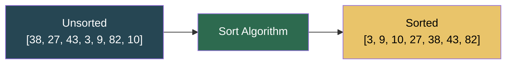

# Sorting

**Sorting** imposes a total order on a collection — every element lands in the right place relative to every other. It is the most studied problem in computer science: nearly every other algorithm (binary search, merge joins, graph algorithms) either *produces* sorted output, *requires* sorted input, or runs faster when data is already ordered.

> "Sorting is not a goal in itself — it is the prerequisite that unlocks logarithmic time everywhere else."

---

## Table of Contents

1. [Why Sorting Matters](#why-sorting-matters)
2. [Algorithm Comparison at a Glance](#algorithm-comparison-at-a-glance)
3. [Key Concepts](#key-concepts)
   - [Stability](#stability)
   - [In-Place vs Out-of-Place](#in-place-vs-out-of-place)
   - [Comparison vs Non-Comparison Sorts](#comparison-vs-non-comparison-sorts)
   - [Adaptive Sorts](#adaptive-sorts)
4. [The Algorithms](#the-algorithms)
   - [Bubble Sort](#bubble-sort)
   - [Selection Sort](#selection-sort)
   - [Insertion Sort](#insertion-sort)
   - [Merge Sort](#merge-sort)
   - [Quick Sort](#quick-sort)
   - [Heap Sort](#heap-sort)
   - [Bucket Sort](#bucket-sort)
5. [Choosing the Right Algorithm](#choosing-the-right-algorithm)
6. [Python's Built-In Sort (Timsort)](#pythons-built-in-sort-timsort)
7. [Sorting in Python — Practical Patterns](#sorting-in-python--practical-patterns)
8. [Common Mistakes](#common-mistakes)
9. [Edge Cases to Always Handle](#edge-cases-to-always-handle)
10. [Files in This Directory](#files-in-this-directory)
11. [Practice Problems](#practice-problems)
12. [Quick Reference Cheat Sheet](#quick-reference-cheat-sheet)

---

## Why Sorting Matters

| Operation | Unsorted array | Sorted array |
|-----------|---------------|--------------|
| Search for a value | O(n) linear scan | **O(log n)** binary search |
| Find min / max | O(n) | **O(1)** — first / last element |
| Find kth smallest | O(n) average (quickselect) | **O(1)** — index directly |
| Detect duplicates | O(n²) naïve | **O(n)** scan for neighbors |
| Merge two collections | O(n·m) naïve | **O(n + m)** two-pointer merge |
| Group identical elements | O(n²) naïve | **O(n)** scan after sort |



---

## Algorithm Comparison at a Glance

| Algorithm | Best | Average | Worst | Space | Stable | In-Place |
|-----------|------|---------|-------|-------|--------|----------|
| **Bubble Sort** | O(n) | O(n²) | O(n²) | O(1) | Yes | Yes |
| **Selection Sort** | O(n²) | O(n²) | O(n²) | O(1) | No | Yes |
| **Insertion Sort** | O(n) | O(n²) | O(n²) | O(1) | Yes | Yes |
| **Merge Sort** | O(n log n) | O(n log n) | O(n log n) | O(n) | Yes | No |
| **Quick Sort** | O(n log n) | O(n log n) | O(n²) | O(log n) | No | Yes |
| **Heap Sort** | O(n log n) | O(n log n) | O(n log n) | O(1) | No | Yes |
| **Bucket Sort** | O(n + k) | O(n + k) | O(n²) | O(n + k) | Yes* | No |

> \* Bucket sort is stable when the inner sort is stable (e.g. insertion sort).

---

## Key Concepts

### Stability

A sort is **stable** if elements with equal keys appear in the same relative order in the output as they did in the input.

```
Input:  [(Alice, 30), (Bob, 25), (Carol, 30)]
                                  ↑ same age as Alice

Stable output:   [(Bob, 25), (Alice, 30), (Carol, 30)]  ← Alice before Carol ✓
Unstable output: [(Bob, 25), (Carol, 30), (Alice, 30)]  ← Alice after Carol ✗
```

**Stability matters when:**
- Sorting by multiple keys (sort by age, then by name — a stable sort preserves the name order within equal ages).
- Objects carry identity beyond their sort key (database rows, UI list items).

**Stable:** Bubble, Insertion, Merge, Bucket (with stable inner sort).
**Unstable:** Selection, Quick, Heap.

### In-Place vs Out-of-Place

| Property | In-Place | Out-of-Place |
|----------|----------|--------------|
| Extra memory | O(1) auxiliary | O(n) temporary storage |
| Modifies input | Yes | No (returns new array) |
| Examples | Bubble, Selection, Insertion, Quick, Heap | Merge Sort |

### Comparison vs Non-Comparison Sorts

**Comparison sorts** determine order purely by comparing pairs of elements. They are bounded by **Ω(n log n)** — the information-theoretic lower bound. Every algorithm in this directory except Bucket Sort is a comparison sort.

**Non-comparison sorts** (Counting Sort, Radix Sort, Bucket Sort) exploit the structure of the data — they can achieve **O(n)** time but require restricted key types or value ranges.

### Adaptive Sorts

An **adaptive** sort detects and exploits existing order in the input. Both Bubble Sort and Insertion Sort are adaptive: they run in O(n) on an already-sorted array.

---

## The Algorithms

### Bubble Sort

**Idea:** Repeatedly walk through the array, swapping adjacent elements that are out of order. Each full pass guarantees the largest unsorted element "bubbles up" to its final position at the end.

```
Pass 1:  [38, 27, 43, 3, 9, 82, 10]
          ↑↑ swap
         [27, 38, 43, 3, 9, 82, 10]
              skip (38 < 43)
             [27, 38, 43, 3, 9, 82, 10]
                   ↑↑ swap
                  [27, 38, 3, 43, 9, 82, 10]  ...
          → 82 is in its final position

Pass 2:  → 43 is in its final position
...
```

**Early-exit optimization:** if a full pass produces zero swaps, the array is already sorted — stop. This gives the O(n) best case.

```python
def bubble_sort(arr: list) -> list:
    a = arr[:]
    n = len(a)
    for i in range(n):
        swapped = False
        for j in range(n - 1 - i):
            if a[j] > a[j + 1]:
                a[j], a[j + 1] = a[j + 1], a[j]
                swapped = True
        if not swapped:
            break
    return a
```

| Property | Value |
|----------|-------|
| Best case | O(n) — already sorted (zero swaps) |
| Worst case | O(n²) — reverse sorted |
| Space | O(1) |
| Stable | Yes — equal elements are never swapped |
| Adaptive | Yes |

**When to use:** Teaching only. Never in production — there is no real workload where bubble sort outperforms insertion sort.

---

### Selection Sort

**Idea:** Maintain a sorted region on the left. In each pass, find the *minimum* of the remaining unsorted region and swap it into the sorted boundary.

```
[38, 27, 43, 3, 9, 82, 10]   min=3  → swap index 0 with index 3
[3,  27, 43, 38, 9, 82, 10]  min=9  → swap index 1 with index 4
[3,  9,  43, 38, 27, 82, 10] min=10 → swap index 2 with index 6
...
```

```python
def selection_sort(arr: list) -> list:
    a = arr[:]
    n = len(a)
    for i in range(n):
        min_idx = i
        for j in range(i + 1, n):
            if a[j] < a[min_idx]:
                min_idx = j
        a[i], a[min_idx] = a[min_idx], a[i]
    return a
```

| Property | Value |
|----------|-------|
| Best case | O(n²) — no early exit possible |
| Worst case | O(n²) |
| Space | O(1) |
| Stable | **No** — a far swap can reorder equal elements |
| Adaptive | No |

**Advantage over Bubble:** Exactly n − 1 swaps total (vs O(n²) swaps for bubble). Useful when writes are costly (e.g., flash memory).

---

### Insertion Sort

**Idea:** Build the sorted array one card at a time. Pick the next unsorted element (the "key") and shift everything larger than it one slot right, then drop the key into the gap.

```
[38 | 27, 43, 3, 9, 82, 10]   key=27 → shift 38 right
[27, 38 | 43, 3, 9, 82, 10]   key=43 → already in place
[27, 38, 43 | 3, 9, 82, 10]   key=3  → shift 43,38,27 right
[3, 27, 38, 43 | 9, 82, 10]   ...
```

```python
def insertion_sort(arr: list) -> list:
    a = arr[:]
    for i in range(1, len(a)):
        key = a[i]
        j = i - 1
        while j >= 0 and a[j] > key:
            a[j + 1] = a[j]
            j -= 1
        a[j + 1] = key
    return a
```

| Property | Value |
|----------|-------|
| Best case | O(n) — already sorted (zero shifts) |
| Worst case | O(n²) — reverse sorted |
| Space | O(1) |
| Stable | Yes |
| Adaptive | Yes |

**When to use:**
- Small arrays (n < ~50) — low constant factor beats O(n log n) algorithms at small sizes.
- Nearly sorted data — extremely fast in practice.
- Online sorting (elements arrive one at a time).
- Inner sort for Bucket Sort.
- Timsort uses insertion sort on small runs.

---

### Merge Sort

**Idea:** Divide-and-conquer. Recursively split the array into halves until you have subarrays of size 1 (trivially sorted). Then repeatedly merge pairs of sorted subarrays into a single sorted array.

```
[38, 27, 43, 3, 9, 82, 10]
       ↙              ↘
[38, 27, 43]        [3, 9, 82, 10]
  ↙       ↘          ↙          ↘
[38]   [27,43]    [3,9]       [82,10]
         ↙  ↘      ↙  ↘        ↙  ↘
       [27][43]  [3] [9]     [82] [10]

Merge phase:
[27][43]  →  [27, 43]
[3][9]    →  [3, 9]
[82][10]  →  [10, 82]
[38][27,43] →  [27, 38, 43]
[3,9][10,82] → [3, 9, 10, 82]
[27,38,43] + [3,9,10,82] → [3, 9, 10, 27, 38, 43, 82]
```

```python
def merge_sort(arr: list) -> list:
    if len(arr) <= 1:
        return arr[:]
    mid = len(arr) // 2
    left = merge_sort(arr[:mid])
    right = merge_sort(arr[mid:])
    return _merge(left, right)

def _merge(left: list, right: list) -> list:
    result = []
    i = j = 0
    while i < len(left) and j < len(right):
        if left[i] <= right[j]:   # <= preserves stability
            result.append(left[i]); i += 1
        else:
            result.append(right[j]); j += 1
    result.extend(left[i:])
    result.extend(right[j:])
    return result
```

| Property | Value |
|----------|-------|
| Best / Avg / Worst | O(n log n) — guaranteed |
| Space | O(n) — temporary arrays for merging |
| Stable | Yes |
| Adaptive | Weakly (bottom-up natural merge sort adapts) |

**When to use:**
- Need a guaranteed O(n log n) worst case.
- Need stability.
- Sorting linked lists (no random access needed for merge).
- External sort (data doesn't fit in memory — merge sorted chunks from disk).

---

### Quick Sort

**Idea:** Choose a **pivot**, partition the array so everything less than the pivot is on its left and everything ≥ pivot is on its right. The pivot is now in its final position. Recursively sort the two partitions.

Uses the **Lomuto partition scheme** (pivot = last element):

```
[38, 27, 43, 3, 9, 82, 10]   pivot = 10
                               ↑ last element

i = 0 (boundary of < pivot region)

j=0: 38 >= 10 → skip         [38, 27, 43, 3, 9, 82, | 10]
j=1: 27 >= 10 → skip
j=2: 43 >= 10 → skip
j=3:  3 <  10 → swap a[0],a[3], i=1   [3, 27, 43, 38, 9, 82, | 10]
j=4:  9 <  10 → swap a[1],a[4], i=2   [3,  9, 43, 38, 27, 82, | 10]
j=5: 82 >= 10 → skip

Place pivot: swap a[2] with a[6]       [3, 9, 10, 38, 27, 82, 43]
                       ↑ pivot is final

Recurse left [3, 9], right [38, 27, 82, 43]
```

```python
def quick_sort(arr: list) -> list:
    a = arr[:]
    _quick_sort_helper(a, 0, len(a) - 1)
    return a

def _quick_sort_helper(a, low, high):
    if low < high:
        pivot_idx = _partition(a, low, high)
        _quick_sort_helper(a, low, pivot_idx - 1)
        _quick_sort_helper(a, pivot_idx + 1, high)

def _partition(a, low, high):
    pivot = a[high]
    i = low
    for j in range(low, high):
        if a[j] < pivot:
            a[i], a[j] = a[j], a[i]
            i += 1
    a[i], a[high] = a[high], a[i]
    return i
```

| Property | Value |
|----------|-------|
| Best / Avg | O(n log n) |
| Worst | O(n²) — pivot always smallest/largest (sorted input with bad pivot) |
| Space | O(log n) — recursion call stack |
| Stable | **No** |
| Adaptive | No |

**Pivot strategies to avoid O(n²):**

| Strategy | How | Effect |
|----------|-----|--------|
| Last element (Lomuto) | `pivot = a[high]` | O(n²) on sorted input |
| First element | `pivot = a[low]` | O(n²) on sorted input |
| **Median-of-three** | `pivot = median(a[low], a[mid], a[high])` | Rarely hits O(n²) |
| **Random pivot** | `pivot = a[randint(low, high)]` | Expected O(n log n) always |
| **Introsort** (stdlib) | QuickSort + HeapSort fallback | Guaranteed O(n log n) |

**When to use:** Default choice for in-place, unstable, average-case optimal sorting. In practice the fastest comparison sort due to cache-friendly sequential access and small constant factor.

---

### Heap Sort

**Idea:** Two phases:
1. **Heapify:** Build a max-heap from the array in O(n) using bottom-up heapification.
2. **Extract:** Repeatedly swap the root (max) to the end of the unsorted region and sift the new root down to restore the heap property. Each extraction takes O(log n).

```
Phase 1: Build max-heap from [38, 27, 43, 3, 9, 82, 10]

      38               82
    /    \           /    \
   27    43   →    43    38
  / \   / \       / \   / \
 3   9 82  10    3   9 27  10

Phase 2: Extract
Swap root(82) with last(10): [10, 43, 38, 3, 9, 27, | 82]
Sift 10 down               : [43, 10, 38, 3, 9, 27, | 82]
                             [43, 27, 38, 3, 9, 10, | 82]
Swap root(43) with last(10): [10, 27, 38, 3, 9, | 43, 82]
...
```

```python
def heap_sort(arr: list) -> list:
    a = arr[:]
    n = len(a)
    for i in range(n // 2 - 1, -1, -1):
        _heapify(a, n, i)
    for i in range(n - 1, 0, -1):
        a[0], a[i] = a[i], a[0]
        _heapify(a, i, 0)
    return a

def _heapify(a, heap_size, root):
    largest = root
    left, right = 2 * root + 1, 2 * root + 2
    if left < heap_size and a[left] > a[largest]:
        largest = left
    if right < heap_size and a[right] > a[largest]:
        largest = right
    if largest != root:
        a[root], a[largest] = a[largest], a[root]
        _heapify(a, heap_size, largest)
```

| Property | Value |
|----------|-------|
| Best / Avg / Worst | O(n log n) — guaranteed |
| Space | O(1) — in-place |
| Stable | **No** |
| Adaptive | No |

**When to use:**
- Need guaranteed O(n log n) *and* O(1) space (merge sort needs O(n)).
- Real-time / embedded systems where worst-case matters.
- Note: slower than Quick Sort in practice due to poor cache behavior (heap accesses jump around in memory).

---

### Bucket Sort

**Idea:** Distribute elements into `k` equally-sized range buckets, sort each bucket individually (typically with insertion sort), then concatenate.

```
arr = [38, 27, 43, 3, 9, 82, 10]   num_buckets = 5
range = [3, 82] → bucket_range = (82 - 3 + 1) / 5 = 16

Distribute:
  bucket[0]  [3–18]:   [3, 9, 10]
  bucket[1]  [19–34]:  [27]
  bucket[2]  [35–50]:  [38, 43]
  bucket[3]  [51–66]:  []
  bucket[4]  [67–82]:  [82]

Sort each bucket:
  [3, 9, 10]  [27]  [38, 43]  []  [82]

Concatenate:
  [3, 9, 10, 27, 38, 43, 82]
```

```python
def bucket_sort(arr: list, num_buckets: int = 5) -> list:
    if not arr:
        return arr[:]
    a = arr[:]
    min_val, max_val = min(a), max(a)
    if min_val == max_val:
        return a
    bucket_range = (max_val - min_val + 1) / num_buckets
    buckets = [[] for _ in range(num_buckets)]
    for val in a:
        idx = int((val - min_val) / bucket_range)
        if idx == num_buckets:
            idx -= 1
        buckets[idx].append(val)
    for bucket in buckets:
        bucket.sort()
    return [val for bucket in buckets for val in bucket]
```

| Property | Value |
|----------|-------|
| Best / Avg | O(n + k) — when data is uniformly distributed |
| Worst | O(n²) — all elements in one bucket |
| Space | O(n + k) |
| Stable | Yes (with stable inner sort) |
| Adaptive | No |

**When to use:**
- Data is **uniformly distributed** over a known range.
- Floating-point numbers in [0, 1).
- When you can choose `k ≈ n` buckets — approaches O(1) per bucket.
- Do NOT use on skewed distributions (most data lands in one bucket → O(n²)).

---

## Choosing the Right Algorithm

```
Need to sort?
│
├── Is n small (< 50)?
│   └── Insertion Sort ✓  (low constant, adaptive, stable)
│
├── Is data nearly sorted?
│   └── Insertion Sort ✓  (O(n) best case)
│
├── Need guaranteed O(n log n) worst case?
│   ├── Need O(1) space?    → Heap Sort ✓
│   └── Need stability?     → Merge Sort ✓
│
├── Sorting a linked list?
│   └── Merge Sort ✓  (no random access required)
│
├── Need stable sort for general use?
│   └── Merge Sort ✓
│
├── Data is uniformly distributed over known range?
│   └── Bucket Sort ✓  (linear average case)
│
├── Minimizing writes? (flash memory, slow writes)
│   └── Selection Sort ✓  (exactly n−1 swaps)
│
└── General-purpose, in-place, average-case optimal?
    └── Quick Sort ✓  (fastest in practice; use random/median-of-3 pivot)
```

| Scenario | Recommended |
|----------|-------------|
| Production code (Python) | `list.sort()` / `sorted()` — Timsort |
| Large random data, in-place | Quick Sort (random pivot) |
| Guaranteed worst-case, O(1) space | Heap Sort |
| Stable, general purpose | Merge Sort |
| Small or nearly-sorted array | Insertion Sort |
| Uniform float/int distribution | Bucket Sort |
| Minimize writes | Selection Sort |
| Teaching / visualization | Bubble Sort |

---

## Python's Built-In Sort (Timsort)

Python's `list.sort()` and `sorted()` use **Timsort** — a hybrid of Merge Sort and Insertion Sort designed for real-world data.

**How Timsort works:**
1. Scan the array for naturally sorted **runs** (ascending or descending sequences). Minimum run length is 32–64.
2. Extend short runs with **insertion sort** (adaptive, fast on nearly-sorted data).
3. **Merge** runs using a stack-based strategy that maintains invariants for balanced, cache-friendly merges.

| Property | Value |
|----------|-------|
| Best | O(n) — already sorted (one run) |
| Average / Worst | O(n log n) |
| Space | O(n) |
| Stable | Yes |

```python
nums = [38, 27, 43, 3, 9, 82, 10]

# In-place (mutates the list)
nums.sort()

# Returns a new sorted list (works on any iterable)
sorted_nums = sorted(nums)

# Reverse
nums.sort(reverse=True)

# Custom key
people = [("Alice", 30), ("Bob", 25), ("Carol", 30)]
people.sort(key=lambda p: p[1])       # sort by age
people.sort(key=lambda p: (p[1], p[0]))  # sort by age, then name

from operator import itemgetter, attrgetter
people.sort(key=itemgetter(1))        # same as lambda, faster
```

---

## Sorting in Python — Practical Patterns

### Sort by Multiple Keys

```python
# Primary key: age ascending; secondary key: name ascending
people.sort(key=lambda p: (p[1], p[0]))

# Primary: age ascending; secondary: name descending
people.sort(key=lambda p: (p[1], [-ord(c) for c in p[0]]))
# Simpler: sort stable twice — secondary first, primary second
people.sort(key=lambda p: p[0])        # 2. name ascending
people.sort(key=lambda p: p[1])        # 1. age ascending (stable preserves name order)
```

### Sort with `functools.cmp_to_key`

When you have a three-way comparator (legacy or complex logic):

```python
from functools import cmp_to_key

def compare(a, b):
    return a - b          # positive → a > b, negative → a < b, 0 → equal

nums.sort(key=cmp_to_key(compare))
```

### Partial / Top-k Sorting

```python
import heapq

nums = [38, 27, 43, 3, 9, 82, 10]
top3 = heapq.nlargest(3, nums)       # [82, 43, 38]  — O(n log k)
bot3 = heapq.nsmallest(3, nums)      # [3, 9, 10]    — O(n log k)
```

### Indirect Sort (sort indices, not values)

```python
data = [38, 27, 43, 3, 9, 82, 10]
order = sorted(range(len(data)), key=lambda i: data[i])
# order = [3, 4, 6, 1, 0, 2, 5]  → indices that would sort data
```

### Check if Sorted

```python
def is_sorted(lst):
    return all(lst[i] <= lst[i+1] for i in range(len(lst) - 1))

# Or
import operator
def is_sorted_by(lst, key=None, reverse=False):
    op = operator.ge if reverse else operator.le
    it = (key(x) for x in lst) if key else iter(lst)
    a, b = None, next(it, None)
    for b in it:
        a, b = b, b
    return True  # simplified — just use: lst == sorted(lst)
```

---

## Common Mistakes

| Mistake | Consequence |
|---------|-------------|
| Using `bubble_sort` in production | O(n²) — always outperformed by insertion sort |
| Forgetting the early-exit `swapped` flag in bubble sort | Needlessly runs all n² iterations on sorted input |
| Assuming Quick Sort is always O(n log n) | Sorted / reverse-sorted input with last-element pivot → O(n²) |
| Not randomizing the pivot | Attacker can craft adversarial input → DoS on O(n²) path |
| Using Selection Sort when stability matters | Equal-key relative order not preserved |
| Sorting a linked list with Quick Sort | No random access → degrades; use Merge Sort for linked lists |
| Modifying the list while iterating over it during sort | Undefined behavior / `RuntimeError` |
| Comparing floats with `==` in a custom comparator | Floating-point imprecision causes inconsistent ordering |
| Using Bucket Sort on non-uniform data | Skewed data puts everything in one bucket → O(n²) |
| Forgetting `if min_val == max_val: return a` in Bucket Sort | Division by zero |
| Sorting in-place when the caller still needs the original | Use `sorted(arr)` (new list) instead of `arr.sort()` (in-place) |
| Assuming Python `sort` is unstable | It is stable — safe to rely on for multi-key sorting |

---

## Edge Cases to Always Handle

1. **Empty array** `[]` — return immediately. Most sorts handle this, but Bucket Sort needs an explicit check.
2. **Single element** `[x]` — trivially sorted; don't enter the loop.
3. **All elements equal** `[5, 5, 5]` — no swaps needed; early-exit bubble sort handles this in O(n).
4. **Already sorted** — bubble and insertion run O(n); others still O(n log n).
5. **Reverse sorted** — worst case for bubble, selection, insertion, and naive Quick Sort.
6. **Duplicates** — stability decides which equal element comes first.
7. **Very large n** — watch for Python recursion depth in recursive sorts (`sys.setrecursionlimit`).
8. **Floats / NaN** — NaN comparisons return False in Python; sort behavior is undefined with NaN. Strip or replace NaN before sorting.
9. **None values** — `None < 5` raises TypeError in Python 3. Use `key=lambda x: (x is None, x)` to sort None last.
10. **Custom objects** — define `__lt__` (and ideally the full set of comparison methods) or always pass a `key` function.

---

## Files in This Directory

| File | Algorithm | Time (avg) | Space | Stable |
|------|-----------|-----------|-------|--------|
| [01_bubble_sort.py](01_bubble_sort.py) | Bubble Sort | O(n²) | O(1) | Yes |
| [02_selection_sort.py](02_selection_sort.py) | Selection Sort | O(n²) | O(1) | No |
| [03_insertion_sort.py](03_insertion_sort.py) | Insertion Sort | O(n²) | O(1) | Yes |
| [04_merge_sort.py](04_merge_sort.py) | Merge Sort | O(n log n) | O(n) | Yes |
| [05_quick_sort.py](05_quick_sort.py) | Quick Sort | O(n log n) | O(log n) | No |
| [06_heap_sort.py](06_heap_sort.py) | Heap Sort | O(n log n) | O(1) | No |
| [07_bucket_sort.py](07_bucket_sort.py) | Bucket Sort | O(n + k) | O(n + k) | Yes |

All files use the same test array: `[38, 27, 43, 3, 9, 82, 10]` → expected output: `[3, 9, 10, 27, 38, 43, 82]`.

---

## Practice Problems

**Easy / Foundation**
1. **Sort an Array** — implement merge sort or quick sort from scratch.
2. **Sort Colors** (Dutch National Flag) — partition into 3 groups in O(n), O(1) space.
3. **Merge Sorted Array** — merge two sorted arrays in-place from the end.
4. **Squares of a Sorted Array** — two-pointer approach on sorted input.
5. **Check if Array is Sorted and Rotated** — count out-of-order adjacent pairs.
6. **Sort Array by Parity** — partition evens/odds using two pointers.

**Medium / Core Patterns**
7. **Merge Intervals** — sort by start time, then merge overlapping intervals.
8. **Meeting Rooms II** — sort by start, use min-heap to track end times.
9. **Sort Characters by Frequency** — `Counter` + bucket sort by frequency.
10. **Largest Number** — custom comparator: compare `str(a)+str(b)` vs `str(b)+str(a)`.
11. **Kth Largest Element** — Quick Select (partition without full sort), O(n) average.
12. **Find the Duplicate Number** — sort + scan, or Floyd's cycle detection.
13. **Wiggle Sort II** — sort then interleave from two halves.
14. **Relative Sort Array** — bucket sort with custom ordering.
15. **Maximum Gap** — bucket sort (pigeonhole) for O(n) max-gap guarantee.

**Hard / Classics**
16. **Count of Smaller Numbers After Self** — merge sort with inversion counting.
17. **Reverse Pairs** — merge sort; count cross-half pairs during merge step.
18. **Count Inversions** — classic merge sort variant.
19. **Minimum Number of Moves to Make Palindrome** — sort-based greedy.
20. **Median of Two Sorted Arrays** — binary search on the shorter array, O(log min(m,n)).

---

## Quick Reference Cheat Sheet

```
ALGORITHM SELECTION:
  n < 50 or nearly sorted   → Insertion Sort
  Stable, general-purpose   → Merge Sort
  Fastest in practice       → Quick Sort (random pivot)
  O(n log n) + O(1) space   → Heap Sort
  Uniform distribution      → Bucket Sort
  Production Python code    → list.sort() / sorted()

COMPLEXITY SUMMARY:
  ┌─────────────────┬──────────┬──────────┬────────┬─────┬────────┐
  │ Algorithm       │ Best     │ Average  │ Worst  │ Sp. │ Stable │
  ├─────────────────┼──────────┼──────────┼────────┼─────┼────────┤
  │ Bubble          │ O(n)     │ O(n²)    │ O(n²)  │ O(1)│  Yes   │
  │ Selection       │ O(n²)    │ O(n²)    │ O(n²)  │ O(1)│  No    │
  │ Insertion       │ O(n)     │ O(n²)    │ O(n²)  │ O(1)│  Yes   │
  │ Merge           │ O(n lgn) │ O(n lgn) │ O(nlgn)│ O(n)│  Yes   │
  │ Quick           │ O(n lgn) │ O(n lgn) │ O(n²)  │O(lgn)│ No   │
  │ Heap            │ O(n lgn) │ O(n lgn) │ O(nlgn)│ O(1)│  No    │
  │ Bucket          │ O(n+k)   │ O(n+k)   │ O(n²)  │O(n+k)│ Yes  │
  └─────────────────┴──────────┴──────────┴────────┴─────┴────────┘

STABILITY RULE:
  Stable:   Bubble, Insertion, Merge, Bucket (stable inner sort)
  Unstable: Selection, Quick, Heap

LOWER BOUND:
  All comparison sorts: Ω(n log n)
  Non-comparison sorts: can achieve O(n) with constraints

PYTHON BUILT-IN:
  arr.sort()          # in-place, O(1) extra space
  sorted(arr)         # new list, original unchanged
  arr.sort(key=f)     # custom key function
  arr.sort(reverse=True)

QUICK SORT PIVOTS:
  last element     → O(n²) on sorted input (avoid)
  random           → expected O(n log n) always ✓
  median-of-three  → good heuristic, no extra randomness ✓

TOP-K WITHOUT FULL SORT:
  heapq.nlargest(k, arr)   → O(n log k)
  heapq.nsmallest(k, arr)  → O(n log k)
  Quick Select             → O(n) average for kth element

MERGE SORT MERGE STEP:
  while both halves have elements:
      pick smaller front element
  append remaining half
  key: left[i] <= right[j] for stability (not <)
```

---

*Previous: [Hashing](../16.Hashing/README.md) | Next: Dynamic Programming*
