# Space Complexity

Space complexity measures **how much extra memory an algorithm needs** as the input size grows. Just like time complexity uses Big O to describe growth rate, space complexity uses the same notation to describe memory usage growth.

> "A fast algorithm that crashes because it runs out of memory is useless. Always consider space alongside time."

---

## Table of Contents

1. [Why Space Complexity Matters](#why-space-complexity-matters)
2. [What Counts as Space?](#what-counts-as-space)
3. [Auxiliary Space vs Total Space](#auxiliary-space-vs-total-space)
4. [Common Space Complexities](#common-space-complexities)
5. [Detailed Breakdown with Python Examples](#detailed-breakdown-with-python-examples)
6. [Space Complexity of Recursion](#space-complexity-of-recursion)
7. [Time–Space Trade-off](#timespace-trade-off)
8. [Space Complexity of Python Data Structures](#space-complexity-of-python-data-structures)
9. [Space Complexity of Sorting Algorithms](#space-complexity-of-sorting-algorithms)
10. [Common Patterns and Pitfalls in Python](#common-patterns-and-pitfalls-in-python)
11. [How to Analyze Space Complexity Step-by-Step](#how-to-analyze-space-complexity-step-by-step)
12. [Interview Tips](#interview-tips)
13. [Practice Problems](#practice-problems)

---

## Why Space Complexity Matters

| Scenario | Why Space Matters |
|---|---|
| Mobile / embedded devices | Limited RAM (MBs, not GBs) |
| Processing huge datasets | Data may not fit in memory |
| Recursive algorithms | Each call adds a stack frame |
| Real-time systems | Memory allocation takes time |
| Cloud/serverless | You pay per MB of memory used |

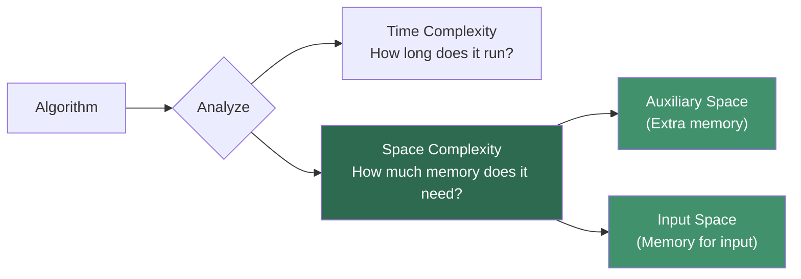

---

## What Counts as Space?

When analyzing space, we account for these memory consumers:

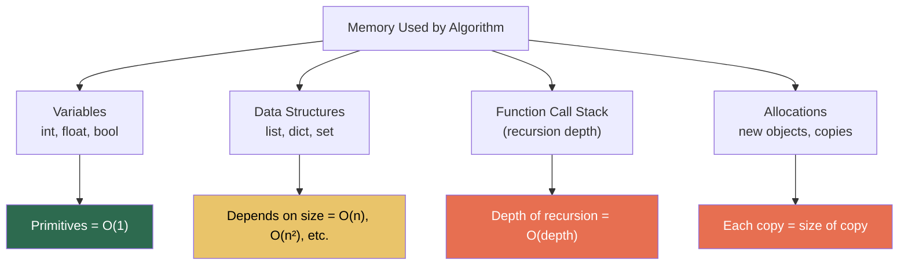

| What | Space Cost | Example |
|---|---|---|
| Integer / Float / Bool | O(1) | `x = 42` |
| String of length n | O(n) | `s = "hello" * n` |
| List of size n | O(n) | `lst = [0] * n` |
| Dictionary with n keys | O(n) | `d = {i: i for i in range(n)}` |
| 2D list (n × m) | O(n × m) | `grid = [[0]*m for _ in range(n)]` |
| Set of n elements | O(n) | `seen = set(range(n))` |
| Recursive call stack | O(depth) | `def f(n): return f(n-1)` |

---

## Auxiliary Space vs Total Space

This distinction comes up in interviews — know it well.

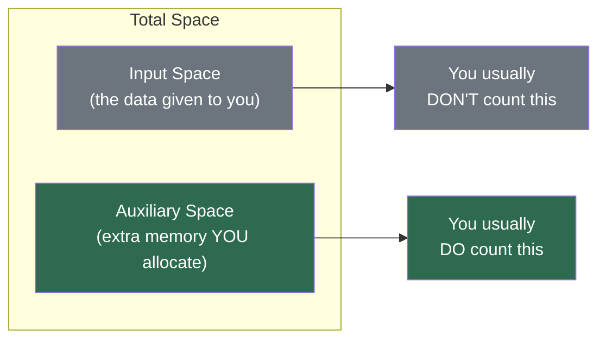

| Term | Definition | Example |
|---|---|---|
| **Auxiliary Space** | Extra memory the algorithm allocates beyond the input | A new list created during sorting |
| **Total Space** | Input space + Auxiliary space | The input array + any new lists |

```python
def sort_example(arr):          # arr takes O(n) — input space
    sorted_arr = sorted(arr)    # sorted_arr takes O(n) — auxiliary space
    return sorted_arr
# Auxiliary space: O(n)
# Total space: O(n) + O(n) = O(n)

def sort_in_place(arr):         # arr takes O(n) — input space
    arr.sort()                  # sorts in place — no extra list
    return arr
# Auxiliary space: O(1)
# Total space: O(n)
```

> In interviews, when someone says "space complexity," they almost always mean **auxiliary space** unless specified otherwise.

---

## Common Space Complexities

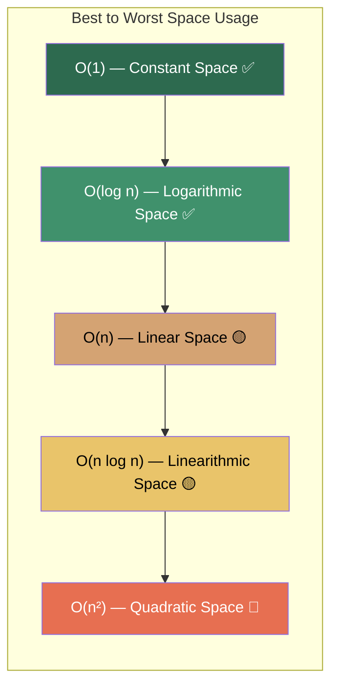

---

## Detailed Breakdown with Python Examples

### O(1) — Constant Space

The algorithm uses a **fixed amount of extra memory** regardless of input size.

```python
def find_max(arr):
    max_val = arr[0]          # 1 variable
    for num in arr:           # loop variable
        if num > max_val:
            max_val = num     # reuses same variable
    return max_val
# Space: O(1) — only a few variables, no matter how big arr is
```

```python
def swap(arr, i, j):
    arr[i], arr[j] = arr[j], arr[i]
# Space: O(1) — swaps in place
```

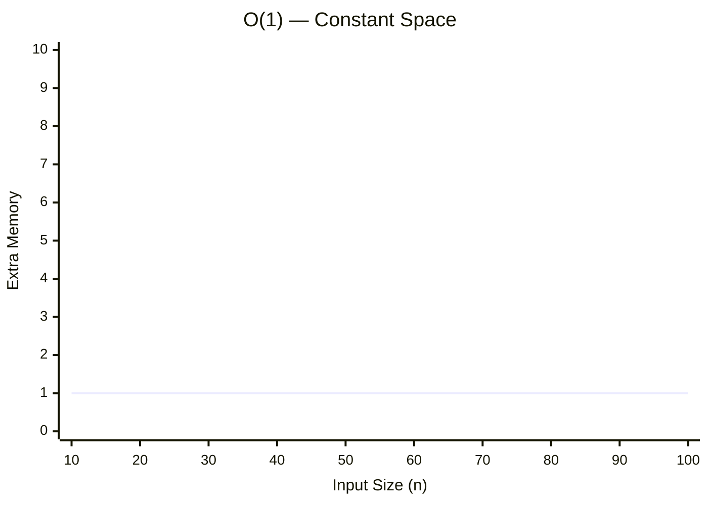

**Examples:**
- Simple variable assignments
- In-place swaps
- Two-pointer technique
- Iterative algorithms with fixed variables
- Bubble sort, selection sort, insertion sort

---

### O(log n) — Logarithmic Space

Typically appears with **recursion that halves the problem** at each step.

```python
def binary_search_recursive(arr, target, low, high):
    if low > high:
        return -1
    mid = (low + high) // 2
    if arr[mid] == target:
        return mid
    elif arr[mid] < target:
        return binary_search_recursive(arr, target, mid + 1, high)
    else:
        return binary_search_recursive(arr, target, low, mid - 1)
# Space: O(log n) — recursion depth is log n (each call halves the range)
```

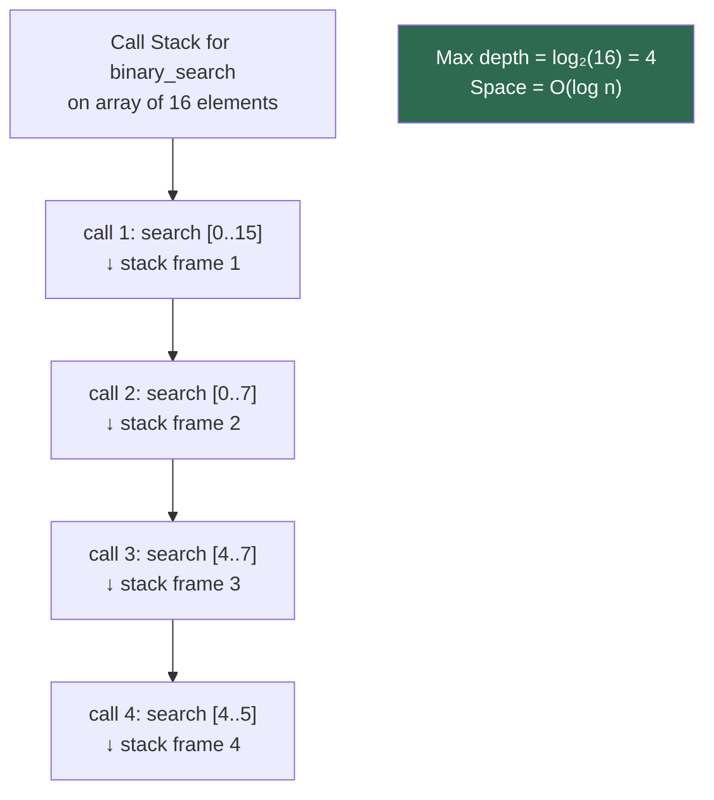

> The iterative version of binary search uses O(1) space — prefer it when space matters.

---

### O(n) — Linear Space

Extra memory grows **proportionally** with input size.

```python
def duplicate_list(arr):
    copy = []
    for item in arr:
        copy.append(item)
    return copy
# Space: O(n) — new list grows with input

def count_frequency(arr):
    freq = {}
    for item in arr:
        freq[item] = freq.get(item, 0) + 1
    return freq
# Space: O(n) — dict could have up to n unique keys

def reverse_string(s):
    return s[::-1]
# Space: O(n) — creates a new string of length n
```

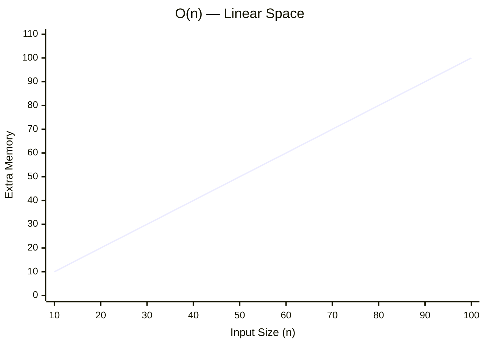

**Examples:**
- Hash maps / dictionaries for lookups
- Creating a copy of the input
- Stack used in DFS traversal
- Merge sort (auxiliary array)
- Storing results in a list

---

### O(n²) — Quadratic Space

Extra memory grows with the **square** of the input. Usually means you're building a 2D structure.

```python
def adjacency_matrix(n):
    matrix = [[0] * n for _ in range(n)]
    return matrix
# Space: O(n²) — n rows × n columns

def all_pairs(arr):
    pairs = []
    for i in range(len(arr)):
        for j in range(i + 1, len(arr)):
            pairs.append((arr[i], arr[j]))
    return pairs
# Space: O(n²) — number of pairs is n(n-1)/2
```

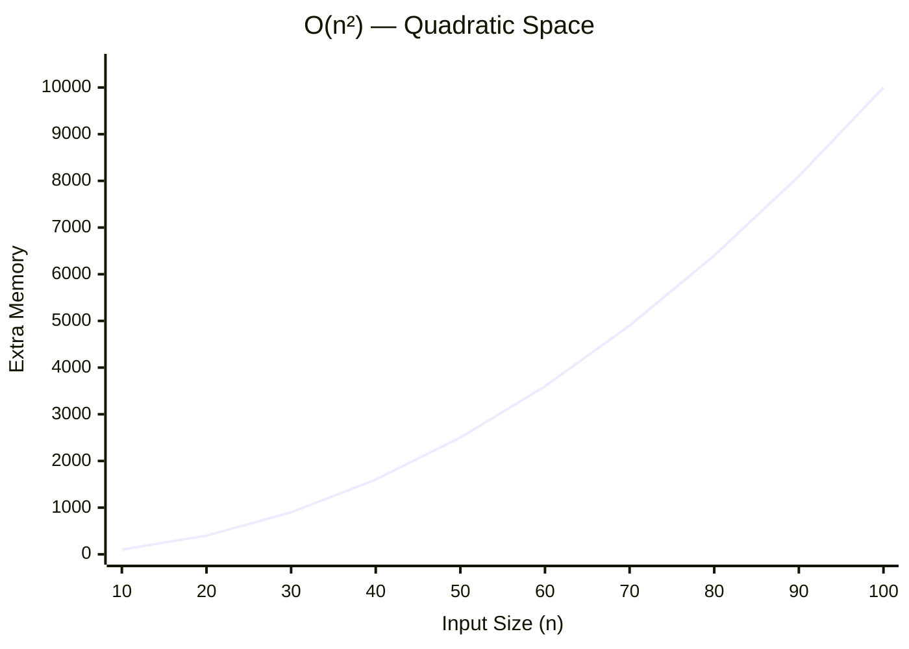

**Examples:**
- Adjacency matrix for a graph
- DP table for problems like LCS (Longest Common Subsequence)
- Storing all pairs/combinations

---

## Space Complexity of Recursion

Every recursive call adds a **stack frame** to memory. The space used is proportional to the **maximum depth** of the recursion tree, not the total number of calls.

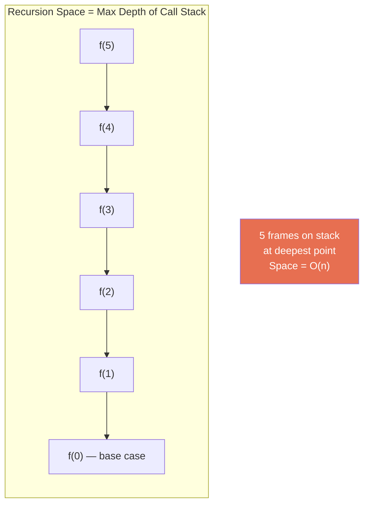

### Linear Recursion — O(n) Space

```python
def factorial(n):
    if n <= 1:
        return 1
    return n * factorial(n - 1)
# Depth: n → Space: O(n)
```

### Logarithmic Recursion — O(log n) Space

```python
def power(base, exp):
    if exp == 0:
        return 1
    if exp % 2 == 0:
        half = power(base, exp // 2)
        return half * half
    else:
        return base * power(base, exp - 1)
# Depth: log(exp) → Space: O(log n)
```

### Tree Recursion — Still O(n) Space!

This is a common misconception. Even though tree recursion makes O(2ⁿ) *calls*, the **space** is only O(n) because the call stack never holds more than `n` frames at once.

```python
def fib(n):
    if n <= 1:
        return n
    return fib(n-1) + fib(n-2)
# Time: O(2ⁿ)
# Space: O(n) — max call stack depth is n
```

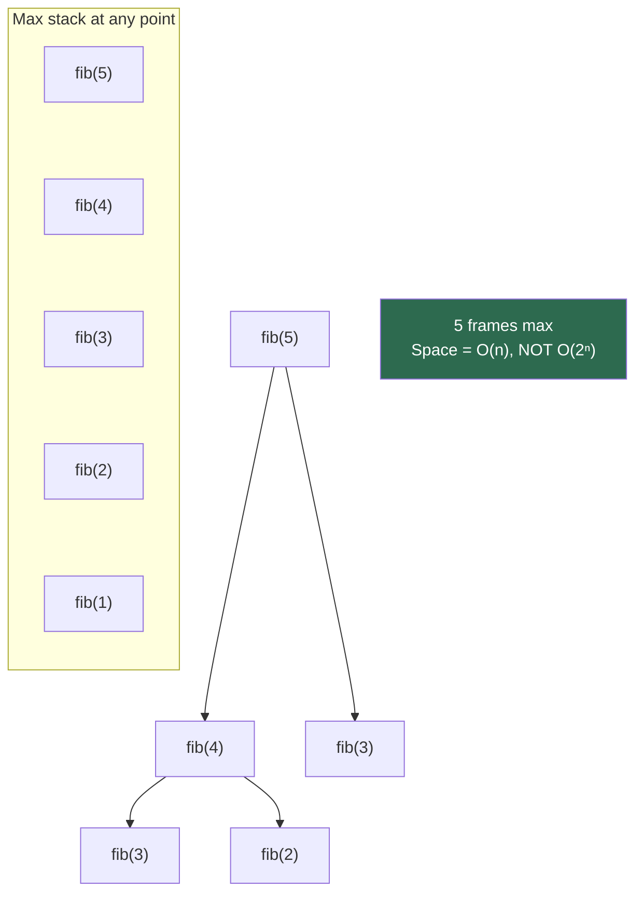

### Tail Recursion (Python does NOT optimize this)

```python
# Tail-recursive — last action is the recursive call
def factorial_tail(n, acc=1):
    if n <= 1:
        return acc
    return factorial_tail(n - 1, n * acc)
# Still O(n) space in Python — Python doesn't do tail-call optimization
# Convert to iterative for O(1) space:

def factorial_iterative(n):
    result = 1
    for i in range(2, n + 1):
        result *= i
    return result
# Space: O(1)
```

> **Python gotcha:** Unlike some languages (Scheme, Haskell), Python does **not** optimize tail recursion. Every recursive call still adds a stack frame. Prefer iterative solutions when stack depth is a concern.

---

## Time–Space Trade-off

Often you can **trade space for time** or vice versa. This is one of the most important concepts in algorithm design.

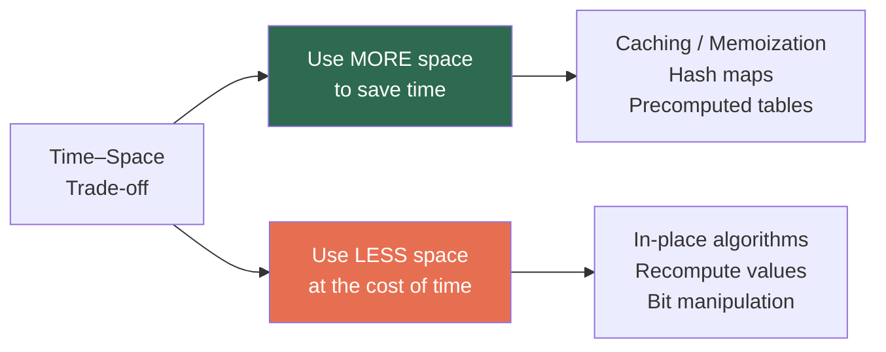

### Example: Two Sum Problem

```python
# Approach 1: Brute force
# Time: O(n²) | Space: O(1)
def two_sum_brute(nums, target):
    for i in range(len(nums)):
        for j in range(i + 1, len(nums)):
            if nums[i] + nums[j] == target:
                return [i, j]

# Approach 2: Hash map
# Time: O(n) | Space: O(n)
def two_sum_hashmap(nums, target):
    seen = {}
    for i, num in enumerate(nums):
        complement = target - num
        if complement in seen:
            return [seen[complement], i]
        seen[num] = i
```

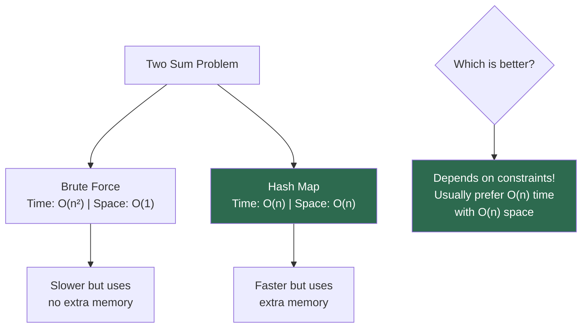

### Example: Fibonacci with Memoization

```python
# Without memoization
# Time: O(2ⁿ) | Space: O(n) — call stack
def fib_naive(n):
    if n <= 1:
        return n
    return fib_naive(n-1) + fib_naive(n-2)

# With memoization
# Time: O(n) | Space: O(n) — cache + call stack
def fib_memo(n, memo={}):
    if n in memo:
        return memo[n]
    if n <= 1:
        return n
    memo[n] = fib_memo(n-1, memo) + fib_memo(n-2, memo)
    return memo[n]

# Iterative with O(1) space — best of both worlds
# Time: O(n) | Space: O(1)
def fib_optimal(n):
    if n <= 1:
        return n
    a, b = 0, 1
    for _ in range(2, n + 1):
        a, b = b, a + b
    return b
```

| Approach | Time | Space |
|---|:-:|:-:|
| Naive recursion | O(2ⁿ) | O(n) |
| Memoized recursion | O(n) | O(n) |
| Iterative (optimal) | O(n) | O(1) |

---

## Space Complexity of Python Data Structures

### Memory Usage Per Type

| Type | Space per Element | Notes |
|---|---|---|
| `int` | 28 bytes (small) | Python ints are objects; grow with value |
| `float` | 24 bytes | Fixed size |
| `bool` | 28 bytes | Subclass of int in Python |
| `str` | 49 + n bytes | 49-byte overhead + 1 byte per ASCII char |
| `list` | 56 + 8n bytes | 56-byte overhead + 8-byte pointer per element |
| `dict` | ~232 + 72n bytes | Hash table overhead |
| `set` | ~216 + 72n bytes | Similar to dict |
| `tuple` | 40 + 8n bytes | Less overhead than list (immutable) |

> These are CPython-specific and approximate. The key insight: Python objects have significant overhead compared to C-style primitives.

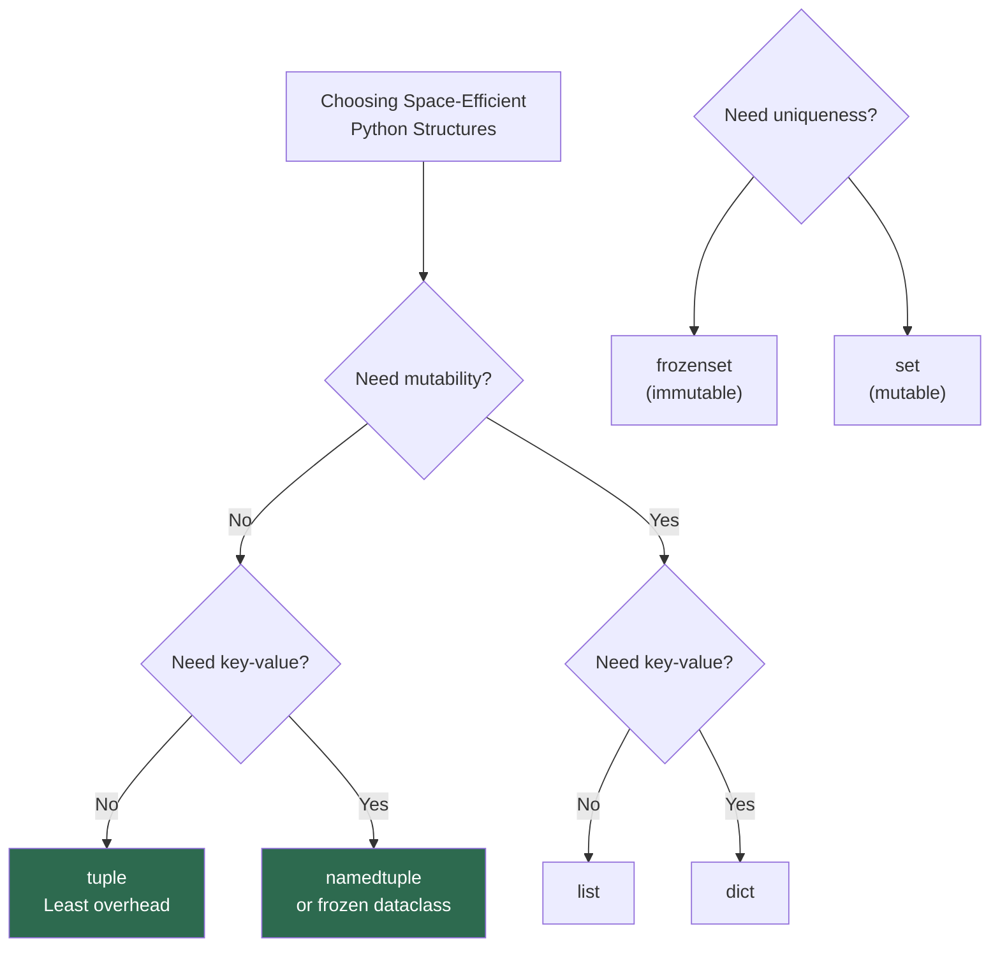

### Python-Specific Memory Optimizers

```python
# 1. Generators — O(1) space instead of O(n)
# BAD: Creates entire list in memory
squares_list = [x**2 for x in range(1_000_000)]  # O(n) space

# GOOD: Generates one value at a time
squares_gen = (x**2 for x in range(1_000_000))    # O(1) space

# 2. __slots__ — reduces per-instance memory in classes
class PointNormal:
    def __init__(self, x, y):
        self.x = x
        self.y = y
# Each instance has a __dict__ → ~152 bytes per instance

class PointSlots:
    __slots__ = ['x', 'y']
    def __init__(self, x, y):
        self.x = x
        self.y = y
# No __dict__ → ~56 bytes per instance (3x savings!)

# 3. array module — typed arrays for numeric data
import array
py_list = [1, 2, 3, 4, 5]           # ~100 bytes (8 bytes/pointer + object overhead)
c_array = array.array('i', [1,2,3,4,5])  # ~40 bytes (4 bytes/int, no object overhead)
```

---

## Space Complexity of Sorting Algorithms

| Algorithm | Space Complexity | In-Place? | Notes |
|---|:-:|:-:|---|
| **Bubble Sort** | O(1) | Yes | Only uses swap variables |
| **Selection Sort** | O(1) | Yes | Only uses index variables |
| **Insertion Sort** | O(1) | Yes | Shifts elements in place |
| **Merge Sort** | O(n) | No | Needs auxiliary array for merging |
| **Quick Sort** | O(log n) | Yes | Call stack from recursion |
| **Heap Sort** | O(1) | Yes | Builds heap in place |
| **Tim Sort** | O(n) | No | Python's built-in `sorted()` and `.sort()` |
| **Counting Sort** | O(k) | No | k = range of input values |
| **Radix Sort** | O(n + k) | No | k = number of digits |

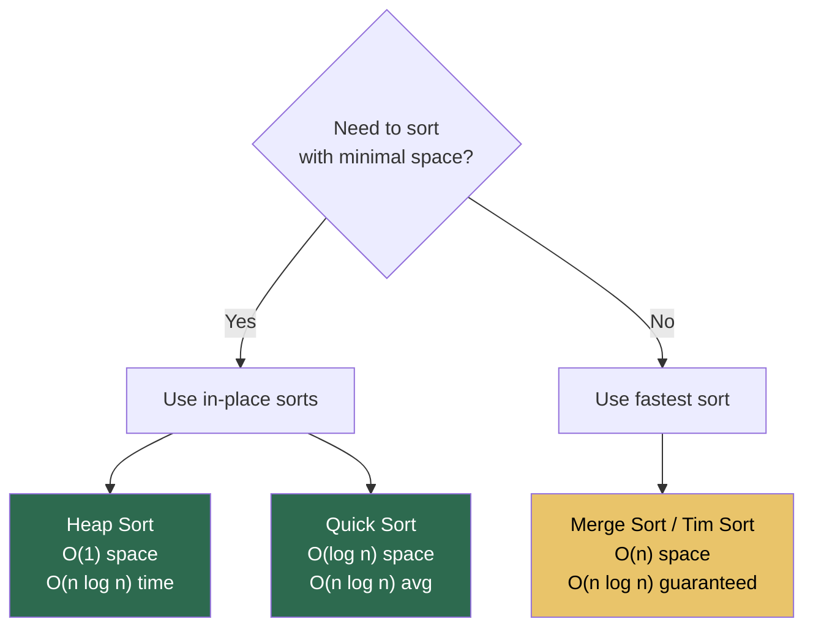

---

## Common Patterns and Pitfalls in Python

### Pattern 1: In-Place vs Creating New Collections

```python
# O(n) space — creates new list
def remove_negatives_new(arr):
    return [x for x in arr if x >= 0]

# O(1) space — modifies in place
def remove_negatives_inplace(arr):
    write = 0
    for read in range(len(arr)):
        if arr[read] >= 0:
            arr[write] = arr[read]
            write += 1
    del arr[write:]
```

### Pattern 2: String Concatenation Trap

```python
# O(n²) space AND time — each concatenation creates a new string
def build_bad(n):
    result = ""
    for i in range(n):
        result += str(i)  # new string allocated every iteration
    return result

# O(n) space and time — join is optimized
def build_good(n):
    return "".join(str(i) for i in range(n))
```

### Pattern 3: Slicing Creates Copies

```python
# arr[:k] creates a NEW list of size k → O(k) space
def first_half(arr):
    return arr[:len(arr)//2]  # O(n) extra space

# Use indices to avoid copies → O(1) space
def process_first_half(arr):
    mid = len(arr) // 2
    for i in range(mid):
        process(arr[i])  # no extra list created
```

### Pattern 4: Recursion → Iteration to Save Space

```python
# O(n) space — recursive call stack
def sum_recursive(arr, i=0):
    if i == len(arr):
        return 0
    return arr[i] + sum_recursive(arr, i + 1)

# O(1) space — iterative
def sum_iterative(arr):
    total = 0
    for num in arr:
        total += num
    return total
```

### Pattern 5: Hidden Space from Python Built-ins

```python
# These all allocate O(n) space:
sorted(arr)        # new sorted list
list(reversed(arr)) # new list
arr[::-1]          # new reversed list
set(arr)           # new set
dict.fromkeys(arr) # new dict

# These are O(1) extra space:
arr.sort()         # in-place sort
arr.reverse()      # in-place reverse
```

---

## How to Analyze Space Complexity Step-by-Step

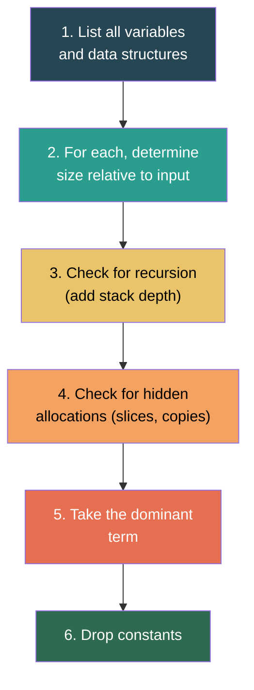

### Walkthrough Example

```python
def find_duplicates(arr):
    seen = set()          # ← grows up to O(n)
    duplicates = []       # ← grows up to O(n)
    for num in arr:       # ← num is O(1)
        if num in seen:
            duplicates.append(num)
        else:
            seen.add(num)
    return duplicates
```

| Variable | Max Size |
|---|---|
| `seen` | O(n) — could contain all elements |
| `duplicates` | O(n) — worst case all are duplicates |
| `num` | O(1) — single variable |
| **Total Auxiliary** | **O(n) + O(n) = O(n)** |

---

## Interview Tips

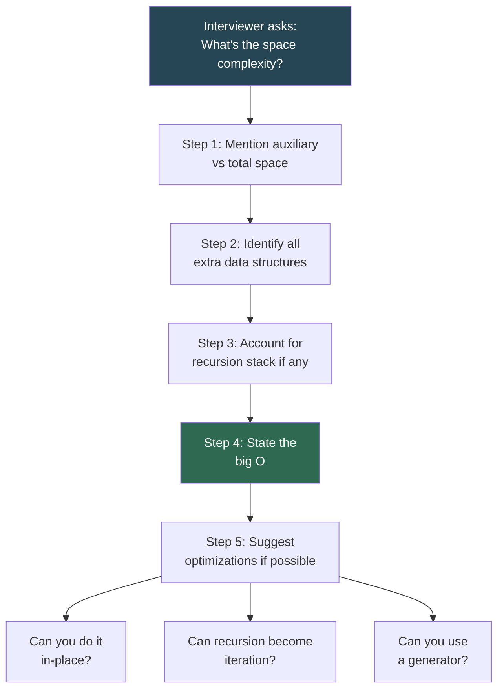

### Key Things to Say in Interviews

| Situation | What to Say |
|---|---|
| Algorithm uses a hash map | "This uses O(n) auxiliary space for the hash map" |
| Recursive solution | "The call stack adds O(depth) space — here it's O(n) / O(log n)" |
| In-place algorithm | "This operates in O(1) auxiliary space" |
| Asked to optimize space | "I can convert recursion to iteration / use two pointers / use bit manipulation" |
| Trade-off discussion | "We can reduce time from O(n²) to O(n) by using O(n) extra space for a hash map" |

---

## Practice Problems

Test your understanding — determine the space complexity:

| # | Code | Answer | Explanation |
|:-:|---|:-:|---|
| 1 | `x = 5; y = 10; z = x + y` | O(1) | Fixed number of variables |
| 2 | `lst = list(range(n))` | O(n) | List of n elements |
| 3 | `grid = [[0]*n for _ in range(n)]` | O(n²) | n × n grid |
| 4 | `for i in range(n): print(i)` | O(1) | Only loop variable, no extra storage |
| 5 | `d = {x: x*2 for x in range(n)}` | O(n) | Dictionary with n entries |
| 6 | Recursive function with depth n | O(n) | n stack frames |
| 7 | Binary search (iterative) | O(1) | Only low, high, mid variables |
| 8 | Binary search (recursive) | O(log n) | log n stack frames |
| 9 | Merge sort | O(n) | Auxiliary array + O(log n) stack |
| 10 | `"".join([str(i) for i in range(n)])` | O(n) | List of n strings |

---

## Quick Reference Cheat Sheet

```
┌───────────────────────────────────────────────────────────────┐
│               SPACE COMPLEXITY CHEAT SHEET                    │
├───────────────────────────────────────────────────────────────┤
│                                                               │
│  O(1)       Fixed variables, in-place algorithms              │
│  O(log n)   Recursive binary search, balanced tree recursion  │
│  O(n)       Hash maps, copying arrays, linear recursion       │
│  O(n²)      2D matrices, adjacency matrix, all-pairs storage  │
│                                                               │
├───────────────────────────────────────────────────────────────┤
│                                                               │
│  KEY RULES:                                                   │
│  1. Count extra memory only (auxiliary space)                 │
│  2. Recursion space = max depth, NOT total calls              │
│  3. Slicing/copying = O(size of copy)                         │
│  4. Python strings are immutable → concatenation = O(n²)      │
│  5. Generators save space: () vs []                           │
│  6. Python does NOT optimize tail recursion                   │
│                                                               │
├───────────────────────────────────────────────────────────────┤
│                                                               │
│  SPACE SAVERS IN PYTHON:                                      │
│  • list.sort() instead of sorted()                            │
│  • Generators instead of list comprehensions                  │
│  • __slots__ in classes                                       │
│  • array.array for typed numeric data                         │
│  • Iterative instead of recursive                             │
│  • Two pointers instead of hash map (when possible)           │
│                                                               │
└───────────────────────────────────────────────────────────────┘
```

---

*Previous: [Big O Notation](../1.BigO/README.md) | Next: [Arrays](../3.Arrays/README.md)*
