# Python Lists

A Python `list` is a **dynamic, ordered, mutable** collection that can hold elements of **any type**. It is the most versatile and commonly used data structure in Python — the go-to container for almost every task.

> "If you only learn one data structure in Python, make it the list. It's an array, a stack, a queue, and more — all in one."

---

## Table of Contents

1. [What is a Python List?](#what-is-a-python-list)
2. [How Lists Work Internally](#how-lists-work-internally)
3. [List vs Array — Key Differences](#list-vs-array--key-differences)
4. [Creating Lists](#creating-lists)
5. [Accessing Elements](#accessing-elements)
6. [Modifying Lists](#modifying-lists)
7. [Removing Elements](#removing-elements)
8. [Searching and Checking](#searching-and-checking)
9. [Slicing — Python's Superpower](#slicing--pythons-superpower)
10. [List Comprehensions](#list-comprehensions)
11. [Iterating Over Lists](#iterating-over-lists)
12. [Sorting and Reversing](#sorting-and-reversing)
13. [Copying Lists](#copying-lists)
14. [Nested Lists (List of Lists)](#nested-lists-list-of-lists)
15. [Lists as Stacks and Queues](#lists-as-stacks-and-queues)
16. [Built-in Functions That Work with Lists](#built-in-functions-that-work-with-lists)
17. [All List Methods — Complete Reference](#all-list-methods--complete-reference)
18. [Time and Space Complexity of List Operations](#time-and-space-complexity-of-list-operations)
19. [Common Patterns and Idioms](#common-patterns-and-idioms)
20. [Common Mistakes and Pitfalls](#common-mistakes-and-pitfalls)
21. [Practice Problems](#practice-problems)

---

## What is a Python List?

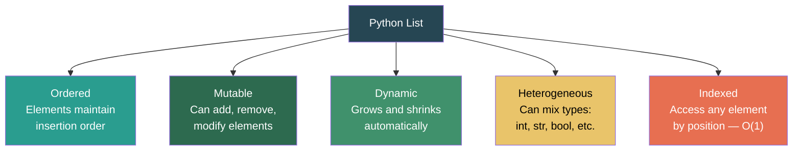

```python
fruits = ["apple", "banana", "cherry"]
mixed  = [1, "hello", 3.14, True, None, [1, 2]]
empty  = []
```

---

## How Lists Work Internally

Under the hood, a Python list is **not** a linked list. It is a **dynamic array of pointers** (references) to Python objects.

```
Python list object
┌─────────────────────────────────────────────┐
│  ob_size: 5          (current length)       │
│  allocated: 8        (capacity)             │
│  ob_item: ─────────► pointer array          │
└─────────────────────────────────────────────┘

Pointer array (contiguous in memory):
┌──────┬──────┬──────┬──────┬──────┬──────┬──────┬──────┐
│ ptr0 │ ptr1 │ ptr2 │ ptr3 │ ptr4 │  —   │  —   │  —   │
└──┬───┴──┬───┴──┬───┴──┬───┴──┬───┴──────┴──────┴──────┘
   │      │      │      │      │       ↑ unused capacity
   ▼      ▼      ▼      ▼      ▼
 int(10) str("hi") float(3.14) bool(True) list([1,2])
(scattered throughout memory — NOT contiguous)
```

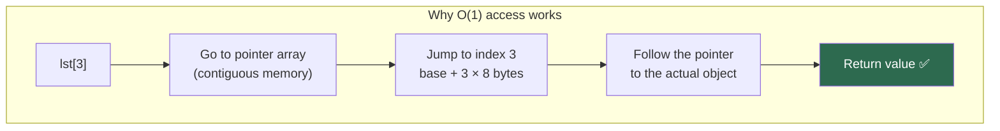

### Dynamic Resizing

When `append()` fills the allocated capacity, Python allocates a **bigger array** (~12.5% larger), copies all pointers over, and frees the old one.

| List size | Allocated capacity |
|:-:|:-:|
| 0 | 0 |
| 1–4 | 4 |
| 5–8 | 8 |
| 9–16 | 16 |
| 17–25 | 25 |
| 26–35 | 35 |

> Growth formula (CPython): `new_size = old_size + (old_size >> 3) + 6`  
> This makes `append()` **amortized O(1)** — the occasional O(n) copy is spread across many cheap appends.

---

## List vs Array — Key Differences

| Feature | Python `list` | `array.array` | `numpy.ndarray` |
|---|---|---|---|
| **Types** | Any (heterogeneous) | Single type (homogeneous) | Single type (homogeneous) |
| **Memory** | Stores pointers → higher overhead | Stores raw values → compact | Stores raw values → most compact |
| **Speed** | Slower for math | Faster than list | Fastest for math |
| **Flexibility** | Most flexible | Limited | Powerful but numeric-focused |
| **Use case** | General purpose | Typed data, I/O | Numerical computing |
| **Resizing** | Dynamic | Dynamic | Fixed after creation |

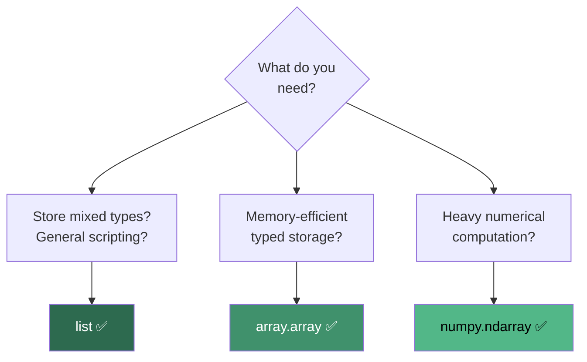

---

## Creating Lists

```python
# Literal
nums = [1, 2, 3, 4, 5]

# Empty list
empty = []
empty = list()

# From a range
evens = list(range(0, 20, 2))       # [0, 2, 4, 6, 8, 10, 12, 14, 16, 18]

# From a string (splits into characters)
chars = list("hello")               # ['h', 'e', 'l', 'l', 'o']

# Repeated values
zeros = [0] * 10                    # [0, 0, 0, 0, 0, 0, 0, 0, 0, 0]

# List comprehension
squares = [x**2 for x in range(10)] # [0, 1, 4, 9, 16, 25, 36, 49, 64, 81]

# From other iterables
from_tuple = list((1, 2, 3))        # [1, 2, 3]
from_set   = list({3, 1, 2})        # [1, 2, 3] (order may vary)
from_dict  = list({"a": 1, "b": 2}) # ['a', 'b'] (keys only)

# Using split
words = "hello world python".split() # ['hello', 'world', 'python']
csv   = "1,2,3,4".split(",")         # ['1', '2', '3', '4']
```

---

## Accessing Elements

```python
fruits = ["apple", "banana", "cherry", "date", "elderberry"]
```

### Indexing

```
Positive Index:    0         1          2        3          4
                ┌─────────┬──────────┬────────┬──────────┬────────────┐
                │  apple  │  banana  │ cherry │   date   │ elderberry │
                └─────────┴──────────┴────────┴──────────┴────────────┘
Negative Index:   -5        -4         -3       -2         -1
```

```python
fruits[0]       # 'apple'       — first element
fruits[2]       # 'cherry'      — third element
fruits[-1]      # 'elderberry'  — last element
fruits[-2]      # 'date'        — second to last

# Out of bounds → IndexError
fruits[10]      # IndexError: list index out of range
```

### Unpacking

```python
# Basic unpacking
a, b, c = [1, 2, 3]       # a=1, b=2, c=3

# Star unpacking
first, *middle, last = [1, 2, 3, 4, 5]
# first=1, middle=[2, 3, 4], last=5

# Swap without temp variable
a, b = b, a

# Ignore values
_, important, _ = [1, 42, 3]
```

---

## Modifying Lists

```python
lst = [10, 20, 30, 40, 50]

# ========== Update by index ==========
lst[0] = 99                    # [99, 20, 30, 40, 50] → O(1)

# ========== Append (add to end) ==========
lst.append(60)                 # [99, 20, 30, 40, 50, 60] → O(1) amortized

# ========== Insert at position ==========
lst.insert(2, 25)              # [99, 20, 25, 30, 40, 50, 60] → O(n)

# ========== Extend (add multiple) ==========
lst.extend([70, 80])           # [99, 20, 25, 30, 40, 50, 60, 70, 80] → O(k)
lst += [90, 100]               # same as extend → O(k)

# ========== Replace a slice ==========
lst[1:3] = [21, 22, 23]        # replaces indices 1-2 with three new values
```

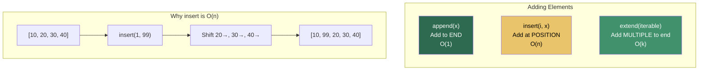

---

## Removing Elements

```python
lst = [10, 20, 30, 20, 40, 50]

# ========== remove(value) — removes FIRST occurrence ==========
lst.remove(20)                 # [10, 30, 20, 40, 50] → O(n) search + shift
# Raises ValueError if not found

# ========== pop(index) — removes and RETURNS ==========
last = lst.pop()               # removes 50, returns 50 → O(1)
elem = lst.pop(1)              # removes index 1 (30), returns 30 → O(n)

# ========== del — remove by index or slice ==========
del lst[0]                     # removes first element → O(n)
del lst[1:3]                   # removes a slice → O(n)

# ========== clear() — remove everything ==========
lst.clear()                    # [] → O(n)
```

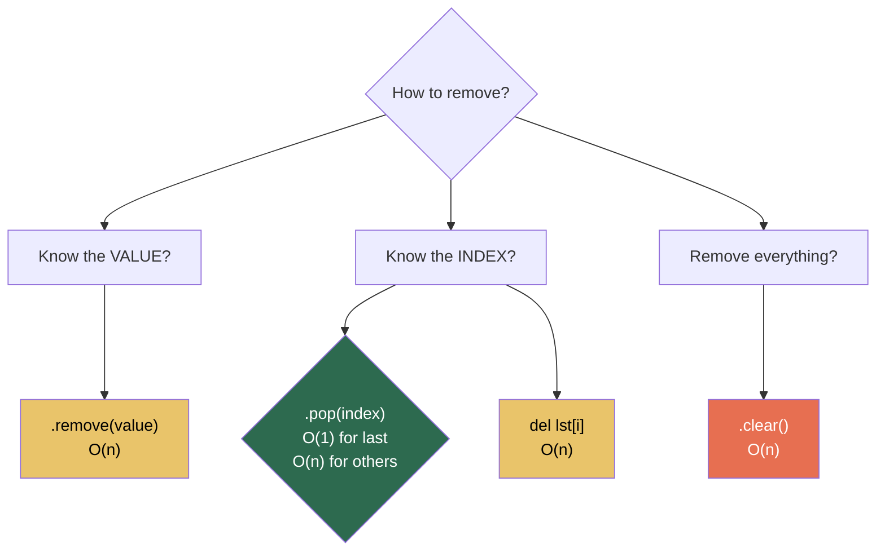

---

## Searching and Checking

```python
lst = [10, 20, 30, 40, 50, 30]

# ========== Membership test ==========
20 in lst          # True → O(n)
99 not in lst      # True → O(n)

# ========== Find index of value ==========
lst.index(30)      # 2 (first occurrence) → O(n)
lst.index(30, 3)   # 5 (search starting from index 3) → O(n)
# Raises ValueError if not found

# ========== Count occurrences ==========
lst.count(30)      # 2 → O(n)
lst.count(99)      # 0 → O(n)
```

> For frequent membership checks, convert to a `set` first — `set` lookup is O(1) average vs O(n) for lists.

```python
# O(n) per check × m checks = O(n × m) total
for item in queries:
    if item in large_list:    # slow
        process(item)

# O(n) to build set + O(1) per check × m checks = O(n + m) total
large_set = set(large_list)
for item in queries:
    if item in large_set:     # fast
        process(item)
```

---

## Slicing — Python's Superpower

Syntax: `lst[start:stop:step]`

- `start` — inclusive (default: beginning)
- `stop` — exclusive (default: end)
- `step` — stride (default: 1)

```python
lst = [0, 1, 2, 3, 4, 5, 6, 7, 8, 9]

# Basic slicing
lst[2:5]        # [2, 3, 4]         — index 2 to 4
lst[:3]         # [0, 1, 2]         — first 3 elements
lst[7:]         # [7, 8, 9]         — from index 7 to end
lst[:]          # [0, 1, ..., 9]    — shallow copy of entire list

# With step
lst[::2]        # [0, 2, 4, 6, 8]  — every other element
lst[1::2]       # [1, 3, 5, 7, 9]  — odd-indexed elements

# Negative indexing
lst[-3:]        # [7, 8, 9]         — last 3 elements
lst[:-2]        # [0, 1, ..., 7]    — all except last 2

# Reverse
lst[::-1]       # [9, 8, ..., 0]    — reversed copy
lst[::-2]       # [9, 7, 5, 3, 1]  — reversed, every other

# Slice assignment
lst[2:5] = [20, 30, 40]             # replace indices 2-4
lst[::2] = [0, 0, 0, 0, 0]          # replace every other element
```

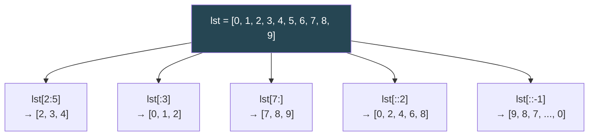

### Slicing Always Creates a New List

```python
original = [1, 2, 3, 4, 5]
sliced = original[1:4]     # [2, 3, 4] — new list, O(k) space

sliced[0] = 99
print(original)            # [1, 2, 3, 4, 5] — unchanged
print(sliced)              # [99, 3, 4]
```

> Slicing nested lists creates a **shallow copy** — inner lists are still shared.

---

## List Comprehensions

The Pythonic way to create lists from existing iterables. More readable and often faster than equivalent loops.

### Syntax

```
[expression for item in iterable if condition]
```

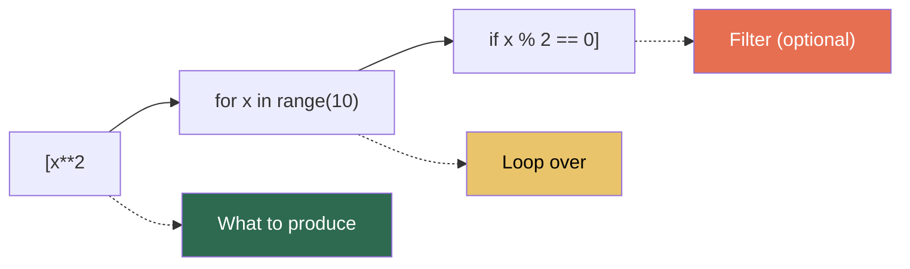

### Examples

```python
# Basic — squares of 0-9
squares = [x**2 for x in range(10)]
# [0, 1, 4, 9, 16, 25, 36, 49, 64, 81]

# With condition — even numbers only
evens = [x for x in range(20) if x % 2 == 0]
# [0, 2, 4, 6, 8, 10, 12, 14, 16, 18]

# Transform — uppercase strings
names = ["alice", "bob", "charlie"]
upper = [name.upper() for name in names]
# ['ALICE', 'BOB', 'CHARLIE']

# Flatten 2D to 1D
matrix = [[1, 2, 3], [4, 5, 6], [7, 8, 9]]
flat = [num for row in matrix for num in row]
# [1, 2, 3, 4, 5, 6, 7, 8, 9]

# If-else (ternary) — no filter, just transform
labels = ["even" if x % 2 == 0 else "odd" for x in range(5)]
# ['even', 'odd', 'even', 'odd', 'even']

# Nested comprehension — 2D list creation
grid = [[0] * 3 for _ in range(3)]
# [[0, 0, 0], [0, 0, 0], [0, 0, 0]]
```

### Comprehension vs Loop — Performance

```python
# Loop — slower (interpreted Python loop)
result = []
for x in range(1_000_000):
    result.append(x * 2)

# Comprehension — ~30-50% faster (optimized C-level loop)
result = [x * 2 for x in range(1_000_000)]

# Generator (lazy) — O(1) space
result = (x * 2 for x in range(1_000_000))   # parentheses, not brackets
```

> **Rule of thumb:** Use comprehensions for simple transforms/filters. Use regular loops when logic is complex or has side effects.

---

## Iterating Over Lists

```python
fruits = ["apple", "banana", "cherry"]

# ========== Basic iteration ==========
for fruit in fruits:
    print(fruit)

# ========== With index — enumerate ==========
for i, fruit in enumerate(fruits):
    print(f"{i}: {fruit}")
# 0: apple
# 1: banana
# 2: cherry

# ========== Enumerate with custom start ==========
for i, fruit in enumerate(fruits, start=1):
    print(f"{i}. {fruit}")
# 1. apple
# 2. banana
# 3. cherry

# ========== Iterate two lists — zip ==========
names  = ["Alice", "Bob", "Charlie"]
scores = [85, 92, 78]
for name, score in zip(names, scores):
    print(f"{name}: {score}")

# ========== Reverse iteration ==========
for fruit in reversed(fruits):
    print(fruit)

# ========== Iterate with indices (avoid if possible) ==========
for i in range(len(fruits)):
    print(fruits[i])
```

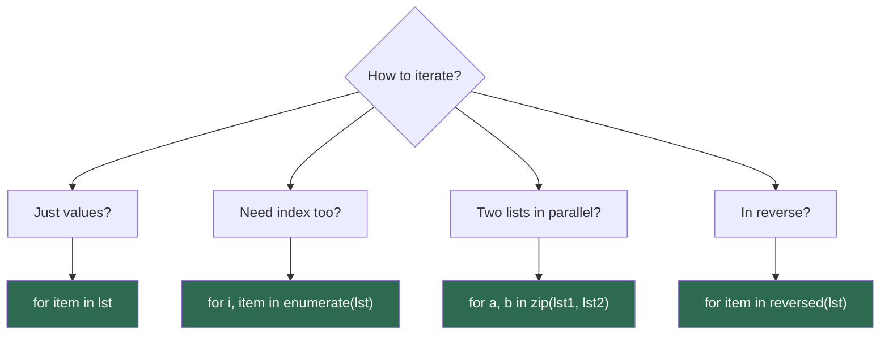

---

## Sorting and Reversing

### Sorting

```python
nums = [3, 1, 4, 1, 5, 9, 2, 6]

# ========== In-place sort — modifies original, returns None ==========
nums.sort()                     # [1, 1, 2, 3, 4, 5, 6, 9] → O(n log n), O(1) extra
nums.sort(reverse=True)         # [9, 6, 5, 4, 3, 2, 1, 1]

# ========== sorted() — returns new list, original unchanged ==========
original = [3, 1, 4, 1, 5]
new_sorted = sorted(original)   # [1, 1, 3, 4, 5] → O(n log n), O(n) extra
print(original)                 # [3, 1, 4, 1, 5] — unchanged

# ========== Custom sort key ==========
words = ["banana", "apple", "cherry", "date"]
words.sort(key=len)             # ['date', 'apple', 'banana', 'cherry']
words.sort(key=str.lower)       # case-insensitive sort

# Sort by second element of tuples
pairs = [(1, 'b'), (3, 'a'), (2, 'c')]
pairs.sort(key=lambda x: x[1]) # [(3, 'a'), (1, 'b'), (2, 'c')]

# Sort by multiple criteria
students = [("Alice", 85), ("Bob", 92), ("Charlie", 85)]
students.sort(key=lambda s: (-s[1], s[0]))
# [('Bob', 92), ('Alice', 85), ('Charlie', 85)]
# ↑ highest score first, then alphabetical for ties
```

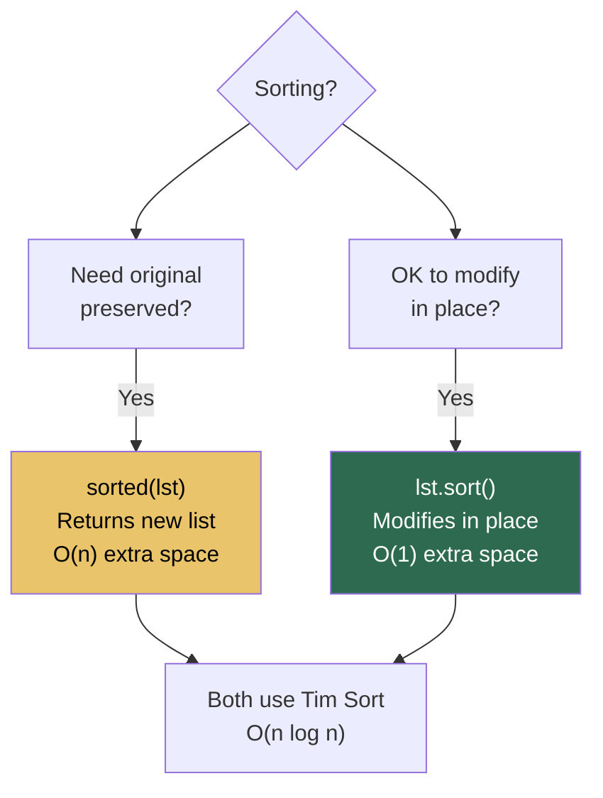

### Reversing

```python
lst = [1, 2, 3, 4, 5]

# In-place — modifies original, O(1) space
lst.reverse()                   # [5, 4, 3, 2, 1]

# New list — O(n) space
rev = lst[::-1]                 # [1, 2, 3, 4, 5]

# Iterator — O(1) space, lazy
for item in reversed(lst):
    print(item)
```

---

## Copying Lists

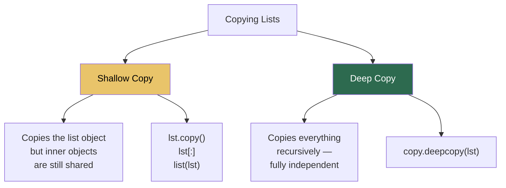

```python
import copy

# ========== Shallow Copy ==========
original = [[1, 2], [3, 4]]
shallow = original.copy()       # or original[:] or list(original)

shallow[0][0] = 99
print(original)  # [[99, 2], [3, 4]] — inner list is SHARED

shallow.append([5, 6])
print(original)  # [[99, 2], [3, 4]] — outer list is independent

# ========== Deep Copy ==========
original = [[1, 2], [3, 4]]
deep = copy.deepcopy(original)

deep[0][0] = 99
print(original)  # [[1, 2], [3, 4]] — fully independent ✅
```

```
Shallow Copy:                    Deep Copy:

original ──► [ptr, ptr]          original ──► [ptr, ptr]
              │     │                          │     │
              ▼     ▼                          ▼     ▼
shallow ──► [ptr, ptr]           deep ────► [ptr, ptr]
              │     │                        │     │
              ▼     ▼                        ▼     ▼
           [1,2]  [3,4]  ← shared        [1,2]  [3,4]  ← independent copies
```

| Method | Syntax | Depth | Speed |
|---|---|---|---|
| Assignment | `b = a` | No copy (same object) | Instant |
| `.copy()` | `b = a.copy()` | Shallow | Fast |
| Slicing | `b = a[:]` | Shallow | Fast |
| `list()` | `b = list(a)` | Shallow | Fast |
| `deepcopy()` | `b = copy.deepcopy(a)` | Deep (recursive) | Slow |

---

## Nested Lists (List of Lists)

```python
# 2D list (matrix)
matrix = [
    [1, 2, 3],
    [4, 5, 6],
    [7, 8, 9]
]

# Access
matrix[1][2]        # 6 → row 1, col 2

# Iterate
for row in matrix:
    for val in row:
        print(val, end=" ")
    print()

# Flatten
flat = [val for row in matrix for val in row]
# [1, 2, 3, 4, 5, 6, 7, 8, 9]

# Transpose
transposed = list(map(list, zip(*matrix)))
# [[1, 4, 7], [2, 5, 8], [3, 6, 9]]
```

### The `*` Trap with Nested Lists

```python
# WRONG — all rows reference the same inner list
grid = [[0] * 3] * 3
grid[0][0] = 1
print(grid)    # [[1, 0, 0], [1, 0, 0], [1, 0, 0]]

# RIGHT — each row is an independent list
grid = [[0] * 3 for _ in range(3)]
grid[0][0] = 1
print(grid)    # [[1, 0, 0], [0, 0, 0], [0, 0, 0]] ✅
```

---

## Lists as Stacks and Queues

### Stack (LIFO) — Use a list directly

```python
stack = []
stack.append(1)      # push → O(1)
stack.append(2)
stack.append(3)
stack.pop()          # pop → O(1) → returns 3
stack[-1]            # peek → O(1) → returns 2
```

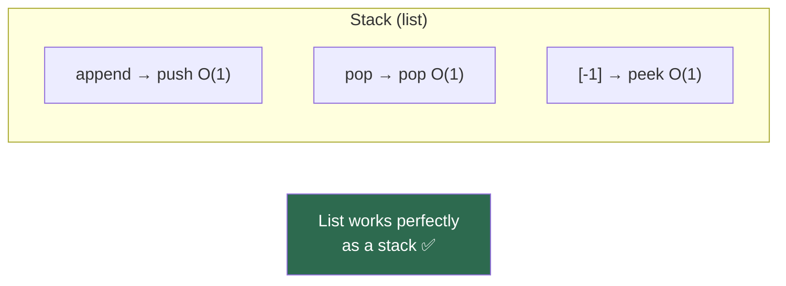

### Queue (FIFO) — Don't use a list, use `deque`

```python
# SLOW — list as queue
queue = []
queue.append(1)      # enqueue → O(1)
queue.pop(0)         # dequeue → O(n) ← BAD! shifts all elements

# FAST — deque as queue
from collections import deque
queue = deque()
queue.append(1)      # enqueue → O(1)
queue.popleft()      # dequeue → O(1) ✅
```

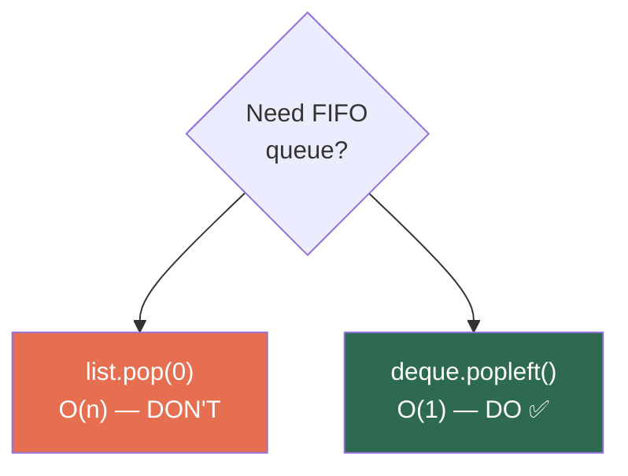

---

## Built-in Functions That Work with Lists

```python
nums = [3, 1, 4, 1, 5, 9, 2, 6]

len(nums)           # 8          — length
sum(nums)           # 31         — total
min(nums)           # 1          — smallest
max(nums)           # 9          — largest
sorted(nums)        # [1,1,2,3,4,5,6,9] — new sorted list
reversed(nums)      # iterator in reverse

any([0, 0, 1])      # True       — any truthy?
all([1, 2, 3])      # True       — all truthy?

list(map(str, nums))           # ['3','1','4',...] — apply function
list(filter(lambda x: x>3, nums)) # [4, 5, 9, 6] — filter by condition

list(zip([1,2,3], ['a','b','c']))  # [(1,'a'), (2,'b'), (3,'c')]
list(enumerate(nums))              # [(0,3), (1,1), (2,4), ...]
```

---

## All List Methods — Complete Reference

| Method | Description | Returns | Time |
|---|---|---|:-:|
| `append(x)` | Add `x` to the end | `None` | O(1)* |
| `extend(iterable)` | Add all items from iterable | `None` | O(k) |
| `insert(i, x)` | Insert `x` at index `i` | `None` | O(n) |
| `remove(x)` | Remove first occurrence of `x` | `None` | O(n) |
| `pop(i=-1)` | Remove and return item at `i` | element | O(1)†/O(n) |
| `clear()` | Remove all items | `None` | O(n) |
| `index(x, start, end)` | Index of first `x` | int | O(n) |
| `count(x)` | Count occurrences of `x` | int | O(n) |
| `sort(key, reverse)` | Sort in place | `None` | O(n log n) |
| `reverse()` | Reverse in place | `None` | O(n) |
| `copy()` | Shallow copy | new list | O(n) |

> \* Amortized O(1)  
> † O(1) only for `pop()` (last element)

---

## Time and Space Complexity of List Operations

| Operation | Average | Worst | Space |
|---|:-:|:-:|:-:|
| `lst[i]` | O(1) | O(1) | O(1) |
| `lst[i] = x` | O(1) | O(1) | O(1) |
| `lst.append(x)` | O(1) | O(n)* | O(1) |
| `lst.insert(i, x)` | O(n) | O(n) | O(n) |
| `lst.pop()` | O(1) | O(1) | O(1) |
| `lst.pop(i)` | O(n) | O(n) | O(n) |
| `lst.remove(x)` | O(n) | O(n) | O(n) |
| `x in lst` | O(n) | O(n) | O(1) |
| `lst.index(x)` | O(n) | O(n) | O(1) |
| `lst.count(x)` | O(n) | O(n) | O(1) |
| `len(lst)` | O(1) | O(1) | O(1) |
| `lst.sort()` | O(n log n) | O(n log n) | O(n) |
| `lst.reverse()` | O(n) | O(n) | O(1) |
| `lst.copy()` | O(n) | O(n) | O(n) |
| `lst[a:b]` | O(b−a) | O(b−a) | O(b−a) |
| `lst.extend(k items)` | O(k) | O(n+k)* | O(k) |
| `del lst[i]` | O(n) | O(n) | O(n) |
| `min(lst)` / `max(lst)` | O(n) | O(n) | O(1) |
| `lst1 + lst2` | O(n+m) | O(n+m) | O(n+m) |
| `lst * k` | O(nk) | O(nk) | O(nk) |

> \* Worst case O(n) occurs during dynamic resizing (rare, amortized away)

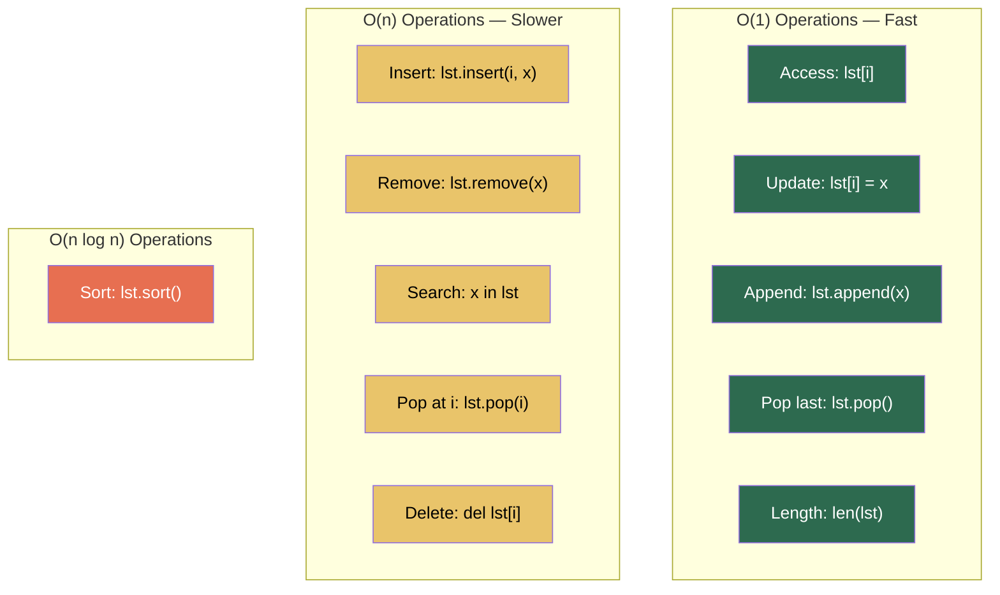

---

## Common Patterns and Idioms

### 1. Counting with a Dictionary

```python
from collections import Counter

words = ["apple", "banana", "apple", "cherry", "banana", "apple"]
freq = Counter(words)
# Counter({'apple': 3, 'banana': 2, 'cherry': 1})

freq.most_common(2)   # [('apple', 3), ('banana', 2)]
```

### 2. Grouping Elements

```python
from collections import defaultdict

students = [("Alice", "A"), ("Bob", "B"), ("Charlie", "A"), ("Dave", "B")]
groups = defaultdict(list)
for name, grade in students:
    groups[grade].append(name)
# {'A': ['Alice', 'Charlie'], 'B': ['Bob', 'Dave']}
```

### 3. Removing Duplicates (Preserving Order)

```python
lst = [3, 1, 4, 1, 5, 9, 2, 6, 5, 3]
unique = list(dict.fromkeys(lst))
# [3, 1, 4, 5, 9, 2, 6] — order preserved ✅
```

### 4. Chunking a List

```python
def chunk(lst, size):
    return [lst[i:i+size] for i in range(0, len(lst), size)]

chunk([1,2,3,4,5,6,7,8,9], 3)
# [[1,2,3], [4,5,6], [7,8,9]]
```

### 5. Rotating a List

```python
def rotate(lst, k):
    k = k % len(lst)
    return lst[-k:] + lst[:-k]

rotate([1,2,3,4,5], 2)    # [4, 5, 1, 2, 3]
```

### 6. Interleaving Two Lists

```python
a = [1, 2, 3]
b = ['a', 'b', 'c']
interleaved = [val for pair in zip(a, b) for val in pair]
# [1, 'a', 2, 'b', 3, 'c']
```

---

## Common Mistakes and Pitfalls

### 1. Modifying a List While Iterating

```python
# WRONG — skips elements or causes IndexError
lst = [1, 2, 3, 4, 5]
for item in lst:
    if item % 2 == 0:
        lst.remove(item)    # modifying during iteration!

# RIGHT — build a new list
lst = [item for item in lst if item % 2 != 0]

# RIGHT — iterate over a copy
for item in lst[:]:         # lst[:] is a copy
    if item % 2 == 0:
        lst.remove(item)
```

### 2. Confusing `sort()` and `sorted()`

```python
lst = [3, 1, 2]

# sort() returns None — modifies in place
result = lst.sort()
print(result)    # None ← common bug!

# sorted() returns new list — original unchanged
lst = [3, 1, 2]
result = sorted(lst)
print(result)    # [1, 2, 3] ✅
```

### 3. Default Mutable Arguments

```python
# WRONG — the default list is shared across all calls!
def add_item(item, lst=[]):
    lst.append(item)
    return lst

print(add_item(1))    # [1]
print(add_item(2))    # [1, 2] ← unexpected!

# RIGHT — use None as default
def add_item(item, lst=None):
    if lst is None:
        lst = []
    lst.append(item)
    return lst
```

### 4. Equality vs Identity

```python
a = [1, 2, 3]
b = [1, 2, 3]
c = a

a == b    # True  — same values
a is b    # False — different objects
a is c    # True  — same object (alias)
```

### 5. Forgetting That `+` Creates a New List

```python
# This is O(n+m) time AND space — creates a brand new list
combined = list1 + list2

# If you just need to add to list1, extend is faster — O(m)
list1.extend(list2)
# or
list1 += list2      # slightly slower than extend, but same idea
```

---

## Practice Problems

| # | Problem | Difficulty | Key Concept | Time | Space |
|:-:|---|:-:|---|:-:|:-:|
| 1 | Reverse a list in place | Easy | Two pointers | O(n) | O(1) |
| 2 | Find the second largest element | Easy | Single pass | O(n) | O(1) |
| 3 | Remove duplicates from sorted list | Easy | Two pointers | O(n) | O(1) |
| 4 | Merge two sorted lists | Easy | Two pointers | O(n+m) | O(n+m) |
| 5 | Move all zeros to end | Easy | Two pointers | O(n) | O(1) |
| 6 | Rotate list by k positions | Medium | Reverse trick | O(n) | O(1) |
| 7 | Find majority element (> n/2) | Medium | Boyer-Moore voting | O(n) | O(1) |
| 8 | Product of array except self | Medium | Prefix/suffix product | O(n) | O(n) |
| 9 | Container with most water | Medium | Two pointers | O(n) | O(1) |
| 10 | Merge k sorted lists | Hard | Heap / Divide & conquer | O(n log k) | O(k) |

---

## Quick Reference Cheat Sheet

```
┌──────────────────────────────────────────────────────────────────┐
│                   PYTHON LISTS CHEAT SHEET                       │
├──────────────────────────────────────────────────────────────────┤
│                                                                  │
│  CREATION:                                                       │
│    []  list()  list(range(n))  [x for x in iterable]            │
│                                                                  │
│  FAST — O(1):                                                    │
│    lst[i]  lst[i]=x  lst.append(x)  lst.pop()  len(lst)        │
│                                                                  │
│  SLOW — O(n):                                                    │
│    lst.insert(i,x)  lst.remove(x)  lst.pop(i)  x in lst        │
│                                                                  │
│  SORTING:                                                        │
│    lst.sort()       → in-place, returns None                    │
│    sorted(lst)      → new list, original unchanged              │
│    key=lambda x:... → custom sort                               │
│                                                                  │
├──────────────────────────────────────────────────────────────────┤
│                                                                  │
│  PYTHONIC PATTERNS:                                              │
│    enumerate(lst)    → index + value                            │
│    zip(a, b)         → parallel iteration                       │
│    reversed(lst)     → lazy reverse iterator                    │
│    [x for x in lst]  → list comprehension                      │
│    (x for x in lst)  → generator (O(1) space)                  │
│                                                                  │
├──────────────────────────────────────────────────────────────────┤
│                                                                  │
│  AVOID:                                                          │
│    • Modifying list while iterating                             │
│    • lst.sort() return value (it's None)                        │
│    • Mutable default arguments def f(lst=[])                    │
│    • [[0]*n]*m for 2D lists (shared rows)                       │
│    • list.pop(0) for queues (use deque)                         │
│                                                                  │
└──────────────────────────────────────────────────────────────────┘
```

---

*Previous: [Arrays](../3.Arrays/REAMDE.md) | Next: [Dictionaries](../5.Dictionaries/README.md)*
