# Python Tuples

A tuple is an **immutable, ordered** sequence of elements. Once created, its contents **cannot be changed** — no adding, removing, or modifying elements. This immutability is not a limitation; it's a feature that makes tuples faster, safer, and hashable.

> "Use a list when things might change. Use a tuple when they shouldn't."

---

## Table of Contents

1. [What is a Tuple?](#what-is-a-tuple)
2. [Why Use Tuples? — When Immutability Wins](#why-use-tuples--when-immutability-wins)
3. [How Tuples Work Internally](#how-tuples-work-internally)
4. [Creating Tuples](#creating-tuples)
5. [Accessing Elements](#accessing-elements)
6. [Tuple Unpacking](#tuple-unpacking)
7. [Tuple Operations](#tuple-operations)
8. [Tuple Methods (There Are Only Two)](#tuple-methods-there-are-only-two)
9. [Iterating Over Tuples](#iterating-over-tuples)
10. [Searching in Tuples](#searching-in-tuples)
11. [Slicing Tuples](#slicing-tuples)
12. [Nested Tuples](#nested-tuples)
13. [Named Tuples — Tuples with Labels](#named-tuples--tuples-with-labels)
14. [Tuple vs List — Complete Comparison](#tuple-vs-list--complete-comparison)
15. [Time and Space Complexity](#time-and-space-complexity)
16. [Common Patterns and Use Cases](#common-patterns-and-use-cases)
17. [Common Mistakes and Pitfalls](#common-mistakes-and-pitfalls)
18. [Practice Problems](#practice-problems)

---

## What is a Tuple?

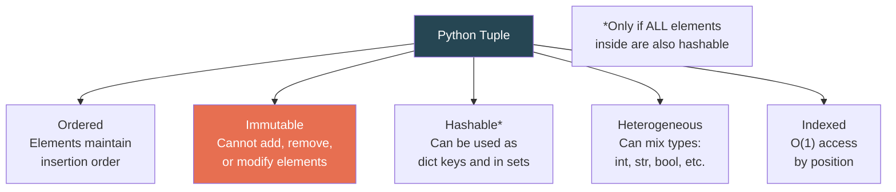

```python
point = (3, 4)
rgb   = (255, 128, 0)
mixed = (1, "hello", 3.14, True, None)
empty = ()
single = (42,)    # note the trailing comma!
```

---

## Why Use Tuples? — When Immutability Wins

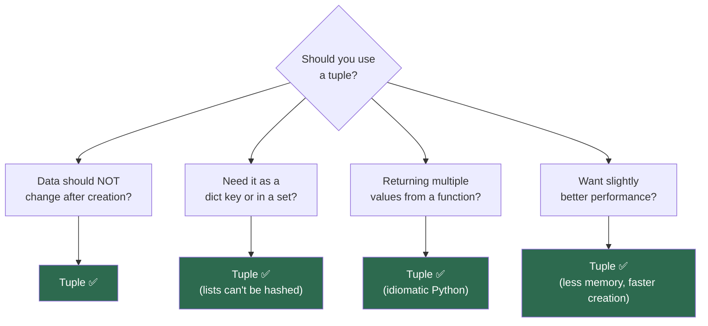

| Reason | Explanation |
|---|---|
| **Safety** | Cannot be accidentally modified — acts as a contract |
| **Hashability** | Can be used as dictionary keys and set elements |
| **Performance** | Faster creation, less memory than lists |
| **Semantic meaning** | Signals "this is a fixed record" (like a row in a database) |
| **Multiple return values** | `return x, y` returns a tuple |
| **Unpacking** | Elegant destructuring: `a, b, c = my_tuple` |

### Memory Comparison

```python
import sys

lst = [1, 2, 3, 4, 5]
tup = (1, 2, 3, 4, 5)

sys.getsizeof(lst)    # 104 bytes
sys.getsizeof(tup)    # 80 bytes  ← 23% less memory
```

| n elements | list (bytes) | tuple (bytes) | Savings |
|:-:|:-:|:-:|:-:|
| 0 | 56 | 40 | 29% |
| 5 | 104 | 80 | 23% |
| 10 | 136 | 120 | 12% |
| 100 | 856 | 840 | 2% |

> The savings come from tuples not needing extra space for dynamic resizing machinery.

---

## How Tuples Work Internally

Tuples are simpler than lists because they don't need resizing. CPython can optimize them heavily.

```
List object:                     Tuple object:
┌──────────────────────┐         ┌──────────────────────┐
│ ob_refcnt            │         │ ob_refcnt            │
│ ob_type → list       │         │ ob_type → tuple      │
│ ob_size: 5           │         │ ob_size: 5           │
│ allocated: 8 ←─ extra│         │ ob_item[0] → ptr     │
│ ob_item → ┐          │         │ ob_item[1] → ptr     │
│            │ pointer │         │ ob_item[2] → ptr     │
│            │ array   │         │ ob_item[3] → ptr     │
│            │ (heap)  │         │ ob_item[4] → ptr     │
└──────────────────────┘         └──────────────────────┘
                                  ↑ Fixed size, no over-allocation
                                  ↑ Pointers stored inline (not separate array)
```

### CPython Tuple Caching

Small tuples (length 0–20) are **cached and reused** by CPython. When a small tuple is garbage-collected, Python keeps the memory and reuses it for the next tuple of the same size — making creation nearly free.

```python
# These may share the same memory allocation under the hood
a = (1, 2, 3)
del a
b = (4, 5, 6)    # CPython may reuse the same memory slot
```

> The empty tuple `()` is a **singleton** — there is only one instance in the entire Python process.

```python
a = ()
b = ()
a is b    # True — same object!
```

---

## Creating Tuples

```python
# ========== Parentheses (most common) ==========
colors = ("red", "green", "blue")

# ========== Without parentheses (tuple packing) ==========
point = 3, 4, 5              # (3, 4, 5)

# ========== Single element — trailing comma required! ==========
single = (42,)                # (42,)  ← tuple
not_tuple = (42)              # 42     ← just an integer!

# ========== From other iterables ==========
from_list   = tuple([1, 2, 3])        # (1, 2, 3)
from_string = tuple("hello")          # ('h', 'e', 'l', 'l', 'o')
from_range  = tuple(range(5))         # (0, 1, 2, 3, 4)
from_set    = tuple({3, 1, 2})        # order may vary
from_gen    = tuple(x**2 for x in range(5))  # (0, 1, 4, 9, 16)

# ========== Empty tuple ==========
empty = ()
empty = tuple()

# ========== Nested ==========
matrix = ((1, 2), (3, 4), (5, 6))
```

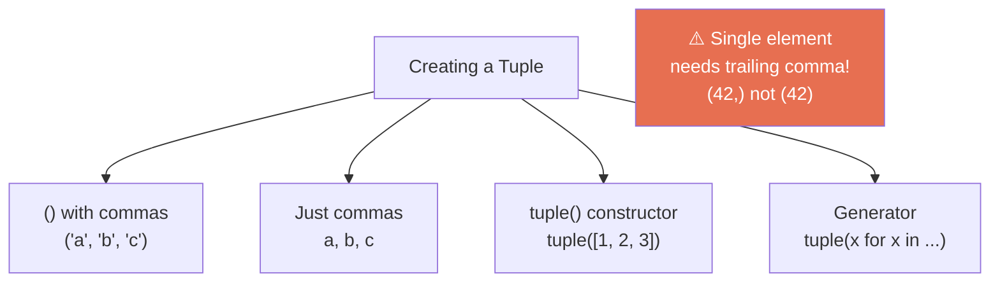

---

## Accessing Elements

```python
colors = ("red", "green", "blue", "yellow", "purple")
```

### Indexing

```
Positive:   0       1        2        3         4
          ┌───────┬────────┬────────┬─────────┬────────┐
          │  red  │ green  │  blue  │ yellow  │ purple │
          └───────┴────────┴────────┴─────────┴────────┘
Negative:  -5      -4       -3       -2        -1
```

```python
colors[0]       # 'red'        — first
colors[2]       # 'blue'       — third
colors[-1]      # 'purple'     — last
colors[-2]      # 'yellow'     — second to last

colors[10]      # IndexError: tuple index out of range
```

### Immutability in Action

```python
t = (1, 2, 3)
t[0] = 99       # TypeError: 'tuple' object does not support item assignment
t.append(4)     # AttributeError: 'tuple' object has no attribute 'append'
del t[0]        # TypeError: 'tuple' object doesn't support item deletion
```

---

## Tuple Unpacking

One of the most elegant features in Python — and tuples are at the heart of it.

```python
# ========== Basic unpacking ==========
point = (3, 4)
x, y = point                  # x=3, y=4

# ========== Multiple return values ==========
def min_max(lst):
    return min(lst), max(lst)  # returns a tuple

lo, hi = min_max([5, 2, 8, 1, 9])   # lo=1, hi=9

# ========== Swap variables ==========
a, b = 1, 2
a, b = b, a                   # a=2, b=1 (no temp variable!)

# ========== Star unpacking ==========
first, *middle, last = (1, 2, 3, 4, 5)
# first=1, middle=[2, 3, 4], last=5

head, *tail = (10, 20, 30, 40)
# head=10, tail=[20, 30, 40]

*init, last = (10, 20, 30, 40)
# init=[10, 20, 30], last=40

# ========== Ignore values ==========
_, y, _ = (1, 2, 3)           # only care about y
name, _, _, age = ("Alice", "M", "Smith", 30)

# ========== Nested unpacking ==========
(a, b), (c, d) = (1, 2), (3, 4)   # a=1, b=2, c=3, d=4

# ========== In loops ==========
points = [(1, 2), (3, 4), (5, 6)]
for x, y in points:
    print(f"x={x}, y={y}")
```

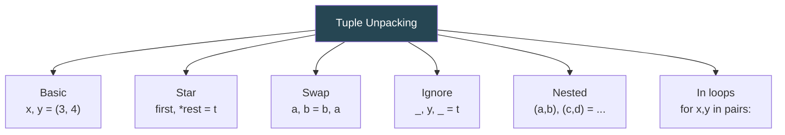

---

## Tuple Operations

```python
a = (1, 2, 3)
b = (4, 5, 6)

# ========== Concatenation — creates NEW tuple ==========
c = a + b                     # (1, 2, 3, 4, 5, 6) → O(n+m)

# ========== Repetition — creates NEW tuple ==========
d = a * 3                     # (1, 2, 3, 1, 2, 3, 1, 2, 3) → O(n·k)

# ========== Membership test ==========
2 in a                        # True → O(n)
9 not in a                    # True → O(n)

# ========== Comparison (element by element) ==========
(1, 2, 3) == (1, 2, 3)       # True
(1, 2, 3) < (1, 2, 4)        # True — compares at first difference
(1, 2) < (1, 2, 3)           # True — shorter is "less" if prefix matches

# ========== Length ==========
len(a)                        # 3 → O(1)

# ========== Min / Max / Sum ==========
min((3, 1, 4, 1, 5))         # 1
max((3, 1, 4, 1, 5))         # 5
sum((3, 1, 4, 1, 5))         # 14
```

> **Key point:** Concatenation and repetition create **new** tuples — the originals are unchanged (immutability!).

---

## Tuple Methods (There Are Only Two)

Tuples are intentionally minimal. They have exactly **two** methods:

```python
t = (1, 2, 3, 2, 4, 2, 5)

# ========== count(value) — how many times value appears ==========
t.count(2)       # 3 → O(n)
t.count(99)      # 0

# ========== index(value) — position of first occurrence ==========
t.index(2)       # 1 → O(n)
t.index(2, 2)    # 3 → search starting from index 2
t.index(99)      # ValueError: tuple.index(x): x not in tuple
```

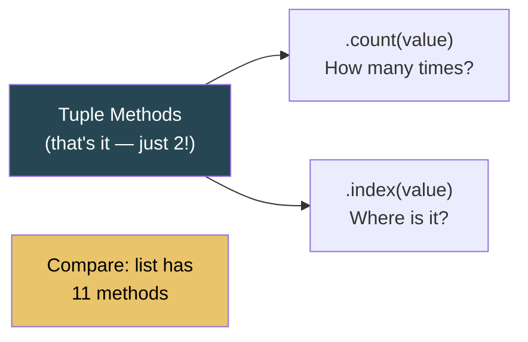

### Why So Few?

Lists have 11 methods (`append`, `insert`, `remove`, `pop`, `sort`, `reverse`, `extend`, `copy`, `clear`, `count`, `index`). Tuples only keep `count` and `index` because all the others **modify** the collection, which tuples cannot do.

---

## Iterating Over Tuples

```python
colors = ("red", "green", "blue")

# ========== Basic ==========
for color in colors:
    print(color)

# ========== With index ==========
for i, color in enumerate(colors):
    print(f"{i}: {color}")

# ========== With enumerate starting at 1 ==========
for i, color in enumerate(colors, start=1):
    print(f"{i}. {color}")

# ========== Parallel iteration ==========
names = ("Alice", "Bob", "Charlie")
scores = (85, 92, 78)
for name, score in zip(names, scores):
    print(f"{name}: {score}")

# ========== Reversed ==========
for color in reversed(colors):
    print(color)
```

---

## Searching in Tuples

```python
t = (10, 20, 30, 40, 50)

# ========== Membership (O(n)) ==========
30 in t              # True
99 in t              # False

# ========== Find index (O(n)) ==========
t.index(30)          # 2

# ========== Safe search ==========
def find_in_tuple(tup, value):
    try:
        return tup.index(value)
    except ValueError:
        return -1

find_in_tuple(t, 30)     # 2
find_in_tuple(t, 99)     # -1

# ========== Binary search on sorted tuple (O(log n)) ==========
import bisect

sorted_t = (1, 3, 5, 7, 9, 11, 13)
i = bisect.bisect_left(sorted_t, 7)
found = i < len(sorted_t) and sorted_t[i] == 7    # True
```

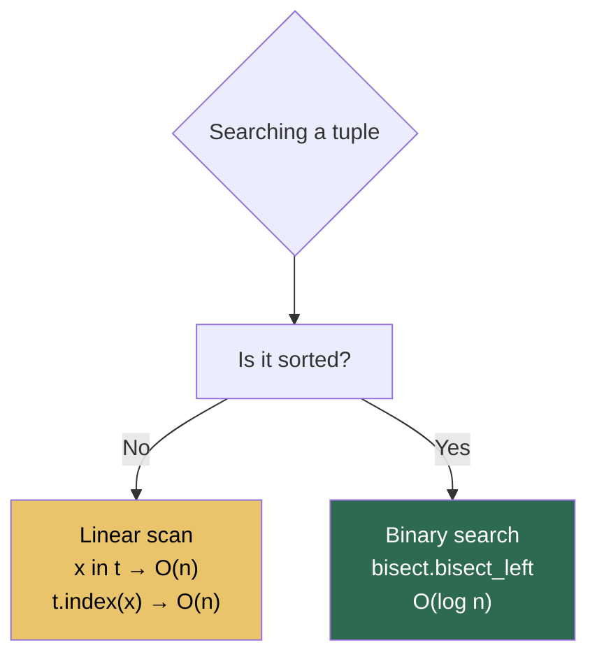

---

## Slicing Tuples

Slicing works exactly like lists — but returns a **new tuple**.

```python
t = (0, 1, 2, 3, 4, 5, 6, 7, 8, 9)

t[2:5]        # (2, 3, 4)
t[:3]         # (0, 1, 2)
t[7:]         # (7, 8, 9)
t[::2]        # (0, 2, 4, 6, 8)
t[::-1]       # (9, 8, 7, 6, 5, 4, 3, 2, 1, 0)
t[-3:]        # (7, 8, 9)
t[1:8:2]      # (1, 3, 5, 7)
```

> Since tuples are immutable, you **cannot** do slice assignment: `t[1:3] = (10, 20)` raises `TypeError`.

### "Modifying" a Tuple (by creating a new one)

```python
t = (1, 2, 3, 4, 5)

# "Insert" at index 2
new_t = t[:2] + (99,) + t[2:]      # (1, 2, 99, 3, 4, 5)

# "Delete" index 2
new_t = t[:2] + t[3:]              # (1, 2, 4, 5)

# "Update" index 2
new_t = t[:2] + (99,) + t[3:]     # (1, 2, 99, 4, 5)
```

> All of these are O(n) — they create entirely new tuples. If you need frequent modifications, use a list.

---

## Nested Tuples

```python
# Tuple of tuples
matrix = (
    (1, 2, 3),
    (4, 5, 6),
    (7, 8, 9)
)

matrix[1][2]          # 6
matrix[0]             # (1, 2, 3)

# Iterate
for row in matrix:
    for val in row:
        print(val, end=" ")
    print()
```

### The Mutable Inside Immutable Gotcha

A tuple is immutable — but if it *contains* a mutable object (like a list), that inner object **can** be changed.

```python
t = (1, 2, [3, 4])

t[2].append(5)        # This works!
print(t)              # (1, 2, [3, 4, 5])

t[2] = [9, 9]         # TypeError — can't reassign the slot
```

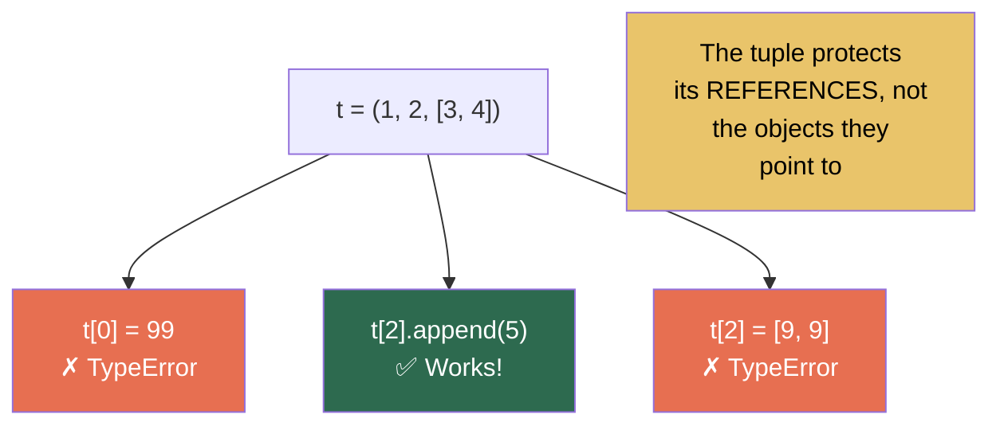

```
Tuple slots (immutable — can't reassign):
┌──────────┬──────────┬──────────┐
│  ptr → 1 │  ptr → 2 │  ptr → ──┼──► [3, 4]  ← this LIST is mutable
└──────────┴──────────┴──────────┘
  Can't change what the pointers point to
  But CAN mutate the mutable object they point to
```

> **Consequence:** A tuple containing a list is **NOT hashable** and cannot be used as a dict key.

```python
hash((1, 2, 3))         # Works — all elements hashable
hash((1, 2, [3, 4]))    # TypeError: unhashable type: 'list'
```

---

## Named Tuples — Tuples with Labels

Named tuples combine the immutability of tuples with the readability of named attributes.

```python
from collections import namedtuple

# Define a type
Point = namedtuple("Point", ["x", "y"])

# Create instances
p = Point(3, 4)
p = Point(x=3, y=4)

# Access by name OR index
p.x           # 3
p[0]          # 3
p.y           # 4

# Still a tuple — immutable
p.x = 10      # AttributeError

# Unpack like a regular tuple
x, y = p

# Convert to dict
p._asdict()   # {'x': 3, 'y': 4}

# Create modified copy
p2 = p._replace(x=10)   # Point(x=10, y=4)
```

### Real-World Example

```python
from collections import namedtuple

Student = namedtuple("Student", ["name", "age", "grade", "gpa"])

students = [
    Student("Alice", 20, "A", 3.9),
    Student("Bob", 22, "B", 3.2),
    Student("Charlie", 21, "A+", 4.0),
]

# Readable access
for s in students:
    print(f"{s.name}: GPA {s.gpa}")

# Sort by GPA
top = sorted(students, key=lambda s: s.gpa, reverse=True)
```

### `typing.NamedTuple` (Modern Alternative)

```python
from typing import NamedTuple

class Point(NamedTuple):
    x: float
    y: float
    z: float = 0.0    # default value

p = Point(1.0, 2.0)       # Point(x=1.0, y=2.0, z=0.0)
```

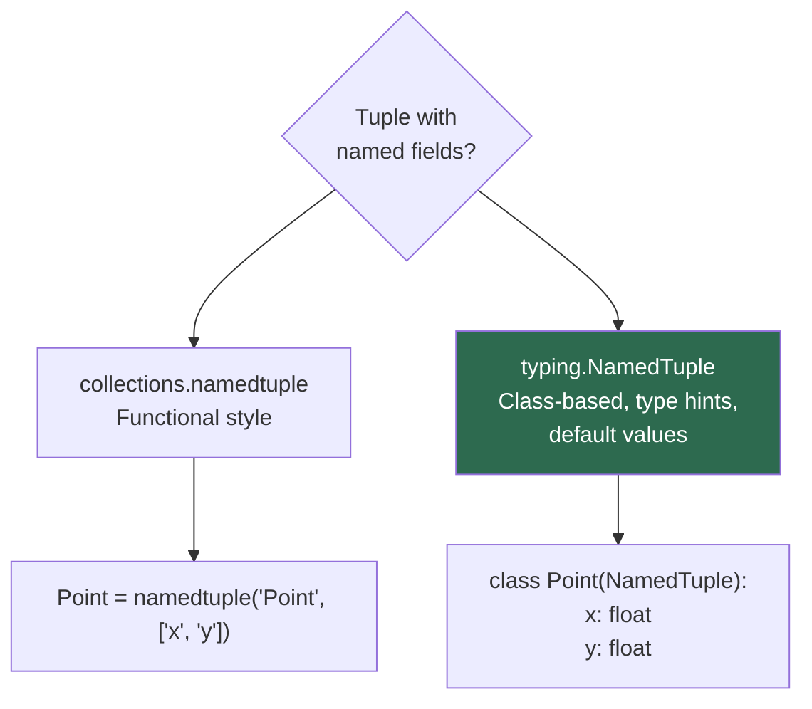

---

## Tuple vs List — Complete Comparison

| Feature | Tuple | List |
|---|:-:|:-:|
| **Mutable** | No | Yes |
| **Syntax** | `(1, 2, 3)` | `[1, 2, 3]` |
| **Methods** | 2 (`count`, `index`) | 11 |
| **Hashable** | Yes* | No |
| **Dict key / Set element** | Yes* | No |
| **Memory** | Less (~23% for small) | More |
| **Creation speed** | Faster | Slower |
| **Iteration speed** | Slightly faster | Slightly slower |
| **Access speed** | Same — O(1) | Same — O(1) |
| **Append** | Not supported | O(1) amortized |
| **Insert/Delete** | Not supported | O(n) |
| **Cached by CPython** | Yes (length 0-20) | No |
| **Semantic meaning** | Fixed record / struct | Dynamic collection |
| **Thread safety** | Inherently safe (immutable) | Needs locks |

> \* Only if all elements are hashable

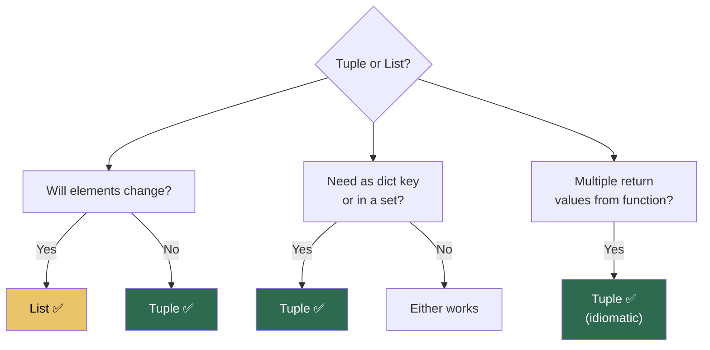

### Performance Benchmark

```python
import timeit

# Creation
timeit.timeit("(1,2,3,4,5)", number=10_000_000)    # ~0.15s
timeit.timeit("[1,2,3,4,5]", number=10_000_000)    # ~0.45s  ← 3x slower

# Iteration
t = tuple(range(1000))
l = list(range(1000))
timeit.timeit("for x in t: pass", globals={"t": t}, number=100_000)  # faster
timeit.timeit("for x in l: pass", globals={"l": l}, number=100_000)  # slower
```

---

## Time and Space Complexity

| Operation | Time | Space | Notes |
|---|:-:|:-:|---|
| `t[i]` (access) | O(1) | O(1) | Direct index |
| `len(t)` | O(1) | O(1) | Stored attribute |
| `x in t` (search) | O(n) | O(1) | Linear scan |
| `t.index(x)` | O(n) | O(1) | Linear scan |
| `t.count(x)` | O(n) | O(1) | Full scan |
| `t1 + t2` (concat) | O(n+m) | O(n+m) | New tuple |
| `t * k` (repeat) | O(nk) | O(nk) | New tuple |
| `t[a:b]` (slice) | O(b-a) | O(b-a) | New tuple |
| `min(t)` / `max(t)` | O(n) | O(1) | Full scan |
| `sum(t)` | O(n) | O(1) | Full scan |
| `sorted(t)` | O(n log n) | O(n) | Returns list! |
| `hash(t)` | O(n) | O(1) | Hashes all elements |
| `tuple(iterable)` | O(n) | O(n) | Creates new tuple |
| `for x in t` | O(n) | O(1) | Iteration |

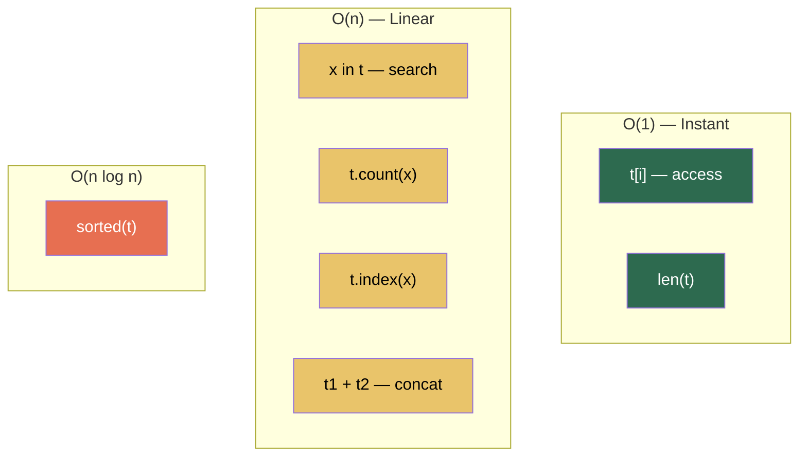

---

## Common Patterns and Use Cases

### 1. Returning Multiple Values

```python
def divide(a, b):
    quotient = a // b
    remainder = a % b
    return quotient, remainder     # returns tuple

q, r = divide(17, 5)              # q=3, r=2
```

### 2. Dictionary Keys (Coordinate Maps)

```python
# Tuples as keys — lists can't do this
grid = {}
grid[(0, 0)] = "start"
grid[(2, 3)] = "treasure"
grid[(4, 4)] = "exit"

if (2, 3) in grid:
    print(grid[(2, 3)])     # 'treasure'
```

### 3. Caching with Tuples (Memoization Keys)

```python
from functools import lru_cache

@lru_cache(maxsize=None)
def grid_paths(m, n):
    if m == 1 or n == 1:
        return 1
    return grid_paths(m-1, n) + grid_paths(m, n-1)
# lru_cache uses (m, n) tuple as the cache key internally
```

### 4. Enum-like Constants

```python
DIRECTIONS = ("N", "S", "E", "W")
HTTP_METHODS = ("GET", "POST", "PUT", "DELETE")
RGB_RED = (255, 0, 0)
```

### 5. Database Records

```python
# Each row from a DB query is often a tuple
rows = [
    ("Alice", 25, "Engineering"),
    ("Bob", 30, "Marketing"),
    ("Charlie", 28, "Engineering"),
]

for name, age, dept in rows:
    print(f"{name} ({age}) - {dept}")
```

### 6. Sorting by Multiple Criteria

```python
students = [("Alice", 85), ("Bob", 92), ("Charlie", 85), ("Dave", 78)]

# Python compares tuples element by element
sorted(students, key=lambda s: (-s[1], s[0]))
# [('Bob', 92), ('Alice', 85), ('Charlie', 85), ('Dave', 78)]
```

### 7. Immutable Config / Settings

```python
ALLOWED_HOSTS = ("localhost", "127.0.0.1", "example.com")
SUPPORTED_FORMATS = (".png", ".jpg", ".gif", ".webp")
```

---

## Common Mistakes and Pitfalls

### 1. Forgetting the Comma in Single-Element Tuples

```python
not_a_tuple = (42)       # int 42 — parentheses are just grouping
a_tuple     = (42,)      # tuple with one element
also_tuple  = 42,        # same — comma makes the tuple
```

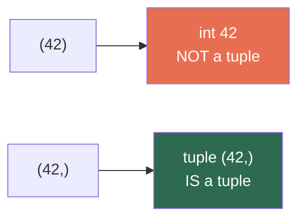

### 2. Trying to Modify a Tuple

```python
t = (1, 2, 3)
t[0] = 99        # TypeError: 'tuple' object does not support item assignment
t.append(4)      # AttributeError
t.remove(2)      # AttributeError

# Convert to list, modify, convert back
lst = list(t)
lst[0] = 99
t = tuple(lst)    # (99, 2, 3)
```

### 3. Mutable Objects Inside Tuples

```python
t = ([1, 2], [3, 4])
t[0].append(99)       # Works! t = ([1, 2, 99], [3, 4])
hash(t)               # TypeError — contains unhashable list
```

### 4. Confusing `sorted()` Return Type

```python
t = (3, 1, 4, 1, 5)
result = sorted(t)
type(result)          # <class 'list'> — NOT a tuple!

result = tuple(sorted(t))   # (1, 1, 3, 4, 5) — explicit conversion
```

### 5. Unpacking Mismatch

```python
t = (1, 2, 3)

a, b = t         # ValueError: too many values to unpack
a, b, c, d = t   # ValueError: not enough values to unpack

# Use star to handle variable lengths
a, *rest = t      # a=1, rest=[2, 3]
```

---

## Practice Problems

| # | Problem | Difficulty | Key Concept | Time | Space |
|:-:|---|:-:|---|:-:|:-:|
| 1 | Sum all elements in a tuple | Easy | Iteration / `sum()` | O(n) | O(1) |
| 2 | Count occurrences of a value | Easy | `.count()` | O(n) | O(1) |
| 3 | Find index of an element | Easy | `.index()` | O(n) | O(1) |
| 4 | Check if a tuple is a palindrome | Easy | Two pointers / slicing | O(n) | O(1)/O(n) |
| 5 | Merge and sort two tuples | Easy | `sorted(t1 + t2)` | O(n log n) | O(n) |
| 6 | Remove duplicates while preserving order | Medium | `dict.fromkeys()` | O(n) | O(n) |
| 7 | Find common elements between two tuples | Easy | Set intersection | O(n+m) | O(min(n,m)) |
| 8 | Unzip a list of tuples | Medium | `zip(*lst)` | O(n) | O(n) |
| 9 | Group consecutive elements into pairs | Medium | Slicing + zip | O(n) | O(n) |
| 10 | Frequency of each element (return as dict) | Easy | Counter | O(n) | O(k) |

---

## Quick Reference Cheat Sheet

```
┌──────────────────────────────────────────────────────────────────┐
│                    PYTHON TUPLES CHEAT SHEET                     │
├──────────────────────────────────────────────────────────────────┤
│                                                                  │
│  CREATION:                                                       │
│    ()  (1,2,3)  1,2,3  tuple(iterable)                          │
│    Single element: (42,) NOT (42)                               │
│                                                                  │
│  METHODS (only 2!):                                              │
│    t.count(x)    → how many times x appears                    │
│    t.index(x)    → position of first x                         │
│                                                                  │
│  ACCESS:                                                         │
│    t[i]  t[-1]  t[a:b]  t[::2]  t[::-1]                       │
│    All return new tuples (originals never change)               │
│                                                                  │
│  OPERATIONS:                                                     │
│    t1 + t2   → concatenation (new tuple)                       │
│    t * k     → repetition (new tuple)                          │
│    x in t    → membership test O(n)                             │
│    len(t)    → length O(1)                                      │
│                                                                  │
├──────────────────────────────────────────────────────────────────┤
│                                                                  │
│  WHY TUPLES:                                                     │
│    ✅ Immutable — safe, predictable                             │
│    ✅ Hashable — dict keys, set elements                        │
│    ✅ Less memory than lists                                    │
│    ✅ Faster creation (CPython caches small tuples)             │
│    ✅ Multiple return values                                    │
│    ✅ Elegant unpacking                                         │
│                                                                  │
├──────────────────────────────────────────────────────────────────┤
│                                                                  │
│  UNPACKING:                                                      │
│    x, y = (1, 2)          basic                                 │
│    a, *rest = (1, 2, 3)   star                                  │
│    a, b = b, a            swap                                  │
│    _, x, _ = (1, 2, 3)    ignore                                │
│                                                                  │
├──────────────────────────────────────────────────────────────────┤
│                                                                  │
│  GOTCHAS:                                                        │
│    • (42) is an int, (42,) is a tuple                           │
│    • sorted(tuple) returns a LIST                               │
│    • Mutable contents can be modified in place                  │
│    • Tuple with list inside is NOT hashable                     │
│    • Python does NOT cache tuples with mutable elements         │
│                                                                  │
└──────────────────────────────────────────────────────────────────┘
```

---

*Previous: [Dictionaries](../5.Dictionaries/README.md) | Next: [Class](../7.Classes/README.md)*
