# Python Classes & Object-Oriented Programming

Object-Oriented Programming (OOP) is a paradigm that organizes code around **objects** — bundles of data (attributes) and behavior (methods) — rather than functions and logic alone. Classes are the **blueprints** from which objects are created.

> "OOP lets you model real-world entities in code. A `Dog` class defines what a dog *is* and what it can *do*. Each individual dog is an *object* (instance) of that class."

---

## Table of Contents

1. [Why OOP?](#why-oop)
2. [Core Concepts at a Glance](#core-concepts-at-a-glance)
3. [Creating a Class](#creating-a-class)
4. [The `__init__` Method (Constructor)](#the-__init__-method-constructor)
5. [Instance vs Class vs Static](#instance-vs-class-vs-static)
6. [Pointers and References in Python](#pointers-and-references-in-python)
7. [The Four Pillars of OOP](#the-four-pillars-of-oop)
8. [Encapsulation](#1-encapsulation)
9. [Abstraction](#2-abstraction)
10. [Inheritance](#3-inheritance)
11. [Polymorphism](#4-polymorphism)
12. [Dunder (Magic) Methods](#dunder-magic-methods)
13. [Properties — Getters and Setters the Pythonic Way](#properties--getters-and-setters-the-pythonic-way)
14. [Composition vs Inheritance](#composition-vs-inheritance)
15. [Dataclasses — Less Boilerplate](#dataclasses--less-boilerplate)
16. [SOLID Principles (Brief)](#solid-principles-brief)
17. [OOP in Data Structures](#oop-in-data-structures)
18. [Common Mistakes](#common-mistakes)
19. [Quick Reference Cheat Sheet](#quick-reference-cheat-sheet)

---

## Why OOP?

| Without OOP | With OOP |
|---|---|
| Data and functions are separate | Data and behavior bundled together |
| Hard to reuse code | Inheritance and composition enable reuse |
| Global state and side effects | Encapsulation protects internal state |
| Scaling is painful | Modular, maintainable, extensible |

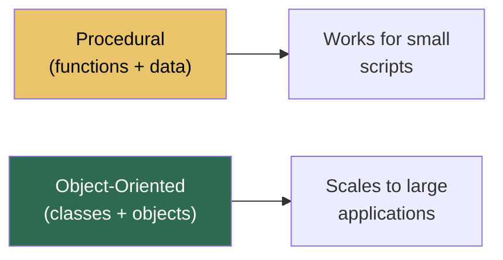

---

## Core Concepts at a Glance

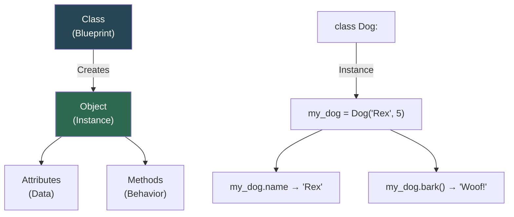

| Term | Definition | Example |
|---|---|---|
| **Class** | Blueprint / template for objects | `class Dog:` |
| **Object** | A specific instance of a class | `rex = Dog("Rex", 5)` |
| **Attribute** | Variable belonging to an object | `rex.name` |
| **Method** | Function belonging to an object | `rex.bark()` |
| **`self`** | Reference to the current instance | `self.name = name` |
| **Constructor** | `__init__` — runs when object is created | `def __init__(self):` |

---

## Creating a Class

```python
class Dog:
    # Class attribute — shared by ALL instances
    species = "Canis lupus familiaris"

    # Constructor — runs on Dog()
    def __init__(self, name, age):
        # Instance attributes — unique to each object
        self.name = name
        self.age = age

    # Instance method
    def bark(self):
        return f"{self.name} says Woof!"

    # String representation
    def __str__(self):
        return f"Dog({self.name}, {self.age})"


# Creating objects (instances)
rex = Dog("Rex", 5)
bella = Dog("Bella", 3)

print(rex.bark())         # Rex says Woof!
print(bella.name)         # Bella
print(rex.species)        # Canis lupus familiaris
print(Dog.species)        # Canis lupus familiaris (accessed via class too)
```

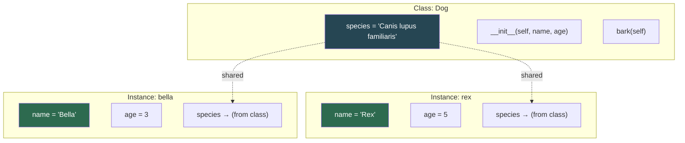

---

## The `__init__` Method (Constructor)

`__init__` is the **initializer** — it sets up the object's state when created.

```python
class BankAccount:
    def __init__(self, owner, balance=0):
        self.owner = owner
        self.balance = balance
        self.transactions = []     # each instance gets its own list

    def deposit(self, amount):
        self.balance += amount
        self.transactions.append(f"+{amount}")

    def withdraw(self, amount):
        if amount > self.balance:
            raise ValueError("Insufficient funds")
        self.balance -= amount
        self.transactions.append(f"-{amount}")

acc = BankAccount("Alice", 1000)
acc.deposit(500)
acc.withdraw(200)
print(acc.balance)              # 1300
print(acc.transactions)         # ['+500', '-200']
```

> `__init__` is NOT the constructor — technically `__new__` creates the object and `__init__` initializes it. But in practice you almost always only override `__init__`.

---

## Instance vs Class vs Static

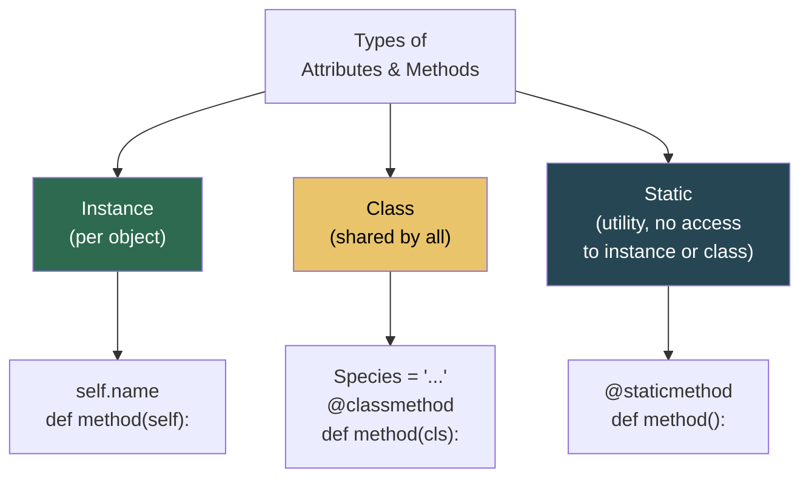

```python
class Circle:
    # Class attribute
    pi = 3.14159

    def __init__(self, radius):
        # Instance attribute
        self.radius = radius

    # Instance method — operates on a specific circle
    def area(self):
        return Circle.pi * self.radius ** 2

    # Class method — operates on the class itself
    @classmethod
    def from_diameter(cls, diameter):
        return cls(diameter / 2)        # cls = Circle

    # Static method — utility, no access to self or cls
    @staticmethod
    def is_valid_radius(value):
        return value > 0


c1 = Circle(5)
c2 = Circle.from_diameter(10)     # alternate constructor
print(c1.area())                  # 78.53975
print(Circle.is_valid_radius(-3)) # False
```

| Type | Decorator | First Arg | Can Access |
|---|---|---|---|
| **Instance method** | none | `self` | Instance + class attrs |
| **Class method** | `@classmethod` | `cls` | Class attrs only |
| **Static method** | `@staticmethod` | none | Neither |

### When to Use What

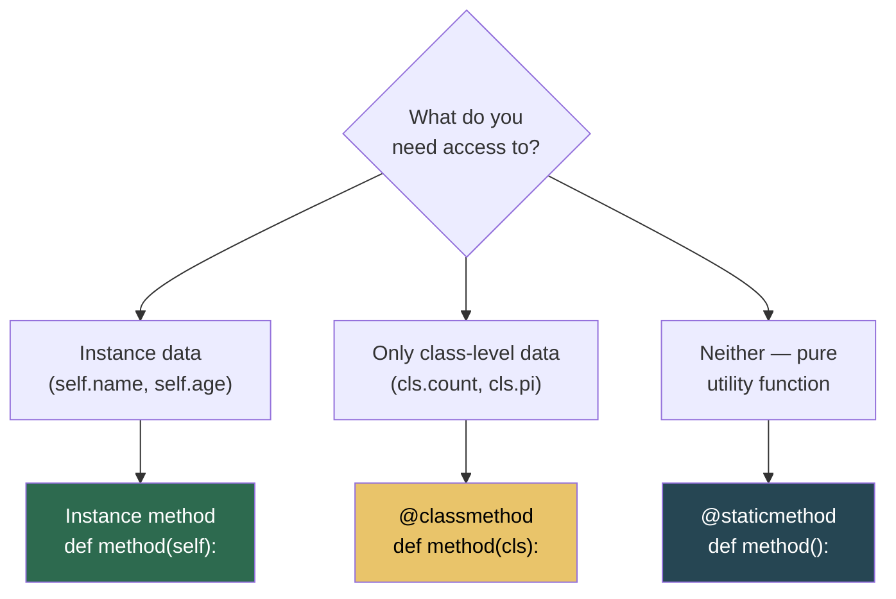

---

## Pointers and References in Python

While Python doesn't have explicit pointers like C/C++, **everything in Python is a reference** (similar to pointers). Understanding references is crucial for working with objects and avoiding common pitfalls.

### Variables Are References

```python
num1 = 11
num2 = num1  # num2 points to the same object as num1

print(id(num1))  # Same memory address
print(id(num2))  # Same memory address

num2 = 22  # Creates a new object, num2 now points elsewhere
# num1 still points to 11
```

### Mutable vs Immutable Objects

```python
# Immutable objects (int, str, tuple) — assignment creates new object
x = 5
y = x
y = 10  # x remains 5, y now points to new int object

# Mutable objects (list, dict, custom objects) — changes affect all references
list1 = [1, 2, 3]
list2 = list1  # Both point to same list object
list2.append(4)  # Modifies the shared object
print(list1)  # [1, 2, 3, 4] — list1 is also affected!
```

### `self` Is a Reference

In methods, `self` is a reference to the instance:

```python
class Dog:
    def __init__(self, name):
        self.name = name  # self is a reference to the object
    
    def bark(self):
        return f"{self.name} says Woof!"  # Accessing via reference

rex = Dog("Rex")  # rex is a reference to the Dog object
print(rex.bark())  # Python passes rex as 'self' to bark()
```

### Common Pitfalls

```python
# Pitfall 1: Mutable defaults
class BadList:
    def __init__(self, items=[]):  # Same list object reused!
        self.items = items

a = BadList()
b = BadList()
a.items.append(1)
print(b.items)  # [1] — unexpected!

# Fix: Use None and create new list
class GoodList:
    def __init__(self, items=None):
        self.items = items if items is not None else []
```

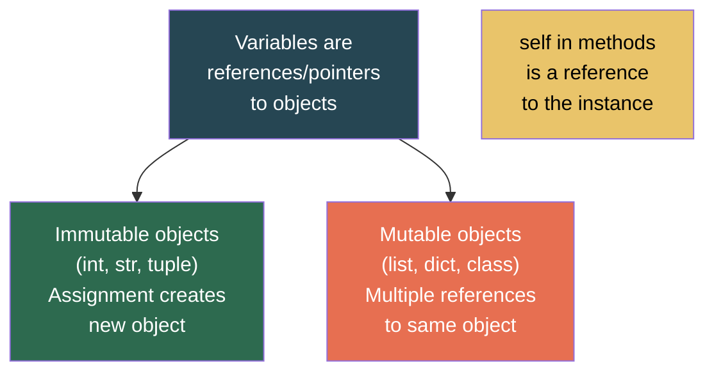

### Reference Counting and Garbage Collection

Python uses **reference counting** to manage memory. When an object's reference count reaches zero, it's garbage collected.

```python
obj = [1, 2, 3]  # ref count = 1
ref = obj         # ref count = 2
del obj           # ref count = 1
del ref           # ref count = 0 → garbage collected
```

---

## The Four Pillars of OOP

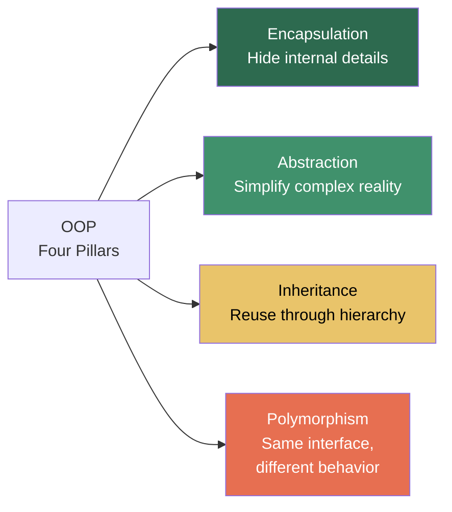

---

## 1. Encapsulation

**Bundling data and methods together** and restricting direct access to some components. Python uses naming conventions instead of hard access modifiers.

| Convention | Access | Example |
|---|---|---|
| `name` | Public | Anyone can access |
| `_name` | Protected (by convention) | "Please don't touch" — but you still can |
| `__name` | Private (name-mangled) | Harder to access — `_ClassName__name` |

```python
class Employee:
    def __init__(self, name, salary):
        self.name = name            # public
        self._department = "Eng"    # protected (convention)
        self.__salary = salary      # private (name-mangled)

    def get_salary(self):
        return self.__salary

    def set_salary(self, value):
        if value < 0:
            raise ValueError("Salary cannot be negative")
        self.__salary = value


emp = Employee("Alice", 75000)
print(emp.name)                # 'Alice' ✅
print(emp._department)         # 'Eng' ✅ (convention says don't, but you can)
print(emp.__salary)            # AttributeError ✗
print(emp._Employee__salary)   # 75000 (name mangling — still accessible)
print(emp.get_salary())        # 75000 ✅ (proper way)
```

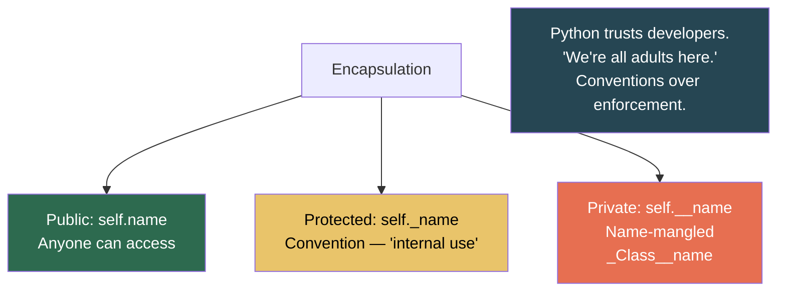

---

## 2. Abstraction

**Hiding complex implementation** and exposing only what's necessary. Users of the class don't need to know *how* it works, only *what* it does.

```python
from abc import ABC, abstractmethod

class Shape(ABC):
    @abstractmethod
    def area(self):
        pass

    @abstractmethod
    def perimeter(self):
        pass

    def describe(self):
        return f"Area: {self.area():.2f}, Perimeter: {self.perimeter():.2f}"


class Rectangle(Shape):
    def __init__(self, width, height):
        self.width = width
        self.height = height

    def area(self):
        return self.width * self.height

    def perimeter(self):
        return 2 * (self.width + self.height)


class Circle(Shape):
    def __init__(self, radius):
        self.radius = radius

    def area(self):
        return 3.14159 * self.radius ** 2

    def perimeter(self):
        return 2 * 3.14159 * self.radius


# Can't create Shape directly
# s = Shape()          # TypeError: Can't instantiate abstract class

r = Rectangle(5, 3)
c = Circle(7)
print(r.describe())    # Area: 15.00, Perimeter: 16.00
print(c.describe())    # Area: 153.94, Perimeter: 43.98
```

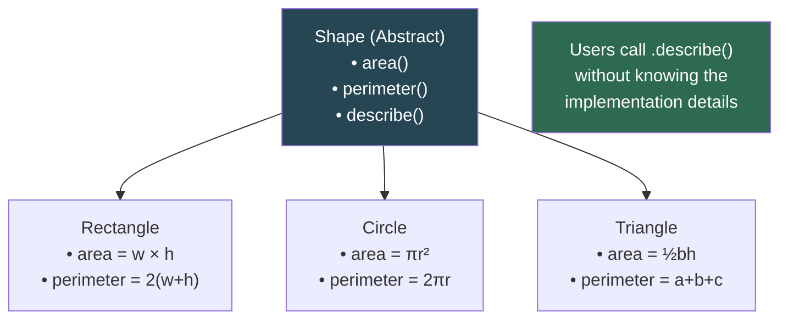

---

## 3. Inheritance

A class (child) can **inherit** attributes and methods from another class (parent), then extend or override them.

### Single Inheritance

```python
class Animal:
    def __init__(self, name, sound):
        self.name = name
        self.sound = sound

    def speak(self):
        return f"{self.name} says {self.sound}!"

    def __str__(self):
        return f"Animal({self.name})"


class Dog(Animal):
    def __init__(self, name, breed):
        super().__init__(name, "Woof")    # call parent's __init__
        self.breed = breed

    def fetch(self, item):
        return f"{self.name} fetches the {item}!"


class Cat(Animal):
    def __init__(self, name):
        super().__init__(name, "Meow")

    def purr(self):
        return f"{self.name} purrs..."


rex = Dog("Rex", "German Shepherd")
print(rex.speak())      # Rex says Woof!     (inherited)
print(rex.fetch("ball")) # Rex fetches the ball! (own method)
print(rex.breed)         # German Shepherd    (own attribute)

whiskers = Cat("Whiskers")
print(whiskers.speak())  # Whiskers says Meow!
```

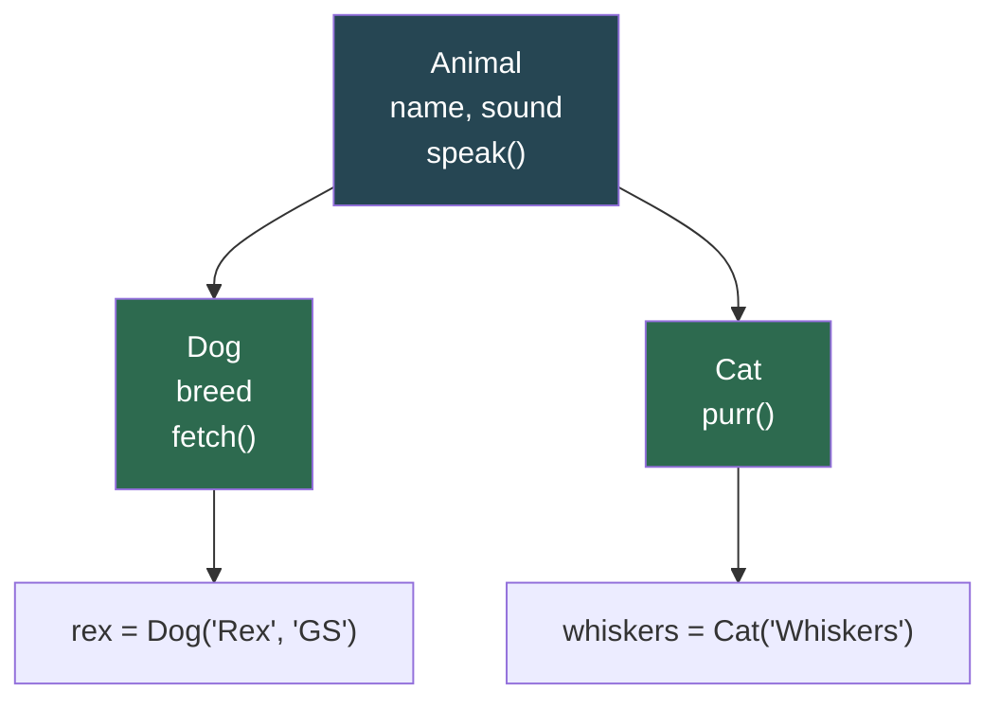

### Multiple Inheritance & MRO

```python
class Flyer:
    def fly(self):
        return "I can fly!"

class Swimmer:
    def swim(self):
        return "I can swim!"

class Duck(Flyer, Swimmer):
    def quack(self):
        return "Quack!"

donald = Duck()
print(donald.fly())     # I can fly!
print(donald.swim())    # I can swim!
print(donald.quack())   # Quack!

# Method Resolution Order — the lookup chain
print(Duck.__mro__)
# (Duck, Flyer, Swimmer, object)
```

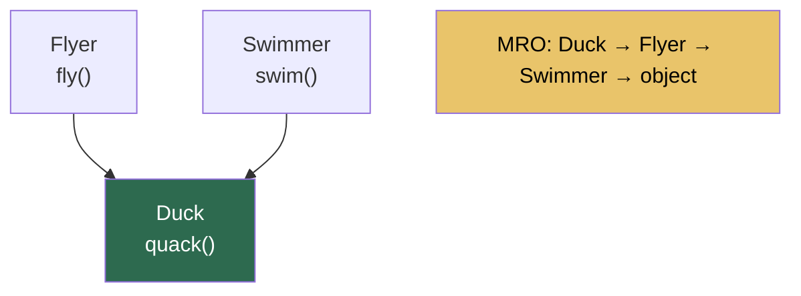

### `super()` — Calling the Parent

```python
class Base:
    def greet(self):
        return "Hello from Base"

class Child(Base):
    def greet(self):
        parent_msg = super().greet()       # call parent's greet
        return f"{parent_msg} and Child"

c = Child()
print(c.greet())   # Hello from Base and Child
```

### `isinstance()` and `issubclass()`

```python
print(isinstance(rex, Dog))       # True
print(isinstance(rex, Animal))    # True  — Dog IS an Animal
print(isinstance(rex, Cat))       # False

print(issubclass(Dog, Animal))    # True
print(issubclass(Dog, Cat))       # False
```

---

## 4. Polymorphism

**Same interface, different behavior.** Different classes respond to the same method name in their own way.

```python
class Shape:
    def area(self):
        raise NotImplementedError

class Square(Shape):
    def __init__(self, side):
        self.side = side
    def area(self):
        return self.side ** 2

class Circle(Shape):
    def __init__(self, radius):
        self.radius = radius
    def area(self):
        return 3.14159 * self.radius ** 2

class Triangle(Shape):
    def __init__(self, base, height):
        self.base = base
        self.height = height
    def area(self):
        return 0.5 * self.base * self.height


# Polymorphism in action — same function works with ANY shape
def print_area(shape):
    print(f"Area: {shape.area():.2f}")

shapes = [Square(4), Circle(3), Triangle(6, 8)]
for s in shapes:
    print_area(s)
# Area: 16.00
# Area: 28.27
# Area: 24.00
```

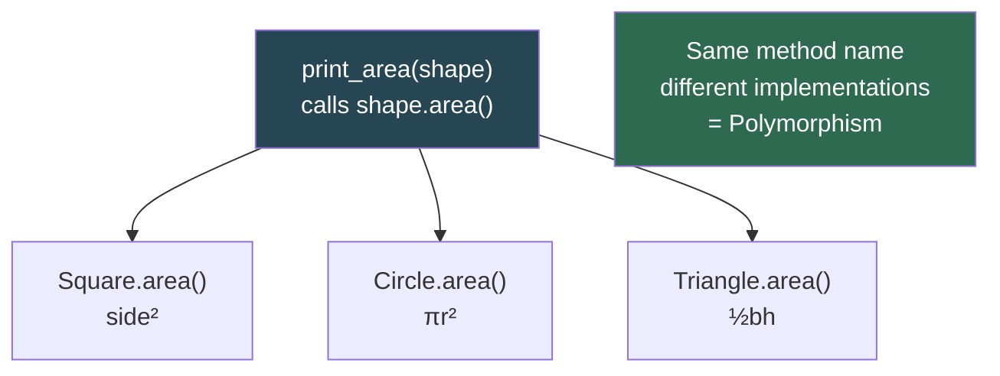

### Duck Typing

Python doesn't require inheritance for polymorphism. If an object has the right method, it works — "If it walks like a duck and quacks like a duck, it's a duck."

```python
class Dog:
    def speak(self):
        return "Woof!"

class Cat:
    def speak(self):
        return "Meow!"

class Robot:
    def speak(self):
        return "Beep boop!"

# No shared base class — but all have speak()
for thing in [Dog(), Cat(), Robot()]:
    print(thing.speak())
```

---

## Dunder (Magic) Methods

Special methods with double underscores that let your classes integrate with Python's built-in operations.

### Most Important Dunders

```python
class Vector:
    def __init__(self, x, y):
        self.x = x
        self.y = y

    # String representations
    def __str__(self):              # for print(), str()
        return f"({self.x}, {self.y})"

    def __repr__(self):             # for debugging, repr()
        return f"Vector({self.x}, {self.y})"

    # Arithmetic
    def __add__(self, other):       # v1 + v2
        return Vector(self.x + other.x, self.y + other.y)

    def __sub__(self, other):       # v1 - v2
        return Vector(self.x - other.x, self.y - other.y)

    def __mul__(self, scalar):      # v * 3
        return Vector(self.x * scalar, self.y * scalar)

    # Comparison
    def __eq__(self, other):        # v1 == v2
        return self.x == other.x and self.y == other.y

    def __lt__(self, other):        # v1 < v2
        return self.magnitude() < other.magnitude()

    # Length / truthiness
    def __len__(self):              # len(v) — could represent dimension
        return 2

    def __bool__(self):             # bool(v), if v:
        return self.x != 0 or self.y != 0

    # Container behavior
    def __getitem__(self, index):   # v[0], v[1]
        if index == 0: return self.x
        if index == 1: return self.y
        raise IndexError

    # Hashing (needed for dict keys / sets)
    def __hash__(self):
        return hash((self.x, self.y))

    # Abs
    def __abs__(self):              # abs(v)
        return self.magnitude()

    def magnitude(self):
        return (self.x**2 + self.y**2) ** 0.5


v1 = Vector(3, 4)
v2 = Vector(1, 2)
print(v1 + v2)         # (4, 6)
print(v1 * 3)          # (9, 12)
print(v1 == Vector(3, 4))  # True
print(abs(v1))         # 5.0
print(v1[0])           # 3
```

### Dunder Method Reference Table

| Method | Triggered By | Purpose |
|---|---|---|
| `__init__` | `MyClass()` | Initialize object |
| `__str__` | `print(obj)`, `str(obj)` | Human-readable string |
| `__repr__` | `repr(obj)`, debugger | Unambiguous string (for devs) |
| `__len__` | `len(obj)` | Length |
| `__getitem__` | `obj[key]` | Index/key access |
| `__setitem__` | `obj[key] = val` | Index/key assignment |
| `__delitem__` | `del obj[key]` | Index/key deletion |
| `__contains__` | `x in obj` | Membership test |
| `__iter__` | `for x in obj` | Make iterable |
| `__next__` | `next(obj)` | Iterator protocol |
| `__add__` | `a + b` | Addition |
| `__sub__` | `a - b` | Subtraction |
| `__mul__` | `a * b` | Multiplication |
| `__eq__` | `a == b` | Equality |
| `__lt__` | `a < b` | Less than |
| `__le__` | `a <= b` | Less than or equal |
| `__hash__` | `hash(obj)` | Hashing (dict keys, sets) |
| `__bool__` | `bool(obj)`, `if obj` | Truthiness |
| `__call__` | `obj()` | Make object callable |
| `__enter__`/`__exit__` | `with obj:` | Context manager |

---

## Properties — Getters and Setters the Pythonic Way

Instead of Java-style `get_x()` / `set_x()`, Python uses `@property`.

```python
class Temperature:
    def __init__(self, celsius):
        self._celsius = celsius       # store internally

    @property
    def celsius(self):                # getter
        return self._celsius

    @celsius.setter
    def celsius(self, value):         # setter
        if value < -273.15:
            raise ValueError("Below absolute zero!")
        self._celsius = value

    @property
    def fahrenheit(self):             # computed property
        return self._celsius * 9/5 + 32

    @fahrenheit.setter
    def fahrenheit(self, value):
        self.celsius = (value - 32) * 5/9


t = Temperature(100)
print(t.celsius)       # 100     — looks like attribute access
print(t.fahrenheit)    # 212.0   — computed on the fly

t.celsius = 0          # calls the setter — validates input
print(t.fahrenheit)    # 32.0

t.celsius = -300       # ValueError: Below absolute zero!
```

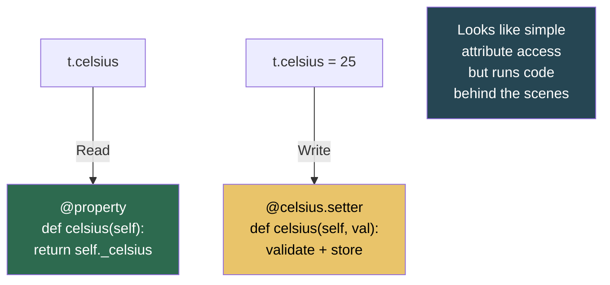

---

## Composition vs Inheritance

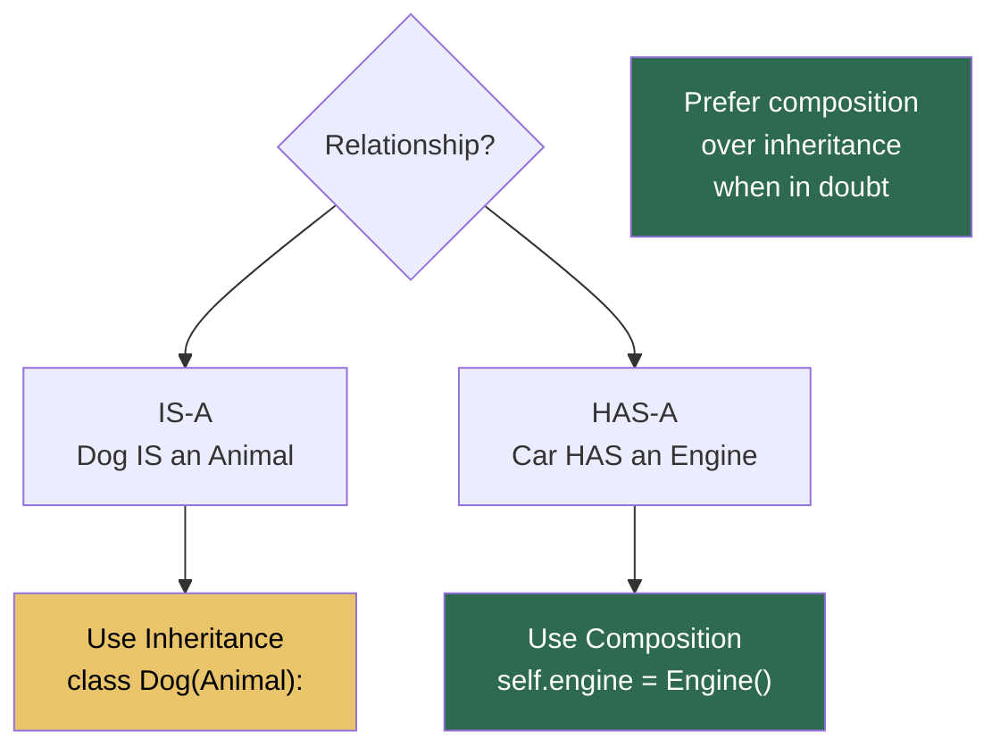

### Inheritance Approach

```python
class Vehicle:
    def start(self):
        return "Vehicle started"

class Car(Vehicle):
    pass    # inherits start()
```

### Composition Approach (Preferred)

```python
class Engine:
    def start(self):
        return "Engine running"

class Car:
    def __init__(self):
        self.engine = Engine()     # HAS-A engine

    def start(self):
        return self.engine.start()
```

| | Inheritance | Composition |
|---|---|---|
| **Coupling** | Tight — child depends on parent internals | Loose — components are independent |
| **Flexibility** | Less — locked into hierarchy | More — swap components at runtime |
| **Reuse** | Inherits everything (even what you don't want) | Pick exactly what you need |
| **When to use** | True IS-A relationship | HAS-A or CAN-DO relationship |

---

## Dataclasses — Less Boilerplate

Python 3.7+ `dataclasses` auto-generate `__init__`, `__repr__`, `__eq__`, and more.

```python
from dataclasses import dataclass, field

@dataclass
class Student:
    name: str
    age: int
    grade: str = "N/A"                     # default value
    courses: list = field(default_factory=list)  # mutable default

    @property
    def is_adult(self):
        return self.age >= 18


s = Student("Alice", 20, "A")
print(s)             # Student(name='Alice', age=20, grade='A', courses=[])
print(s.is_adult)    # True

# Auto-generated __eq__
s2 = Student("Alice", 20, "A")
print(s == s2)       # True

# Frozen (immutable) dataclass
@dataclass(frozen=True)
class Point:
    x: float
    y: float

p = Point(3, 4)
p.x = 10            # FrozenInstanceError
```

### Regular Class vs Dataclass

```python
# Without dataclass — lots of boilerplate
class StudentOld:
    def __init__(self, name, age, grade="N/A"):
        self.name = name
        self.age = age
        self.grade = grade

    def __repr__(self):
        return f"Student({self.name}, {self.age}, {self.grade})"

    def __eq__(self, other):
        return (self.name, self.age, self.grade) == (other.name, other.age, other.grade)


# With dataclass — all of the above is auto-generated
@dataclass
class StudentNew:
    name: str
    age: int
    grade: str = "N/A"
```

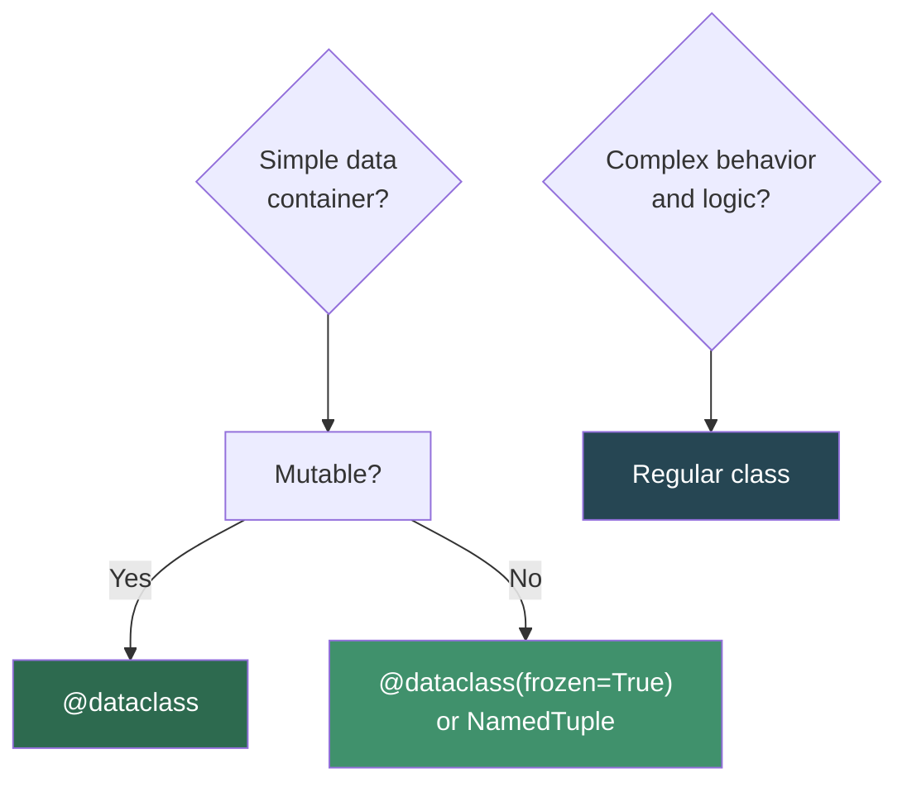

---

## SOLID Principles (Brief)

These are the five design principles that make OOP code maintainable and scalable.

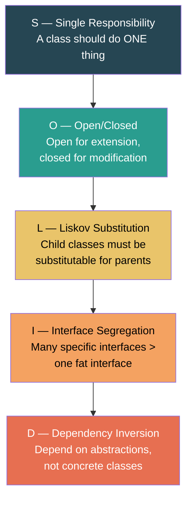

```python
# S — Single Responsibility
class UserAuth:         # handles authentication ONLY
    def login(self, user, pwd): ...
    def logout(self): ...

class UserProfile:      # handles profile ONLY
    def update_name(self, name): ...
    def get_avatar(self): ...

# O — Open/Closed
class Shape(ABC):
    @abstractmethod
    def area(self): ...

class NewHexagon(Shape):    # extend by adding new class, not modifying Shape
    def area(self): ...

# L — Liskov Substitution
def print_area(shape: Shape):
    print(shape.area())     # works with ANY Shape subclass

# D — Dependency Inversion
class NotificationService:
    def __init__(self, sender):          # depends on abstraction
        self.sender = sender             # not a concrete EmailSender

    def notify(self, message):
        self.sender.send(message)
```

---

## OOP in Data Structures

OOP is the foundation for implementing data structures. Here's how a simple Linked List looks with classes:

```python
class Node:
    def __init__(self, value):
        self.value = value
        self.next = None

class LinkedList:
    def __init__(self):
        self.head = None
        self.length = 0

    def append(self, value):
        new_node = Node(value)
        if not self.head:
            self.head = new_node
        else:
            current = self.head
            while current.next:
                current = current.next
            current.next = new_node
        self.length += 1

    def __len__(self):
        return self.length

    def __str__(self):
        values = []
        current = self.head
        while current:
            values.append(str(current.value))
            current = current.next
        return " → ".join(values)

    def __iter__(self):
        current = self.head
        while current:
            yield current.value
            current = current.next


ll = LinkedList()
ll.append(1)
ll.append(2)
ll.append(3)
print(ll)           # 1 → 2 → 3
print(len(ll))      # 3
for val in ll:
    print(val)      # 1, 2, 3
```

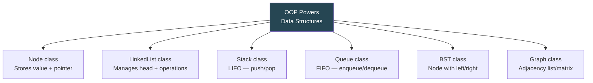

---

## Common Mistakes

### 1. Forgetting `self`

```python
class Bad:
    def greet():                # missing self!
        return "hello"

b = Bad()
b.greet()    # TypeError: greet() takes 0 positional arguments but 1 was given

class Good:
    def greet(self):
        return "hello"
```

### 2. Mutable Class Attributes Shared Across Instances

```python
# WRONG — all instances share the SAME list
class Student:
    courses = []           # class-level list

    def add_course(self, course):
        self.courses.append(course)

a = Student()
b = Student()
a.add_course("Math")
print(b.courses)           # ['Math'] — b is affected!

# RIGHT — create in __init__
class Student:
    def __init__(self):
        self.courses = []  # instance-level list
```

### 3. Not Calling `super().__init__()`

```python
class Animal:
    def __init__(self, name):
        self.name = name

# WRONG — parent __init__ never runs
class Dog(Animal):
    def __init__(self, name, breed):
        self.breed = breed
        # forgot super().__init__(name)!
        print(self.name)    # AttributeError: 'Dog' has no attribute 'name'

# RIGHT
class Dog(Animal):
    def __init__(self, name, breed):
        super().__init__(name)
        self.breed = breed
```

### 4. Confusing `__str__` and `__repr__`

```python
class Point:
    def __init__(self, x, y):
        self.x = x
        self.y = y

    def __repr__(self):              # for developers / debugging
        return f"Point({self.x}, {self.y})"

    def __str__(self):               # for end users / print
        return f"({self.x}, {self.y})"

p = Point(3, 4)
print(p)          # (3, 4)     — calls __str__
print(repr(p))    # Point(3, 4) — calls __repr__
print([p])        # [Point(3, 4)] — containers use __repr__
```

### 5. Overusing Inheritance

```python
# Don't create deep hierarchies — favor composition
# BAD: Animal → Pet → Dog → GuideDog → TrainedGuideDog
# GOOD: Dog with Trainable and Guide behaviors composed in
```

---

## Quick Reference Cheat Sheet

```
┌──────────────────────────────────────────────────────────────────┐
│              PYTHON OOP CHEAT SHEET                              │
├──────────────────────────────────────────────────────────────────┤
│                                                                  │
│  CLASS BASICS:                                                   │
│    class MyClass:                                                │
│        class_attr = "shared"                                    │
│        def __init__(self, x):                                   │
│            self.x = x           # instance attribute            │
│        def method(self):        # instance method               │
│            return self.x                                        │
│                                                                  │
│  METHOD TYPES:                                                   │
│    def method(self):            → instance method               │
│    @classmethod                                                  │
│    def method(cls):             → class method                  │
│    @staticmethod                                                 │
│    def method():                → static method                 │
│                                                                  │
├──────────────────────────────────────────────────────────────────┤
│                                                                  │
│  FOUR PILLARS:                                                   │
│    Encapsulation   → _protected, __private                      │
│    Abstraction     → ABC, @abstractmethod                       │
│    Inheritance     → class Child(Parent):                       │
│    Polymorphism    → same method, different behavior            │
│                                                                  │
├──────────────────────────────────────────────────────────────────┤
│                                                                  │
│  KEY DUNDERS:                                                    │
│    __init__        → constructor                                │
│    __str__         → print(obj)                                 │
│    __repr__        → repr(obj), debugger                        │
│    __eq__          → obj1 == obj2                               │
│    __lt__          → obj1 < obj2                                │
│    __add__         → obj1 + obj2                                │
│    __len__         → len(obj)                                   │
│    __getitem__     → obj[key]                                   │
│    __iter__        → for x in obj                               │
│    __hash__        → hash(obj)                                  │
│    __call__        → obj()                                      │
│                                                                  │
├──────────────────────────────────────────────────────────────────┤
│                                                                  │
│  PROPERTIES:                                                     │
│    @property       → getter (read)                              │
│    @x.setter       → setter (write with validation)             │
│                                                                  │
│  DATACLASSES (3.7+):                                             │
│    @dataclass      → auto __init__, __repr__, __eq__            │
│    frozen=True     → immutable dataclass                        │
│                                                                  │
├──────────────────────────────────────────────────────────────────┤
│                                                                  │
│  RULES OF THUMB:                                                 │
│    • Prefer composition over inheritance                        │
│    • Keep classes focused (Single Responsibility)               │
│    • Use ABC for interfaces / contracts                         │
│    • Use @dataclass for simple data containers                  │
│    • Always call super().__init__() in child classes            │
│    • Don't use mutable class-level attributes                   │
│                                                                  │
└──────────────────────────────────────────────────────────────────┘
```

---

*Previous: [Tuples](../6.Tuples/README.md) | Next: [Single Linked List](../8.SingleLinkedList/README.md)*
