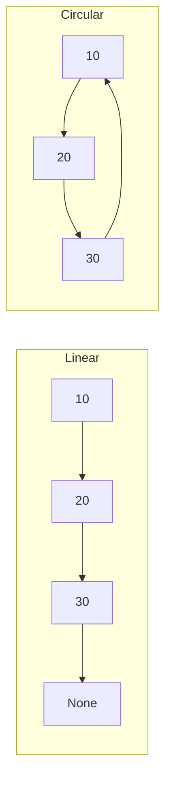
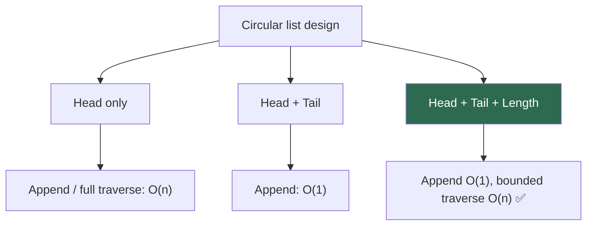
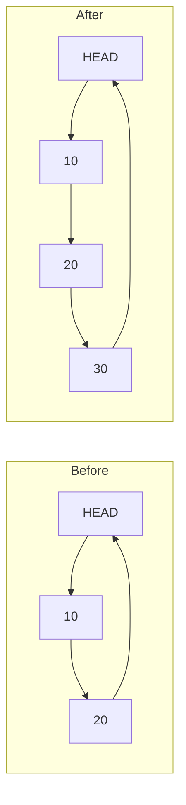

# Circular Linked List

A **circular linked list** is a linked list where the **last node does not point to `None`** — it points back to another node, usually the **head**, forming a closed loop. Traversal can continue “forever” unless you track where you started or how many nodes to visit.

> "A circular linked list is like a roundabout — you can keep going in a circle; you need a rule (start marker or count) to know when you’ve made a full lap."

---

## Table of Contents

1. [Circular vs Linear Linked List](#circular-vs-linear-linked-list)
2. [Anatomy of a Circular Singly Linked List](#anatomy-of-a-circular-singly-linked-list)
3. [Node Class](#node-class)
4. [Empty and Single-Node Cases](#empty-and-single-node-cases)
5. [Head, Tail, and Length](#head-tail-and-length)
6. [Operations — Visual Walkthrough](#operations--visual-walkthrough)
7. [Full Implementation in Python](#full-implementation-in-python)
8. [Traversal Patterns](#traversal-patterns)
9. [Time and Space Complexity](#time-and-space-complexity)
10. [Real-World Uses](#real-world-uses)
11. [Related Interview Ideas](#related-interview-ideas)
12. [Edge Cases to Always Handle](#edge-cases-to-always-handle)
13. [Common Mistakes](#common-mistakes)
14. [Practice Problems](#practice-problems)
15. [Quick Reference Cheat Sheet](#quick-reference-cheat-sheet)

---

## Circular vs Linear Linked List

| Aspect | Linear (SLL) | Circular (CSLL) |
|--------|--------------|-----------------|
| Last node’s `next` | `None` | Points to **head** (typical) |
| Natural “end” | Reaching `None` | No `None` from last node |
| Traversal stop condition | `while node:` | `while node != start` or count `length` steps |
| Empty list | `head is None` | Same |
| One node | `next is None` | `next is self` (points to itself) |



---

## Anatomy of a Circular Singly Linked List

```
        ┌──────────────────────────────────────────┐
        │                                          │
        ▼                                          │
┌──────────────┐     ┌──────────────┐     ┌──────────────┐
│ value: 10    │     │ value: 20    │     │ value: 30    │
│ next:  ──────┼────►│ next:  ──────┼────►│ next:  ──────┼──┐
└──────────────┘     └──────────────┘     └──────────────┘  │
     HEAD (entry)         ...              last node        │
        ▲◄──────────────────────────────────────────────────┘
```


| Component | Purpose |
|-----------|---------|
| **Node** | `value` + `next` (never “ends” at `None` from the tail in a non-empty list) |
| **Head** | Arbitrary entry point; often the “first” logical element |
| **Tail** | Optional; last node whose `next` is `head` |
| **Length** | Strongly recommended — makes bounded traversal O(n) and avoids infinite loops |

---

## Node Class

Same as a singly linked list node; the **structure** is identical — only **how you wire `next`** changes.

```python
class Node:
    def __init__(self, value):
        self.value = value
        self.next = None  # set to head or self when inserted into circular list

    def __repr__(self):
        return f"Node({self.value})"
```

---

## Empty and Single-Node Cases

| State | `head` | `tail` (if used) | Structure |
|-------|--------|------------------|-----------|
| Empty | `None` | `None` | — |
| One node | node A | A | `A.next is A` |

```python
# After inserting first element into circular list:
# head = tail = node
# node.next = node
```

---

## Head, Tail, and Length

Keeping **`tail`** and **`length`** mirrors the singly linked list pattern and avoids scanning the whole ring for append or for “how many steps” in traversal.



---

## Operations — Visual Walkthrough

### Append (insert after current tail) — O(1) with tail

1. New node’s `next` = `head`
2. Old `tail.next` = new node
3. `tail` = new node  
4. `length += 1`

For the **first** node: `head = tail = new`, `new.next = new`.



### Prepend (new head) — O(1) with tail

1. `new.next` = `head`
2. `tail.next` = new
3. `head` = new  
4. `length += 1`

### Delete head — O(1) with tail

1. If `length == 1`: clear list
2. Else: `tail.next = head.next`, `head = head.next`
3. `length -= 1`

### Delete tail — O(n) for singly circular

You must find the node **before** the tail (walk from `head` until `current.next == tail`).

### Search / print all — O(n)

Walk **exactly `length` steps** from `head`, or stop when you return to `head` after the first step (careful with off-by-one on the first iteration).

---

## Full Implementation in Python

```python
class Node:
    def __init__(self, value):
        self.value = value
        self.next = None


class CircularSinglyLinkedList:
    def __init__(self):
        self.head = None
        self.tail = None
        self.length = 0

    def append(self, value):
        new_node = Node(value)
        if self.length == 0:
            self.head = self.tail = new_node
            new_node.next = new_node
        else:
            new_node.next = self.head
            self.tail.next = new_node
            self.tail = new_node
        self.length += 1

    def prepend(self, value):
        new_node = Node(value)
        if self.length == 0:
            self.head = self.tail = new_node
            new_node.next = new_node
        else:
            new_node.next = self.head
            self.tail.next = new_node
            self.head = new_node
        self.length += 1

    def pop_first(self):
        if self.length == 0:
            return None
        val = self.head.value
        if self.length == 1:
            self.head = self.tail = None
        else:
            self.tail.next = self.head.next
            self.head = self.head.next
        self.length -= 1
        return val

    def __len__(self):
        return self.length

    def __iter__(self):
        if self.length == 0:
            return
        current = self.head
        for _ in range(self.length):
            yield current.value
            current = current.next

    def __repr__(self):
        return "[" + " -> ".join(str(v) for v in self) + " -> (cycle to head)]"


# Example
if __name__ == "__main__":
    cll = CircularSinglyLinkedList()
    for x in (10, 20, 30):
        cll.append(x)
    print(cll)  # [10 -> 20 -> 30 -> (cycle to head)]
    print(list(cll))
```

---

## Traversal Patterns

### 1. Fixed count (recommended)

```python
def visit_all(head, length):
    if length == 0:
        return
    cur = head
    for _ in range(length):
        # process cur.value
        cur = cur.next
```

### 2. Until back to start (no length)

```python
def visit_all_from_start(head):
    if head is None:
        return
    start = head
    while True:
        # process head.value
        head = head.next
        if head is start:
            break
```

### 3. Doubly circular

Each node has `prev` and `next`; you can walk backward — useful for playlists or undoable cursors.

---

## Time and Space Complexity

Assume **head + tail + length** maintained.

| Operation | Time | Notes |
|-----------|------|--------|
| Append | O(1) | |
| Prepend | O(1) | |
| Pop first | O(1) | |
| Pop last | O(n) | Find predecessor |
| Search | O(n) | |
| Insert at index | O(n) | |
| Traversal (full) | O(n) | |

**Space:** O(n) for nodes; O(1) extra for pointers/counters.

---

## Real-World Uses

| Domain | Why circular |
|--------|----------------|
| **OS / scheduling** | Round-robin among tasks or CPU cores |
| **Games** | Turn order that wraps to the first player |
| **Buffers** | Ring buffers (often array-based; same *idea*) |
| **UI** | Infinite carousels, circular menus |
| **Networking** | Token ring (classic) |

---

## Related Interview Ideas

- **Detect cycle in a linked list** (Floyd’s tortoise & hare) — *any* cycle, not only “tail → head”.
- **Josephus problem** — often modeled with a circular structure.
- **Split a circular list into two halves** — use slow/fast pointers with cycle awareness.
- **Merge two sorted circular lists** — extend merge logic; reconnect tail to head at the end.

---

## Edge Cases to Always Handle

1. **Empty list** — `head` / `tail` are `None`, `length == 0`.
2. **Single node** — `next` must point to **self**; deleting that node empties the list.
3. **Infinite loops** — never write `while cur:` on a circular list without a step limit or start marker.
4. **One-element append/prepend** — must set `tail.next` and `new.next` consistently.

---

## Common Mistakes

| Mistake | Consequence |
|---------|-------------|
| Leaving last node’s `next` as `None` | Not circular; breaks ring invariants |
| `while node:` traversal | Infinite loop |
| Forgetting to update `tail.next` on prepend | Ring broken |
| Pop last with only `tail` pointer | Cannot unlink without predecessor |

---

## Practice Problems

1. Implement **pop_last** for a circular singly linked list.
2. **Josephus:** n people in a circle, every k-th eliminated — return survivor order or last person.
3. Given a circular list and a value, **insert after first occurrence** of that value.
4. **Split** circular list into two circular lists of (almost) equal size.
5. **Rotate** the list so that a given node becomes the new head (O(1) if you have tail pointer).
6. (Classic on linear lists, same skill) **Detect cycle** and find **start of cycle**.

---

## Quick Reference Cheat Sheet

```
Empty:     head = tail = None, length = 0
One node:  node.next = node

Append:    new.next = head; tail.next = new; tail = new
Prepend:   new.next = head; tail.next = new; head = new
Pop first: tail.next = head.next; head = head.next  (or clear if len==1)

Traverse:  for _ in range(length): ...; cur = cur.next
Never:     while cur:  # on a true circular list without break
```

---

## Further Reading

- **Doubly circular linked list** — `head.prev` points to tail; full bidirectional ring.
- Compare with **ring buffer** (array + modulo index) for cache-friendly fixed capacity.

---

*Previous: [Singly Linked List](../8.SingleLinkedList/README.md)*
