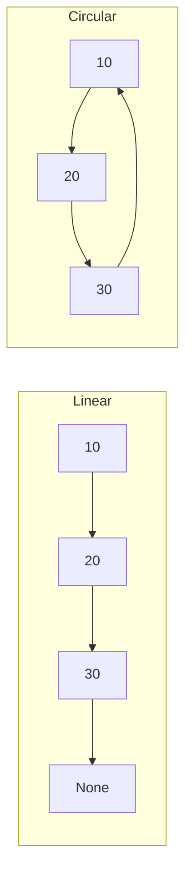
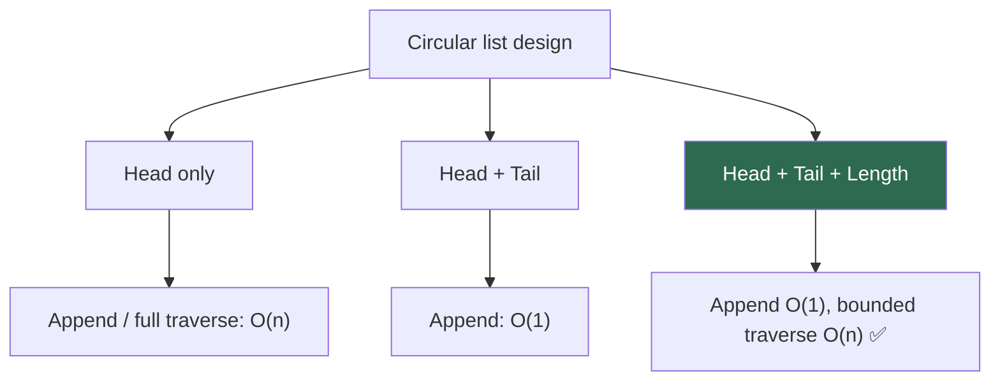
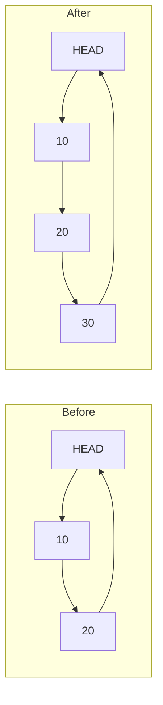

# Circular Linked List

A **circular linked list** is a linked list where the **last node does not point to `None`** — it points back to another node, usually the **head**, forming a closed loop. Traversal can continue “forever” unless you track where you started or how many nodes to visit.

> "A circular linked list is like a roundabout — you can keep going in a circle; you need a rule (start marker or count) to know when you’ve made a full lap."

---

## Table of Contents

1. [Circular vs Linear Linked List](#circular-vs-linear-linked-list)
2. [Anatomy of a Circular Singly Linked List](#anatomy-of-a-circular-singly-linked-list)
3. [Node Class](#node-class)
4. [Empty and Single-Node Cases](#empty-and-single-node-cases)
5. [Head, Tail, and Length](#head-tail-and-length)
6. [Operations — Visual Walkthrough](#operations--visual-walkthrough)
7. [Full Implementation in Python](#full-implementation-in-python)
8. [Traversal Patterns](#traversal-patterns)
9. [Time and Space Complexity](#time-and-space-complexity)
10. [Real-World Uses](#real-world-uses)
11. [Related Interview Ideas](#related-interview-ideas)
12. [Edge Cases to Always Handle](#edge-cases-to-always-handle)
13. [Common Mistakes](#common-mistakes)
14. [Practice Problems](#practice-problems)
15. [Quick Reference Cheat Sheet](#quick-reference-cheat-sheet)

---

## Circular vs Linear Linked List

| Aspect | Linear (SLL) | Circular (CSLL) |
|--------|--------------|-----------------|
| Last node’s `next` | `None` | Points to **head** (typical) |
| Natural “end” | Reaching `None` | No `None` from last node |
| Traversal stop condition | `while node:` | `while node != start` or count `length` steps |
| Empty list | `head is None` | Same |
| One node | `next is None` | `next is self` (points to itself) |



---

## Anatomy of a Circular Singly Linked List

```
        ┌──────────────────────────────────────────┐
        │                                          │
        ▼                                          │
┌──────────────┐     ┌──────────────┐     ┌──────────────┐
│ value: 10    │     │ value: 20    │     │ value: 30    │
│ next:  ──────┼────►│ next:  ──────┼────►│ next:  ──────┼──┐
└──────────────┘     └──────────────┘     └──────────────┘  │
     HEAD (entry)         ...              last node        │
        ▲◄──────────────────────────────────────────────────┘
```


| Component | Purpose |
|-----------|---------|
| **Node** | `value` + `next` (never “ends” at `None` from the tail in a non-empty list) |
| **Head** | Arbitrary entry point; often the “first” logical element |
| **Tail** | Optional; last node whose `next` is `head` |
| **Length** | Strongly recommended — makes bounded traversal O(n) and avoids infinite loops |

---

## Node Class

Same as a singly linked list node; the **structure** is identical — only **how you wire `next`** changes.

```python
class Node:
    def __init__(self, value):
        self.value = value
        self.next = None  # set to head or self when inserted into circular list

    def __repr__(self):
        return f"Node({self.value})"
```

---

## Empty and Single-Node Cases

| State | `head` | `tail` (if used) | Structure |
|-------|--------|------------------|-----------|
| Empty | `None` | `None` | — |
| One node | node A | A | `A.next is A` |

```python
# After inserting first element into circular list:
# head = tail = node
# node.next = node
```

---

## Head, Tail, and Length

Keeping **`tail`** and **`length`** mirrors the singly linked list pattern and avoids scanning the whole ring for append or for “how many steps” in traversal.



---

## Operations — Visual Walkthrough

### Append (insert after current tail) — O(1) with tail

1. New node’s `next` = `head`
2. Old `tail.next` = new node
3. `tail` = new node  
4. `length += 1`

For the **first** node: `head = tail = new`, `new.next = new`.



### Prepend (new head) — O(1) with tail

1. `new.next` = `head`
2. `tail.next` = new
3. `head` = new  
4. `length += 1`

### Delete head — O(1) with tail

1. If `length == 1`: clear list
2. Else: `tail.next = head.next`, `head = head.next`
3. `length -= 1`

### Delete tail — O(n) for singly circular

You must find the node **before** the tail (walk from `head` until `current.next == tail`).

### Search / print all — O(n)

Walk **exactly `length` steps** from `head`, or stop when you return to `head` after the first step (careful with off-by-one on the first iteration).

---

## Implementation Files

This folder contains two different implementations of Circular Singly Linked Lists:

### 1. Basic Implementation (`circularLinkedList.py`)
A simple circular linked list with basic append functionality.

### 2. Complete Implementation (`CircularSinglyLinkedListNew.py`)
A comprehensive implementation with full CRUD operations, search, traversal, and more methods.

## Core Implementation Example

Here's the key structure and methods from our implementations:

```python
class Node:
    def __init__(self, value):
        self.value = value
        self.next = None
    
    def __str__(self):
        return str(self.value)

class CSLinkedList:
    def __init__(self):
        self.head = None
        self.tail = None
        self.length = 0
    
    def __str__(self):
        temp_node = self.head
        result = ''
        while temp_node is not None:
            result += str(temp_node.value)
            temp_node = temp_node.next
            if temp_node == self.head:  # Stop condition for circular list
                break
            result += ' -> '
        return result

    def append(self, value):
        new_node = Node(value)
        if self.length == 0:
            self.head = new_node
            self.tail = new_node
            new_node.next = new_node
        else:
            self.tail.next = new_node
            new_node.next = self.head
            self.tail = new_node
        self.length += 1

    def prepend(self, value):
        new_node = Node(value)
        if self.length == 0:
            self.head = new_node
            self.tail = new_node
            new_node.next = new_node
        else:
            new_node.next = self.head
            self.head = new_node
            self.tail.next = new_node  # Point tail's next to new head
        self.length += 1

    def pop_first(self):
        if self.length == 0:
            return None
        popped_node = self.head
        
        if self.length == 1:
            self.head = None
            self.tail = None
        else:
            self.head = self.head.next
            self.tail.next = self.head  # Update tail's next to new head
            popped_node.next = None
        
        self.length -= 1
        return popped_node

    def pop(self):
        if self.length == 0:
            return None
        popped_node = self.tail
        if self.length == 1:
            self.head = None
            self.tail = None
        else:
            temp = self.head
            while temp.next != self.tail:  # Find second-to-last node
                temp = temp.next
            temp.next = self.head  # Point to head to maintain circularity
            self.tail = temp  # Update tail
        popped_node.next = None
        self.length -= 1
        return popped_node

    def traverse(self):
        if not self.head:
            return
        current = self.head
        while current is not None:
            print(current.value)
            current = current.next
            if current == self.head:  # Stop when we complete the circle
                break

    def search(self, target):
        current = self.head
        index = 0
        while current is not None:
            if current.value == target:
                return index
            current = current.next
            index += 1
            if current == self.head:  # Stop when we complete the circle
                break
        return -1

# Example usage
if __name__ == "__main__":
    cll = CSLinkedList()
    cll.append(10)
    cll.append(20)
    cll.append(30)
    print(cll)  # 10 -> 20 -> 30
    print(f"Length: {cll.length}")
```

### Additional Methods in Complete Implementation

The `CircularSinglyLinkedListNew.py` file includes these additional methods:

- `insert(index, value)` - Insert at specific position (O(n))
- `get(index)` - Get node at specific index (O(n))
- `set_value(index, value)` - Update value at index (O(n))
- `remove(index)` - Remove node at specific index (O(n))
- `delete_all()` - Clear the entire list (O(1))

**Key Implementation Details:**
- All methods properly handle the circular nature by maintaining `tail.next = head`
- Empty list and single-node cases are handled separately
- The `__str__` method prevents infinite loops by checking `if temp_node == self.head`
- Search methods include the circular stop condition

---

## Traversal Patterns

### 1. Fixed count (recommended)

```python
def visit_all(head, length):
    if length == 0:
        return
    cur = head
    for _ in range(length):
        # process cur.value
        cur = cur.next
```

### 2. Until back to start (no length)

```python
def visit_all_from_start(head):
    if head is None:
        return
    start = head
    while True:
        # process head.value
        head = head.next
        if head is start:
            break
```

### 3. Doubly circular

Each node has `prev` and `next`; you can walk backward — useful for playlists or undoable cursors.

---

## Time and Space Complexity

Assume **head + tail + length** maintained.

| Operation | Time | Notes |
|-----------|------|--------|
| Append | O(1) | |
| Prepend | O(1) | |
| Pop first | O(1) | |
| Pop last | O(n) | Find predecessor |
| Search | O(n) | |
| Insert at index | O(n) | |
| Traversal (full) | O(n) | |

**Space:** O(n) for nodes; O(1) extra for pointers/counters.

---

## Real-World Uses

| Domain | Why circular |
|--------|----------------|
| **OS / scheduling** | Round-robin among tasks or CPU cores |
| **Games** | Turn order that wraps to the first player |
| **Buffers** | Ring buffers (often array-based; same *idea*) |
| **UI** | Infinite carousels, circular menus |
| **Networking** | Token ring (classic) |

---

## Related Interview Ideas

- **Detect cycle in a linked list** (Floyd’s tortoise & hare) — *any* cycle, not only “tail → head”.
- **Josephus problem** — often modeled with a circular structure.
- **Split a circular list into two halves** — use slow/fast pointers with cycle awareness.
- **Merge two sorted circular lists** — extend merge logic; reconnect tail to head at the end.

---

## Edge Cases to Always Handle

1. **Empty list** — `head` / `tail` are `None`, `length == 0`.
2. **Single node** — `next` must point to **self**; deleting that node empties the list.
3. **Infinite loops** — never write `while cur:` on a circular list without a step limit or start marker.
4. **One-element append/prepend** — must set `tail.next` and `new.next` consistently.

---

## Common Mistakes

| Mistake | Consequence |
|---------|-------------|
| Leaving last node’s `next` as `None` | Not circular; breaks ring invariants |
| `while node:` traversal | Infinite loop |
| Forgetting to update `tail.next` on prepend | Ring broken |
| Pop last with only `tail` pointer | Cannot unlink without predecessor |

---

## Files in This Directory

| File | Description |
|------|-------------|
| `circularLinkedList.py` | Basic implementation with `append()` method |
| `CircularSinglyLinkedListNew.py` | Complete implementation with all CRUD operations |
| `README.md` | This comprehensive guide |

## Practice Problems

1. **Extend Basic Implementation**: Add `prepend`, `pop`, and `search` methods to the basic `circularLinkedList.py`.
2. **Josephus Problem**: n people in a circle, every k-th eliminated — return survivor order or last person.
3. **Insert After Value**: Given a circular list and a value, insert a new node after the first occurrence of that value.
4. **Split Circular List**: Split a circular list into two circular lists of (almost) equal size.
5. **Rotate List**: Rotate the list so that a given node becomes the new head (O(1) if you have tail pointer).
6. **Cycle Detection**: (Classic problem) Detect if a linked list has a cycle and find the start of the cycle.
7. **Fix Implementation Bug**: The current `CircularSinglyLinkedListNew.py` has duplicate `search()` and `pop()` methods - fix by combining them properly.

---

## Quick Reference Cheat Sheet

```
Empty:     head = tail = None, length = 0
One node:  node.next = node

Append:    new.next = head; tail.next = new; tail = new
Prepend:   new.next = head; tail.next = new; head = new
Pop first: tail.next = head.next; head = head.next  (or clear if len==1)

Traverse:  for _ in range(length): ...; cur = cur.next
Never:     while cur:  # on a true circular list without break
```

---

## Implementation Notes

### Code Quality Issues in Current Files

The `CircularSinglyLinkedListNew.py` implementation has several issues that should be addressed:

1. **Duplicate Method Definitions**:
   - Two `search()` methods (lines 95-103 and 105-113) - only the second one is used
   - Two `pop()` methods (lines 149-162 and 164-179) - only the second one is used

2. **Logic Issues**:
   - First `pop()` method doesn't maintain circularity properly (sets `temp.next = None`)
   - Inconsistent handling of the circular nature in different methods

3. **Best Practices**:
   - Consider removing duplicate methods
   - Ensure all methods consistently maintain the circular property
   - Add proper error handling for edge cases

### Recommended Improvements

1. **Fix Duplicate Methods**: Remove or merge duplicate method definitions
2. **Consistent Circularity**: Ensure all operations maintain `tail.next = head`
3. **Add Validation**: Include bounds checking and empty list validation
4. **Enhanced Search**: Consider adding `contains()` method that returns boolean
5. **Iterator Support**: Add proper `__iter__` method for easy traversal

---

## Further Reading

- **Doubly circular linked list** — `head.prev` points to tail; full bidirectional ring.
- Compare with **ring buffer** (array + modulo index) for cache-friendly fixed capacity.

---

*Previous: [Singly Linked List](../8.SingleLinkedList/README.md) | Next: [Doubly Linked List](../10.DoublyLinkedList/README.md)*
