# Arrays

An array is a **contiguous block of memory** that stores a fixed-size collection of elements of the same type. It is the most fundamental data structure in computer science — virtually every other data structure is built on top of or uses arrays internally.

> "Arrays are the building blocks of programming. Master arrays, and you've mastered the foundation of data structures."

---

## Table of Contents

1. [Interesting Facts About Arrays](#interesting-facts-about-arrays)
2. [What is an Array?](#what-is-an-array)
3. [Memory Layout — How Arrays Work Under the Hood](#memory-layout--how-arrays-work-under-the-hood)
4. [Types of Arrays](#types-of-arrays)
5. [Arrays in Python](#arrays-in-python)
6. [Array Operations and Their Complexities](#array-operations-and-their-complexities)
7. [1D Array — Creation and Basic Operations](#1d-array--creation-and-basic-operations)
8. [2D Array — Matrices](#2d-array--matrices)
9. [Common Array Techniques](#common-array-techniques)
10. [When to Use and When to Avoid Arrays](#when-to-use-and-when-to-avoid-arrays)
11. [Array vs Other Data Structures](#array-vs-other-data-structures)
12. [Common Mistakes in Python](#common-mistakes-in-python)
13. [Practice Problems](#practice-problems)

---

## Interesting Facts About Arrays

1. **The first array was born in 1945** — Konrad Zuse's Plankalkül (the first high-level programming language) included multi-dimensional arrays called "Variationsreihen."

2. **CPU caches love arrays** — Because arrays store elements contiguously in memory, they benefit from *spatial locality*. When you access `arr[0]`, the CPU loads a whole chunk (cache line, typically 64 bytes) into cache, making `arr[1]`, `arr[2]`, etc. nearly free to access. Linked lists don't get this benefit.

3. **Python lists are NOT arrays** — A Python `list` is actually an array of *pointers* (references) to objects scattered in memory. A true array (like `array.array` or `numpy.ndarray`) stores raw values contiguously.

4. **Arrays can waste up to 50% of their memory** — Dynamic arrays (like Python lists) over-allocate to amortize append costs. A list with 1,000 elements might have space allocated for ~1,125 elements internally.

5. **O(1) random access is an array superpower** — No other fundamental data structure gives you instant access to any element by index. This is possible because `address = base + index × element_size` is a single arithmetic operation.

6. **The billion-dollar mistake touches arrays** — Tony Hoare called null references a "billion-dollar mistake," and array index out-of-bounds errors are among the most common bugs in software history (buffer overflow vulnerabilities in C/C++).

7. **NumPy arrays can be 100x faster than Python lists** — For numerical operations, NumPy uses C-level loops on contiguous memory instead of Python's interpreted object-by-object iteration.

8. **Databases are built on arrays** — B-trees (used in MySQL, PostgreSQL) store sorted arrays of keys in each node. The fast binary search on these arrays is what makes database queries efficient.

9. **Your screen is a 2D array** — Every image, every frame of video, every game you play — the display is fundamentally a 2D array of pixels (typically represented as a 3D array: height × width × color channels).

10. **Arrays predate computers** — Mathematical matrices (2D arrays) were used in ancient China (around 200 BC) in the text *The Nine Chapters on the Mathematical Art* for solving systems of linear equations.

---

## What is an Array?

An array stores elements in **consecutive memory locations**, each accessible by a numeric index.

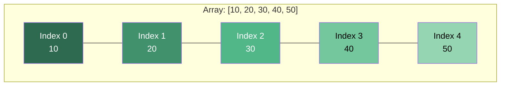

### Key Properties

| Property | Description |
|---|---|
| **Contiguous Memory** | All elements are stored next to each other in memory |
| **Fixed Type** (true arrays) | Every element is the same type and size |
| **Zero-Indexed** | First element is at index `0` |
| **Random Access** | Any element accessible in O(1) via its index |
| **Fixed Size** (static arrays) | Size is set at creation and cannot change |

---

## Memory Layout — How Arrays Work Under the Hood

This is what makes arrays fast. Every element is the same size and sits right next to the previous one.

```
Memory Address:   1000    1004    1008    1012    1016
                ┌───────┬───────┬───────┬───────┬───────┐
                │  10   │  20   │  30   │  40   │  50   │
                └───────┴───────┴───────┴───────┴───────┘
Index:             0       1       2       3       4

Element size = 4 bytes (int)
Base address = 1000

Address of arr[i] = 1000 + (i × 4)
  arr[0] → 1000 + 0 = 1000
  arr[3] → 1000 + 12 = 1012    ← Instant! No iteration needed.
```

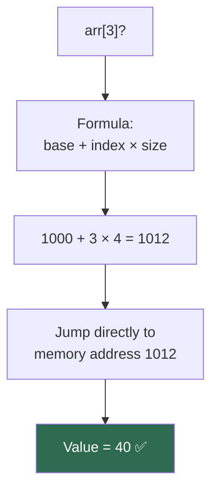

### Python List vs True Array — Memory Layout

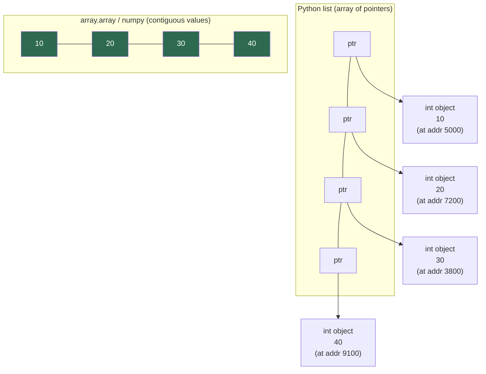

---

## Types of Arrays

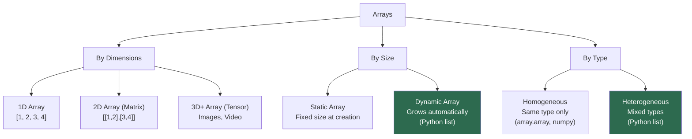

### Static vs Dynamic Arrays

| Feature | Static Array | Dynamic Array (Python list) |
|---|---|---|
| Size | Fixed at creation | Grows/shrinks automatically |
| Memory | Exact allocation | Over-allocates (~12.5% extra) |
| Append | Not supported | O(1) amortized |
| Memory waste | None | Some (over-allocation) |
| Use case | Embedded systems, C/C++ | General purpose scripting |

### How Dynamic Arrays Grow

When a Python list runs out of space, it allocates a **bigger array** (roughly 1.125x the current size), copies everything over, and frees the old one.

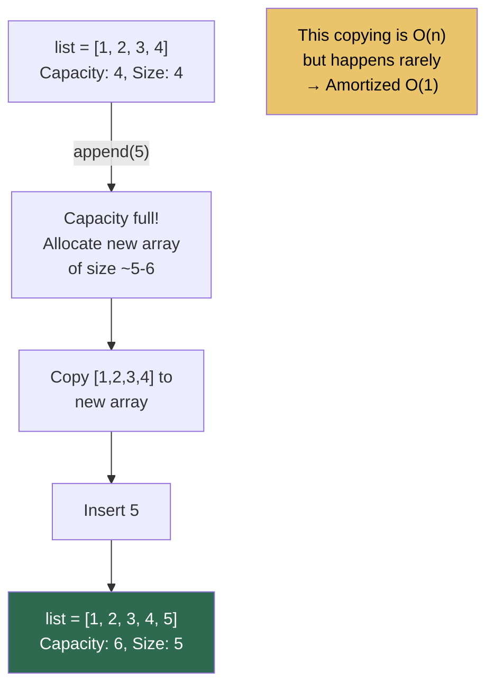

---

## Arrays in Python

Python offers **three ways** to work with arrays:

### 1. Python List (most common)

```python
lst = [1, 2, 3, 4, 5]
lst.append(6)         # O(1) amortized
lst[2]                # O(1) access → 3
lst.insert(0, 99)     # O(n) — shifts everything right
```

- Heterogeneous (can mix types: `[1, "hello", 3.14]`)
- Dynamic size
- Not a "true" array — stores pointers to objects

### 2. array.array (typed array)

```python
import array
arr = array.array('i', [1, 2, 3, 4, 5])  # 'i' = signed int
arr.append(6)
arr[2]                # → 3
```

| Type Code | C Type | Python Type | Size (bytes) |
|:-:|---|---|:-:|
| `'b'` | signed char | int | 1 |
| `'i'` | signed int | int | 4 |
| `'f'` | float | float | 4 |
| `'d'` | double | float | 8 |
| `'u'` | Unicode char | str | 2 |

- Homogeneous (single type only)
- More memory efficient than lists
- Same API as lists for most operations

### 3. NumPy ndarray (for numerical computing)

```python
import numpy as np
arr = np.array([1, 2, 3, 4, 5])
arr * 2               # → [2, 4, 6, 8, 10] — vectorized operation
arr.mean()            # → 3.0
arr.reshape(5, 1)     # → 2D column vector
```

- Fastest for math operations (C-level loops)
- Supports multi-dimensional arrays natively
- Broadcasting, slicing, and vectorized operations

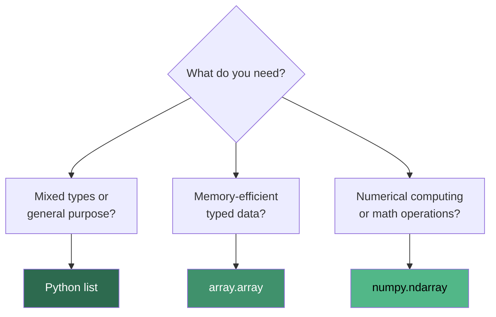

---

## Array Operations and Their Complexities

### Time Complexity

| Operation | Python List | array.array | numpy.ndarray |
|---|:-:|:-:|:-:|
| **Access by index** `arr[i]` | O(1) | O(1) | O(1) |
| **Update** `arr[i] = x` | O(1) | O(1) | O(1) |
| **Append** `arr.append(x)` | O(1)* | O(1)* | O(n)† |
| **Insert at index** `arr.insert(i, x)` | O(n) | O(n) | O(n) |
| **Delete by index** `del arr[i]` | O(n) | O(n) | O(n) |
| **Search (unsorted)** `x in arr` | O(n) | O(n) | O(n) |
| **Search (sorted)** binary search | O(log n) | O(log n) | O(log n) |
| **Pop last** `arr.pop()` | O(1) | O(1) | — |
| **Pop at index** `arr.pop(i)` | O(n) | O(n) | — |
| **Length** `len(arr)` | O(1) | O(1) | O(1) |
| **Slice** `arr[a:b]` | O(b-a) | O(b-a) | O(b-a) |
| **Sort** `arr.sort()` | O(n log n) | O(n log n) | O(n log n) |
| **Reverse** `arr.reverse()` | O(n) | O(n) | O(n) |

> \* Amortized O(1) — occasionally O(n) when resizing  
> † NumPy arrays are fixed-size; "appending" creates a new array

### Space Complexity

| Operation | Space |
|---|:-:|
| Access / Update | O(1) |
| Append | O(1) amortized |
| Insert / Delete | O(n) — shifts elements |
| Sort (Tim Sort) | O(n) |
| Slice | O(k) — creates copy of k elements |

### Why Insert and Delete are O(n)

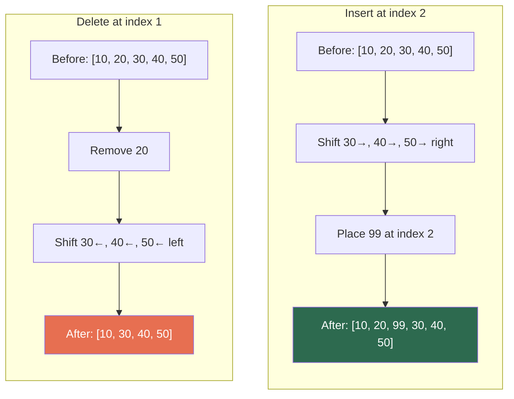

---

## 1D Array — Creation and Basic Operations

```python
import array

# ========== Creation ==========
arr = array.array('i', [1, 2, 3, 4, 5])

# ========== Access ==========
print(arr[0])           # 1  → O(1)
print(arr[-1])          # 5  → O(1) — Python supports negative indexing

# ========== Update ==========
arr[2] = 99             # [1, 2, 99, 4, 5] → O(1)

# ========== Insertion ==========
arr.insert(2, 10)       # [1, 2, 10, 99, 4, 5] → O(n)
arr.append(6)           # [1, 2, 10, 99, 4, 5, 6] → O(1) amortized

# ========== Deletion ==========
arr.remove(10)          # Removes first occurrence of 10 → O(n)
arr.pop()               # Removes last element → O(1)
arr.pop(2)              # Removes element at index 2 → O(n)

# ========== Search ==========
print(3 in arr)         # True/False → O(n)
print(arr.index(4))     # Returns index of first occurrence → O(n)

# ========== Traversal ==========
for element in arr:     # O(n)
    print(element)

# ========== Length ==========
print(len(arr))         # O(1)

# ========== Slicing ==========
sub = arr[1:4]          # Elements from index 1 to 3 → O(k)
```

### Traversal Patterns

```python
# Forward traversal
for i in range(len(arr)):
    print(arr[i])

# Reverse traversal
for i in range(len(arr) - 1, -1, -1):
    print(arr[i])

# Pythonic forward
for element in arr:
    print(element)

# With index
for i, element in enumerate(arr):
    print(f"Index {i}: {element}")
```

---

## 2D Array — Matrices

A 2D array is an array of arrays — used for matrices, grids, game boards, images.

```python
# Creating a 2D array (using lists)
matrix = [
    [1, 2, 3],
    [4, 5, 6],
    [7, 8, 9]
]

# Access element at row 1, col 2
print(matrix[1][2])     # 6 → O(1)

# Update
matrix[0][0] = 99       # O(1)
```

### Memory Layout of 2D Arrays

```
Logical View:              Memory (Row-major order):

  Col 0  Col 1  Col 2
┌──────┬──────┬──────┐     ┌───┬───┬───┬───┬───┬───┬───┬───┬───┐
│  1   │  2   │  3   │     │ 1 │ 2 │ 3 │ 4 │ 5 │ 6 │ 7 │ 8 │ 9 │
├──────┼──────┼──────┤     └───┴───┴───┴───┴───┴───┴───┴───┴───┘
│  4   │  5   │  6   │     Row 0      Row 1      Row 2
├──────┼──────┼──────┤
│  7   │  8   │  9   │     Address of matrix[r][c] = base + (r × cols + c) × size
└──────┴──────┴──────┘
```

### 2D Array Traversal

```python
rows = len(matrix)
cols = len(matrix[0])

# Row-major traversal (row by row)
for r in range(rows):
    for c in range(cols):
        print(matrix[r][c], end=" ")
    print()
# Output: 1 2 3 / 4 5 6 / 7 8 9

# Column-major traversal (column by column)
for c in range(cols):
    for r in range(rows):
        print(matrix[r][c], end=" ")
    print()
# Output: 1 4 7 / 2 5 8 / 3 6 9
```

### Common 2D Array Operations

```python
# Transpose
def transpose(matrix):
    rows, cols = len(matrix), len(matrix[0])
    return [[matrix[r][c] for r in range(rows)] for c in range(cols)]

# Rotate 90° clockwise
def rotate_90(matrix):
    return [list(row) for row in zip(*matrix[::-1])]

# Flatten 2D → 1D
def flatten(matrix):
    return [elem for row in matrix for elem in row]
```

### Creating 2D Arrays — Watch Out!

```python
# WRONG — all rows share the same list object
grid = [[0] * 3] * 3
grid[0][0] = 1
print(grid)    # [[1, 0, 0], [1, 0, 0], [1, 0, 0]] — ALL rows changed!

# RIGHT — each row is an independent list
grid = [[0] * 3 for _ in range(3)]
grid[0][0] = 1
print(grid)    # [[1, 0, 0], [0, 0, 0], [0, 0, 0]] — only row 0 changed ✅
```

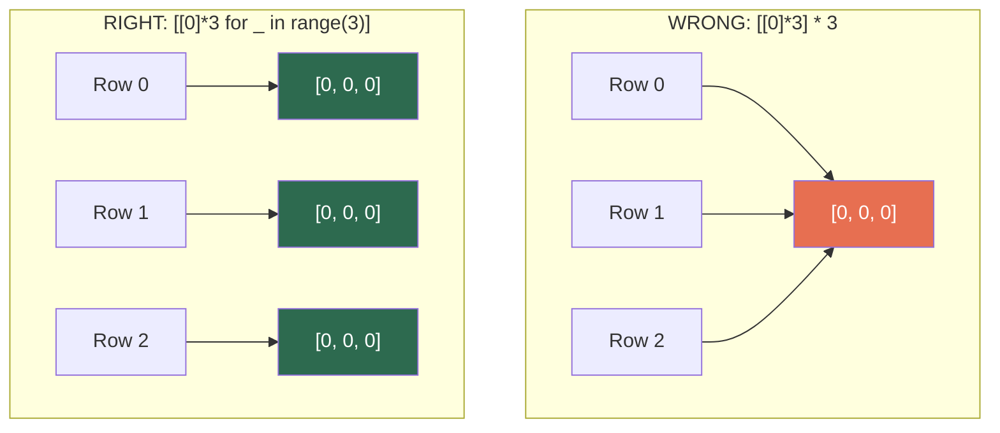

---

## Common Array Techniques

These patterns appear repeatedly in coding interviews.

### 1. Two Pointers

Use two indices moving toward each other or in the same direction.

```python
# Check if a list is a palindrome — O(n) time, O(1) space
def is_palindrome(arr):
    left, right = 0, len(arr) - 1
    while left < right:
        if arr[left] != arr[right]:
            return False
        left += 1
        right -= 1
    return True
```

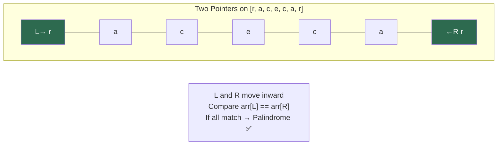

### 2. Sliding Window

Maintain a window of elements and slide it across the array.

```python
# Maximum sum of k consecutive elements — O(n) time, O(1) space
def max_sum_subarray(arr, k):
    window_sum = sum(arr[:k])
    max_sum = window_sum
    for i in range(k, len(arr)):
        window_sum += arr[i] - arr[i - k]  # slide: add right, remove left
        max_sum = max(max_sum, window_sum)
    return max_sum
```

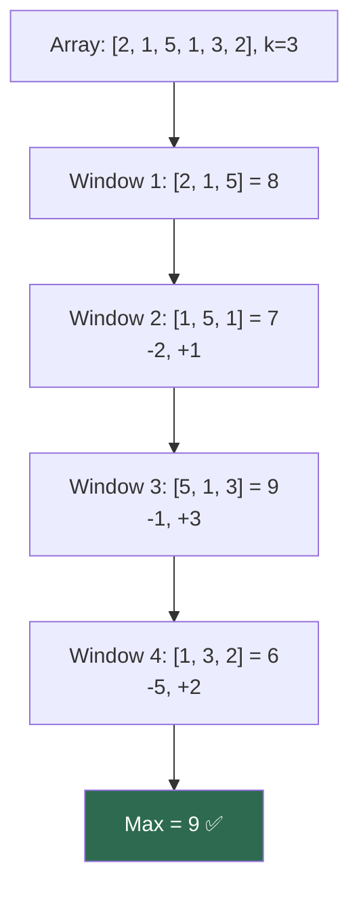

### 3. Prefix Sum

Precompute cumulative sums for O(1) range sum queries.

```python
# Build prefix sum array — O(n) time, O(n) space
def prefix_sum(arr):
    prefix = [0] * (len(arr) + 1)
    for i in range(len(arr)):
        prefix[i + 1] = prefix[i] + arr[i]
    return prefix

# Range sum query — O(1)
# sum(arr[l:r+1]) = prefix[r+1] - prefix[l]
```

```
Array:      [3, 1, 4, 1, 5]
Prefix Sum: [0, 3, 4, 8, 9, 14]

Sum of arr[1..3] = prefix[4] - prefix[1] = 9 - 3 = 6
Verify: 1 + 4 + 1 = 6 ✅
```

### 4. Hash Map for Counting / Lookup

```python
# Find two numbers that sum to target — O(n) time, O(n) space
def two_sum(arr, target):
    seen = {}
    for i, num in enumerate(arr):
        complement = target - num
        if complement in seen:
            return [seen[complement], i]
        seen[num] = i
```

### 5. Kadane's Algorithm (Maximum Subarray)

```python
# Maximum sum subarray — O(n) time, O(1) space
def max_subarray(arr):
    max_sum = curr_sum = arr[0]
    for num in arr[1:]:
        curr_sum = max(num, curr_sum + num)
        max_sum = max(max_sum, curr_sum)
    return max_sum
```

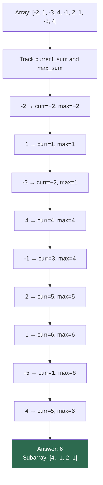

### Techniques Summary

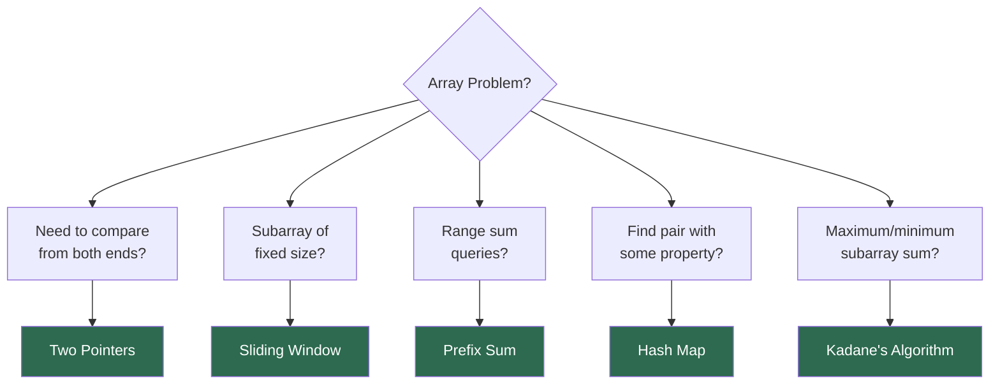

---

## When to Use and When to Avoid Arrays

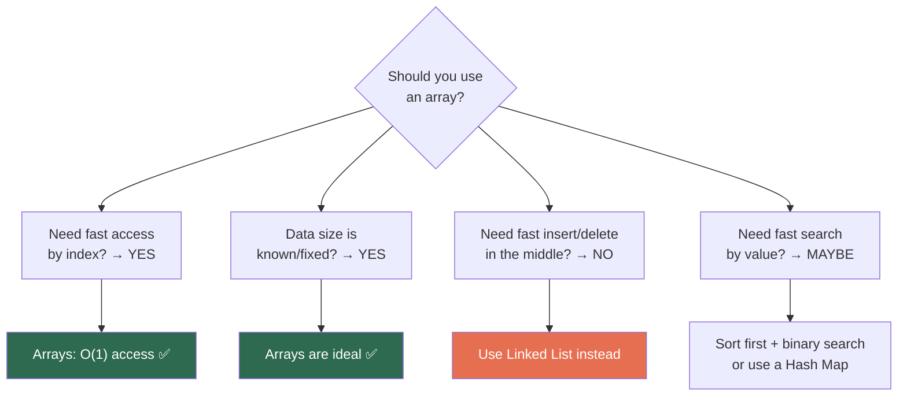

| Use Arrays When | Avoid Arrays When |
|---|---|
| You need O(1) access by position | You frequently insert/delete in the middle |
| Data size is known or mostly fixed | Size changes dramatically and unpredictably |
| You iterate sequentially often | You need fast key-value lookups (use dict) |
| Memory layout matters (cache performance) | You need fast membership tests (use set) |
| You need sorted data with binary search | Elements have complex relationships (use graph) |

---

## Array vs Other Data Structures

| Feature | Array | Linked List | Hash Map | Stack/Queue |
|---|:-:|:-:|:-:|:-:|
| Access by index | O(1) | O(n) | — | — |
| Search by value | O(n) | O(n) | O(1) | O(n) |
| Insert at beginning | O(n) | O(1) | — | O(1) |
| Insert at end | O(1)* | O(1)† | O(1) | O(1) |
| Insert at middle | O(n) | O(1)† | — | — |
| Delete | O(n) | O(1)† | O(1) | O(1) |
| Memory | Contiguous | Scattered | Hash table | Depends |
| Cache friendly | Yes | No | Moderate | Depends |

> \* Amortized for dynamic arrays  
> † O(1) only if you have a reference to the node

---

## Common Mistakes in Python

### 1. Modifying a List While Iterating

```python
# WRONG — skips elements, causes unexpected behavior
arr = [1, 2, 3, 4, 5]
for i in range(len(arr)):
    if arr[i] % 2 == 0:
        arr.pop(i)        # indices shift after pop!

# RIGHT — iterate over a copy, or build a new list
arr = [x for x in arr if x % 2 != 0]
```

### 2. Off-by-One Errors

```python
arr = [10, 20, 30, 40, 50]

# WRONG — IndexError
for i in range(len(arr) + 1):  # range goes 0..5, but arr[5] doesn't exist
    print(arr[i])

# RIGHT
for i in range(len(arr)):      # range goes 0..4
    print(arr[i])
```

### 3. Shallow Copy vs Deep Copy

```python
import copy

original = [[1, 2], [3, 4]]

shallow = original.copy()           # or original[:]
shallow[0][0] = 99
print(original)   # [[99, 2], [3, 4]] — inner lists are shared!

original = [[1, 2], [3, 4]]
deep = copy.deepcopy(original)
deep[0][0] = 99
print(original)   # [[1, 2], [3, 4]] — fully independent ✅
```

### 4. Using `==` vs `is` for Comparison

```python
a = [1, 2, 3]
b = [1, 2, 3]
c = a

print(a == b)   # True — same values
print(a is b)   # False — different objects in memory
print(a is c)   # True — same object
```

---

## Practice Problems

| # | Problem | Difficulty | Key Technique | Time | Space |
|:-:|---|:-:|---|:-:|:-:|
| 1 | Find the missing number (1 to n) | Easy | Math (sum formula) | O(n) | O(1) |
| 2 | Reverse an array in place | Easy | Two pointers | O(n) | O(1) |
| 3 | Find duplicates | Easy | Hash set | O(n) | O(n) |
| 4 | Two Sum | Easy | Hash map | O(n) | O(n) |
| 5 | Maximum subarray sum | Medium | Kadane's | O(n) | O(1) |
| 6 | Merge two sorted arrays | Medium | Two pointers | O(n+m) | O(n+m) |
| 7 | Rotate array by k positions | Medium | Reverse trick | O(n) | O(1) |
| 8 | Trapping rain water | Hard | Two pointers | O(n) | O(1) |
| 9 | Longest consecutive sequence | Medium | Hash set | O(n) | O(n) |
| 10 | Median of two sorted arrays | Hard | Binary search | O(log min(n,m)) | O(1) |

---

## Quick Reference Cheat Sheet

```
┌─────────────────────────────────────────────────────────────────┐
│                    ARRAYS CHEAT SHEET                            │
├─────────────────────────────────────────────────────────────────┤
│                                                                 │
│  CORE OPERATIONS:                                               │
│  Access       arr[i]              O(1)                          │
│  Update       arr[i] = x         O(1)                          │
│  Append       arr.append(x)      O(1) amortized               │
│  Insert       arr.insert(i, x)   O(n) — shifts elements       │
│  Delete       arr.pop(i)         O(n) — shifts elements        │
│  Search       x in arr           O(n) unsorted, O(log n) sorted│
│  Sort         arr.sort()         O(n log n)                    │
│                                                                 │
├─────────────────────────────────────────────────────────────────┤
│                                                                 │
│  PYTHON CHOICES:                                                │
│  list         → General purpose, mixed types                   │
│  array.array  → Typed, memory efficient                        │
│  numpy.ndarray→ Numerical computing, fastest math              │
│                                                                 │
├─────────────────────────────────────────────────────────────────┤
│                                                                 │
│  KEY TECHNIQUES:                                                │
│  Two Pointers     → Palindromes, pair problems                 │
│  Sliding Window   → Fixed/variable size subarray               │
│  Prefix Sum       → Range sum queries                          │
│  Hash Map         → Counting, lookups, two sum                 │
│  Kadane's         → Maximum subarray sum                       │
│                                                                 │
├─────────────────────────────────────────────────────────────────┤
│                                                                 │
│  GOTCHAS IN PYTHON:                                             │
│  • [[0]*n]*m creates shared rows — use list comprehension      │
│  • Don't mutate a list while iterating over it                 │
│  • Slicing creates copies (O(k) space)                         │
│  • list.copy() is shallow — use copy.deepcopy() for nested     │
│                                                                 │
└─────────────────────────────────────────────────────────────────┘
```

---

*Previous: [Space Complexity](../SpaceComplexity/README.md) | Next: [Lists](../Lists/README.md)*
