# Big O Notation

Big O notation describes **how the runtime or space usage of an algorithm grows** as the input size grows. It gives us a language to talk about algorithm efficiency in a way that is independent of hardware or language.

> "Big O is not about how fast the code runs in seconds — it's about how the number of operations scales with input size."

---

## Table of Contents

1. [Why Big O Matters](#why-big-o-matters)
2. [Time Complexity vs Space Complexity](#time-complexity-vs-space-complexity)
3. [Common Big O Complexities](#common-big-o-complexities)
4. [Complexity Comparison Chart](#complexity-comparison-chart)
5. [Detailed Breakdown of Each Complexity](#detailed-breakdown-of-each-complexity)
6. [Rules for Calculating Big O](#rules-for-calculating-big-o)
7. [Big O of Common Data Structure Operations](#big-o-of-common-data-structure-operations)
8. [Big O of Sorting Algorithms](#big-o-of-sorting-algorithms)
9. [How to Approach Big O in Interviews](#how-to-approach-big-o-in-interviews)
10. [Common Mistakes](#common-mistakes)
11. [Practice Problems](#practice-problems)

---

## Why Big O Matters

When you write code, you need to answer: *"Will this still work when the data gets really big?"*

| Input Size (n) | O(n) | O(n²) | O(2ⁿ) |
|:-:|:-:|:-:|:-:|
| 10 | 10 | 100 | 1,024 |
| 100 | 100 | 10,000 | 1.27 × 10³⁰ |
| 1,000 | 1,000 | 1,000,000 | Practically infinite |

A solution that works for `n = 10` can bring a server to its knees at `n = 1,000` if the complexity is poor.

---

## Time Complexity vs Space Complexity

| | Time Complexity | Space Complexity |
|---|---|---|
| **Measures** | Number of operations | Amount of memory used |
| **Question** | "How many steps does this take?" | "How much extra memory does this need?" |
| **Trade-off** | Often inversely related — faster algorithms may use more memory and vice versa |

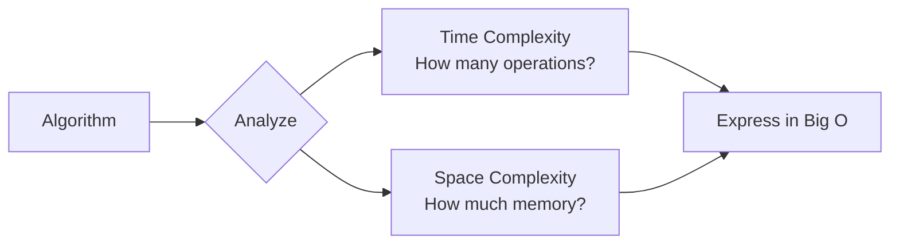

---

## Common Big O Complexities

Ranked from **best** (fastest) to **worst** (slowest):

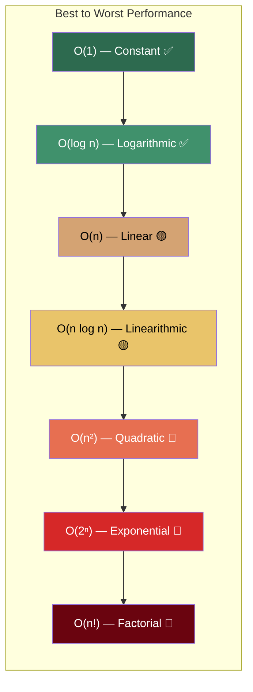

---

## Complexity Comparison Chart

This shows how operations grow as input size increases:

```
Operations
    ^
    |                                                    /  O(n!)
    |                                                 /
    |                                              /
    |                                           /     / O(2ⁿ)
    |                                        /     /
    |                                     /     /
    |                                  /     /
    |                               /     /        ___--- O(n²)
    |                            /     / ___---
    |                         /   ___---
    |                      / __---          __--- O(n log n)
    |                   _---        ___---
    |               __--     ___---
    |           __--   ___---            ___--- O(n)
    |       _---___---            ___---
    |    __----            ___---
    | _--          ___---
    |--     ___---
    |___---                      ______________ O(log n)
    |          ________________________________ O(1)
    +---------------------------------------------------> n (Input Size)
```

---

## Detailed Breakdown of Each Complexity

### O(1) — Constant Time

The number of operations stays the **same** regardless of input size.

```python
def get_first(lst):
    return lst[0]   # Always 1 operation, no matter the list size
```

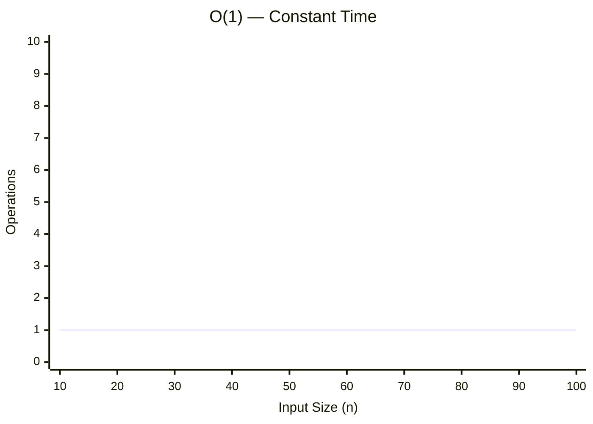

**Examples:**
- Accessing an array element by index
- Inserting/removing from the front/end of a linked list (with pointer)
- Hash table lookup (average case)
- Push / Pop on a stack

---

### O(log n) — Logarithmic Time

The problem size gets **halved** with each step. Very efficient.

```python
def binary_search(arr, target):
    low, high = 0, len(arr) - 1
    while low <= high:
        mid = (low + high) // 2
        if arr[mid] == target:
            return mid
        elif arr[mid] < target:
            low = mid + 1
        else:
            high = mid - 1
    return -1
```

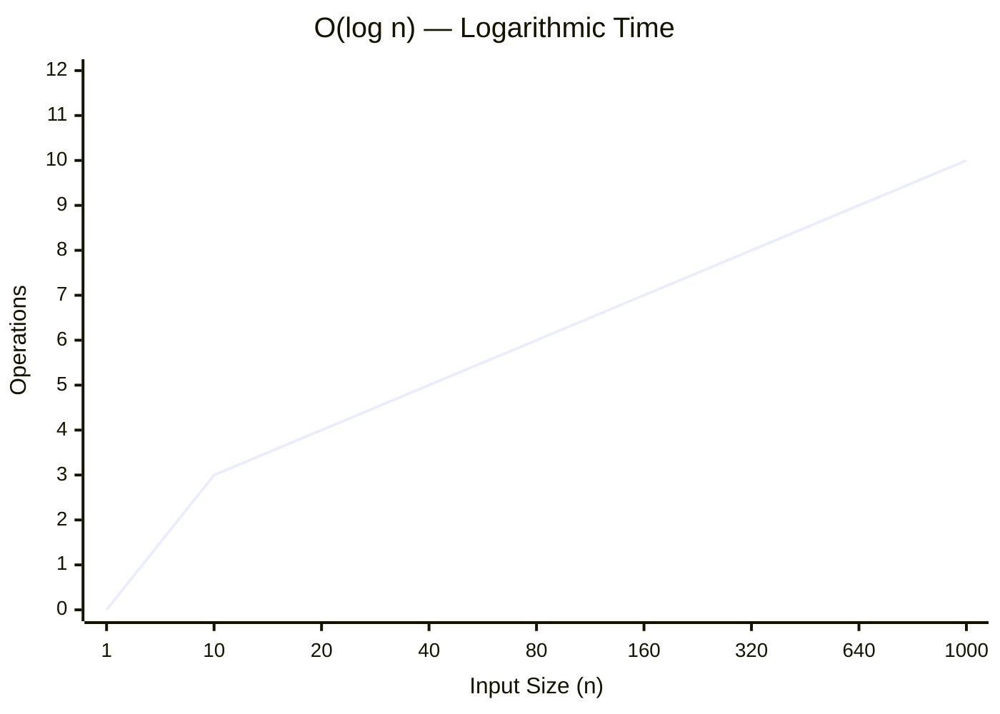

**Why it works:** If you have 1,000 elements, you need at most ~10 comparisons (since 2¹⁰ = 1024).

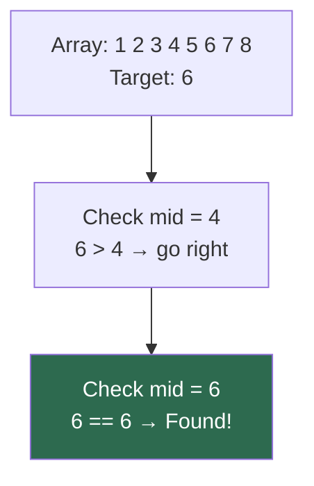

**Examples:**
- Binary search
- Balanced BST operations
- Certain divide-and-conquer algorithms

---

### O(n) — Linear Time

Operations grow **proportionally** with input size. You visit each element once.

```python
def find_max(lst):
    max_val = lst[0]
    for num in lst:
        if num > max_val:
            max_val = num
    return max_val
```

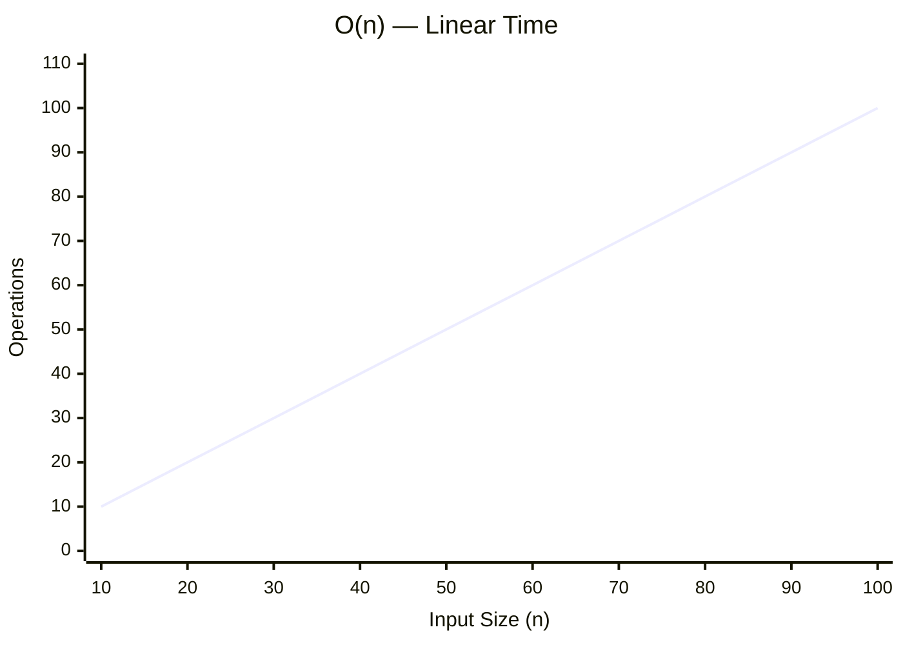

**Examples:**
- Looping through an array
- Linear search
- Counting elements
- Finding min/max in unsorted array

---

### O(n log n) — Linearithmic Time

Typical of efficient **sorting algorithms**. You do `log n` work for each of the `n` elements.

```python
def merge_sort(arr):
    if len(arr) <= 1:
        return arr
    mid = len(arr) // 2
    left = merge_sort(arr[:mid])
    right = merge_sort(arr[mid:])
    return merge(left, right)
```

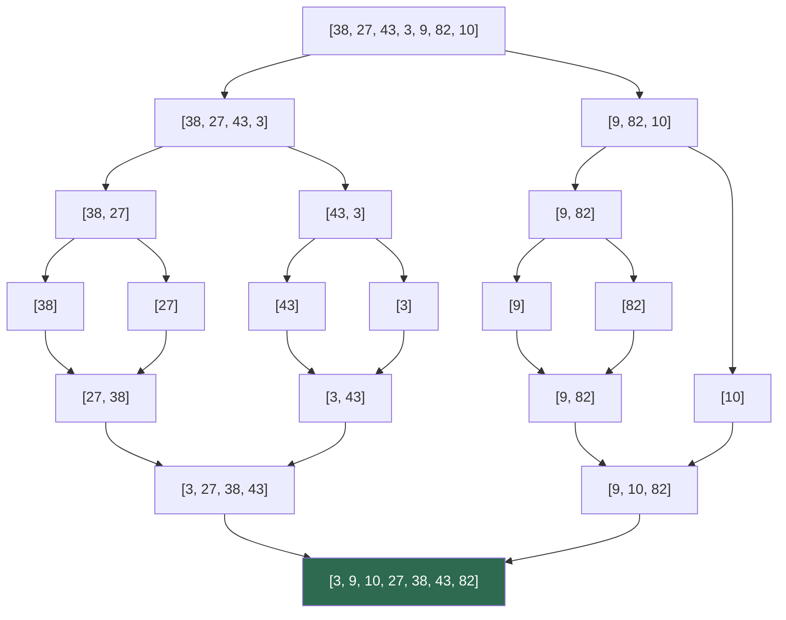

**Examples:**
- Merge sort
- Heap sort
- Tim sort (Python's built-in sort)

---

### O(n²) — Quadratic Time

Usually involves **nested loops** — for every element, you iterate through all elements again.

```python
def bubble_sort(arr):
    n = len(arr)
    for i in range(n):             # outer loop: n times
        for j in range(0, n-i-1):  # inner loop: n times
            if arr[j] > arr[j+1]:
                arr[j], arr[j+1] = arr[j+1], arr[j]
```

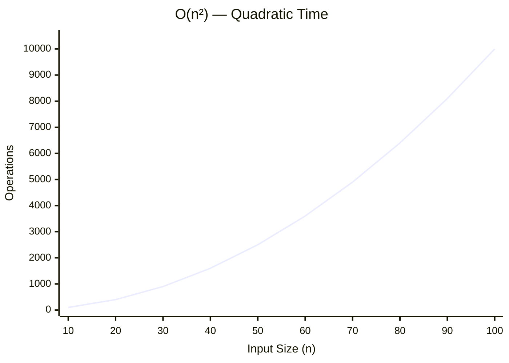

**Examples:**
- Bubble sort
- Selection sort
- Insertion sort
- Checking all pairs in an array

---

### O(2ⁿ) — Exponential Time

Every additional element **doubles** the work. Grows extremely fast.

```python
def fibonacci(n):
    if n <= 1:
        return n
    return fibonacci(n - 1) + fibonacci(n - 2)
```

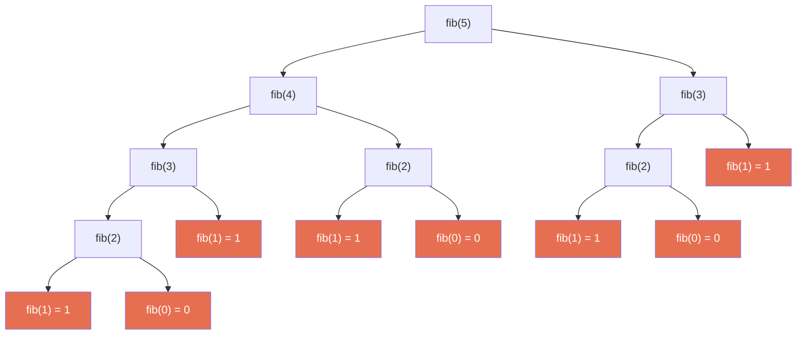

Notice how `fib(3)` and `fib(2)` are calculated multiple times — this is why dynamic programming exists.

**Examples:**
- Naive recursive Fibonacci
- Power set (all subsets)
- Recursive solution without memoization

---

### O(n!) — Factorial Time

The number of operations grows as `n × (n-1) × (n-2) × ... × 1`. Practically unusable for large inputs.

```python
def permutations(arr, l=0):
    if l == len(arr) - 1:
        print(arr)
        return
    for i in range(l, len(arr)):
        arr[l], arr[i] = arr[i], arr[l]
        permutations(arr, l + 1)
        arr[l], arr[i] = arr[i], arr[l]
```

| n | n! |
|:-:|:-:|
| 3 | 6 |
| 5 | 120 |
| 10 | 3,628,800 |
| 15 | 1,307,674,368,000 |

**Examples:**
- Generating all permutations
- Travelling salesman problem (brute force)

---

## Rules for Calculating Big O

### Rule 1: Drop Constants

```
O(2n)  →  O(n)
O(500) →  O(1)
O(13n²) → O(n²)
```

Constants don't matter at scale. Whether you loop once or twice, it's still linear growth.

### Rule 2: Drop Non-Dominant Terms

```
O(n + n²)      →  O(n²)
O(n + log n)   →  O(n)
O(n² + n³)     →  O(n³)
```

Keep only the term that grows the fastest.

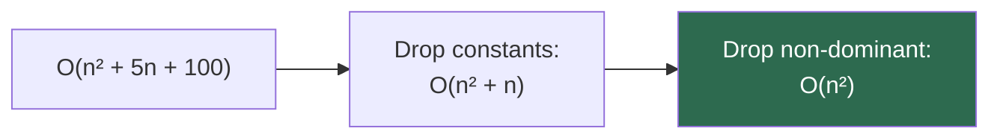

### Rule 3: Different Inputs → Different Variables

```python
def print_pairs(a, b):
    for x in a:       # O(a)
        print(x)
    for y in b:       # O(b)
        print(y)
# Total: O(a + b), NOT O(n)

def nested(a, b):
    for x in a:
        for y in b:
            print(x, y)
# Total: O(a × b), NOT O(n²)
```

### Rule 4: Loops

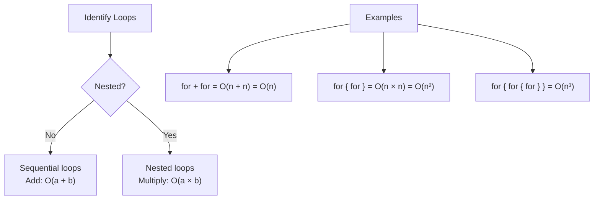

### Rule 5: Recursive Calls

For recursion, identify:
- **How many branches** per call (branching factor)
- **How deep** the recursion goes (depth)

Total operations ≈ **branches^depth**

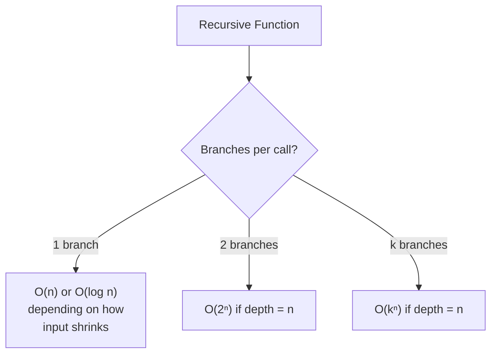

---

## Big O of Common Data Structure Operations

### Access, Search, Insert, Delete

| Data Structure | Access | Search | Insert | Delete |
|---|:-:|:-:|:-:|:-:|
| **Array** | O(1) | O(n) | O(n) | O(n) |
| **Sorted Array** | O(1) | O(log n) | O(n) | O(n) |
| **Linked List** | O(n) | O(n) | O(1)* | O(1)* |
| **Stack** | O(n) | O(n) | O(1) | O(1) |
| **Queue** | O(n) | O(n) | O(1) | O(1) |
| **Hash Table** | — | O(1) avg | O(1) avg | O(1) avg |
| **BST (balanced)** | O(log n) | O(log n) | O(log n) | O(log n) |
| **BST (unbalanced)** | O(n) | O(n) | O(n) | O(n) |
| **Heap** | — | O(n) | O(log n) | O(log n) |

> *Linked List insert/delete is O(1) **if you already have a reference** to the position. Finding that position is O(n).

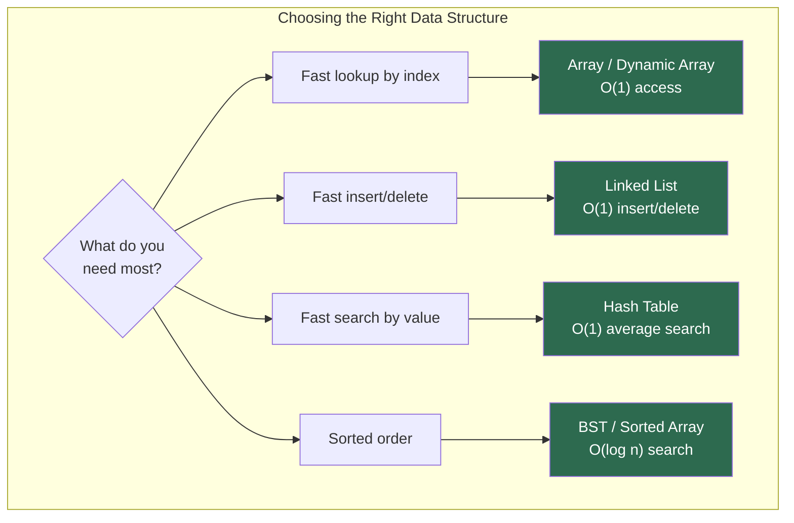

---

## Big O of Sorting Algorithms

| Algorithm | Best | Average | Worst | Space | Stable? |
|---|:-:|:-:|:-:|:-:|:-:|
| **Bubble Sort** | O(n) | O(n²) | O(n²) | O(1) | Yes |
| **Selection Sort** | O(n²) | O(n²) | O(n²) | O(1) | No |
| **Insertion Sort** | O(n) | O(n²) | O(n²) | O(1) | Yes |
| **Merge Sort** | O(n log n) | O(n log n) | O(n log n) | O(n) | Yes |
| **Quick Sort** | O(n log n) | O(n log n) | O(n²) | O(log n) | No |
| **Heap Sort** | O(n log n) | O(n log n) | O(n log n) | O(1) | No |
| **Tim Sort** | O(n) | O(n log n) | O(n log n) | O(n) | Yes |
| **Counting Sort** | O(n + k) | O(n + k) | O(n + k) | O(k) | Yes |
| **Radix Sort** | O(nk) | O(nk) | O(nk) | O(n + k) | Yes |

> **Stable** means equal elements keep their original relative order.

---

## How to Approach Big O in Interviews

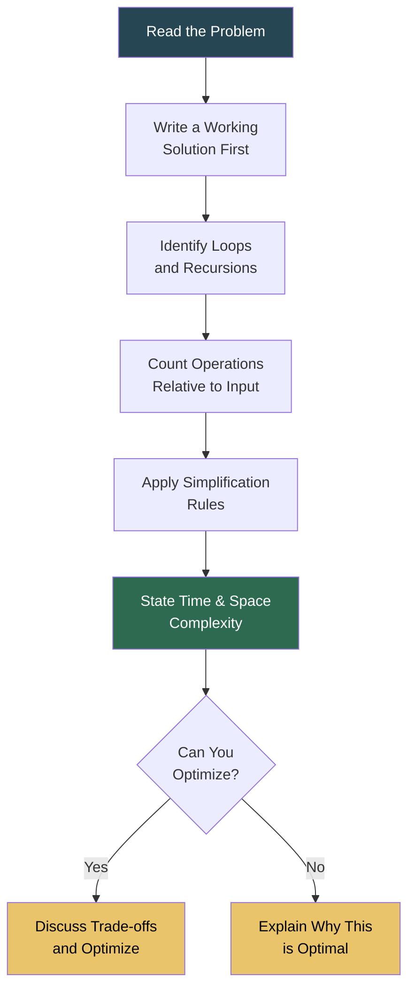

### Key Phrases for Interviews

| When you see... | Think... |
|---|---|
| Single loop through array | O(n) |
| Nested loop (same array) | O(n²) |
| Input halved each step | O(log n) |
| Sorting then iterating | O(n log n) |
| Two pointers | O(n) |
| Hash map for lookup | O(1) per lookup |
| Recursion with 2 branches | O(2ⁿ) |
| Recursion with memoization | Reduced to O(n) or O(n²) |

---

## Common Mistakes

### 1. Confusing Best/Average/Worst Case with Big O

Big O specifically describes the **worst case** upper bound. Don't mix it up:

| Notation | Meaning |
|---|---|
| **Big O (O)** | Upper bound (worst case) |
| **Big Omega (Ω)** | Lower bound (best case) |
| **Big Theta (Θ)** | Tight bound (average case) |

### 2. Ignoring Space Complexity

```python
# O(1) space — modifies in place
def reverse_in_place(arr):
    l, r = 0, len(arr) - 1
    while l < r:
        arr[l], arr[r] = arr[r], arr[l]
        l += 1
        r -= 1

# O(n) space — creates a new list
def reverse_copy(arr):
    return arr[::-1]
```

Both are O(n) time, but space usage differs.

### 3. Forgetting Hidden Loops

```python
# Looks like O(n), but string concatenation in Python creates
# a new string each time → O(n²)
def build_string(n):
    s = ""
    for i in range(n):
        s += str(i)    # Each += copies the entire string
    return s

# Fix: use join → O(n)
def build_string_fast(n):
    return "".join(str(i) for i in range(n))
```

---

## Practice Problems

Test your understanding:

| # | Problem | Answer |
|:-:|---|---|
| 1 | Accessing the 5th element in an array | O(1) |
| 2 | Looping through an array of size n | O(n) |
| 3 | Nested loop: outer n, inner n | O(n²) |
| 4 | Binary search on sorted array | O(log n) |
| 5 | Two sequential loops over n elements | O(n) |
| 6 | Three nested loops over n elements | O(n³) |
| 7 | Loop from 1 to n, then sort the result | O(n log n) |
| 8 | Hash map lookup | O(1) average |
| 9 | Recursive fibonacci without memoization | O(2ⁿ) |
| 10 | Merge sort | O(n log n) |

---

## Quick Reference Cheat Sheet

```
┌──────────────────────────────────────────────────────┐
│                BIG O CHEAT SHEET                     │
├──────────────────────────────────────────────────────┤
│                                                      │
│  EXCELLENT    O(1)        Constant                   │
│  GOOD         O(log n)    Logarithmic                │
│  FAIR         O(n)        Linear                     │
│  OKAY         O(n log n)  Linearithmic               │
│  BAD          O(n²)       Quadratic                  │
│  HORRIBLE     O(2ⁿ)       Exponential                │
│  CATASTROPHIC O(n!)       Factorial                  │
│                                                      │
├──────────────────────────────────────────────────────┤
│                                                      │
│  SIMPLIFICATION RULES:                               │
│  1. Drop constants:       O(2n) → O(n)              │
│  2. Drop non-dominant:    O(n + n²) → O(n²)         │
│  3. Different inputs:     Use different variables     │
│  4. Sequential loops:     Add  — O(a + b)            │
│  5. Nested loops:         Multiply — O(a × b)        │
│                                                      │
└──────────────────────────────────────────────────────┘
```

---

*Next up: [Space Complexity](../SpaceComplexity/README.md)*
