# Python Dictionaries

A Python dictionary is a **hash table** — an unordered (insertion-ordered since Python 3.7+) collection of **key-value pairs** that provides **O(1) average-case** lookups, inserts, and deletes.

> "If arrays are about *position* and lists are about *sequence*, dictionaries are about *meaning* — every value has a name."

---

## Table of Contents

1. [What is a Dictionary?](#what-is-a-dictionary)
2. [How Dictionaries Work Internally — Hash Tables](#how-dictionaries-work-internally--hash-tables)
3. [Creating Dictionaries](#creating-dictionaries)
4. [Accessing Values](#accessing-values)
5. [Adding and Updating](#adding-and-updating)
6. [Removing Elements](#removing-elements)
7. [Checking for Keys and Values](#checking-for-keys-and-values)
8. [Iterating Over Dictionaries](#iterating-over-dictionaries)
9. [Dictionary Comprehensions](#dictionary-comprehensions)
10. [Merging Dictionaries](#merging-dictionaries)
11. [Nested Dictionaries](#nested-dictionaries)
12. [defaultdict, Counter, and OrderedDict](#defaultdict-counter-and-ordereddict)
13. [All Dictionary Methods — Complete Reference](#all-dictionary-methods--complete-reference)
14. [Time and Space Complexity](#time-and-space-complexity)
15. [Hash Table — Deep Dive](#hash-table--deep-dive)
16. [Dictionary vs Other Data Structures](#dictionary-vs-other-data-structures)
17. [Common Patterns and Idioms](#common-patterns-and-idioms)
18. [Common Mistakes and Pitfalls](#common-mistakes-and-pitfalls)
19. [Practice Problems](#practice-problems)

---

## What is a Dictionary?

A dictionary maps **keys** to **values**. Think of it like a real-world dictionary: you look up a *word* (key) to find its *definition* (value).

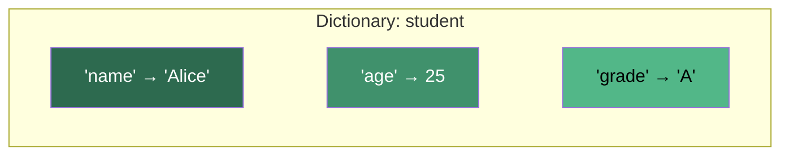

### Key Properties

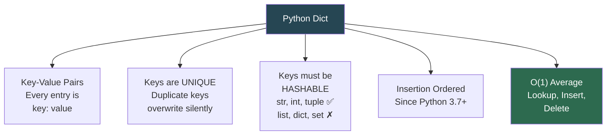

| Property | Description |
|---|---|
| **Key-Value pairs** | Data stored as `{key: value}` |
| **Keys are unique** | Setting a duplicate key overwrites the old value |
| **Keys must be hashable** | Immutable types only: `str`, `int`, `float`, `tuple`, `bool`, `frozenset` |
| **Values can be anything** | Any Python object — lists, dicts, functions, classes |
| **Insertion ordered** | Guarantees iteration order = insertion order (Python 3.7+) |
| **Mutable** | Can add, update, delete entries after creation |

---

## How Dictionaries Work Internally — Hash Tables

Understanding the internals helps you know *why* dicts are fast and *when* they can be slow.

### Step-by-Step: What Happens When You Do `d["name"] = "Alice"`

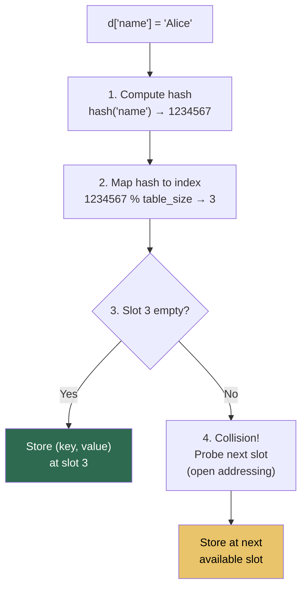

### Hash Table Structure

```
Hash Table (internal array):

 Index │ Hash         │ Key       │ Value
───────┼──────────────┼───────────┼──────────
   0   │ —            │ —         │ —
   1   │ 8478291031   │ 'age'     │ 25
   2   │ —            │ —         │ —
   3   │ 2314920177   │ 'name'    │ 'Alice'
   4   │ —            │ —         │ —
   5   │ 7712349801   │ 'grade'   │ 'A'
   6   │ —            │ —         │ —
   7   │ —            │ —         │ —

• Table is sparse (has empty slots) for fast lookups
• Load factor = entries / table_size → resizes when > 2/3
• CPython uses open addressing with perturbation probing
```

### Why O(1)?

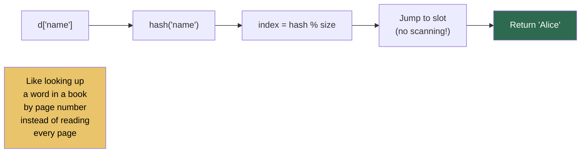

### What Makes a Good Hash?

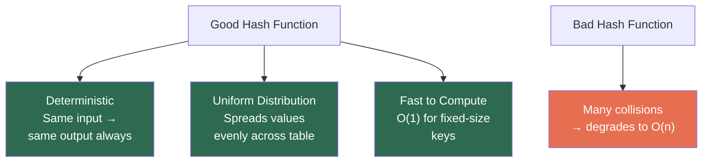

---

## Creating Dictionaries

```python
# ========== Literal syntax (most common) ==========
student = {"name": "Alice", "age": 25, "grade": "A"}

# ========== dict() constructor ==========
student = dict(name="Alice", age=25, grade="A")

# ========== From list of tuples ==========
pairs = [("name", "Alice"), ("age", 25)]
student = dict(pairs)

# ========== From two parallel lists (zip) ==========
keys   = ["name", "age", "grade"]
values = ["Alice", 25, "A"]
student = dict(zip(keys, values))

# ========== dict.fromkeys() — same value for all keys ==========
defaults = dict.fromkeys(["a", "b", "c"], 0)
# {'a': 0, 'b': 0, 'c': 0}

# ========== Dictionary comprehension ==========
squares = {x: x**2 for x in range(6)}
# {0: 0, 1: 1, 2: 4, 3: 9, 4: 16, 5: 25}

# ========== Empty dictionary ==========
empty = {}
empty = dict()
```

---

## Accessing Values

```python
student = {"name": "Alice", "age": 25, "grade": "A"}

# ========== Bracket notation — raises KeyError if missing ==========
student["name"]       # 'Alice'
student["phone"]      # KeyError: 'phone'

# ========== .get() — returns default if missing (safe) ==========
student.get("name")           # 'Alice'
student.get("phone")          # None
student.get("phone", "N/A")   # 'N/A'

# ========== Access all keys, values, or items ==========
student.keys()        # dict_keys(['name', 'age', 'grade'])
student.values()      # dict_values(['Alice', 25, 'A'])
student.items()       # dict_items([('name', 'Alice'), ('age', 25), ('grade', 'A')])
```

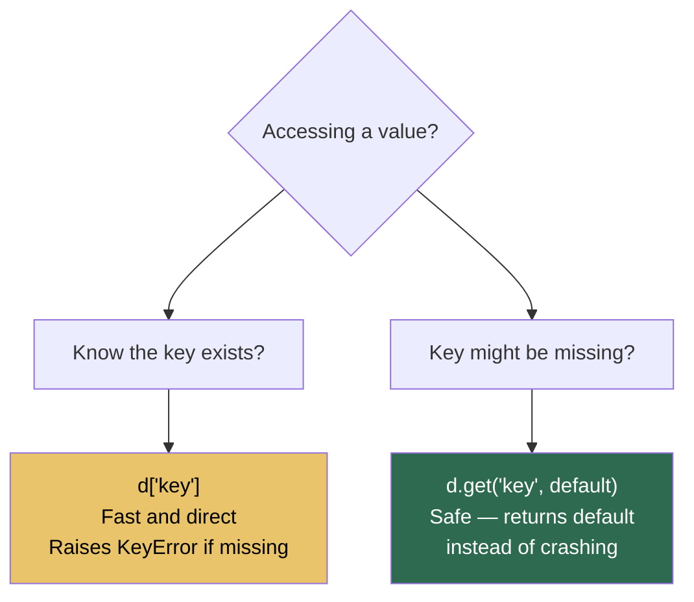

---

## Adding and Updating

```python
d = {"name": "Alice", "age": 25}

# ========== Add new key ==========
d["grade"] = "A"               # {'name': 'Alice', 'age': 25, 'grade': 'A'}

# ========== Update existing key ==========
d["age"] = 26                  # overwrites 25 → 26

# ========== update() — merge another dict or keyword args ==========
d.update({"city": "London", "age": 27})
d.update(phone="123-456")

# ========== setdefault() — set only if key doesn't exist ==========
d.setdefault("name", "Bob")    # 'Alice' — key exists, no change
d.setdefault("email", "a@b.c") # sets and returns 'a@b.c' — key was missing
```

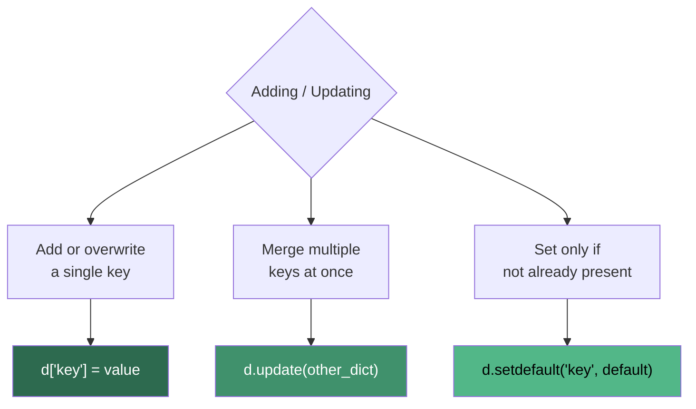

---

## Removing Elements

```python
d = {"name": "Alice", "age": 25, "grade": "A", "city": "London"}

# ========== pop(key) — removes and returns value ==========
age = d.pop("age")             # returns 25, d = {'name': 'Alice', ...}
val = d.pop("phone", "N/A")   # returns 'N/A' — safe, no KeyError

# ========== popitem() — removes LAST inserted pair ==========
last = d.popitem()             # returns ('city', 'London')

# ========== del — remove by key ==========
del d["grade"]                 # KeyError if key doesn't exist

# ========== clear() — remove all ==========
d.clear()                      # {}
```

| Method | Removes | Returns | If Missing |
|---|---|---|---|
| `pop(key)` | Specific key | The value | KeyError (or default) |
| `pop(key, default)` | Specific key | The value or default | Returns default |
| `popitem()` | Last inserted pair | `(key, value)` tuple | KeyError if empty |
| `del d[key]` | Specific key | Nothing | KeyError |
| `clear()` | Everything | Nothing | — |

---

## Checking for Keys and Values

```python
d = {"name": "Alice", "age": 25, "grade": "A"}

# ========== Check if KEY exists (O(1) average) ==========
"name" in d          # True
"phone" in d         # False
"phone" not in d     # True

# ========== Check if VALUE exists (O(n) — must scan all values) ==========
"Alice" in d.values()    # True
99 in d.values()         # False
```

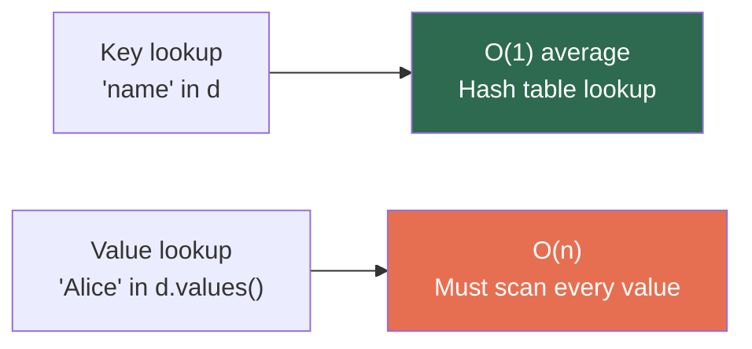

> **Key insight:** Checking for a *key* is O(1) because it uses the hash table. Checking for a *value* is O(n) because values are not hashed — you must scan all of them.

---

## Iterating Over Dictionaries

```python
d = {"name": "Alice", "age": 25, "grade": "A"}

# ========== Iterate over keys (default) ==========
for key in d:
    print(key)                 # name, age, grade

# ========== Iterate over values ==========
for value in d.values():
    print(value)               # Alice, 25, A

# ========== Iterate over key-value pairs ==========
for key, value in d.items():
    print(f"{key}: {value}")   # name: Alice, age: 25, grade: A

# ========== With enumerate ==========
for i, (key, value) in enumerate(d.items()):
    print(f"{i}. {key}: {value}")
```

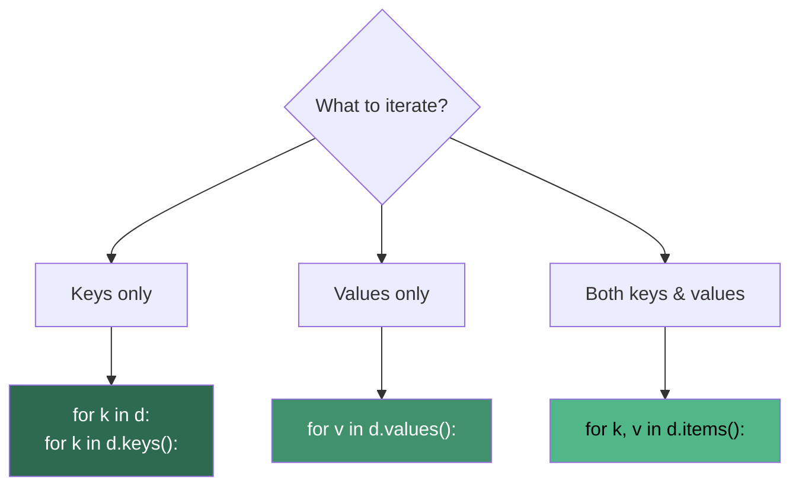

> Iteration order is guaranteed to be **insertion order** in Python 3.7+.

---

## Dictionary Comprehensions

Same concept as list comprehensions, but produces a dict.

```python
# ========== Basic — squares ==========
squares = {x: x**2 for x in range(6)}
# {0: 0, 1: 1, 2: 4, 3: 9, 4: 16, 5: 25}

# ========== With condition — even squares only ==========
even_sq = {x: x**2 for x in range(10) if x % 2 == 0}
# {0: 0, 2: 4, 4: 16, 6: 36, 8: 64}

# ========== Swap keys and values ==========
original = {"a": 1, "b": 2, "c": 3}
swapped = {v: k for k, v in original.items()}
# {1: 'a', 2: 'b', 3: 'c'}

# ========== From a list — character frequency ==========
word = "mississippi"
freq = {ch: word.count(ch) for ch in set(word)}
# {'m': 1, 'i': 4, 's': 4, 'p': 2}

# ========== Filter a dict ==========
scores = {"Alice": 85, "Bob": 62, "Charlie": 91, "Dave": 55}
passed = {name: score for name, score in scores.items() if score >= 70}
# {'Alice': 85, 'Charlie': 91}

# ========== Nested — transform values ==========
celsius = {"London": 15, "Paris": 20, "Tokyo": 25}
fahrenheit = {city: (temp * 9/5) + 32 for city, temp in celsius.items()}
# {'London': 59.0, 'Paris': 68.0, 'Tokyo': 77.0}
```

---

## Merging Dictionaries

```python
a = {"x": 1, "y": 2}
b = {"y": 3, "z": 4}

# ========== update() — modifies a in place ==========
a.update(b)          # a = {'x': 1, 'y': 3, 'z': 4}   (b's 'y' wins)

# ========== | operator (Python 3.9+) — creates new dict ==========
merged = a | b       # {'x': 1, 'y': 3, 'z': 4}

# ========== |= operator (Python 3.9+) — in place ==========
a |= b               # same as a.update(b)

# ========== ** unpacking — creates new dict ==========
merged = {**a, **b}  # {'x': 1, 'y': 3, 'z': 4}   (last one wins)
```

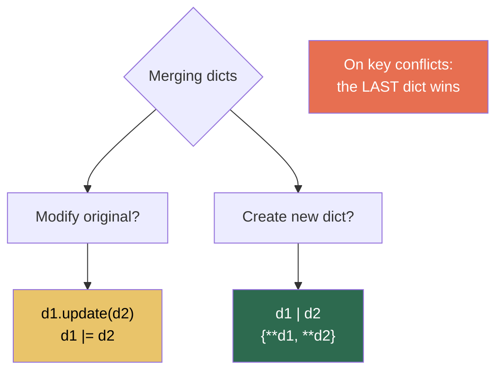

---

## Nested Dictionaries

```python
# A dictionary of dictionaries
school = {
    "Alice": {"age": 20, "grade": "A", "courses": ["Math", "CS"]},
    "Bob":   {"age": 22, "grade": "B", "courses": ["Physics", "CS"]},
}

# Access nested values
school["Alice"]["grade"]              # 'A'
school["Alice"]["courses"][1]         # 'CS'

# Add nested entry
school["Charlie"] = {"age": 21, "grade": "A+", "courses": ["Bio"]}

# Update nested value
school["Bob"]["grade"] = "A"

# Safe nested access
school.get("Dave", {}).get("grade", "N/A")   # 'N/A' — no KeyError
```

### Flattening a Nested Dict

```python
def flatten_dict(d, parent_key="", sep="."):
    items = []
    for k, v in d.items():
        new_key = f"{parent_key}{sep}{k}" if parent_key else k
        if isinstance(v, dict):
            items.extend(flatten_dict(v, new_key, sep).items())
        else:
            items.append((new_key, v))
    return dict(items)

nested = {"a": 1, "b": {"c": 2, "d": {"e": 3}}}
flatten_dict(nested)
# {'a': 1, 'b.c': 2, 'b.d.e': 3}
```

---

## defaultdict, Counter, and OrderedDict

### `defaultdict` — Auto-initialize missing keys

```python
from collections import defaultdict

# Without defaultdict — must check if key exists
freq = {}
for word in ["apple", "banana", "apple"]:
    if word not in freq:
        freq[word] = 0
    freq[word] += 1

# With defaultdict — automatic initialization
freq = defaultdict(int)           # default value: 0
for word in ["apple", "banana", "apple"]:
    freq[word] += 1               # no KeyError!
# defaultdict(<class 'int'>, {'apple': 2, 'banana': 1})

# Group items into lists
groups = defaultdict(list)
for name, dept in [("Alice", "Eng"), ("Bob", "Sales"), ("Charlie", "Eng")]:
    groups[dept].append(name)
# {'Eng': ['Alice', 'Charlie'], 'Sales': ['Bob']}
```

### `Counter` — Count things

```python
from collections import Counter

# Count occurrences
text = "mississippi"
c = Counter(text)
# Counter({'s': 4, 'i': 4, 'p': 2, 'm': 1})

c.most_common(2)          # [('s', 4), ('i', 4)]
c["s"]                    # 4
c["z"]                    # 0 — no KeyError!

# Count words
words = ["apple", "banana", "apple", "cherry", "banana", "apple"]
Counter(words)
# Counter({'apple': 3, 'banana': 2, 'cherry': 1})

# Arithmetic with counters
a = Counter("aabbc")
b = Counter("abccc")
a + b                     # Counter({'a': 3, 'b': 3, 'c': 4})
a - b                     # Counter({'a': 1, 'b': 1})
```

### `OrderedDict` — Order matters (mostly legacy)

```python
from collections import OrderedDict

# Since Python 3.7, regular dicts preserve insertion order.
# OrderedDict is still useful for:
# 1. Equality comparison considers order
# 2. move_to_end() method
# 3. LRU cache implementation

od = OrderedDict([("a", 1), ("b", 2), ("c", 3)])
od.move_to_end("a")       # moves 'a' to the end
od.move_to_end("c", last=False)  # moves 'c' to the beginning
```

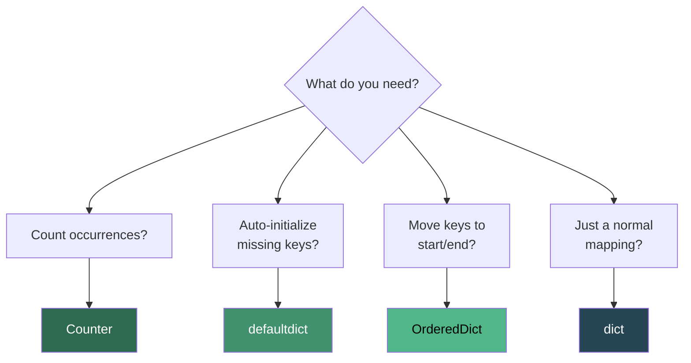

---

## All Dictionary Methods — Complete Reference

| Method | Description | Returns |
|---|---|---|
| `d[key]` | Get value by key | Value / KeyError |
| `d[key] = val` | Set or overwrite | — |
| `d.get(key, default)` | Safe get | Value or default |
| `d.setdefault(key, default)` | Get, or set + get if missing | Value |
| `d.keys()` | All keys | dict_keys view |
| `d.values()` | All values | dict_values view |
| `d.items()` | All (key, value) pairs | dict_items view |
| `d.update(other)` | Merge other into d | None |
| `d.pop(key, default)` | Remove and return value | Value or default |
| `d.popitem()` | Remove last inserted pair | (key, value) tuple |
| `del d[key]` | Remove by key | — / KeyError |
| `d.clear()` | Remove all entries | None |
| `d.copy()` | Shallow copy | New dict |
| `dict.fromkeys(keys, val)` | Create with same value | New dict |
| `key in d` | Check key exists | bool |
| `len(d)` | Number of entries | int |
| `d1 \| d2` | Merge (3.9+) | New dict |
| `d1 \|= d2` | Merge in place (3.9+) | None |

---

## Time and Space Complexity

### Time Complexity

| Operation | Average | Worst | Notes |
|---|:-:|:-:|---|
| `d[key]` (get) | **O(1)** | O(n) | Worst case: all keys collide |
| `d[key] = val` (set) | **O(1)** | O(n) | Includes amortized resize |
| `del d[key]` | **O(1)** | O(n) | |
| `key in d` | **O(1)** | O(n) | |
| `d.get(key)` | **O(1)** | O(n) | |
| `d.pop(key)` | **O(1)** | O(n) | |
| `d.values()` | O(1) | O(1) | Creates a view (lazy) |
| `d.keys()` | O(1) | O(1) | Creates a view (lazy) |
| `d.items()` | O(1) | O(1) | Creates a view (lazy) |
| `val in d.values()` | **O(n)** | O(n) | Must scan all values |
| `len(d)` | O(1) | O(1) | Stored as attribute |
| `for k in d` | O(n) | O(n) | Iterate all entries |
| `d.update(other)` | O(len(other)) | O(n) | |
| `d.copy()` | O(n) | O(n) | Shallow copy |
| `d.clear()` | O(n) | O(n) | |

### Why O(n) Worst Case?

When many keys hash to the same index (collision), the hash table degrades. In practice this is **extremely rare** with Python's hash function.

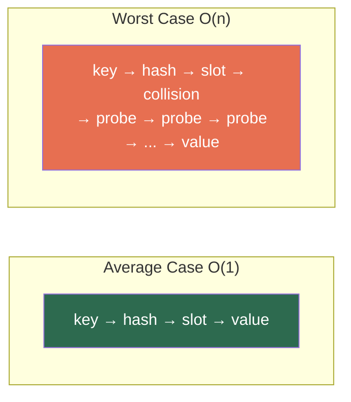

### Space Complexity

| Aspect | Space |
|---|---|
| Dict with n entries | O(n) |
| Each entry overhead | ~72 bytes (key + value + hash) |
| Hash table fill | Resizes at 2/3 full → always ~33% empty slots |
| Total memory for n items | ~232 + 72n bytes (CPython estimate) |

> Python dicts use more memory than lists because each entry stores the key, value, *and* hash. Trade-off: space for speed.

---

## Hash Table — Deep Dive

### Hash Collisions and Resolution

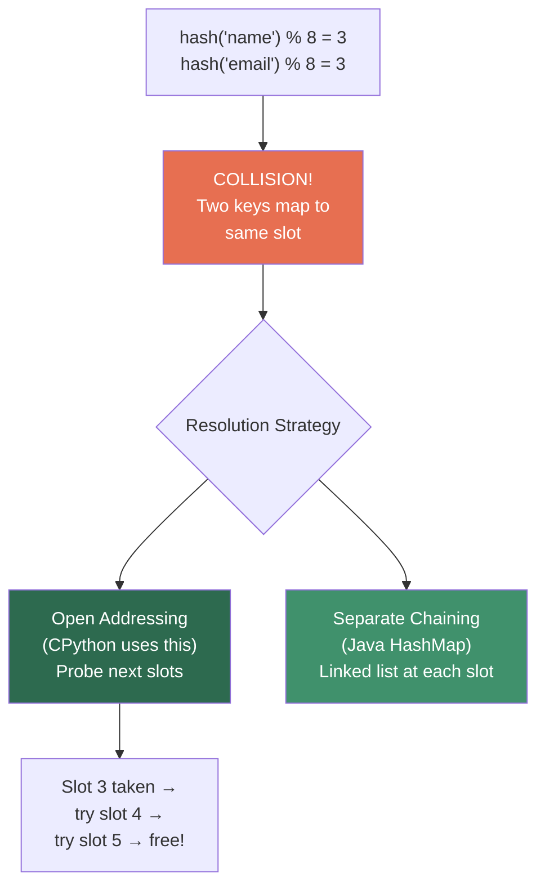

### Resizing

When the hash table is more than 2/3 full, Python **doubles** the table size and rehashes all entries.

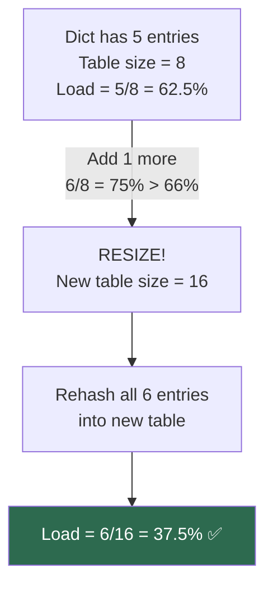

### What Can Be a Key? (Hashability)

```python
# HASHABLE — can be keys ✅
hash(42)                  # int
hash("hello")             # str
hash((1, 2, 3))           # tuple (if contents are hashable)
hash(True)                # bool
hash(frozenset({1, 2}))   # frozenset

# NOT HASHABLE — cannot be keys ✗
hash([1, 2, 3])           # TypeError: unhashable type: 'list'
hash({1, 2, 3})           # TypeError: unhashable type: 'set'
hash({"a": 1})            # TypeError: unhashable type: 'dict'
```

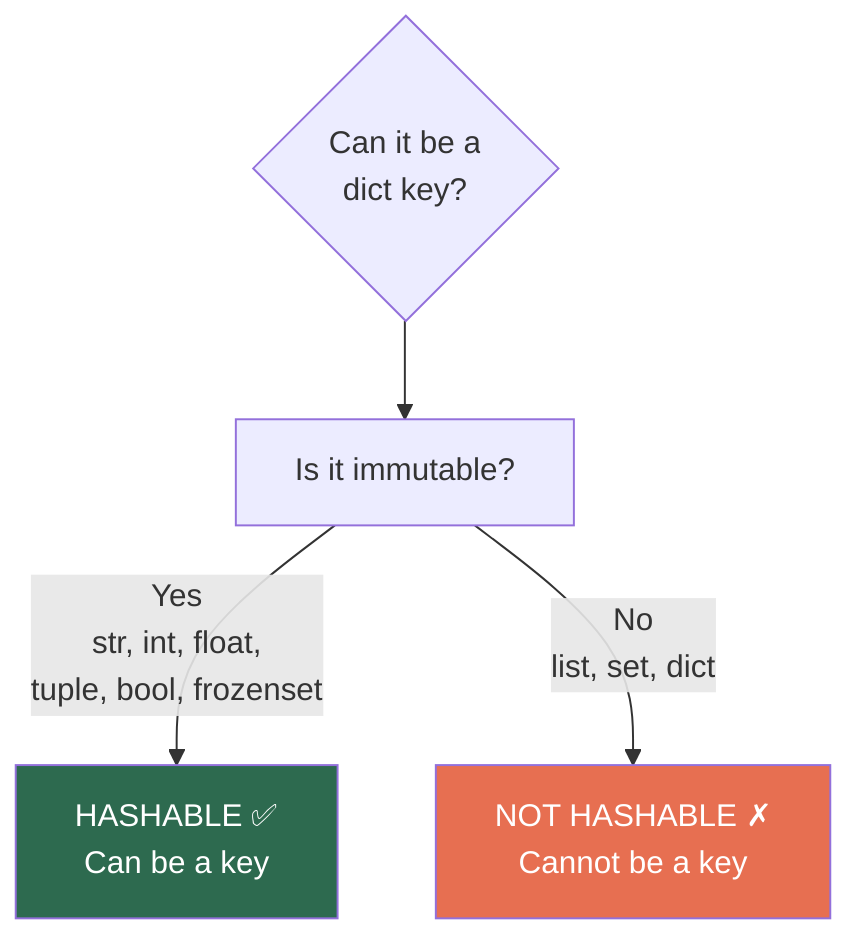

---

## Dictionary vs Other Data Structures

| Feature | dict | list | set | tuple |
|---|:-:|:-:|:-:|:-:|
| Lookup by key/index | O(1) | O(1) by index | — | O(1) by index |
| Search by value | O(n) | O(n) | O(1) | O(n) |
| Insert | O(1) | O(1) append / O(n) insert | O(1) | Immutable |
| Delete | O(1) | O(n) | O(1) | Immutable |
| Ordered | Yes (3.7+) | Yes | No | Yes |
| Mutable | Yes | Yes | Yes | No |
| Duplicates | Keys: No / Values: Yes | Yes | No | Yes |
| Memory | High | Medium | Medium | Low |

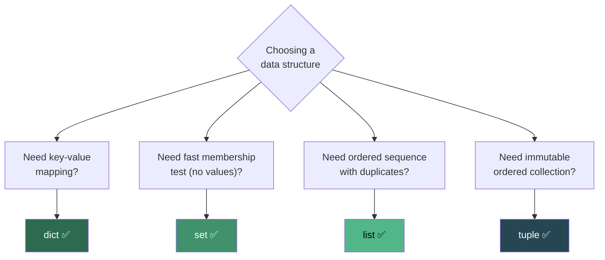

---

## Common Patterns and Idioms

### 1. Counting / Frequency Map

```python
from collections import Counter

# One-liner frequency count
freq = Counter([1, 2, 2, 3, 3, 3])
# Counter({3: 3, 2: 2, 1: 1})

# Manual approach
freq = {}
for item in [1, 2, 2, 3, 3, 3]:
    freq[item] = freq.get(item, 0) + 1
```

### 2. Grouping by a Property

```python
from collections import defaultdict

words = ["eat", "tea", "tan", "ate", "nat", "bat"]
anagrams = defaultdict(list)
for word in words:
    key = "".join(sorted(word))
    anagrams[key].append(word)
# {'aet': ['eat', 'tea', 'ate'], 'ant': ['tan', 'nat'], 'abt': ['bat']}
```

### 3. Inverting a Dictionary

```python
original = {"a": 1, "b": 2, "c": 3}
inverted = {v: k for k, v in original.items()}
# {1: 'a', 2: 'b', 3: 'c'}

# If values aren't unique, collect keys into lists
original = {"a": 1, "b": 2, "c": 1}
inverted = defaultdict(list)
for k, v in original.items():
    inverted[v].append(k)
# {1: ['a', 'c'], 2: ['b']}
```

### 4. Two Sum with a Dict

```python
def two_sum(nums, target):
    seen = {}
    for i, num in enumerate(nums):
        complement = target - num
        if complement in seen:
            return [seen[complement], i]
        seen[num] = i
# O(n) time, O(n) space
```

### 5. Caching / Memoization

```python
def fib(n, memo={}):
    if n in memo:
        return memo[n]
    if n <= 1:
        return n
    memo[n] = fib(n-1, memo) + fib(n-2, memo)
    return memo[n]

# Or use functools
from functools import lru_cache

@lru_cache(maxsize=None)
def fib(n):
    if n <= 1:
        return n
    return fib(n-1) + fib(n-2)
```

### 6. Building an Adjacency List (Graphs)

```python
from collections import defaultdict

edges = [(0, 1), (0, 2), (1, 2), (2, 3)]
graph = defaultdict(list)
for u, v in edges:
    graph[u].append(v)
    graph[v].append(u)    # undirected
# {0: [1, 2], 1: [0, 2], 2: [0, 1, 3], 3: [2]}
```

### 7. Sorting a Dict by Value

```python
scores = {"Alice": 85, "Bob": 92, "Charlie": 78}

# Sort by value (ascending)
sorted_asc = dict(sorted(scores.items(), key=lambda x: x[1]))
# {'Charlie': 78, 'Alice': 85, 'Bob': 92}

# Sort by value (descending)
sorted_desc = dict(sorted(scores.items(), key=lambda x: x[1], reverse=True))
# {'Bob': 92, 'Alice': 85, 'Charlie': 78}

# Sort by key
sorted_key = dict(sorted(scores.items()))
# {'Alice': 85, 'Bob': 92, 'Charlie': 78}
```

---

## Common Mistakes and Pitfalls

### 1. Modifying a Dict While Iterating

```python
# WRONG — RuntimeError: dictionary changed size during iteration
d = {"a": 1, "b": 2, "c": 3}
for key in d:
    if d[key] < 3:
        del d[key]

# RIGHT — iterate over a copy of keys
for key in list(d.keys()):
    if d[key] < 3:
        del d[key]

# RIGHT — dict comprehension
d = {k: v for k, v in d.items() if v >= 3}
```

### 2. Using Mutable Default with `fromkeys()`

```python
# WRONG — all keys share the same list!
d = dict.fromkeys(["a", "b", "c"], [])
d["a"].append(1)
print(d)    # {'a': [1], 'b': [1], 'c': [1]} — all share the same list!

# RIGHT — use a comprehension
d = {k: [] for k in ["a", "b", "c"]}
d["a"].append(1)
print(d)    # {'a': [1], 'b': [], 'c': []} ✅
```

### 3. KeyError When Accessing Missing Keys

```python
d = {"name": "Alice"}

# WRONG — crashes on missing key
print(d["age"])           # KeyError: 'age'

# RIGHT — safe approaches
print(d.get("age", 0))   # 0
if "age" in d:
    print(d["age"])
```

### 4. Assuming Dict Is Ordered in Python < 3.7

```python
# In Python 3.6 and below, dict order is NOT guaranteed.
# Use OrderedDict if you need order in older Python versions.
```

### 5. Using Unhashable Types as Keys

```python
# WRONG
d = {[1, 2]: "list key"}      # TypeError: unhashable type: 'list'

# RIGHT — convert to tuple
d = {(1, 2): "tuple key"}     # ✅
```

---

## Practice Problems

| # | Problem | Difficulty | Key Concept | Time | Space |
|:-:|---|:-:|---|:-:|:-:|
| 1 | Count character frequency in a string | Easy | Counter / dict | O(n) | O(k) |
| 2 | Two Sum | Easy | Hash map lookup | O(n) | O(n) |
| 3 | Check if two strings are anagrams | Easy | Counter comparison | O(n) | O(1)* |
| 4 | Group anagrams | Medium | Dict with sorted key | O(n·k log k) | O(n·k) |
| 5 | Find first non-repeating character | Easy | OrderedDict / Counter | O(n) | O(1)* |
| 6 | Longest substring without repeating chars | Medium | Sliding window + dict | O(n) | O(min(n,26)) |
| 7 | Subarray sum equals k | Medium | Prefix sum + dict | O(n) | O(n) |
| 8 | LRU Cache | Medium | OrderedDict / dict + DLL | O(1) | O(capacity) |
| 9 | Word frequency in a document | Easy | Counter | O(n) | O(k) |
| 10 | Top K frequent elements | Medium | Counter + heap | O(n log k) | O(n) |

> \* O(1) when the alphabet is fixed (e.g., 26 lowercase letters)

---

## Quick Reference Cheat Sheet

```
┌──────────────────────────────────────────────────────────────────┐
│                 PYTHON DICTIONARIES CHEAT SHEET                  │
├──────────────────────────────────────────────────────────────────┤
│                                                                  │
│  CREATION:                                                       │
│    {}  dict()  dict(zip(keys, vals))  {k:v for k,v in ...}     │
│                                                                  │
│  O(1) AVERAGE:                                                   │
│    d[k]  d[k]=v  del d[k]  k in d  d.get(k)  d.pop(k)        │
│                                                                  │
│  O(n):                                                           │
│    val in d.values()  for k in d  d.copy()  d.clear()          │
│                                                                  │
│  SAFE ACCESS:                                                    │
│    d.get(k, default)  d.setdefault(k, default)                 │
│                                                                  │
│  VIEWS:                                                          │
│    d.keys()  d.values()  d.items()                              │
│                                                                  │
├──────────────────────────────────────────────────────────────────┤
│                                                                  │
│  COLLECTIONS MODULE:                                             │
│    Counter(iterable)     → count occurrences                    │
│    defaultdict(factory)  → auto-initialize missing keys         │
│    OrderedDict           → move_to_end(), order-aware ==        │
│                                                                  │
├──────────────────────────────────────────────────────────────────┤
│                                                                  │
│  MERGE (3.9+):                                                   │
│    d1 | d2    → new dict (last wins)                            │
│    d1 |= d2   → update d1 in place                             │
│    {**d1, **d2}→ new dict (works in 3.5+)                      │
│                                                                  │
├──────────────────────────────────────────────────────────────────┤
│                                                                  │
│  KEYS MUST BE HASHABLE:                                          │
│    ✅ str, int, float, tuple, bool, frozenset                   │
│    ✗  list, set, dict                                           │
│                                                                  │
├──────────────────────────────────────────────────────────────────┤
│                                                                  │
│  AVOID:                                                          │
│    • d[key] on missing key — use d.get()                        │
│    • Modifying dict while iterating — use list(d.keys())        │
│    • dict.fromkeys(keys, []) — shared mutable default           │
│    • Unhashable keys (lists, sets)                              │
│                                                                  │
└──────────────────────────────────────────────────────────────────┘
```

---

*Previous: [Lists](../Lists/README.md) | Next: [Tuples](../Tuples/README.md)*
