# Singly Linked List

A singly linked list is the simplest form of a linked list — each node holds **data** and a **pointer to the next node**. Traversal is one-directional: head to tail. The last node's pointer is `None`, signaling the end.

> "A singly linked list is like a one-way street — you can only move forward, and if you miss your turn, you have to start over."

---

## Table of Contents

1. [Anatomy of a Singly Linked List](#anatomy-of-a-singly-linked-list)
2. [Node Class](#node-class)
3. [Head, Tail, and Length](#head-tail-and-length)
4. [Operations — Visual Walkthrough](#operations--visual-walkthrough)
5. [Full Implementation in Python](#full-implementation-in-python)
6. [Traversal Patterns](#traversal-patterns)
7. [Reversing a Singly Linked List](#reversing-a-singly-linked-list)
8. [Time and Space Complexity](#time-and-space-complexity)
9. [Singly Linked List as a Stack](#singly-linked-list-as-a-stack)
10. [Singly Linked List as a Queue](#singly-linked-list-as-a-queue)
11. [Essential Interview Techniques](#essential-interview-techniques)
12. [Edge Cases to Always Handle](#edge-cases-to-always-handle)
13. [Common Mistakes](#common-mistakes)
14. [Practice Problems](#practice-problems)
15. [Quick Reference Cheat Sheet](#quick-reference-cheat-sheet)

---

## Anatomy of a Singly Linked List

```
HEAD                                                    TAIL
 │                                                       │
 ▼                                                       ▼
┌──────────────┐     ┌──────────────┐     ┌──────────────┐
│ value: 10    │     │ value: 20    │     │ value: 30    │
│ next:  ──────┼────►│ next:  ──────┼────►│ next: None   │
└──────────────┘     └──────────────┘     └──────────────┘
     Node 0               Node 1               Node 2
```

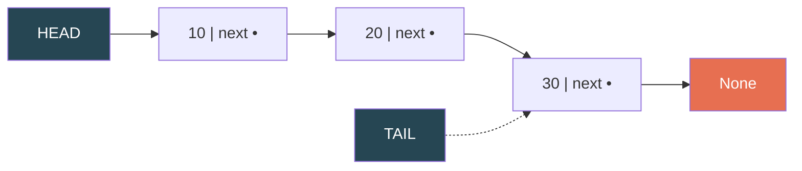

| Component | Purpose |
|---|---|
| **Node** | Container holding `value` + `next` pointer |
| **Head** | Pointer to the first node — entry point for all operations |
| **Tail** | Pointer to the last node — makes append O(1) |
| **Length** | Count of nodes — makes `len()` O(1) instead of O(n) |
| **None** | Signals the end of the list |

---

## Node Class

The building block. Each node knows only two things: its own value and where the next node is.

```python
class Node:
    def __init__(self, value):
        self.value = value
        self.next = None

    def __repr__(self):
        return f"Node({self.value})"
```

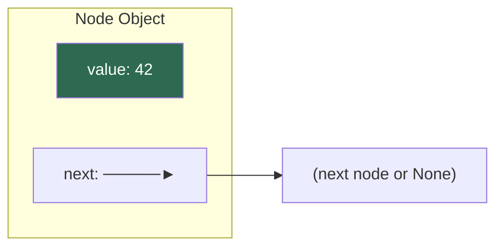

---

## Head, Tail, and Length

Maintaining a `tail` pointer and `length` counter is optional but turns several O(n) operations into O(1).

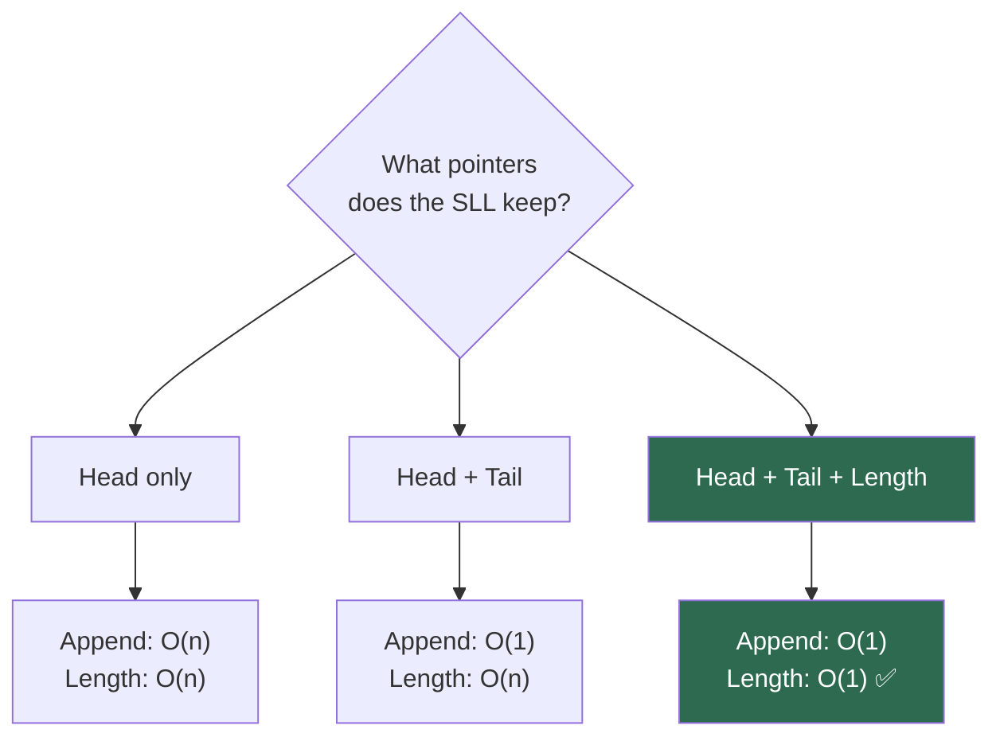

| Variant | Append | Prepend | Length | Pop Last |
|---|:-:|:-:|:-:|:-:|
| Head only | O(n) | O(1) | O(n) | O(n) |
| Head + Tail | O(1) | O(1) | O(n) | O(n) |
| Head + Tail + Length | O(1) | O(1) | O(1) | O(n)* |

> \* Pop last is always O(n) for singly linked lists — even with a tail pointer you still need the node *before* the tail to update pointers.

---

## Operations — Visual Walkthrough

### Prepend (Insert at Head) — O(1)

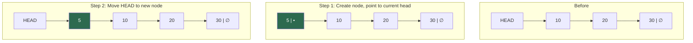

```python
def prepend(self, value):
    new_node = Node(value)
    new_node.next = self.head    # 1. point new → old head
    self.head = new_node         # 2. move head to new
    if self.length == 0:
        self.tail = new_node     # 3. if empty, tail = new too
    self.length += 1
```

---

### Append (Insert at Tail) — O(1) with tail pointer

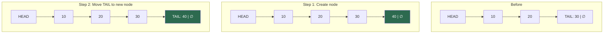

```python
def append(self, value):
    new_node = Node(value)
    if not self.head:            # empty list
        self.head = new_node
        self.tail = new_node
    else:
        self.tail.next = new_node  # 1. old tail → new node
        self.tail = new_node       # 2. move tail to new
    self.length += 1
```

---

### Insert at Index — O(n)

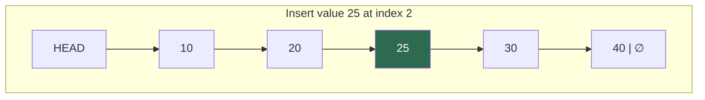

**Why O(n)?** You must traverse to the node at `index - 1` first.

```python
def insert(self, index, value):
    if index == 0:
        return self.prepend(value)
    if index == self.length:
        return self.append(value)

    new_node = Node(value)
    prev = self._get_node(index - 1)    # O(n) traversal
    new_node.next = prev.next            # new → prev's next
    prev.next = new_node                 # prev → new
    self.length += 1
```

**Pointer order matters:**

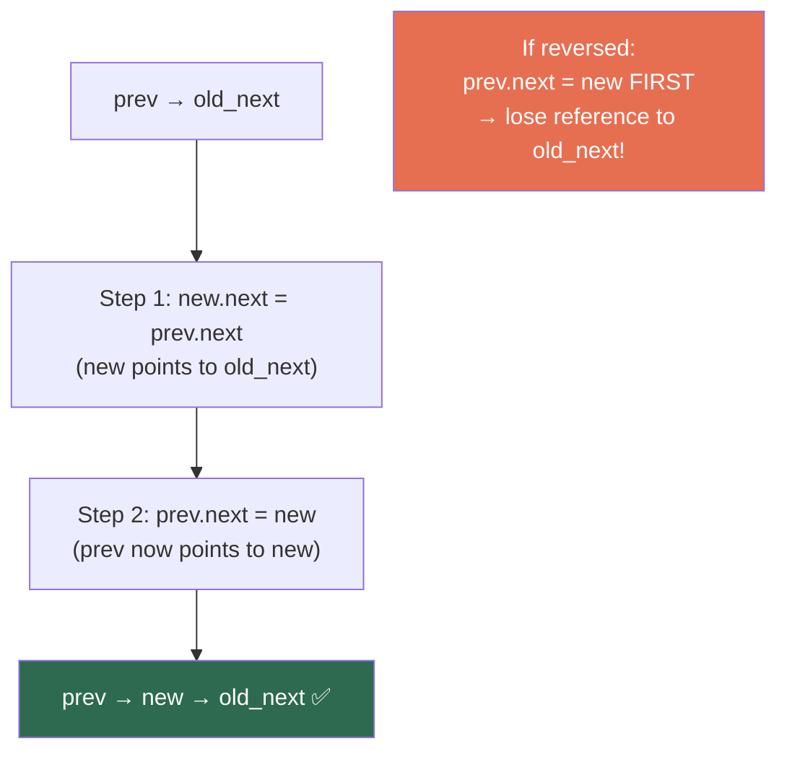

---

### Delete Head (Pop First) — O(1)

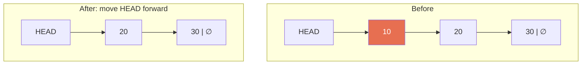

```python
def pop_first(self):
    if not self.head:
        raise IndexError("List is empty")
    value = self.head.value
    self.head = self.head.next     # move head forward
    self.length -= 1
    if self.length == 0:
        self.tail = None           # list is now empty
    return value
```

---

### Delete Tail (Pop Last) — O(n)

This is the **key weakness** of singly linked lists. Even with a tail pointer, you need the node *before* the tail to update its `next` to `None`.

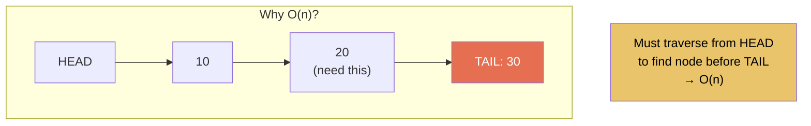

```python
def pop(self):
    if not self.head:
        raise IndexError("List is empty")
    if self.length == 1:
        return self.pop_first()

    current = self.head
    while current.next != self.tail:    # find second-to-last
        current = current.next
    value = self.tail.value
    current.next = None                 # second-to-last → None
    self.tail = current                 # update tail
    self.length -= 1
    return value
```

> **This is why doubly linked lists exist** — DLL can pop last in O(1) using `tail.prev`.

---

### Delete at Index — O(n)

```python
def remove(self, index):
    if index == 0:
        return self.pop_first()
    if index == self.length - 1:
        return self.pop()

    prev = self._get_node(index - 1)
    target = prev.next
    prev.next = target.next     # skip over the target node
    self.length -= 1
    return target.value
```

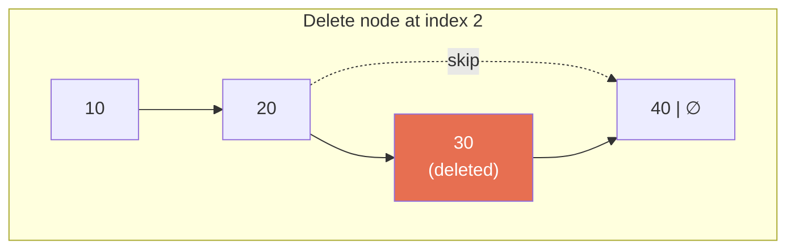

---

### Search — O(n)

```python
def search(self, value):
    current = self.head
    index = 0
    while current:
        if current.value == value:
            return index
        current = current.next
        index += 1
    return -1
```

---

## Full Implementation in Python

```python
class Node:
    def __init__(self, value):
        self.value = value
        self.next = None

    def __repr__(self):
        return f"Node({self.value})"


class SinglyLinkedList:
    def __init__(self):
        self.head = None
        self.tail = None
        self.length = 0

    # ======================== CREATE ========================

    def prepend(self, value):
        """Insert at head — O(1)."""
        new_node = Node(value)
        new_node.next = self.head
        self.head = new_node
        if self.length == 0:
            self.tail = new_node
        self.length += 1

    def append(self, value):
        """Insert at tail — O(1) with tail pointer."""
        new_node = Node(value)
        if not self.head:
            self.head = new_node
            self.tail = new_node
        else:
            self.tail.next = new_node
            self.tail = new_node
        self.length += 1

    def insert(self, index, value):
        """Insert at index — O(n). Raises IndexError if out of range."""
        if index < 0 or index > self.length:
            raise IndexError(f"Index {index} out of range for list of length {self.length}")
        if index == 0:
            return self.prepend(value)
        if index == self.length:
            return self.append(value)
        new_node = Node(value)
        prev = self._get_node(index - 1)
        new_node.next = prev.next
        prev.next = new_node
        self.length += 1

    # ======================== READ ========================

    def _get_node(self, index):
        """Internal: get node object at index — O(n)."""
        if index < 0 or index >= self.length:
            raise IndexError(f"Index {index} out of range for list of length {self.length}")
        current = self.head
        for _ in range(index):
            current = current.next
        return current

    def get(self, index):
        """Get value at index — O(n)."""
        return self._get_node(index).value

    def search(self, value):
        """Return index of first occurrence, or -1 if not found — O(n)."""
        current = self.head
        index = 0
        while current:
            if current.value == value:
                return index
            current = current.next
            index += 1
        return -1

    # ======================== UPDATE ========================

    def set(self, index, value):
        """Update value at index — O(n)."""
        self._get_node(index).value = value

    # ======================== DELETE ========================

    def pop_first(self):
        """Remove and return first value — O(1)."""
        if not self.head:
            raise IndexError("pop from empty list")
        value = self.head.value
        self.head = self.head.next
        self.length -= 1
        if self.length == 0:
            self.tail = None
        return value

    def pop(self):
        """Remove and return last value — O(n)."""
        if not self.head:
            raise IndexError("pop from empty list")
        if self.length == 1:
            return self.pop_first()
        prev = self._get_node(self.length - 2)
        value = self.tail.value
        prev.next = None
        self.tail = prev
        self.length -= 1
        return value

    def remove(self, index):
        """Remove and return value at index — O(n)."""
        if index < 0 or index >= self.length:
            raise IndexError(f"Index {index} out of range")
        if index == 0:
            return self.pop_first()
        if index == self.length - 1:
            return self.pop()
        prev = self._get_node(index - 1)
        value = prev.next.value
        prev.next = prev.next.next
        self.length -= 1
        return value

    def remove_value(self, value):
        """Remove first occurrence of value — O(n). Returns True if found."""
        if not self.head:
            return False
        if self.head.value == value:
            self.pop_first()
            return True
        current = self.head
        while current.next:
            if current.next.value == value:
                if current.next == self.tail:
                    self.tail = current
                current.next = current.next.next
                self.length -= 1
                return True
            current = current.next
        return False

    # ======================== UTILITIES ========================

    def reverse(self):
        """Reverse the list in place — O(n) time, O(1) space."""
        self.head, self.tail = self.tail, self.head
        prev = None
        current = self.tail    # start from old head (now tail)
        while current:
            next_node = current.next
            current.next = prev
            prev = current
            current = next_node

    def to_list(self):
        """Convert to Python list — O(n)."""
        result = []
        current = self.head
        while current:
            result.append(current.value)
            current = current.next
        return result

    def from_list(self, lst):
        """Build SLL from Python list — O(n)."""
        self.head = None
        self.tail = None
        self.length = 0
        for val in lst:
            self.append(val)

    def clear(self):
        """Remove all elements — O(1) (GC handles the rest)."""
        self.head = None
        self.tail = None
        self.length = 0

    def is_empty(self):
        return self.length == 0

    # ======================== DUNDER METHODS ========================

    def __len__(self):
        return self.length

    def __str__(self):
        values = []
        current = self.head
        while current:
            values.append(str(current.value))
            current = current.next
        return " → ".join(values) + " → None"

    def __repr__(self):
        return f"SinglyLinkedList({self.to_list()})"

    def __iter__(self):
        current = self.head
        while current:
            yield current.value
            current = current.next

    def __contains__(self, value):
        return self.search(value) != -1

    def __getitem__(self, index):
        return self.get(index)

    def __setitem__(self, index, value):
        self.set(index, value)

    def __eq__(self, other):
        if not isinstance(other, SinglyLinkedList):
            return False
        if self.length != other.length:
            return False
        a, b = self.head, other.head
        while a:
            if a.value != b.value:
                return False
            a, b = a.next, b.next
        return True

    def __bool__(self):
        return self.length > 0


# ======================== USAGE ========================

ll = SinglyLinkedList()
ll.append(10)
ll.append(20)
ll.append(30)
ll.prepend(5)
print(ll)              # 5 → 10 → 20 → 30 → None

ll.insert(2, 15)
print(ll)              # 5 → 10 → 15 → 20 → 30 → None

ll.remove(2)
print(ll)              # 5 → 10 → 20 → 30 → None

ll[1] = 99             # __setitem__
print(ll[1])           # 99 — __getitem__
print(20 in ll)        # True — __contains__
print(len(ll))         # 4 — __len__

ll.reverse()
print(ll)              # 30 → 20 → 99 → 5 → None

for val in ll:          # __iter__
    print(val)

print(ll.to_list())    # [30, 20, 99, 5]
```

---

## Traversal Patterns

Every SLL operation that needs to find a node by position requires traversal from `head`.

### Forward Traversal

```python
current = self.head
while current:
    process(current.value)
    current = current.next
```

### Traverse with Previous Pointer

Essential for deletion — you need the node *before* the target.

```python
prev = None
current = self.head
while current:
    if current.value == target:
        if prev:
            prev.next = current.next    # skip current
        else:
            self.head = current.next    # deleting head
        break
    prev = current
    current = current.next
```

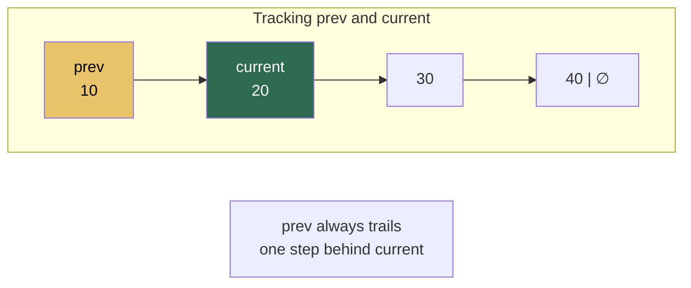

### Count Nodes (Without Length)

```python
def count(self):
    count = 0
    current = self.head
    while current:
        count += 1
        current = current.next
    return count
```

### Get Nth Node from End

```python
def get_nth_from_end(self, n):
    """Two-pointer technique — O(n) time, O(1) space."""
    fast = slow = self.head
    for _ in range(n):               # advance fast by n steps
        if not fast:
            raise IndexError("n exceeds list length")
        fast = fast.next
    while fast:                      # move both until fast hits end
        slow = slow.next
        fast = fast.next
    return slow.value                # slow is now n from the end
```

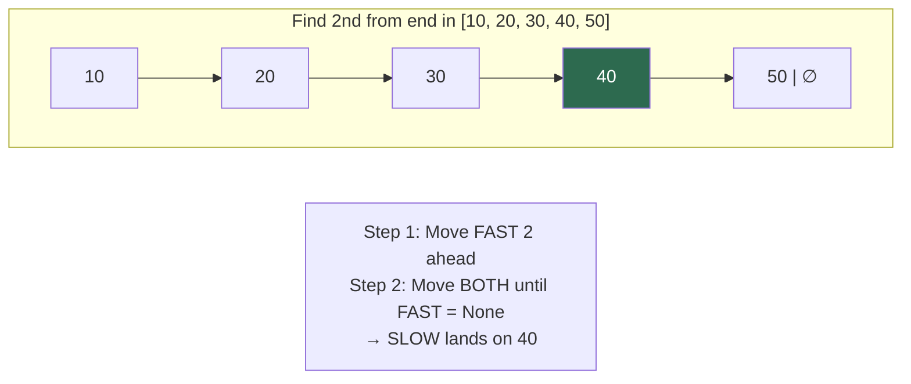

---

## Reversing a Singly Linked List

The single most important SLL operation to understand. It appears in interviews constantly.

### Iterative Reversal — O(n) time, O(1) space

```python
def reverse(head):
    prev = None
    current = head
    while current:
        next_node = current.next     # 1. save next
        current.next = prev          # 2. reverse pointer
        prev = current               # 3. advance prev
        current = next_node          # 4. advance current
    return prev                      # new head
```

### Step-by-Step Visualization

```
Initial:   None   10 → 20 → 30 → None
           prev   curr

Step 1:    None ← 10   20 → 30 → None
                  prev  curr

Step 2:    None ← 10 ← 20   30 → None
                       prev  curr

Step 3:    None ← 10 ← 20 ← 30   None
                            prev   curr (None → stop)

Return prev → 30 is the new head
```

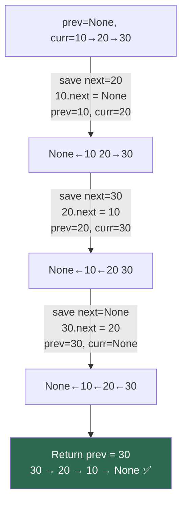

### Recursive Reversal — O(n) time, O(n) space (call stack)

```python
def reverse_recursive(head):
    if not head or not head.next:
        return head
    new_head = reverse_recursive(head.next)
    head.next.next = head    # make next node point back to current
    head.next = None         # break forward link
    return new_head
```

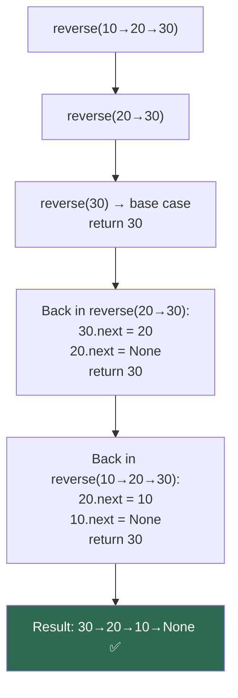

### Reverse a Sub-section (Between positions)

```python
def reverse_between(head, left, right):
    """Reverse nodes from position left to right (1-indexed)."""
    dummy = Node(0)
    dummy.next = head
    prev = dummy
    for _ in range(left - 1):
        prev = prev.next

    current = prev.next
    for _ in range(right - left):
        next_node = current.next
        current.next = next_node.next
        next_node.next = prev.next
        prev.next = next_node

    return dummy.next
```

---

## Time and Space Complexity

| Operation | Time | Space | Notes |
|---|:-:|:-:|---|
| `prepend(value)` | **O(1)** | O(1) | Update head pointer |
| `append(value)` | **O(1)** | O(1) | With tail pointer |
| `insert(index, value)` | O(n) | O(1) | Traversal to index |
| `get(index)` | O(n) | O(1) | Traversal to index |
| `set(index, value)` | O(n) | O(1) | Traversal to index |
| `search(value)` | O(n) | O(1) | Linear scan |
| `pop_first()` | **O(1)** | O(1) | Update head pointer |
| `pop()` (last) | O(n) | O(1) | Must find second-to-last |
| `remove(index)` | O(n) | O(1) | Traversal + pointer update |
| `remove_value(val)` | O(n) | O(1) | Linear scan |
| `reverse()` | O(n) | O(1) | Three-pointer technique |
| `len()` | **O(1)** | O(1) | Stored as attribute |
| `to_list()` | O(n) | O(n) | Creates Python list |
| `clear()` | **O(1)** | O(1) | Nullify head/tail |

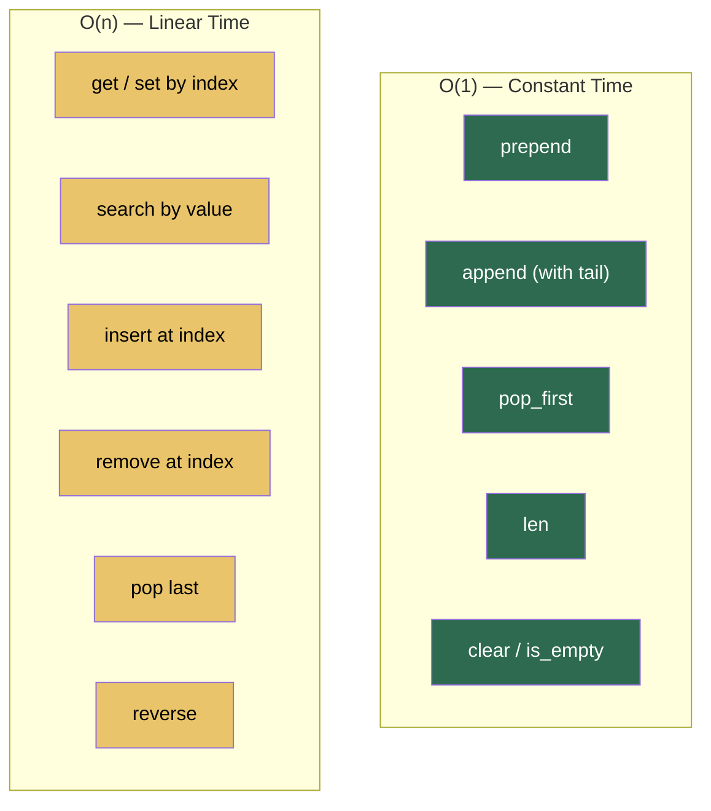

### Space: O(n) Total

Each node stores `value` + one pointer. For `n` nodes the total space is O(n). No extra space needed for operations (all in-place except `to_list`).

---

## Singly Linked List as a Stack

A SLL naturally implements a stack — push/pop at the **head** for O(1) both ways.

```python
class Stack:
    def __init__(self):
        self._list = SinglyLinkedList()

    def push(self, value):
        self._list.prepend(value)     # O(1)

    def pop(self):
        return self._list.pop_first() # O(1)

    def peek(self):
        if self._list.head:
            return self._list.head.value
        raise IndexError("Stack is empty")

    def is_empty(self):
        return self._list.length == 0

    def __len__(self):
        return self._list.length
```

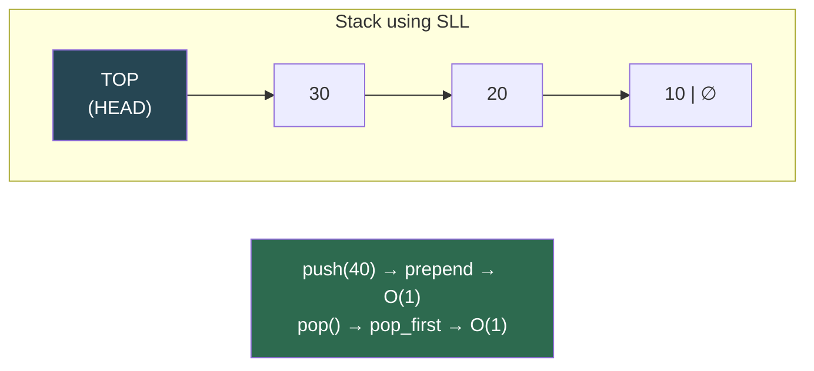

---

## Singly Linked List as a Queue

For a queue, enqueue at **tail** and dequeue from **head** — both O(1) with a tail pointer.

```python
class Queue:
    def __init__(self):
        self._list = SinglyLinkedList()

    def enqueue(self, value):
        self._list.append(value)      # O(1) with tail

    def dequeue(self):
        return self._list.pop_first() # O(1)

    def peek(self):
        if self._list.head:
            return self._list.head.value
        raise IndexError("Queue is empty")

    def is_empty(self):
        return self._list.length == 0

    def __len__(self):
        return self._list.length
```

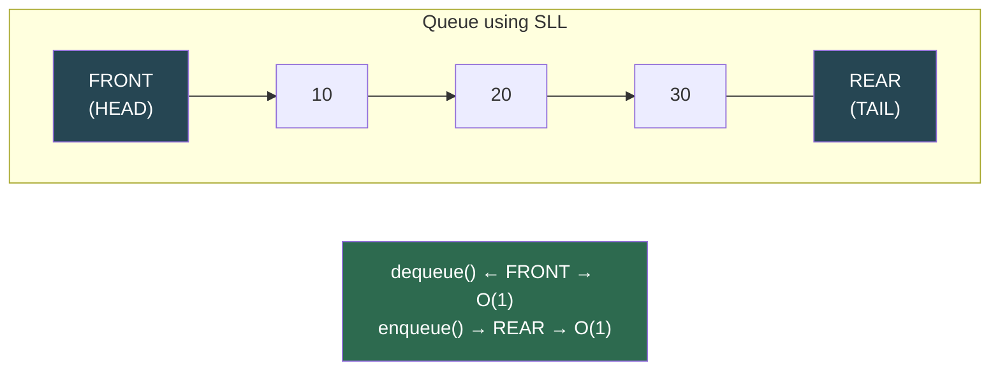

---

## Essential Interview Techniques

### 1. Fast and Slow Pointers (Tortoise and Hare)

```python
def find_middle(head):
    slow = fast = head
    while fast and fast.next:
        slow = slow.next
        fast = fast.next.next
    return slow
```

| Problem | How It Helps |
|---|---|
| Find middle node | Slow is at middle when fast reaches end |
| Detect cycle | If fast meets slow, there's a cycle |
| Find cycle start | After meeting, reset one pointer to head; advance both by 1 |
| Check palindrome | Find middle, reverse second half, compare |

### 2. Dummy/Sentinel Node

Eliminates special-casing for operations on the head.

```python
def delete_all(head, val):
    dummy = Node(0)
    dummy.next = head
    current = dummy
    while current.next:
        if current.next.value == val:
            current.next = current.next.next
        else:
            current = current.next
    return dummy.next
```

### 3. Two Pointers with Gap

```python
def remove_nth_from_end(head, n):
    dummy = Node(0)
    dummy.next = head
    fast = slow = dummy
    for _ in range(n + 1):
        fast = fast.next
    while fast:
        fast = fast.next
        slow = slow.next
    slow.next = slow.next.next
    return dummy.next
```

### 4. Recursive Thinking

Many SLL problems have elegant recursive solutions. The call stack acts as an implicit "backward pointer."

```python
def print_reverse(node):
    """Print list in reverse — recursion gives backward traversal."""
    if not node:
        return
    print_reverse(node.next)
    print(node.value)
```

### Technique Decision Tree

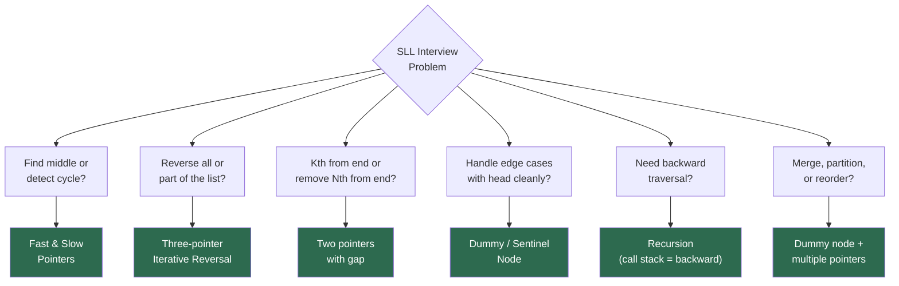

---

## Edge Cases to Always Handle

Every SLL function should account for these:

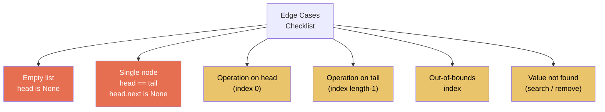

```python
# Template for safe SLL operations
def safe_operation(self, index):
    if not self.head:                          # empty list
        raise IndexError("List is empty")
    if index < 0 or index >= self.length:      # bounds check
        raise IndexError("Index out of range")
    if index == 0:                             # head case
        return self.handle_head()
    if index == self.length - 1:               # tail case
        return self.handle_tail()
    # ... general case ...
```

---

## Common Mistakes

### 1. Losing the Next Pointer During Insert

```python
# WRONG — overwrites the link before saving it
prev.next = new_node
new_node.next = prev.next    # prev.next is already new_node → infinite loop!

# RIGHT — save first, then overwrite
new_node.next = prev.next    # save the link
prev.next = new_node         # then overwrite
```

### 2. Not Updating Tail

```python
# Forgetting tail when list becomes empty
def pop_first(self):
    value = self.head.value
    self.head = self.head.next
    self.length -= 1
    if self.length == 0:
        self.tail = None       # if you forget this, tail is stale!
    return value
```

### 3. Off-by-One Traversal

```python
# To reach index i: exactly i hops
current = self.head
for _ in range(i):             # NOT range(i-1) or range(i+1)
    current = current.next

# To reach the node BEFORE index i: exactly i-1 hops
prev = self.head
for _ in range(i - 1):
    prev = prev.next
```

### 4. Infinite Loop While Traversing

```python
# WRONG — if you accidentally create a cycle
current = self.head
while current:                 # never becomes None → infinite loop
    current = current.next

# SAFETY — add a counter
current = self.head
seen = 0
while current and seen < self.length:
    current = current.next
    seen += 1
```

### 5. Returning `None` Instead of the Modified List

```python
# WRONG — reverse modifies in place but returns nothing
def reverse(self):
    # ... reversal logic ...
    # forgot to return or update self.head!

# RIGHT — update head and tail
def reverse(self):
    self.head, self.tail = self.tail, self.head
    prev = None
    current = self.tail
    while current:
        next_node = current.next
        current.next = prev
        prev = current
        current = next_node
```

---

## Practice Problems

| # | Problem | Difficulty | Key Technique | Time | Space |
|:-:|---|:-:|---|:-:|:-:|
| 1 | Reverse a linked list | Easy | Three pointers (prev, curr, next) | O(n) | O(1) |
| 2 | Find middle node | Easy | Fast & slow pointers | O(n) | O(1) |
| 3 | Detect cycle | Easy | Floyd's tortoise & hare | O(n) | O(1) |
| 4 | Merge two sorted lists | Easy | Dummy node + comparison | O(n+m) | O(1) |
| 5 | Remove duplicates (sorted) | Easy | Single pointer + comparison | O(n) | O(1) |
| 6 | Remove Nth from end | Medium | Two pointers with gap of N | O(n) | O(1) |
| 7 | Check if palindrome | Medium | Fast/slow → reverse second half → compare | O(n) | O(1) |
| 8 | Find cycle start | Medium | Floyd's + reset one to head | O(n) | O(1) |
| 9 | Intersection of two lists | Medium | Length difference + align | O(n+m) | O(1) |
| 10 | Reverse in groups of K | Hard | Iterative reversal in chunks | O(n) | O(1) |
| 11 | Reorder list (L0→Ln→L1→Ln-1→...) | Medium | Find mid + reverse + merge | O(n) | O(1) |
| 12 | Add two numbers (digits in nodes) | Medium | Carry propagation | O(max(n,m)) | O(max(n,m)) |
| 13 | Sort a linked list | Medium | Merge sort (find mid + merge) | O(n log n) | O(log n) |
| 14 | Partition around value x | Medium | Two dummy lists + merge | O(n) | O(1) |
| 15 | Remove all nodes with value x | Easy | Dummy node + skip | O(n) | O(1) |

---

## Quick Reference Cheat Sheet

```
┌──────────────────────────────────────────────────────────────────┐
│                SINGLY LINKED LIST CHEAT SHEET                    │
├──────────────────────────────────────────────────────────────────┤
│                                                                  │
│  STRUCTURE:                                                      │
│    Node: value + next                                           │
│    SLL: head → node → node → ... → None                        │
│                                                                  │
│  O(1) OPERATIONS:                                                │
│    prepend       → insert at head                               │
│    append        → insert at tail (with tail pointer)           │
│    pop_first     → remove from head                             │
│    len           → stored as attribute                          │
│                                                                  │
│  O(n) OPERATIONS:                                                │
│    get/set       → traverse to index                            │
│    search        → linear scan                                  │
│    insert(i)     → traverse to i-1, then O(1) insert            │
│    remove(i)     → traverse to i-1, then O(1) delete            │
│    pop (last)    → must find second-to-last                     │
│    reverse       → three-pointer technique                      │
│                                                                  │
├──────────────────────────────────────────────────────────────────┤
│                                                                  │
│  KEY WEAKNESS:                                                   │
│    No backward traversal → can't pop last in O(1)              │
│    No random access → always O(n) to reach index i             │
│                                                                  │
│  INTERVIEW TECHNIQUES:                                           │
│    Fast & Slow     → middle, cycle, palindrome                  │
│    Dummy Node      → simplify head edge cases                   │
│    Two Ptr + Gap   → Nth from end                               │
│    Three Pointers  → iterative reversal                         │
│    Recursion       → implicit backward traversal                │
│                                                                  │
├──────────────────────────────────────────────────────────────────┤
│                                                                  │
│  EDGE CASES — ALWAYS CHECK:                                      │
│    • Empty list (head is None)                                  │
│    • Single node (head == tail)                                 │
│    • Operation on head (index 0)                                │
│    • Operation on tail (index n-1)                              │
│    • Index out of bounds                                        │
│    • Update tail when list becomes empty                        │
│                                                                  │
├──────────────────────────────────────────────────────────────────┤
│                                                                  │
│  SLL AS STACK:  push = prepend O(1), pop = pop_first O(1)       │
│  SLL AS QUEUE:  enqueue = append O(1), dequeue = pop_first O(1) │
│                                                                  │
│  INSERT ORDER:                                                   │
│    1. new.next = prev.next     (save link first!)               │
│    2. prev.next = new          (then overwrite)                 │
│                                                                  │
│  REVERSE (iterative):                                            │
│    prev = None                                                  │
│    while curr: next=curr.next, curr.next=prev, prev=curr,      │
│                curr=next                                         │
│    return prev                                                  │
│                                                                  │
└──────────────────────────────────────────────────────────────────┘
```

---

*Previous: [Linked Lists (Overview)](../LinkedList/README.md) | Next: [Singly Linked List Problems](../SinglyLinkedListProblems/README.md)*
